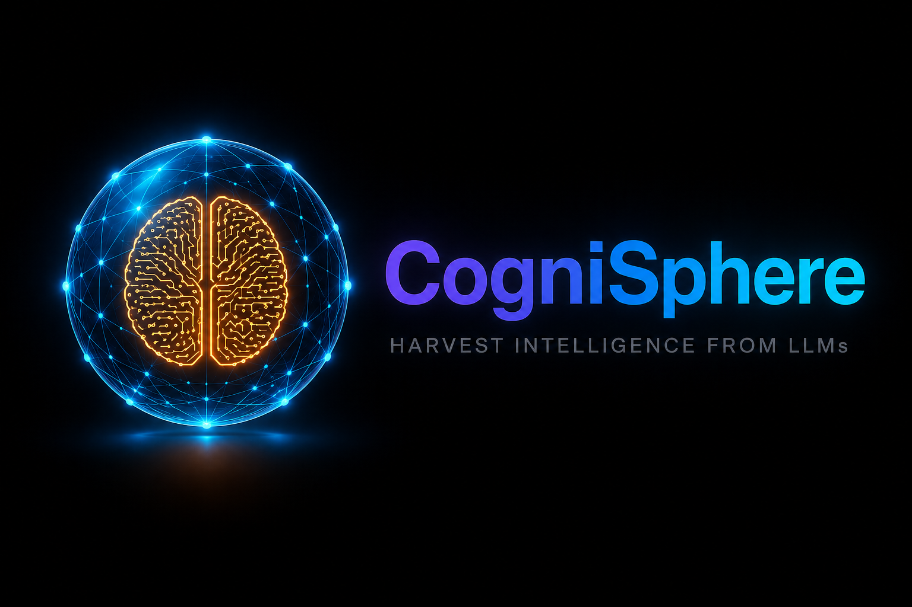

<div align="center">



**Minimal · Self-improving · Persistent** — a harness for fleets of autonomous LLM agents that work the way a human operator does.

[](https://www.typescriptlang.org/)
[](https://nodejs.org/)
[](https://hono.dev/)
[](https://www.sqlite.org/)
[](docs/v0-deferred.md)
[](#contributing)

</div>

> ### 🌌 The idea behind the name
> A **Dyson Sphere** is a megastructure that envelops a star to harvest its raw
> energy. **CogniSphere** is the same idea, pointed at *intelligence*: a thin
> structure that envelops powerful **LLMs** to harvest their raw reasoning — and
> channels that output into fleets of autonomous, persistent agents.
>
> The LLM stays external and is never reinvented. CogniSphere is the shell around
> it — the collectors, the wiring, the distribution grid that turns raw model
> intelligence into useful work.

CogniSphere is built on three ideas:

- **🪶 Minimal.** The core is **~20 files / ~3.8K LOC** of fundamentals — filesystem, SQLite, subprocess, HTTP. No orchestration framework, no DI container, no magic. You can read the whole thing in an afternoon and change it with confidence.
- **🧠 Self-improving.** Agents reflect on their own work, *dream* to consolidate short-term experience into long-term memory, and author their own skills — so an agent is sharper next week than it is today.
- **♾️ Persistent.** Identity, memory, sessions, and queued work all live on disk and survive restarts. Agents are long-lived workers, not stateless request handlers.

### Agents that work the way an operator does

CogniSphere treats an agent less like a chatbot and more like a **digital operator** —
a persistent worker with its own identity, memory, and toolset who shows up across many
conversations and gets real work done.

In CogniSphere, **every plugin is an app** — Telegram, Gmail, a calendar, a scheduler,
operator chat. Through the apps it's connected to, each agent:

- **Lives in its apps.** It receives **notifications** from the apps it's wired into, acts on them, and reaches back out through those same apps to interact with the outside world.
- **Multi-tasks.** It handles many independent conversations (threads) at once — serializing work where it must, running in parallel where it can — like a person juggling several chats and inboxes.
- **Collaborates with its team.** Agents coordinate with one another through the very same apps they use to talk to people, so a fleet behaves like a team of coworkers rather than a set of isolated bots.
- **Reflects.** It reviews its own runs — what worked, what went wrong — and turns those mistakes and learnings into better future behavior.
- **Dreams.** On its own schedule it revisits recent activity and consolidates short-term experience into durable long-term memory — the way sleep turns a day's events into lasting knowledge.
- **Improves over time.** Reflection, memory, and self-authored skills compound into an agent that gets better the longer it runs.

> Reflection, dream-based memory consolidation, and autonomous self-improvement are
> central to CogniSphere's design. See [Status & roadmap](#status--roadmap) for exactly
> what ships in v0 today versus what's on the way.

**Under the hood,** CogniSphere is a multi-agent orchestration server: one Node process
owns many independent agents, each a self-contained directory of prompts, skills, scripts,
app state, and a workspace. For every batch of inbound notifications, the harness spawns a
short-lived [`pi`](https://www.npmjs.com/package/@earendil-works/pi-coding-agent) subprocess
to run the LLM loop (the model at the core), then gets out of the way.

---

## Why CogniSphere

CogniSphere optimizes for the properties that are **nearly impossible to retrofit**
onto an agent platform — simplicity, fleet operability, and clean source/thread
routing — and deliberately leaves intelligence features (auto-compaction,
self-evolution) as additive modules you can grow into.

| Differentiator | What it means |
|---|---|
| 🪶 **Minimal & legible** | ~20 server files, ~3.8K LOC. No framework. The LLM loop is delegated to the external `pi` binary, so the harness stays a thin orchestration shell. |
| 🧩 **One plugin contract** | Implement a single TypeScript interface (`start` / `stop` / `handleHttpRequest` + `ctx.notify`), drop a folder under `plugins/<id>/`, and it's dynamically imported. Adding an event source is *one file*. |
| 📁 **File-resident state** | Every agent is a directory. `tar` it and you have a backup. No hidden global state, no external store required. |
| 🚀 **Multi-agent is the native shape** | Many agents live in-memory in one process, each isolated on disk under `agents/<id>/`. Add an agent = drop an `agent.json` + restart (or hit the agents API). Scale out = run more servers with a different `COGNISPHERE_ROOT_DIR`. |
| 🧵 **Declarative session routing** | Per-agent `threadIdStrategy` (`single`, `plugin`, or `plugin_channel`) keys conversations to source/thread. A unified SQLite events table tracks every notification with `thread_id`, `status`, and `priority` — fully durable across restarts. |
| 🔁 **Resumable sub-agents** | Sub-agents are `pi` subprocesses; reuse the same `--session-dir` and a child resumes its prior session across many parent batches. Persistence by convention, not a heavyweight subsystem. |
| ⚡ **Per-thread queueing** | A per-agent SQLite WAL queue with a small worker pool serializes work per thread while allowing concurrent batches across threads up to `maxConcurrentSlots`. |

> CogniSphere is the foundation; you grow it into your own platform.

---

## Architecture

```
┌─ Node server process ──────────────────────────────────────────────┐
│  HTTP server (single port — Hono)                                  │
│   ├── /webhook/<agentId>/<pluginId>/...   plugin webhooks (external)│
│   ├── /admin/<agentId>/send                operator → agent         │
│   ├── /admin/<agentId>/abort | /steer      operator controls        │
│   └── /api/* , /healthz , SPA shell                                 │
│                                                                    │
│  PluginRegistry — scans built-in + user-space plugin roots         │
│                                                                    │
│  AgentManager                                                      │
│    ├── Agent admin (privileged: platform plugin)                   │
│    ├── Agent A1                                                    │
│    │     ├── AgentRunner (queue + workers + spawn pi)              │
│    │     ├── PluginInstance: telegram                              │
│    │     └── PluginInstance: admin                                 │
│    └── Agent A2 …                                                  │
│                                                                    │
│  EventLog (SQLite — one row per notify, one row per batch)         │
└────────────────────────────────────────────────────────────────────┘
                          │
                          ▼ per batch
                  spawn `pi --mode rpc`   (cwd = agent dir, short-lived)
```

One Node process. In-process plugin actors. One `pi` child per batch. No daemon
beyond the server. Tools (`read`, `bash`, `edit`, …) execute inside the child
against the agent's working directory.

→ Deep dive: [`docs/server.md`](docs/server.md) (implemented subsystem) ·
[`docs/hld.md`](docs/hld.md) (full design contract) ·
[`docs/event-flow-visualization.html`](docs/event-flow-visualization.html) (event/notification lifecycle).

---

## Built-in plugins (apps)

**A plugin is an app** — an agent's window onto the outside world. Each is a
TypeScript module that lives in-process: it turns external events into agent
**notifications** (`ctx.notify`) and ships CLI scripts the agent runs via its
`bash` tool to act back out — sending a message, replying to an email,
collaborating with a teammate.

| Plugin | Purpose |
|---|---|
| `admin` | Operator ↔ agent chat over the internal `/admin/<agentId>/send` endpoint. |
| `scheduler` | Cron-style timers that wake an agent on a schedule. |
| `telegram` | Inbound Telegram messages → notifications; outbound replies via CLI. |
| `gws` | Google Workspace / Gmail integration (polling + actions). |

Authoring a new source is a single file implementing the `Plugin` interface in
[`packages/harness/core/types.ts`](packages/harness/core/types.ts). Drop it under
`plugins/<id>/` (user-space plugins shadow built-ins on id collision) and it's
dynamically imported on boot.

---

## Quick start

**Prerequisites:** Node ≥ 20 and pnpm. Two ways in: **run a harness** (you
operate agents) or **develop the harness** (you hack on CogniSphere itself).

### Run a harness (the `cognisphere` CLI)

CogniSphere installs as a **versioned dependency** — you scaffold a small data
dir and point it at the package, with no codebase copy per deployment. The code
is managed by the lockfile; your agents, plugins, and secrets are the only thing
you own. See [`docs/distribution-and-deployment.md`](docs/distribution-and-deployment.md).

```bash
# The package lives on a private registry (GitHub Packages) — authenticate once:
export GITHUB_TOKEN=<token with read:packages>

# 1. Scaffold a harness data dir in the current directory (./my-harness)
npx @cognisphere/cognisphere-harness init my-harness   # --root <dir> to put it elsewhere

# 2. Install the harness, then scaffold an agent + (optional) a catalog plugin
cd my-harness
pnpm install
cognisphere agent new dr-renu          # forks the base template into agents/dr-renu/
cognisphere plugin add telegram        # forks a catalog plugin into plugins/telegram/

# 3. Run it locally (hot reload). Serves the bundled web console on the same port.
cognisphere dev                        # --port <n> to change the backend port
```

Configure the agent's model + secrets (Models/Secrets settings, or `.secrets/`),
then edit `agents/dr-renu/` freely — it's yours, git-tracked. Deploy to a Linux
host with `cognisphere up` (systemd) and migrate across versions with
`cognisphere upgrade`. For a **backend-only** host (no operator console), run
`cognisphere serve --headless` — the server exposes only the API/webhook/admin
surfaces and mounts no web UI. Full command surface:
[distribution-and-deployment.md §10](docs/distribution-and-deployment.md#10-cli-surface).

### Develop the harness (monorepo)

```bash
git clone https://github.com/t0r0id/CogniSphere.git
cd CogniSphere
pnpm install                 # all workspace deps (harness + web)
pnpm run build:web           # (optional) build the UI; without it → JSON status page
pnpm run dev                 # tsx watch (hot reload) — or `pnpm start`
```

The server listens on `http://127.0.0.1:7331`, running against
`~/.cognisphere/default` (override with the env vars below). For **full-stack
dev** — backend *and* the Vite dev server (HMR) together — scaffold a harness
dir and run `cognisphere dev` from it: in the monorepo it starts both and points
Vite's `/api` proxy at the backend (`--port` / `--web-port` to choose ports).
Equivalently, run `pnpm run dev` and `pnpm run dev:web` in separate terminals.

### Configuration

Set via environment (a `.env` file in the package cwd is loaded automatically):

| Variable | Default | Purpose |
|---|---|---|
| `COGNISPHERE_ROOT_DIR` | `~/.cognisphere` | Base data path; multiple harnesses can share it. |
| `COGNISPHERE_ID` | `default` | `<rootDir>/<harnessId>` is the harness home. |
| `PORT` | `7331` | HTTP listen port. |
| `BIND_HOST` | `127.0.0.1` | Listen interface. |
| `SERVER_BASE_URL` | `http://<host>:<port>` | Base URL used to build plugin webhook URLs. |
| `COGNISPHERE_HEADLESS` | _unset_ | When set (`1`/`true`/`yes`), the server mounts no web UI — API/webhook/admin only. Equivalent to `cognisphere serve --headless`. |

> The CLI derives `COGNISPHERE_ROOT_DIR` / `COGNISPHERE_ID` from the harness dir
> (the cwd), so `cognisphere dev` / `serve` need no env wiring.

Sensitive files (`secrets.json`, `models.json`, `users.json`, `session-key`)
live under `<rootDir>/<harnessId>/.secrets/` (mode `0600`, kept out of VCS by the
generated `.gitignore`).

---

## HTTP API

A single Node `http.Server` exposes three surfaces:

- **`/api/*`** — agents, filesystem, secrets, models, harness settings (cookie-auth gated).
- **`/admin/<agentId>/*`** — operator chat / abort / steer (cookie-auth gated).
- **`/webhook/<agentId>/<pluginId>/*`** — external plugin webhooks (raw req/res, no harness auth).

Full route reference, request/response shapes, and the auth model:
[`docs/api.md`](docs/api.md).

---

## Project layout

```
cognisphere-harness/                # pnpm workspace
├── packages/
│   ├── harness/                    # @cognisphere/cognisphere-harness (publishable backend)
│   │   ├── bin/cognisphere.mjs     # CLI entry shim
│   │   ├── cli/                    # the `cognisphere` CLI (init, agent, plugin, dev, up, upgrade)
│   │   ├── core/                   # agent-runner engine + the process entrypoint
│   │   │   ├── main.ts             # boot + route wiring
│   │   │   ├── agent-manager.ts    # owns all agents
│   │   │   ├── runner.ts           # queue + workers + spawn pi
│   │   │   ├── queue.ts            # per-agent SQLite WAL queue
│   │   │   ├── rpc.ts              # pi --mode rpc client
│   │   │   └── plugin-registry.ts
│   │   ├── api/                    # HTTP routes (/api, /admin, /webhook)
│   │   ├── plugins/                # built-in plugins: admin, scheduler, telegram, gws
│   │   └── base-agent/             # the base template every agent forks from
│   └── web/                        # cognisphere-web — React + Vite + shadcn/ui console
├── docs/                           # design & reference (see below)
├── CHANGELOG.md                    # breaking-change source for `cognisphere upgrade`
└── package.json
```

---

## Documentation

| Doc | What it covers |
|---|---|
| [`docs/hld.md`](docs/hld.md) | High-level design — the contract for all subsystems. |
| [`docs/server.md`](docs/server.md) | Implemented agent-runner subsystem: process model, on-disk layout, components, flows. |
| [`docs/api.md`](docs/api.md) | HTTP surface: auth model, every route, request/response shapes. |
| [`docs/distribution-and-deployment.md`](docs/distribution-and-deployment.md) | How CogniSphere is packaged, installed, deployed, and upgraded — the `cognisphere` CLI, the registry, multi-harness deployment, the upgrade flow. |
| [`docs/v0-deferred.md`](docs/v0-deferred.md) | What v0 cut from the HLD, with manual workflows in place. |
| [`docs/improvement-design.md`](docs/improvement-design.md) | Roadmap for self-evolution and memory features. |
| [`docs/cognisphere-vs-hermes.html`](docs/cognisphere-vs-hermes.html) | Scored comparison vs `hermes-agent`. |
| [`docs/event-flow-visualization.html`](docs/event-flow-visualization.html) | Event & notification lifecycle, visualized. |

---

## Status & roadmap

CogniSphere is at **v0**. Shipping today: the runner, per-agent queue, plugin
contract, the four built-in plugins, the operator web console, and the
`cognisphere` CLI for scaffolding/running/deploying/upgrading a harness.

Designed but **deferred** (see [`docs/v0-deferred.md`](docs/v0-deferred.md)):

- The privileged **admin agent** + `platform` plugin that CRUDs other agents/skills (the autonomous "self-evolving" loop).
- **Automatic memory compaction** (token-budget summarization).
- Docker isolation and per-agent process isolation.

The framework already has the bones for self-evolution — agents can author
`skills/agent/`, `scripts/agent/`, and `extensions/agent/` on disk — the
autonomous curation loop is what's deferred.

---

## Contributing

After any change, run the full check (typecheck + lint for both packages):

```bash
pnpm check
```

Resolve every error **and** warning before opening a PR, and keep the docs in
sync — see [`CLAUDE.md`](CLAUDE.md) for the contributor guidelines (which docs to
update for which changes, the simplicity/surgical-changes bias, etc.).

---

## Credits

CogniSphere builds on the [`pi`](https://www.npmjs.com/package/@earendil-works/pi-coding-agent)
coding-agent runtime for the per-batch LLM loop.
