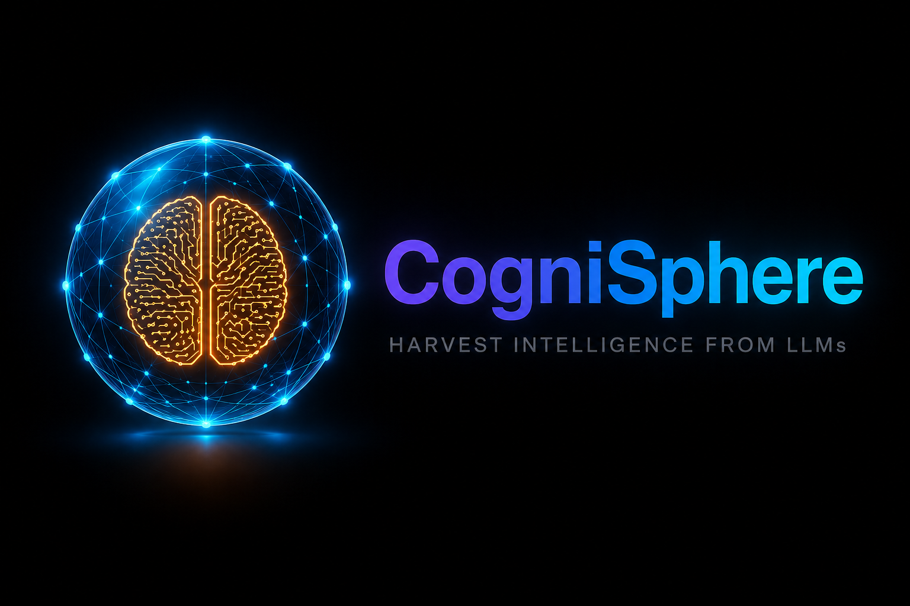
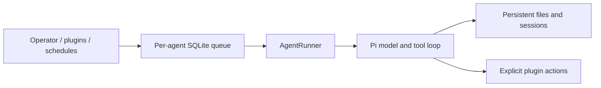

<div align="center">



**Persistent agents, shared orchestration, extensible integrations.**

[](https://www.typescriptlang.org/)
[](https://nodejs.org/)
[](LICENSE)

</div>

CogniSphere is a multi-agent orchestration server built around the Pi coding-agent runtime. Each agent has its own instructions, skills, workspace, plugins, and conversation history. The harness receives work, stores it durably, and runs short-lived Pi processes to handle it.

## How it works


```mermaid
flowchart LR
    Inputs[Operator / plugins / schedules] --> Queue[Per-agent SQLite queue]
    Queue --> Runner[AgentRunner]
    Runner --> Pi[Pi model and tool loop]
    Pi --> Files[Persistent files and sessions]
    Pi --> Actions[Explicit plugin actions]
```

Threads keep related messages in one conversation. Work is serialized within a thread and can run concurrently across threads. Follow-up messages can steer active work. Failed attempts use delivery evidence to resume or resend, while the console exposes processing status and session history.

The current runtime executes local processes on a trusted host. The next implementation priority is the shared Process/Docker sandbox architecture in the [roadmap](docs/roadmap.md).

## Plugins

| Plugin | Purpose |
|---|---|
| `admin` | Operator chat; included for every agent. |
| `scheduler` | Cron and one-time schedules; included for every agent. |
| `agent-messaging` | Agent-to-agent and cross-thread messages; included for every agent. |
| `telegram` | Long-poll messages/attachments and outbound Bot API actions. |
| `gws` | Gmail polling/routing and Google Workspace CLI actions. |
| `artifacts` | Publish standalone HTML with public/private access. |

Plugins implement one interface: `manifest`, `start`, `stop`, optional HTTP handling, and `ctx.notify`. A deployment can supply its own plugin definitions and agent-specific configuration.

## Run an app home

Prerequisites: Node.js 20.12 or later, pnpm, and access to the configured GitHub Packages registry. Configure registry authentication as described in the [CLI installation guide](docs/low-level/cli.md#installation).

```bash
npx @cognisphere-sh/cognisphere-harness init my-app
cd my-app
pnpm install
cd harness
pnpm exec cognisphere serve
```

The scaffold contains `harness/`, an optional product `app/`, deployment scripts, and the developer agent `nova`. Configure a provider and enabled model in the console before using agents. In an interactive terminal, first boot prompts for console credentials. For noninteractive deployments, provision credentials before exposing the service.

Create another agent from the harness directory:

```bash
pnpm exec cognisphere agent new support
# Configure agents/support/agent.json, then restart the server to discover it.
```

Fork an optional plugin when you need to customize its source:

```bash
pnpm exec cognisphere plugin add telegram
```

Enable it for an agent by creating that agent's `plugins/telegram/config.json`, setting the plugin's credentials, and restarting the agent. Forking a definition does not enable it for every agent.

## Develop the harness

```bash
pnpm install
pnpm dev       # backend
pnpm dev:web   # operator console, in another terminal
pnpm check    # typecheck and lint both packages
```

`packages/harness` contains the CLI, server, plugins, agent templates, and app-home scaffold. `packages/web` contains the operator console. The product app created in an app home is separate from this console.

## Documentation

| Document | Purpose |
|---|---|
| [High-level design](docs/high-level-design.md) | System boundaries, layer dependencies, end-to-end examples, and design choices. |
| [Core low-level design](docs/low-level/core.md) | Lifecycle, queue, routing, execution, recovery, and server settings. |
| [Plugins low-level design](docs/low-level/plugins.md) | Integration contracts, discovery, seeds, notifications, actions, and failures. |
| [Agents low-level design](docs/low-level/agents.md) | Agent templates, configuration, files, prompts, skills, extensions, and tools. |
| [API low-level design](docs/low-level/api.md) | HTTP architecture, authentication, and complete current route reference. |
| [CLI low-level design](docs/low-level/cli.md) | Scaffolding, process supervision, packaging, deployment, and upgrades. |
| [Web low-level design](docs/low-level/web.md) | Operator console, API state, polling, chat rendering, settings, and files. |
| [Core roadmap](docs/roadmap.md) | Delivery order and acceptance gates, with a separate implementation plan for each item. |

## FAQ

### I want to run my first agent. Where should I start?

Follow [Run an app home](#run-an-app-home), install dependencies, and configure an enabled model/provider in the console. `init` creates nova; additional agents are created with `agent new` and discovered at server restart. The [CLI FAQ](docs/low-level/cli.md#faq) explains directory resolution, ports, and installation issues.

### My message is queued or failed. How do I find out why?

Inspect the agent's state/error, then its Events view and linked session history. Queue capacity, silent input, a running thread, settings drain, and failed attempts have different causes. The [core FAQ](docs/low-level/core.md#faq) covers each and explains automatic versus manual retries.

### Where can I find parameter explanations and examples?

Use the [agents FAQ](docs/low-level/agents.md#faq) for `agent.json`, [plugins FAQ](docs/low-level/plugins.md#faq) for integration settings/notification flags, and [API FAQ](docs/low-level/api.md#faq) for request fields and paging. Each links to its authoritative contract rather than duplicating every schema here.

### Are Docker isolation, live token streaming, and session search available now?

They are planned in the [core roadmap](docs/roadmap.md). Current execution uses local Pi RPC processes and the console polls saved state. Each [design document](#documentation) separates current behavior from proposed interfaces; roadmap examples alone do not enable a feature.

### I am building a product app. Is it the same thing as the operator console?

No. The bundled console is for operating the harness; the scaffold's optional `app/` owns its own user experience/authentication. Its backend can use the operator-level app bearer to call the harness and must enforce its own user access. See the [API FAQ](docs/low-level/api.md#faq) before exposing any harness credential to a browser.

## Contributing

Run `pnpm check` after changes and update the affected documentation. See [CLAUDE.md](CLAUDE.md) for repository conventions. Planned features should have a design linked from the roadmap; update current-system documentation when their implementation lands.

## Credits and license

CogniSphere uses the Pi coding-agent runtime and is licensed under the [MIT License](LICENSE).
