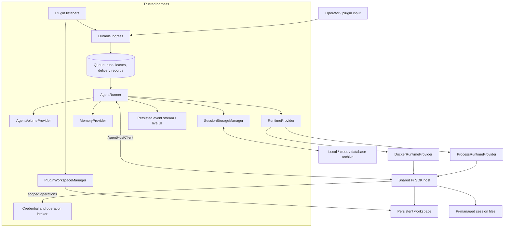
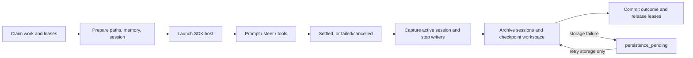

# Sandbox design

Status: planned. Initial scope is local **Process and Docker**, running the same Pi SDK host. Process is a trusted local execution option; Docker provides the container boundary. The [implementation roadmap](../roadmap.md#1-sandbox-implementation) defines delivery stages. [Reference contracts](process-docker-contracts.ts) describe the interfaces; their OS, Docker, and storage drivers are not implemented.

## Architecture

Keep one runner and one set of queue, steering, retry, and persistence rules. Runtime providers manage compute; storage providers manage durable data. Plugin listeners remain in the harness so they can accept work while agent compute is idle.



The provider choice does not change conversation semantics. Runtime, workspace, and session archive are independently selected through trusted profiles, with incompatible capabilities rejected at configuration time.

## Components

| Component | Responsibility |
|---|---|
| `AgentRunner` | Claims work and writer leases; coordinates preparation, execution, persistence, retries, and cleanup. |
| `RuntimeProvider` | `ensureRuntime`, `start`, `inspect`, `stop`, `dispose`, `listOwned`; returns transport plus a recoverable runtime identity. |
| `ProcessRuntimeProvider` | Launches the approved SDK host using absolute executable paths and an owned process group. |
| `DockerRuntimeProvider` | Creates, attaches, starts, inspects, stops, and removes containers by container identity. |
| `AgentHostClient` | Shared versioned JSON-line transport for prompt, steer, abort, state, shutdown, and normalized Pi events. |
| `AgentVolumeProvider` | Prepares safe workspace/session/run paths and checkpoints workspace state. Initially implemented by `LocalDirectoryVolumeProvider`. |
| `SessionStorageManager` | Restores/reconciles live files before a batch and archives all relevant JSONLs after writers exit. |
| `SessionArchiveStore` | Stores original JSONL bytes and manifests with revision checks; local, cloud, and database adapters share the contract. |
| `MemoryProvider` | Separate memory preparation/finalization hooks; initially `WorkspaceFileMemoryProvider`. |
| `PluginWorkspaceManager` | Publishes staged attachments/files into scoped plugin workspace paths and coordinates with checkpoints. |
| Operation broker | Authenticates scoped actions, holds upstream credentials, deduplicates delivery, and reports uncertain outcomes. |

## Pi host and transport

Use a small file-backed SDK host in both providers. It supplies the runtime workspace as `SessionManager.open(file, sessionDir, cwdOverride)` so sessions can move between host paths and Docker paths without rewriting archived JSONL headers. Pi continues to own serialization, compaction, and conversation history.

The host accepts `prompt`, `steer`, `abort`, `get_state`, and `shutdown`. It emits readiness, acknowledgments, normalized events, and settled/shutdown outcomes. `AgentHostClient` reuses the existing framing/request-ID approach but is not a claim of compatibility with every stock Pi RPC command.

Wait for session-level `agent_settled` before beginning normal finalization; an `agent_end` can precede automatic retries or compaction. Preserve actual input-delivery links and record the active file/session/leaf mapping before shutdown. The installed Pi SDK exposes both the working-directory override and settled event; implementation must exercise them in integration fixtures.

## Data boundaries

```text
<harnessRoot>/
  control/
    runs.db                           queue, runs, leases, operation/event records
    plugins/<agent>/<plugin>/         private cursors, schedules, authorization state
    secrets/                          protected credentials / vault references
    incoming/<agent>/<file-id>/        durable attachment staging
    archives/                         optional local archive backend
  runtime-installations/<agent>/<platform>/<recipe-hash>/
                                      versioned Process dependencies
  agents/<agent>/
    agent.json                        operator-controlled settings
    assets/releases/<revision>/       approved prompts, skills, scripts, extensions,
                                      plugin code and dependency/build recipes
    sessions/<thread>/<session>/       live Pi JSONL files
    workspace/
      files/  scripts/  skills/        agent-authored work
      memory/                         durable notes
      plugins/<plugin>/               attachments/, files/, rebuildable cache/
      .home/  .deps/                  scoped user settings and optional packages
    runs/<run>/spec/                   assembled prompt and nonsecret run config
    runs/<run>/scratch/                temporary files
```

| Resource | Process | Docker |
|---|---|---|
| Assets | Resolved absolute release directory | `/assets`, read-only |
| Workspace / cwd | Agent workspace directory | `/workspace`, read-write |
| Current session tree | Selected session directory | `/sessions`, read-write for Pi |
| Run specification | Per-run directory | `/run-spec`, read-only |
| Runtime dependencies | Approved versioned native installation | `/opt/runtime` from a pinned image |

Never expose the control database, other agents, host HOME, Docker socket, or harness secrets to the Docker runtime. Clear ambient credential/global Pi discovery and construct an allowlisted environment instead of copying `process.env`.

Assets are immutable releases. Resolve and record a revision before launch; do not mount a moving `current` symlink. Agent-authored scripts/skills belong in workspace. Only approved asset extensions may execute as Pi extensions; workspace content must not become an imported host hook. Asset/image changes create candidate releases through a trusted workflow.

The Docker baseline permits Pi to write sessions, and its ordinary tools share that identity. **Strict workspace-only tool access requires a separate tool execution identity or service without a sessions mount.** That is a release gate for any profile claiming the stronger guarantee. A same-account Process profile cannot promise host isolation or immutable same-owner assets; reject requested protections it cannot enforce.

## Runtime preparation and lifecycle

One approved dependency manifest has two realizations: a platform-specific native installation and a Docker image digest. Record Pi, Node/Python, platform, and lockfile versions. Process never executes a container image.

Provision native dependencies once per recipe under a lock, using an approved setup script and explicit executable/cache paths. Publish readiness only after validation. Create changed recipes at their final versioned path rather than mutating a live installation. System packages are explicit host prerequisites.

Build and smoke-test Docker images outside the agent runtime. Launch as non-root with read-only root, dropped capabilities, no-new-privileges, resource limits, and bounded scratch. Validate bind-source ownership on the daemon host. Persist container identity before attach/start; use labels to reconcile an uncertain create response. Inspect actual container exit rather than assuming a Docker CLI exit proves completion.

Process recovery uses PID plus start identity and reconciles orphaned runs before retrying. Anonymous stdio pipes are not reconnectable. Process-group cleanup does not fully contain deliberately detached descendants; stronger native limits require explicit OS facilities.

Compute starts on demand and is torn down immediately after persistence by default. Persistent workspace/session data and always-on plugin listeners have separate lifetimes. Warm idle reuse and cloud adapters are later extensions.

## Batch flow and persistence



1. Persist ingress independently of runner/compute availability. Claim the thread/session and workspace writer leases in a fixed order; create a durable run ID and fencing generation.
2. Resolve approved assets/runtime/storage profiles. Prepare safe paths, memory, and plugin data roots. Restore the selected session only after reconciling any newer surviving live file.
3. Assemble prompts with runtime paths, load resources explicitly, mint a scoped callback grant, and start the shared host. Wait for readiness before prompting.
4. Preserve queue priority, steering, `doNotSteer`, silent inputs, and delivery mapping. Feed live events to the UI independently of archive completion.
5. On settlement, block new steers, validate/persist active session mapping, request orderly SDK shutdown, and wait for all session writers to exit. Cancellation closes new operation admission immediately; normal shutdown permits legitimate finalization before revocation.
6. Pause plugin file publication and drain pending writes. Archive sessions, checkpoint workspace, and finalize memory. Commit receipts and queue/run outcome only after persistence succeeds.
7. Dispose compute and release leases. Retry cleanup without replaying completed model work. Reopen plugin publication after the checkpoint barrier.

A storage failure leaves `persistence_pending` and retains recoverable files. Retry storage, not the model. Archive receipts describe file integrity and restore eligibility separately from whether model work succeeded. Keep original bytes for partial/crashed files and retain the last validated restore pointer. No file means a recorded no-transcript outcome, not a fabricated transcript.

Archive saves use content checksums, idempotency keys, and expected-head revisions. Keep the newest archive head separate from the chosen restorable revision. Inventory switched/new session files and lineage as well as the initially opened file. Local stores publish revisions atomically; cloud stores verify uploaded objects before publishing manifests; database stores transact bytes and revision metadata.

Default to one workspace writer even when multiple threads have queued work. Shared images and volumes do not provide writer coordination. Recovery verifies retained/restored session content before choosing continuation versus resend; a delivery report can be newer than the last archive.

## Plugins, credentials, and callbacks

Keep polling cursors, scheduling authority, credentials, and delivery records in trusted control storage. Agent-accessible plugin files belong under `workspace/plugins/<id>/`.

Downloads first enter durable staging. `PluginWorkspaceManager` publishes complete files with server-generated IDs and safe paths, then commits readiness and queues notifications. Track `staged → publishing → published` with checksum/size so crash recovery completes a publication without duplicating it. Serialize publication with checkpointing; downloads can continue in staging while the publication gate is closed. Reject path traversal and symlink escapes when writing with host authority.

Use a separate `/runtime/v1/*` API with short-lived run grants bound to agent, thread, run, fence, expiry, and allowed operations. Identity comes from the grant, not a caller-supplied sender field. Reject stale generations and revoke grants at termination.

| Surface | Authorized caller and purpose |
|---|---|
| `/runtime/v1/messages` | Agent: send a durable message to an allowed destination. |
| `/runtime/v1/plugins/:plugin/operations` | Agent: request an explicitly allowed typed plugin action. |
| `/runtime/v1/operations/:id` | Owning agent: inspect pending/success/failure/uncertain delivery. |
| `/runtime/v1/progress` | Agent: publish scoped progress, without run-finalization authority. |
| `/runtime/v1/image-requests` | Agent: request a dependency release for trusted review/build. |
| Runtime events / heartbeat | Trusted adapter only; use direct in-process ingestion initially. |

Upstream model/plugin credentials remain in the broker. Agent grants are readable by tools but cannot retrieve those credentials or publish trusted lifecycle events. Adapt existing CLI syntax to typed broker actions, including Telegram, GWS, messaging, scheduler, and artifacts. Compatible model traffic can use brokered credentials; token-in-path and credential-file CLIs need explicit adapters. Docker deployments claiming hidden credentials also need enforced network policy, not only proxy settings.

Persist outgoing operations separately from session archives. An acceptance receipt is not proof of delivery. Reusing an operation ID deduplicates the same request; changed payloads conflict. Unknown external outcomes require reconciliation rather than automatic replay.

## Live console and product delivery

Expose authenticated Server-Sent Events at `GET /api/agents/:id/stream`, with run ID, monotonic sequence, audience, and a resume cursor through `Last-Event-ID`. Existing REST routes carry send/cancel commands. Persist lifecycle and user-facing message/operation records; token deltas may be transient. Reconnect replays retained events or requests a snapshot when the cursor is too old.

The console distinguishes configured/ready/idle agent state from active run state and displays runtime provider, persistence status, and workspace ownership. Progress and explicit replies arrive before archival finishes. Reconcile streamed final messages with archived entries using stable IDs so the same answer appears once. Completion is published only after required durability, even if answer text was visible earlier.

## Migration

Start with the Process adapter and local archive, then validate Docker against the same fixtures. Add cloud/database archive adapters without changing Pi's live-file behavior. The initial runtime scope stays Process/Docker.

Migrate one drained agent at a time with a backup and rollback manifest. Classify approved assets separately from agent-authored files; preserve ambiguous edits for review. Move queue/private plugin state into control storage and attachments into plugin workspace paths. Preserve original JSONL bytes and identity mappings. Keep durable ingress available during cutover, and retain the old tree until validation succeeds.

The roadmap owns sequencing and acceptance checks. This document owns the target interfaces and behavior.
