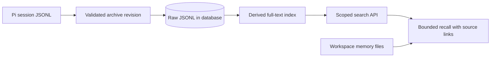

# Sessions and memory design

Status: planned after sandbox persistence. The [sandbox design](sandbox.md) owns live files, archive adapters, and batch hooks. This design adds search and recall without changing Pi's session format.

## Responsibilities

| Element | Responsibility |
|---|---|
| Session archive | Preserve original JSONL revisions and restore metadata. |
| Database archive backend | Store raw JSONL and revision metadata for the search phase; backfill earlier local/cloud archives. |
| Search index | Derive searchable messages/tool text with agent, thread, session, revision, and entry IDs. Rebuildable from raw archives. |
| Search API | Enforce scope, return bounded excerpts and source links, and paginate results. |
| Memory provider | Retrieve relevant context and prepare durable memory access; not a competing transcript writer. |
| Workspace memory | Agent-authored notes and indexes under `workspace/memory/`, included in workspace checkpoints. |

## Data flow

Index after archive publication using an idempotent revision job. A failed indexing job must not rerun model work or make a valid archived session unrestorable. Preserve branch/entry relationships and distinguish incomplete captures from validated restore revisions.

Start with full-text search. Embeddings and extracted summaries are optional later backends. Retrieved history is evidence, not new instructions or automatically verified memory. Bound recall by relevance, scope, and context budget; preserve source links so an agent or operator can inspect the original.

The search phase makes database-backed raw JSONL available even when deployments previously chose another archive backend. It does not replace Pi's live files with an in-memory database serializer.

## Access and lifecycle

Apply agent/thread authorization before searching or returning snippets. Keep archive credentials and indexing authority in trusted services. Retention/deletion must cover raw revisions, derived indexes, and recalled caches. Keep operational audit events separate from agent-editable notes and transcripts.

Completion criteria and progress are tracked in the [implementation roadmap](../roadmap.md#2-session-search-and-memory).
