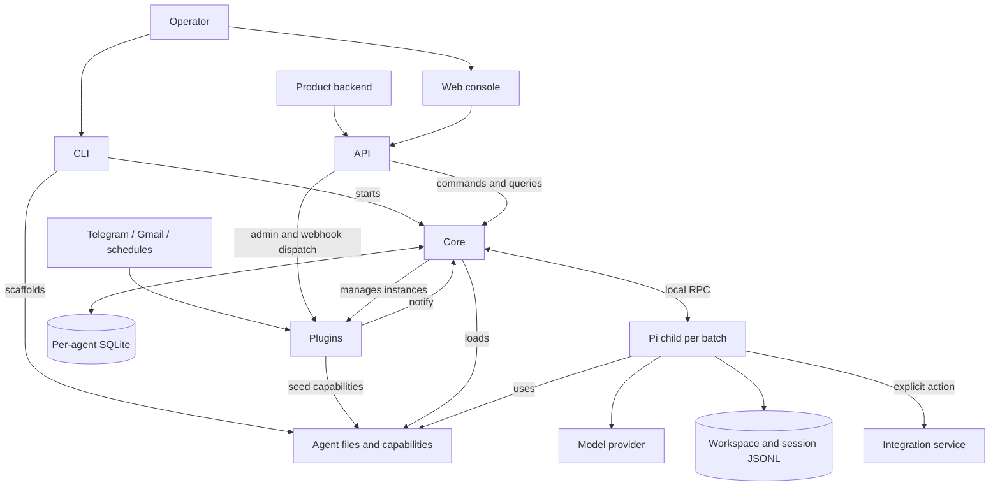
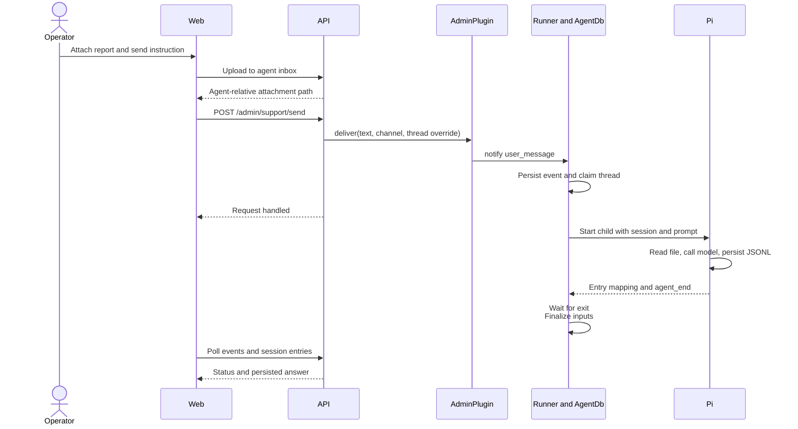
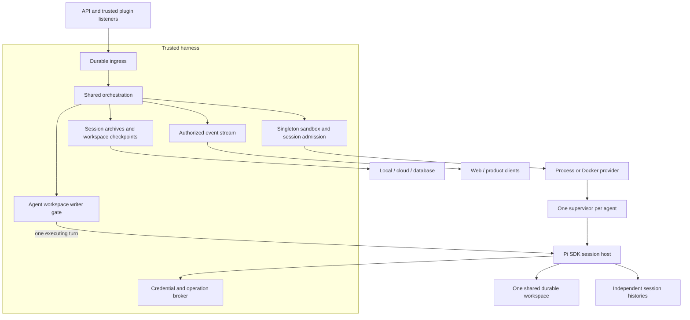

# High-level design

CogniSphere is a persistent-agent harness: integrations supply work, the harness queues and routes it, and Pi executes the model/tool loop. Each agent has its own configuration, capabilities, files, plugin instances, and conversation history. One Node.js service manages the deployment; the React console and optional product applications use its HTTP interface.

**Status:** the current-system sections describe the source in this checkout. The target architecture is explicitly marked planned. The [roadmap](roadmap.md) is the single delivery index; individual implementation plans live under `plans/`. [FAQ](#faq).

## Layers and responsibilities

These are logical ownership boundaries, not six separately deployed services. Core, plugins, API, CLI, and agent templates ship in `packages/harness`; web is developed in `packages/web` and bundled with the harness package.

| Layer and low-level design | Owns | Depends on / supplies |
|---|---|---|
| [Core](low-level/core.md) | Lifecycle, routing, durable queue, batch execution, credential/model stores. | Consumes agent assets and plugin notifications; supplies state and commands to API. |
| [Plugins](low-level/plugins.md) | Integration listeners, source state, notification formatting, explicit actions. | Implements core contracts; supplies seeds to agents and optional raw HTTP handlers to API. |
| [Agents](low-level/agents.md) | Templates, prompts, skills, scripts, Pi extensions, editable knowledge/work. | CLI creates agent forks; plugins seed capabilities; core loads and runs them. |
| [API](low-level/api.md) | Authentication, HTTP validation, lifecycle/settings/files/history routes, webhook dispatch. | Calls core and plugin interfaces; serves web and product backends. |
| [CLI](low-level/cli.md) | App-home scaffolding, agent/plugin forks, server supervision, upgrade bookkeeping, packaging. | Assembles core, agent/plugin templates, and the built web console. |
| [Web](low-level/web.md) | Operator navigation, chat/history, events, files, settings. | Consumes HTTP contracts; never reads SQLite or agent files directly. |

Core's composition root wires concrete implementations. Plugin contracts are defined in core; plugins do not select workers or edit queue rows. API handlers translate requests into those same lifecycle and notification paths. Agent assets are executable/content inputs, not another orchestration service.

## Identity and durable state

| Term | Meaning and lifetime |
|---|---|
| Harness | A deployment rooted at `<rootDir>/<harnessId>`. |
| Agent | Persistent identity with its own files, database, and plugin instances. |
| Notification/event | One input, with source metadata and a mutable processing row in SQLite. |
| Channel | A source conversation, such as a Telegram chat. |
| Thread | Routing key; at most one current batch per thread. |
| Batch | Claimed inputs, possibly augmented by live steers, handled by one Pi child. |
| Session | Pi JSONL conversation associated with a thread; survives child exit. |

SQLite owns queue state and thread/session bindings. Pi owns conversation serialization. Agent and plugin files own work products and integration state. Those stores serve different purposes: setting an event to `done` does not reconstruct a transcript or prove an external message was delivered. The [agents design](low-level/agents.md#persistent-layout) defines the current file tree; the [core design](low-level/core.md#queue-and-recovery) defines queue recovery.

## Example: an operator asks an agent to summarize a file

The request acknowledgment is separate from processing completion. Today's plugin wrapper logs and swallows notification errors, so even acceptance is not a durable receipt contract. The operator checks event/session state. Sending the answer to Telegram or email requires an explicit integration action; assistant text is visible in the console but is not automatically delivered to the originating service.

Follow-up input for the same streaming thread can steer the current child. `doNotSteer` waits for a later batch. Silent input alone does not wake an idle thread. Different threads can use different configured slots today, but share the agent directory and can conflict on files.

## Current deployment and trust

The server, plugins, and local Pi children run on a trusted host. A child runs with the agent directory as cwd, receives environment credentials, and can execute shell commands. Directory separation and the seven-tool list do not enforce isolation. Plugin code runs inside the server. API cookies and the product-app bearer grant operator-level access; `X-App-User` is attribution, not an authorization scope.

The CLI creates an app home containing `harness/`, optional `app/`, and deployment scripts. In production the server serves the bundled console; development uses Vite's API proxy. See [CLI deployment](low-level/cli.md#server-deployment) and [API authentication](low-level/api.md#1-mount-points-and-auth-model).

## Planned architecture

The first workstream replaces the local RPC launch path with one shared orchestration flow and small Process/Docker adapters. It uses a direct Pi SDK host inside the execution environment. It does not add a remote stock-Pi-RPC migration stage.

Several logical sessions can be admitted to an agent's sole sandbox, but the baseline permits one tool-enabled turn at a time. The writer gate includes file reads/preparation, tools, plugin publication, descendants, and checkpointing. Waiting sessions have no executing agent code. Session history and shared-workspace restore heads are independent: reopening an old conversation sees the current shared files.

| Design choice | Reason | Cost or limit |
|---|---|---|
| Shared orchestration with provider adapters | Queue, retry, and delivery behavior stays consistent across runtimes. | Provider conformance and failure tests are required. |
| Pi SDK owns live file-backed history | Preserve native history, compaction, entry identity, and restore behavior. | SDK version and event ordering need integration fixtures. |
| One sandbox and one workspace per agent | Files are immediately shared across conversations without live merging. | Tool-enabled turns serialize; capacity is admission, not parallel execution. |
| Broker outside execution | Credentials and privileged actions remain under trusted control. | Each supported integration needs a typed adapter and uncertain-delivery recovery. |
| Stop writers before archiving and handoff | A consistent checkpoint cannot race detached writers. | Storage failure blocks later workspace writers as `persistence_pending`. |
| Process labeled `[no sandbox]` | Accurately describes trusted local execution. | No host isolation; Docker also needs an explicit protection profile. |
| Search after durable archives; improvement after search | New behavior has traceable, restorable evidence. | Search and improvement remain later workstreams. |

Docker's baseline still allows the Pi writer and ordinary tools to access live session files under one identity. Strict workspace-only tools require a separate tool execution boundary. Same-agent sessions are not mutually isolated by path names or copied capabilities.

[Agent and automation simplification](plans/10-agent-simplification.md) adds a read-only base image/release plus persistent resource overrides, ordered main/sub-agent capability context, and asynchronous delegation within that same sandbox. Script routing, cron jobs and plugin daemons use durable ingress while agent compute is stopped. The harness supervises editable scripts in isolated workers; only trusted adapters access the encrypted vault and upstream credentials. Publishing a script revision does not grant it harness-process authority.

## How to use and maintain these docs

Read this document for system boundaries, then the relevant layer design for implementation details and examples. Use the [roadmap](roadmap.md) for order/status and its ten linked plans for proposed interfaces, algorithms, failure handling, migration, and acceptance checks. The [runtime contracts](plans/runtime-contracts.ts) are type-checkable design references, not installed drivers.

Keep each concern in its owning layer document. When a roadmap feature lands, update that layer's current behavior and mark the corresponding roadmap acceptance evidence; do not describe a proposed interface as shipped merely because its plan exists. Deployment-facing instructions remain in the separately shipped [app-home reference](../packages/harness/home-template/docs/base-harness/README.md).

## FAQ

These questions cover product users, deployment operators, and developers. Answers distinguish today's system from the planned runtime.

### I am new to the project. Which document should I read first?

Read the layer/dependency map above, then the design for the part you will change. For running a deployment, start with [CLI installation](low-level/cli.md#installation); for debugging a stuck message, start with the [core FAQ](low-level/core.md#faq). Use the [roadmap](roadmap.md) when you need implementation order or proposed features.

### Are the six layers separate services I need to deploy?

No. Core, plugins, API, CLI, and agent templates ship in the harness package. The web console is built separately and bundled for the server to serve. Current model/tool work runs in local Pi child processes; the optional product app is a separate application that talks to the harness API.

### What is the difference between an agent, a thread, a session, and a batch?

An agent is the persistent identity and its capabilities/files. A thread routes a conversation; its session is Pi's saved JSONL history. A batch is one execution attempt over queued inputs, potentially including follow-up steers. Restarting a child ends that execution process without normally deleting the agent or its conversation.

### Does a successful Send response mean the agent completed my request?

No. The current response acknowledges request handling, and the plugin notification wrapper can swallow enqueue errors. Look for the event row, its processing status, and its linked session entry. A completed model turn also does not prove that an email or Telegram reply was sent; that requires an explicit integration action and its result.

### Can two conversations share files without sharing their chat history?

Yes. Threads have separate conversation histories but use the same agent directory today. With multiple execution slots they can race on files. The planned runtime keeps one shared workspace and serializes complete tool-enabled turns, so shared files remain available while histories stay separate.

### What happens if I close the browser or restart the server?

Closing the browser does not cancel backend work already queued. Server shutdown interrupts execution; persisted inputs and histories survive, and current startup recovery handles interrupted rows under the retry budget. See [core recovery](low-level/core.md#faq) before treating a restarted request as safe to repeat externally.

### Is the current system safe to treat as a multi-tenant sandbox?

It does not provide that boundary. Plugins run inside the server, agent tools execute on the host with exported credentials, and authenticated operator/product bearer access is broad. The [protection plan](plans/07-protection-and-cutover.md) describes future enforceable profiles, including their limits; separate agent directories alone do not isolate tenants.

### I want a new integration, tool, or screen. Which layer should I change?

Use a plugin for an external source/listener and its actions, agent skills/scripts/extensions for Pi capabilities, API for HTTP contracts, and web for operator interaction. Changes to scheduling, retries, or lifecycle belong in core; scaffold/package changes belong in CLI. Update every affected contract when the feature crosses those boundaries.

### Why does the roadmap use the Pi SDK while the current docs describe RPC?

They describe different stages. The shipped runner still launches Pi in RPC mode; the target imports the SDK inside the execution environment and uses a narrow harness-owned transport. The [SDK plan](plans/01-sdk-runtime.md) defines parity and cutover requirements. Its presence does not enable the new runtime.

### How do I keep an implementation change and these docs consistent?

Update the current layer doc and its FAQ when observable behavior changes. If the work implements a planned feature, also record acceptance evidence in the roadmap and revise the plan's status. Keep detailed parameter definitions in the owning layer and link to them from cross-layer answers rather than creating another competing specification.
