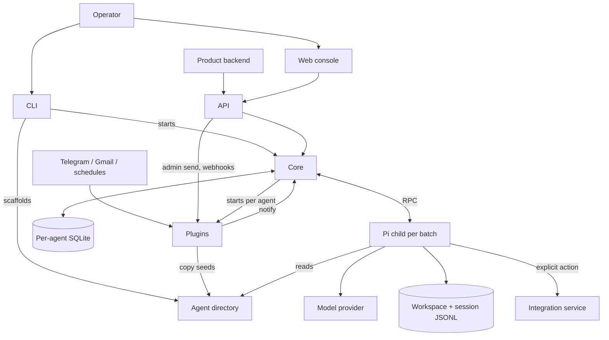
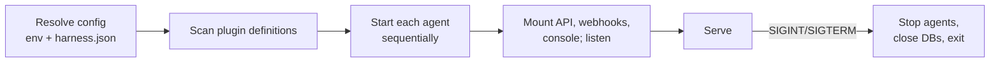
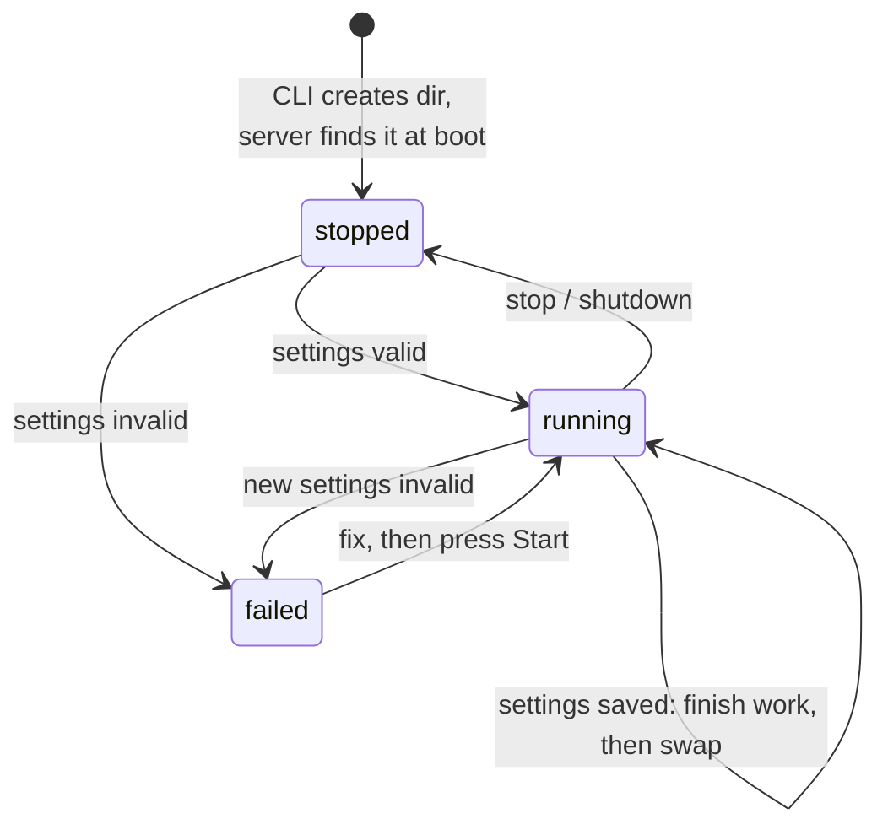
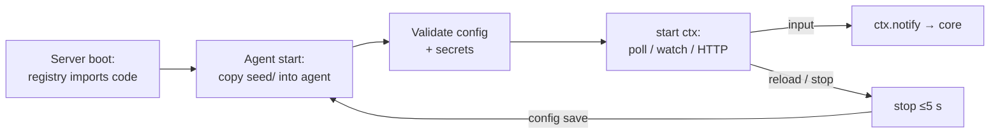
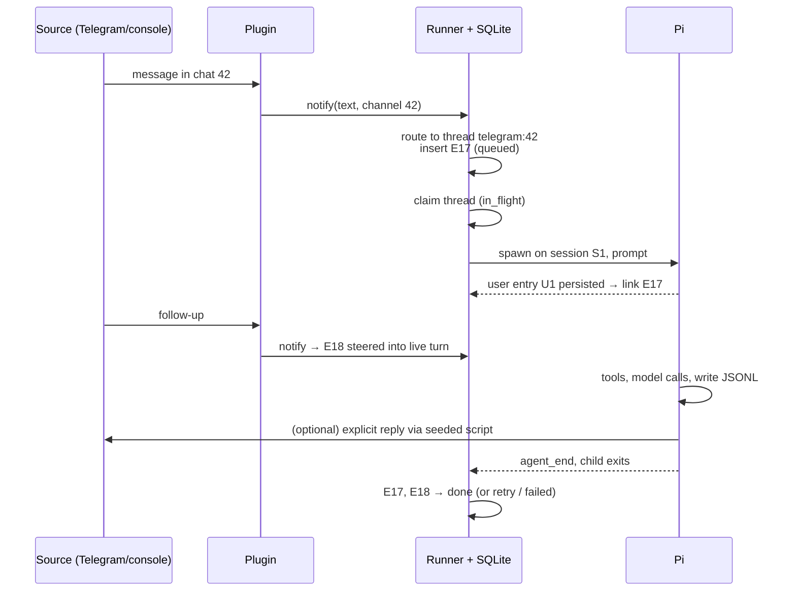
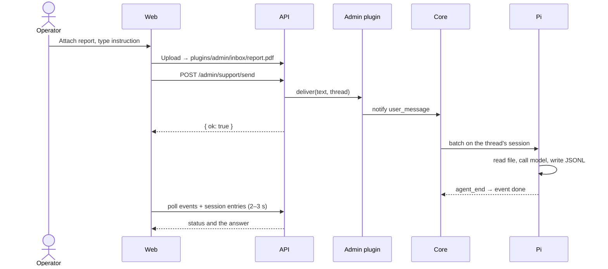
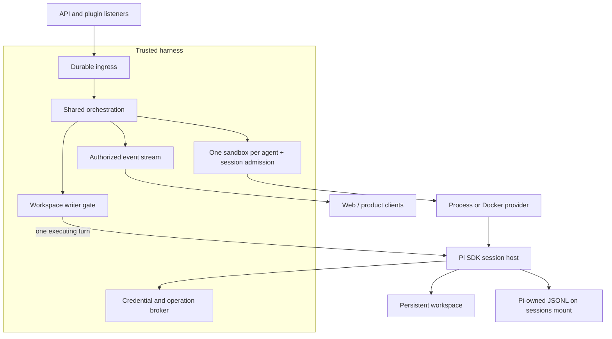

# High-level design

CogniSphere runs **long-lived AI agents**. Messages arrive from Telegram, Gmail, schedules or the operator console. The harness puts each one in a queue, decides which conversation it belongs to, and starts [Pi](https://github.com/earendil-works/pi) (the model-and-tools engine) to handle it. Each agent has its own folder with its settings, skills, files and conversation history. One Node.js server runs everything, and the web console and optional product apps talk to it over HTTP.

**If you read only one thing:** an input becomes a row in SQLite. A short-lived Pi process handles it and writes the conversation to a file. The row is then marked done, retried, or failed. Replies to Telegram or email happen only if the agent explicitly runs a send script.

**Status:** everything below describes the code in this checkout, except the section marked [planned](#planned-architecture). The [roadmap](roadmap.md) is the only delivery index. [FAQ](#faq).

## Layers

These are ownership boundaries inside one package, not separate services. Core, plugins, API, CLI and agent templates ship in `packages/harness`; the web console is built from `packages/web` and bundled into it.

| Layer | Owns | Talks to |
|---|---|---|
| [Core](low-level/core.md) | Agent lifecycle, routing, durable queue, batch execution, model/secret stores. | Runs plugins and Pi; serves state to API. |
| [Plugins](low-level/plugins.md) | Listeners for external sources, integration state, seeded agent tools. | Call `notify` into core; serve raw HTTP via API. |
| [Agents](low-level/agents.md) | Templates, prompts, skills, scripts, Pi extensions, knowledge and work files. | Loaded by core into each Pi child. |
| [API](low-level/api.md) | Auth, HTTP validation, lifecycle/settings/files/history routes, webhook dispatch. | Calls core and plugins; used by web and product backends. |
| [CLI](low-level/cli.md) | App-home scaffolding, agent/plugin forks, server supervision, upgrades, packaging. | Starts core; writes agent/plugin files. |
| [Web](low-level/web.md) | Operator console: chat/history, events, files, settings. | HTTP only — never reads SQLite or files directly. |

```mermaid
flowchart TB
    Operator --> Web[Web console]
    Operator --> CLI
    Product[Product backend] --> API
    Web --> API
    CLI -->|starts| Core
    CLI -->|scaffolds| Assets[Agent directory]
    Sources[Telegram / Gmail / schedules] --> Plugins
    API --> Core
    API -->|admin send, webhooks| Plugins
    Core -->|starts per agent| Plugins
    Plugins -->|notify| Core
    Plugins -->|copy seeds| Assets
    Core <--> Queue[(Per-agent SQLite)]
    Core <-->|RPC| Pi[Pi child per batch]
    Pi -->|reads| Assets
    Pi --> Model[Model provider]
    Pi --> Files[(Workspace + session JSONL)]
    Pi -->|explicit action| External[Integration service]
```

## Vocabulary

| Term | Meaning | Example |
|---|---|---|
| Harness | One deployment rooted at `<rootDir>/<harnessId>`, served by one process. | `~/.cognisphere/default` |
| Agent | Persistent identity = one directory with its own DB and plugin instances. | `support` |
| Plugin instance | One integration enabled on one agent. | `support/telegram` |
| Event | One input, stored as a mutable SQLite row. | E17 "summarize the report" |
| Thread | Routing key; at most one running batch per thread. | `telegram:42` |
| Session | Pi's JSONL history bound to a thread; survives process exit. | `sessions/telegram:42/S1.jsonl` |
| Batch | Inputs claimed together (plus live follow-ups), run by one Pi child. | E17 + steered E18 |

Each store has one job: **SQLite** holds queue state and thread → session bindings; **Pi JSONL** holds the conversation; **agent/plugin files** hold work and integration state. So an event marked `done` doesn't prove an email was sent, and deleting an event doesn't delete history.

## Lifecycles

Four things live for different lengths of time. Inside a running **harness**, an **agent** can be stopped or running. A running agent has **plugin instances** listening, and an agent usually has no Pi process between **events**.

### 1. Harness — boot, serve, stop

```mermaid
flowchart LR
    A[Resolve config<br/>env + harness.json] --> B[Scan plugin definitions]
    B --> C[Start each agent<br/>sequentially]
    C --> D[Mount API, webhooks,<br/>console; listen]
    D --> E[Serve]
    E -->|SIGINT/SIGTERM| F[Stop agents,<br/>close DBs, exit]
```

The CLI (`cognisphere serve`) finds `harness.json` and spawns the server. Boot resolves paths and ports, imports plugin definitions (a deployment's own copy overrides a packaged one), then starts agents one by one. A broken agent is shown as `failed`; the rest still run. On shutdown, running work goes back into the queue (using up one attempt) and is picked up after the next boot. Details: [core harness lifecycle](low-level/core.md#harness-lifecycle).

### 2. Agent — create, start, run, stop

```mermaid
stateDiagram-v2
    [*] --> stopped: CLI creates dir,<br/>server finds it at boot
    stopped --> running: settings valid
    stopped --> failed: settings invalid
    failed --> running: fix, then press Start
    running --> running: settings saved: finish work, then swap
    running --> failed: new settings invalid
    running --> stopped: stop / shutdown
```

1. `cognisphere agent new support` forks the base template into `agents/support/`.
2. The operator sets a persona, model and secrets, then restarts the server so it discovers the directory.
3. **Start:** validate `agent.json` + secrets → open `sessions/.events.db` → run bootstrap → create the runner → start plugins → sweep interrupted rows → `running`.
4. **Run:** while idle, no Pi process exists. Each claimed batch spawns a Pi child that exits when the batch ends.
5. **Reload:** saving settings pauses new work, lets the running batch finish, then rebuilds the runner and plugins. This only happens for a *running* agent; a failed agent needs you to press Start after fixing it.
6. **Stop:** files, database and history stay. Work that was running goes back into the queue and uses up one attempt. Stop is not remembered, so the next boot starts the agent again.

Details: [core agent lifecycle](low-level/core.md#agent-lifecycle), [agent files](low-level/agents.md#agent-lifecycle-end-to-end).

### 3. Plugin — discover, seed, listen, stop

```mermaid
flowchart LR
    A[Server boot:<br/>registry imports code] --> B[Agent start:<br/>copy seed/ into agent]
    B --> C[Validate config<br/>+ secrets]
    C --> D[start ctx:<br/>poll / watch / HTTP]
    D -->|input| E[ctx.notify → core]
    D -->|reload / stop| F[stop ≤5 s]
    F -->|config save| B
```

The code is loaded once per server boot, and a fresh **instance** is created on every agent start or plugin reload. On each start, the manager copies the plugin's prompts, skills and scripts into the agent and checks its config; then the instance starts listening. A plugin that fails (for example, GWS before Google is connected) is marked `failed` on its own, and the agent keeps working. **Anything a plugin sends before the agent's runner has started (during Start, Restart or a settings swap) is dropped**, and `notify` gives no receipt either way. Outbound actions such as sending a Telegram reply are scripts the *agent* runs explicitly. Details: [plugin lifecycle](low-level/plugins.md#discovery-and-lifecycle).

### 4. Event — from input to answer

```mermaid
sequenceDiagram
    participant Src as Source (Telegram/console)
    participant Plugin
    participant Core as Runner + SQLite
    participant Pi
    Src->>Plugin: message in chat 42
    Plugin->>Core: notify(text, channel 42)
    Core->>Core: route to thread telegram:42<br/>insert E17 (queued)
    Core->>Core: claim thread (in_flight)
    Core->>Pi: spawn on session S1, prompt
    Pi-->>Core: user entry U1 persisted → link E17
    Src->>Plugin: follow-up
    Plugin->>Core: notify → E18 steered into live turn
    Pi->>Pi: tools, model calls, write JSONL
    Pi->>Src: (optional) explicit reply via seeded script
    Pi-->>Core: agent_end, child exits
    Core->>Core: E17, E18 → done (or retry / failed)
```

`queued → in_flight → done`. A failed batch sends the input back to `queued` until `maxAttempts` (default 3) is used up, then marks it `failed`. An input already in Pi's history is retried with a short "continue" nudge; one that never reached Pi is resent with a retry warning. Abort → `cancelled`. Retries can repeat side effects, because nothing is exactly-once. Details: [core event lifecycle](low-level/core.md#event-lifecycle).

### Worked example: operator asks an agent to summarize a file

```mermaid
sequenceDiagram
    actor Operator
    participant Web
    participant API
    participant Admin as Admin plugin
    participant Core
    participant Pi
    Operator->>Web: Attach report, type instruction
    Web->>API: Upload → plugins/admin/inbox/report.pdf
    Web->>API: POST /admin/support/send
    API->>Admin: deliver(text, thread)
    Admin->>Core: notify user_message
    API-->>Web: { ok: true }
    Core->>Pi: batch on the thread's session
    Pi->>Pi: read file, call model, write JSONL
    Pi-->>Core: agent_end → event done
    Web->>API: poll events + session entries (2–3 s)
    API-->>Web: status and the answer
```

`{ ok: true }` only means the request was handled. It is **not** a receipt, because the plugin wrapper swallows enqueue errors. Progress is visible through polling, since there is no token streaming. The answer appears in the console, but nothing is sent to Telegram or email unless the agent calls that integration. Follow-ups on the same streaming thread steer the live turn, `doNotSteer` makes them wait, and silent inputs never wake an idle thread.

## Key design decisions

| Decision | Why | Cost |
|---|---|---|
| One server process, per-agent runner + SQLite | Small control path; each agent's state is local and inspectable. | A plugin or server crash affects every agent. |
| Durable queue, short-lived Pi child per batch | Work and history survive restarts; idle agents cost nothing. | Spawn overhead; recovery relies on delivery evidence. |
| Pi owns history; queue only links to it | No second transcript store. | Correlation has to survive partial delivery and retries. |
| Threads, not agents, are the unit of conversation | One agent serves many chats with separate histories and shared files. | Parallel threads can race on files (no lock today). |
| Plugins = in-process listeners + seeded tools | New sources reuse routing/queueing; instructions version with plugin code. | No isolation; `notify` has no receipt. |
| Replies are explicit agent actions | The agent decides whether and where to answer. | Delivery needs its own evidence and dedup. |
| Soft settings reload | Active work finishes under its original config. | "Saved" is not the same as "active". |
| HTTP polling console | Simple recovery by rereading durable state. | No live tokens; progress shows up with a delay. |

## Known risks at a glance

The full lists, with suggested fixes, are in each layer's "Known issues and suggested improvements" section. The most important ones:

| Risk | Where | Suggested direction |
|---|---|---|
| Inputs a plugin sends while its agent is starting or swapping settings are silently dropped. | [Core](low-level/core.md#known-issues-and-suggested-improvements), [plugins](low-level/plugins.md#known-issues-and-suggested-improvements) | Persist before the runner starts; durable intake ([plan 1.4](plans/04-ingress-and-operations.md)). |
| Every agent can read all its credentials, its database and every thread's history. | [Agents](low-level/agents.md#known-issues-and-suggested-improvements) | Workspace-only view and a credential broker ([plan 1.2](plans/02-workspace-and-provisioning.md), [1.4](plans/04-ingress-and-operations.md)). |
| One app secret or cookie gives full operator access; a server without a terminal can start with `admin / changeme`. | [API](low-level/api.md#known-issues-and-suggested-improvements) | Scoped tokens; refuse the default password. |
| No duplicate protection anywhere (send, plugins, retries), and no maximum turn time. | [Core](low-level/core.md#known-issues-and-suggested-improvements), [API](low-level/api.md#known-issues-and-suggested-improvements) | Idempotency keys, source dedup, turn deadline. |
| A failed agent doesn't recover when its settings are fixed; operator restarts use up retry attempts. | [Core](low-level/core.md#known-issues-and-suggested-improvements) | Restart failed agents on reload; don't count operator interruptions. |
| More than one slot lets threads overwrite each other's files. | [Core](low-level/core.md#known-issues-and-suggested-improvements) | Keep one slot until the workspace gate lands. |

## Deployment and trust

The server, plugins and Pi children all run on one **trusted host**. A Pi child runs with the agent directory as cwd, gets credentials as env vars, and can run any shell command. Separate directories and the seven-tool list do **not** isolate anything. Plugin code runs inside the server. The console cookie and the product-app bearer both grant full operator access, and `X-App-User` is attribution only.

`cognisphere init` creates an app home with `harness/`, an optional `app/`, and deployment scripts. In production the server serves the bundled console; in development Vite proxies to the API. See [CLI deployment](low-level/cli.md#server-deployment) and [API auth](low-level/api.md#1-mount-points-and-auth-model).

## Planned architecture

This is not implemented; the [roadmap](roadmap.md) tracks delivery. The local RPC launch path is replaced by one shared orchestration flow, small Process/Docker adapters, and a Pi SDK host running inside the execution environment.

```mermaid
flowchart TB
    Input[API and plugin listeners] --> Ingress[Durable ingress]
    subgraph Control[Trusted harness]
        Ingress --> Runner[Shared orchestration]
        Runner --> Singleton[One sandbox per agent + session admission]
        Runner --> Gate[Workspace writer gate]
        Broker[Credential and operation broker]
        Runner --> Events[Authorized event stream]
    end
    Singleton --> Provider[Process or Docker provider]
    Provider --> Host[Pi SDK session host]
    Gate -->|one executing turn| Host
    Host --> Workspace[Persistent workspace]
    Host --> Histories[Pi-owned JSONL on sessions mount]
    Host --> Broker
    Events --> UI[Web / product clients]
```

Each agent gets **one sandbox and one workspace**. `maxConcurrentSlots` must be 1, so one turn runs at a time and other sessions wait in the durable queue. The writer gate covers file preparation, tools, plugin publication and cleanup. Pi writes history straight to the persistent sessions mount, with no transcript copies.

| Decision | Why | Cost |
|---|---|---|
| Shared orchestration + provider adapters | The same queue/retry/delivery behavior on every runtime. | Needs provider conformance tests. |
| Pi SDK owns live history | Keeps native history, compaction and entry IDs. | Needs SDK version fixtures. |
| One sandbox + workspace per agent | Files are shared across conversations with no merging. | Tool-enabled turns run one at a time. |
| Broker outside the sandbox | Credentials and privileged actions stay trusted. | Each integration needs a typed adapter. |
| Stop writers before handoff | Detached tools can't race the next turn. | Cleanup errors go into visible recovery. |
| Process provider labelled `[no sandbox]` | Honest about local execution. | No host isolation; Docker needs a protection profile. |
| Read-only search over Pi files | Evidence links point at real entries. | No memory service or archive. |

[Agent simplification](plans/10-agent-simplification.md) adds a read-only `base/`, a writable `agent-managed/`, Pi-owned `sessions/`, resource overrides, sub-agent delegation, durable ingress for scripts/cron/daemons, and vault access only through trusted adapters. The [runtime contracts](plans/runtime-contracts.ts) are type-checked references, not installed code. Proposed core cleanups are in the [core simplification review](low-level/core.md#simplification-review-proposed).

## Maintaining these docs

Each concern has one owning layer document. When behavior changes, update that document (and its FAQ). When a planned feature lands, record the evidence in the roadmap instead of relabeling the plan. User-facing deployment instructions live in the shipped [app-home reference](../packages/harness/home-template/docs/base-harness/README.md).

## FAQ

### Operators

#### Where do I start reading?

Read this page first, then the layer you care about.

- To install and run a deployment, start with [CLI installation](low-level/cli.md#installation) and [server deployment](low-level/cli.md#server-deployment).
- To debug a stuck or missing message, start with the [core FAQ](low-level/core.md#faq).
- For settings and environment variables, see [core server configuration](low-level/core.md#server-configuration-and-operations).

#### What is the difference between an agent, a thread, a session and a batch?

An agent is a persistent identity: one folder with its settings, files and database. A thread is one conversation inside that agent, and its session is Pi's saved history for that conversation. A batch is one run of a short-lived Pi process over some queued inputs. When the Pi process exits, the agent and the history stay. See [vocabulary](#vocabulary).

#### I sent a message and nothing happened. Where do I look?

Check three places, in this order. The server logs tell you whether the agent or a plugin failed. The event row (Events tab) tells you whether the input was queued, running, done or failed. The session file (chat view) tells you what the model and tools actually did. The [core FAQ](low-level/core.md#faq) walks through the common causes.

#### Why did the agent not reply on Telegram or by email?

Replies are never sent automatically. The agent has to run the plugin's send script, and a finished event only means the turn ended. Open the conversation and check whether the agent called the send script and what it returned. See [plugins FAQ](low-level/plugins.md#faq).

#### What happens if I close the browser or restart the server?

Closing the browser cancels nothing; the work runs on the server. A restart interrupts running batches. Each interrupted input uses up one attempt and is retried after the next boot. Read [core recovery](low-level/core.md#queue-and-recovery) before you resend anything that has outside effects, such as an email.

#### How do I back up, restore and upgrade a deployment?

The list of what a backup must contain is in [core operations](low-level/core.md#server-configuration-and-operations). When `BACKUP_S3_BUCKET` is set, the server setup script installs a scheduled backup (daily by default) to S3-compatible storage. Restoring is a manual unzip; there is no restore command. Upgrades have separate code and data versions; follow [CLI upgrades](low-level/cli.md#upgrades) and back up first.

#### Is this a multi-tenant sandbox?

No. Plugins run inside the server, and agent tools run on the host with the agent's credentials. Anyone with the console login or the app secret has full operator access. Run it on a host you trust, for people you trust. See [deployment and trust](#deployment-and-trust) and the [protection plan](plans/07-protection-and-cutover.md).

### Integrators

#### How does my product app talk to agents?

Your app's backend calls the harness HTTP API with the app bearer secret. It sends a message with `POST /admin/<agentId>/send`, then polls events and session entries for the result. `X-App-User` is only a label for attribution, not a permission. See [API auth](low-level/api.md#1-mount-points-and-auth-model).

#### Does a successful send mean the agent finished?

No. `{ ok: true }` only means the request was handled, and it is not even proof that the input was queued. Follow the event's status and its linked session entry, as described in [following a message](low-level/api.md#how-do-i-send-a-message-and-get-the-answer-back). A finished turn also does not prove that an outside reply was sent.

#### Can I stream the answer token by token?

Not today. The console and API clients poll durable state every few seconds. Live streaming is a [planned](#planned-architecture) change; see the [API FAQ](low-level/api.md#how-often-should-i-poll-is-there-a-stream-or-a-callback-when-the-answer-is-ready).

### Developers

#### Which layer do I change?

- A new input source, or actions on an outside service, goes in a plugin.
- New agent abilities go in skills, scripts or Pi extensions.
- HTTP contracts go in the API layer, and screens go in web.
- Queueing, retries, routing and agent lifecycle belong to core.
- Scaffolding, packaging and deployment scripts belong to the CLI.

Then update that layer's document, as described in [maintaining these docs](#maintaining-these-docs).

#### Can two conversations share files but not history?

Yes. Each thread has its own history, and all threads share one agent folder. With more than one slot, two threads can edit the same file at the same time, and nothing stops them today. Keep `maxConcurrentSlots` at 1 until the planned runtime runs one turn at a time.

#### How do I test a change locally?

There is no automated test suite. Run `pnpm check` for types and lint, then run the server with `pnpm dev` (and `pnpm dev:web` for the console) against a scratch data folder, and try the change by hand. Details are in the [core FAQ](low-level/core.md#how-do-i-run-and-debug-core-locally).

#### Why does the roadmap say "Pi SDK" when these docs say "RPC"?

Today's runner starts Pi as a separate process in RPC mode. The SDK host is the target described in [plan 1.1](plans/01-sdk-runtime.md). Until it lands, these docs describe RPC.
