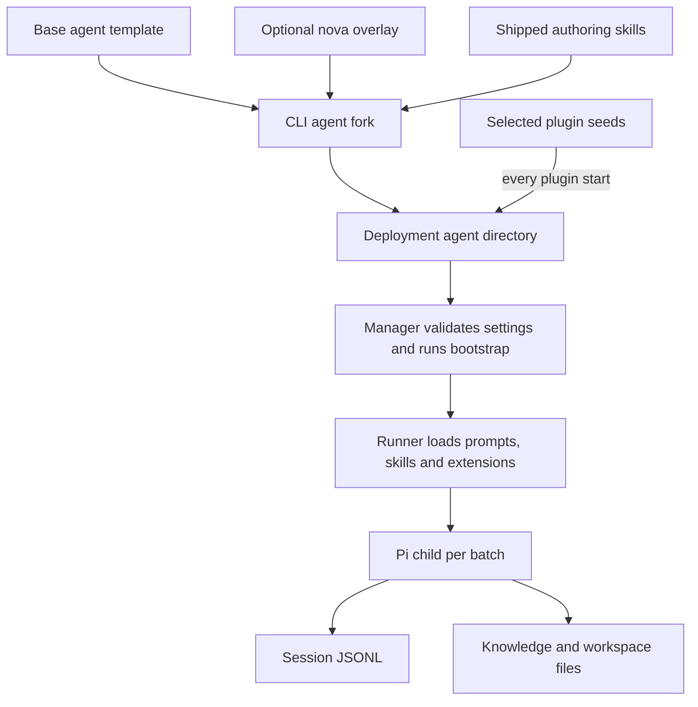

# Agents low-level design

**Status:** current agent templates and runtime assets. [High-level design](../high-level-design.md) · [Roadmap](../roadmap.md). [FAQ](#faq).

## Responsibility and dependencies

The agents layer defines the capabilities and persistent content Pi sees: persona, prompts, skills, scripts, extensions, knowledge, and work products. The runtime lifecycle is owned by [core](core.md#agent-lifecycle). [CLI](cli.md) creates deployment-owned forks; [plugins](plugins.md) add namespaced seeds; [API](api.md) and [web](web.md) expose configuration and files.

| Source | Responsibility |
|---|---|
| [base-agent](../../packages/harness/src/agents/base-agent/) | Base prompts, extensions, tool wrappers, bootstrap requirements, knowledge/workspace seeds. |
| [nova overlay](../../packages/harness/src/agents/nova/) | Developer-agent persona for managing the deployment. |
| [scaffoldAgent](../../packages/harness/src/cli/agent.ts) | Copy base/overlay, install skills, write starter `agent.json`. |
| [AgentJson and fixed tools](../../packages/harness/src/core/types.ts) | Runtime settings contract and tool list. |
| [spawnPi / assembleSystemPrompt](../../packages/harness/src/core/runner.ts) | Prompt assembly and explicit Pi resource loading. |

## Creation and loading



`cognisphere init` creates `nova`. The name is reserved for the developer agent; `agent new nova --dev` recreates that role. Ordinary agents receive the base template and `create-skill`; the developer receives the full shipped harness skill set. A fork is deployment-owned, not dynamically inherited from the package after creation. Plugin seed copying is a separate repeated operation.

The manager writes the agent-directory prompt fragment only if absent, so operator edits win but the roster is not a live directory service. Sorted `.md` files in `system_prompts/` form the system prompt. The runner adds thread/session context and writes the assembled prompt to `sessions/<thread>/.system-prompt.md`; passing a file path avoids large argv strings.

## Persistent layout

```text
<harnessRoot>/
  harness.json
  .secrets/                           credentials, login and model settings
  plugins/<plugin>/                   optional deployment-owned definitions
  agents/<agent>/
    agent.json                        identity and runtime settings
    system_prompts/                   ordered instruction fragments
    skills/                           recursively discovered SKILL.md files
    scripts/                          agent and plugin command helpers
    extensions/                       explicit Pi extension entry points
    bootstrap/                        bootstrap.sh and dependency requirements
    .venv/                            optional agent Python environment
    knowledge/                        editable knowledge and memory notes
    workspace/                        durable work products
    plugins/<plugin>/
      config.json
      state/                          cursors, routes, schedules, output
      inbox/                          attachments
    sessions/
      .events.db                      core queue and thread bindings
      <thread>/<session>.jsonl         Pi-owned conversation history
      <thread>/.system-prompt.md       most recent assembled prompt
```

**Current cwd is the entire agent directory**, not `workspace/`. The child can therefore use `knowledge/`, plugin inboxes, and scripts directly. Session files and database placement here do not create a security boundary. Proposed `/workspace`-only cwd and separated control storage belong to [plan 1.2](../plans/02-workspace-and-provisioning.md).

Pi writes JSONL; core writes event/session bindings; plugins write integration state; tools write work products. These are separate persistence responsibilities. The session API reads files and the console renders entries; neither replaces Pi as the transcript writer.

## Configuration and credentials

Illustrative `agent.json`, using the repository's scaffold model value (the provider/model must be configured and enabled in the deployment):

```json
{
  "name": "support",
  "description": "Summarizes support tickets and prepares replies.",
  "model": { "provider": "anthropic", "id": "claude-sonnet-4-6", "thinkingLevel": "medium" },
  "threadIdStrategy": { "type": "plugin_channel" },
  "maxConcurrentSlots": 1,
  "maxAttempts": 3,
  "configSchema": {
    "type": "object",
    "properties": { "REPLY_STYLE": { "type": "string", "default": "concise" } }
  },
  "config": { "REPLY_STYLE": "concise" }
}
```

| Field / store | Behavior |
|---|---|
| `name`, `description`, `devAgent` | Display/roster identity and developer-role marker. |
| `model` | Default provider/id/thinking level; unset thinking defaults to `medium`. Per-thread overrides take effect on next batch. |
| `threadIdStrategy.type` | `single`, `plugin`, `plugin_channel`; explicit per-input override wins. |
| `maxConcurrentSlots`, `maxAttempts` | Defaults 1 and 3; slots clamped to at least 1. Current validation is targeted, not a complete schema for all fields. |
| `configSchema` / `config` | Schema-validated nonsecret string environment values; populated config requires a schema. |
| `secretsSchema` | Agent secret fields; only required keys block startup when absent. |
| `.secrets/secrets.json` | `agentId → bucket → key/value`, with reserved bucket `agent`; duplicate environment keys fail startup. |
| `.secrets/models.json` | Provider credentials, enabled models, context/token overrides. Known providers are gated; unknown providers can fall through to Pi ambient configuration. |

Plugin contexts receive declared keys from their bucket; the Pi child receives all nonempty keys across the agent's buckets plus provider credentials and config. Collisions across those sources fail startup. Secrets are readable by code the agent runs. Provider OAuth uses Pi's separate runtime `auth.json` (normally under `~/.pi/agent/`), while Workspace OAuth lives under the harness's `.secrets/gws/`. Model overrides are synchronized into Pi's runtime `models.json`.

## Runtime capabilities

Every agent has the fixed tools `read`, `bash`, `edit`, `write`, `grep`, `find`, and `ls`. The runner disables ambient prompt/context/skill/extension discovery and passes the explicit roots. Skills load recursively from `skills/`; extensions are valid first-level `.ts`/`.js` files or directories with an entry point.

| Base extension | Operation and reason |
|---|---|
| [harness-bridge](../../packages/harness/src/agents/base-agent/extensions/harness-bridge.ts) | Sweeps persisted user entries at later events and reports IDs via RPC extension status frames. Maps queued inputs to history without pretending message events prove persistence. |
| [context-meta](../../packages/harness/src/agents/base-agent/extensions/context-meta.ts) | Persists checkpoint deltas and injects ephemeral per-call context usage. Avoids creating endless turns by only queuing mid-run metadata when another model call is expected. |
| [bash-guard](../../packages/harness/src/agents/base-agent/extensions/bash-guard.ts) | Prepends `set -u` and provides a quoting hint on unbound-variable errors. Agents can opt out; this prevents accidental text corruption, not malicious shell access. |
| [skill-update-notice](../../packages/harness/src/agents/base-agent/extensions/skill-update-notice.ts) | Tracks read/notified skill versions in custom session entries and announces later changes with a short changelog. |

Bootstrap executes on the host at agent startup. `.venv/bin` is prepended to PATH when available. Helpers such as `agent-browser`, `ddgs`, `markitdown`, and `session-reader` are agent capabilities; they do not own queue scheduling.

## Example: the same agent across two conversations

With `plugin_channel`, Telegram chat 42 maps to `telegram:42`, while operator input with explicit `threadId: review` maps to `review`. Each thread has a separate canonical JSONL. Both children use the same agent directory and can read `workspace/report.md`.

1. Chat 42 asks support to create the report. Core starts Pi with chat 42's session path.
2. Pi reads the plugin prompt/skills, writes the report, and records its actions in that conversation.
3. Later the operator asks the `review` thread to revise it. That thread has independent history, but can read the same report.
4. If multiple current slots run these turns simultaneously, files can race. The future shared-workspace gate serializes whole turns and requires rereading current files before editing.

## Design choices and future work

Editable deployment forks support custom personas and local tools; repeated seed copying keeps packaged plugin instructions aligned. These ownership rules must be understood before upgrades. File-backed history preserves Pi behavior and readable evidence, while agent-authored memory remains editable notes rather than an authoritative transcript.

[Plan 1.2](../plans/02-workspace-and-provisioning.md) introduces immutable approved assets and shared workspace coordination; [plan 2](../plans/08-session-search-memory.md) adds source-linked recall; [plan 3](../plans/09-agent-improvement.md) produces reviewable improvements before allowing trusted publication. None of those plans currently prevents an agent from modifying its host-accessible assets.

## FAQ

These questions cover people configuring agents and developers extending their capabilities. They describe the current file-backed agent contract.

### How do I create an agent that is ready to receive work?

Run `pnpm exec cognisphere agent new support` from the app home or its harness directory. Set the persona in `system_prompts/1-agent.md`, configure/enable its model provider in the console, and set required agent/plugin credentials. Restart the server to discover the new directory, then check agent and plugin states before sending work.

### What does each top-level `agent.json` parameter control?

| Parameter | What to decide |
|---|---|
| `name`, `description` | Human-readable identity and role description; the directory name remains the agent ID. |
| `model.provider`, `model.id` | Default configured provider and enabled model. |
| `model.thinkingLevel` | Pi reasoning setting; defaults to `medium` at spawn when absent. Supported configuration values are `off`, `minimal`, `low`, `medium`, `high`, `xhigh`; actual model support depends on the selected runtime/model. |
| `threadIdStrategy` | How ordinary plugin/channel inputs share or separate conversations. |
| `maxConcurrentSlots` | Active batch capacity per agent; default 1. |
| `maxAttempts` | Failed-attempt budget before a notification becomes terminally failed; default 3. |
| `configSchema`, `config` | Shape and values of nonsecret environment configuration. |
| `secretsSchema` | Agent-owned credential fields and which are required. |
| `devAgent` | Developer-agent marker written by CLI scaffolding. |

Use sensible positive integer capacity/retry values; current validation does not enforce a complete schema for every field. Proposed `sandbox` fields in roadmap examples are not implemented settings.

### How do I separate customer chats while preserving each chat's history?

Use `threadIdStrategy: { "type": "plugin_channel" }` and stable source channel IDs. Plugin routing overrides can still choose another thread. This is conversation routing, not an authorization or filesystem boundary; all threads of the agent can access the same agent files today.

### Can I change the model for just one conversation?

Yes. Select a per-thread override in chat or use the thread-model API after that thread exists. The override applies to the next batch, not the current model turn. Clearing it restores inheritance from the agent default; changing the default alone does not remove existing thread overrides.

### Where should I store a report, durable notes, and private credentials?

Put work products under `workspace/`, editable knowledge/memory under `knowledge/` in the current layout, and configured credentials in the harness's `.secrets` stores. Current cwd is the agent root, so `workspace/report.md` is an agent-relative path. Credential storage conventions do not hide exported values from the agent's tools; the planned layout/broker changes that boundary.

### Which prompt files should I edit, and when do prompt changes take effect?

Use `system_prompts/1-agent.md` for the agent persona. Preserve ownership conventions for harness `0-*` and plugin `plugin-*.md` fragments; plugin copies are reseeded from their definition. The runner assembles sorted prompt files on every new child spawn, so an edit does not rewrite the system prompt of an already-running batch.

### How do I add a skill, a helper script, or a Pi extension?

Place a skill under `skills/<namespace>/<name>/SKILL.md`, a helper under `scripts/<namespace>/`, or an extension at a valid first-level entry in `extensions/`. Skills load recursively; extension discovery does not recursively import arbitrary nested files. The next child loads the configured resources. A skill supplies guidance, while an extension executes code inside Pi; review that distinction before installing one.

### Can I turn off bash just by changing `agent.json`?

There is no per-agent tools field for that today: the runner supplies the fixed seven-tool list. Removing an instruction or adding a bash-guard rule is not an access-control boundary. Restricting execution requires a deliberate runtime/tool policy implementation, with the stronger planned options described in [protection profiles](../plans/07-protection-and-cutover.md).

### Why does the agent fail to start after I add a secret or config key?

Check required schema fields, config-schema validation, provider configuration/model enablement, and environment-key collisions. Agent, plugin, provider, and nonsecret config sources must not ambiguously define the same flattened key. Saving settings can succeed while the resulting agent is failed; read the returned/state error rather than relying on the save alone.

### I changed secrets on disk. Why does restarting just the agent still use old values?

The secrets store caches reads. Use the dedicated secrets API/console, which invalidates the cache during reload, or restart the server to create fresh stores. A plain stop/start of the agent is not the same cache-invalidation path.

### What happens if bootstrap fails or a helper dependency is missing?

Bootstrap runs at agent startup on the host, and failures are logged/tolerated; an agent may appear running while a helper still fails. Inspect bootstrap and tool output, repair the dependency setup, and restart the agent to rerun it. The versioned approved provisioning in plan 1.2 is not yet the current behavior.

### Does upgrading the harness automatically replace all my agent customizations?

Agent forks are deployment-owned and require deliberate migration; they are not live subclasses of the package template. Plugin-owned seed files are a separate case and are recopied at plugin start. Follow the [two-phase upgrade process](cli.md#upgrades) and inspect the proposed diff before treating code installation as a completed data migration.

### What does resetting a conversation remove? Does it reset the agent's files too?

Thread deletion removes that thread's queued/history event rows, session binding, and session directory, once no batch is active. It does not undo workspace files, plugin state, or external actions. If several channels route to one thread, they share the context being deleted.
