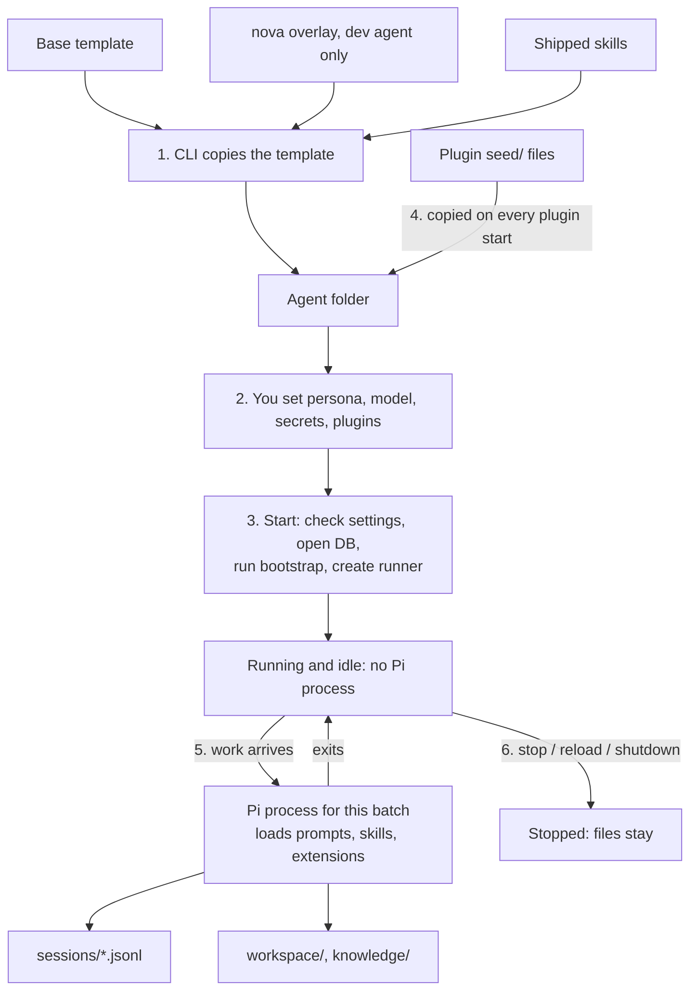

# Agents low-level design

**Status:** implemented. [High-level design](../high-level-design.md) · [Roadmap](../roadmap.md) · [FAQ](#faq)

## In one minute

**An agent is a folder.** Everything Pi knows and uses comes from it:

- its persona and instructions;
- skills and helper scripts;
- Pi extensions;
- notes and work files;
- plugin data;
- its conversation history.

[Core](core.md#agent-lifecycle) decides *when* the agent runs. This page explains *what the agent is made of*: how the folder is created, what's in it, how it is configured, and what Pi loads from it.

| Source | What it provides |
|---|---|
| [base-agent](../../packages/harness/src/agents/base-agent/) | The template every agent starts from: base prompt, extensions, bootstrap script, starter knowledge and workspace folders. |
| [nova overlay](../../packages/harness/src/agents/nova/) | Extra prompts that make `nova` the developer agent that manages the deployment. |
| [scaffoldAgent](../../packages/harness/src/cli/agent.ts) | Copies the template (and overlay), installs skills, writes a starter `agent.json`. |
| [AgentJson, tool list](../../packages/harness/src/core/types.ts) | The settings format and the seven fixed tools. |
| [spawnPi, assembleSystemPrompt](../../packages/harness/src/core/runner.ts) | Builds the system prompt and tells Pi what to load. |

## Agent lifecycle, end to end


```mermaid
flowchart TB
    Base[Base template] --> Fork[1. CLI copies the template]
    Nova[nova overlay, dev agent only] --> Fork
    Skills[Shipped skills] --> Fork
    Fork --> Dir[Agent folder]
    Dir --> Configure[2. You set persona, model, secrets, plugins]
    Configure --> Start[3. Start: check settings, open DB,<br/>run bootstrap, create runner]
    PluginSeeds[Plugin seed/ files] -->|4. copied on every plugin start| Dir
    Start --> Idle[Running and idle: no Pi process]
    Idle -->|5. work arrives| Batch[Pi process for this batch<br/>loads prompts, skills, extensions]
    Batch --> History[sessions/*.jsonl]
    Batch --> Work[workspace/, knowledge/]
    Batch -->|exits| Idle
    Idle -->|6. stop / reload / shutdown| Stopped[Stopped: files stay]
```

1. **Create.**
   - `cognisphere init` creates `nova`, the developer agent, with all three shipped skills.
   - `cognisphere agent new support` copies the base template, installs the `create-skill` skill under `skills/agent/create-skill/`, and writes a starter `agent.json` (model `anthropic` / `claude-sonnet-4-6`, thread strategy `single`).

   The copy belongs to your deployment. Later harness upgrades **don't** change it automatically.
2. **Configure.** In the console, enable a model provider, fill in any required secrets, and add `plugins/<id>/config.json` for each optional plugin. Write the persona in `system_prompts/1-agent.md`.
3. **Start.** The server only finds new agent folders at boot, so restart it. Then core:
   - checks the settings;
   - opens `sessions/.events.db`;
   - runs `bootstrap/bootstrap.sh` (this happens on *every* start);
   - creates the runner ([full startup steps](core.md#startup-steps)).

   A problem leaves the agent `failed` with a readable error.
4. **Plugin files.** Each time a plugin starts, its `seed/` files are copied into the agent, overwriting earlier copies. If there are at least two agents, core also writes `system_prompts/0.1-agent-directory.md` (a list of the others) once, when that file is missing.
5. **Handle a batch.** When there is work, core:
   1. builds the system prompt from every `system_prompts/*.md` file in name order, plus the thread's context;
   2. saves it to `sessions/<thread>/.system-prompt.md`;
   3. starts Pi in the agent's folder.

   Pi adds to the thread's history file and edits files, then exits. Edits to prompts or skills apply to the **next** Pi process, never one that is already running.
6. **Stop.** Stopping, reloading or shutting down leaves every file, the database and the history in place. Deleting a thread removes its events, its session link and its session folder. Nothing deletes workspace files for you.

## Persistent layout

```text
<harnessRoot>/
  harness.json
  .secrets/                           credentials, logins and model settings
  plugins/<plugin>/                   optional plugin code owned by the deployment
  agents/<agent>/
    agent.json                        identity and runtime settings
    system_prompts/                   instruction files, read in name order:
                                        0-base_prompt.md    harness base prompt
                                        0.1-agent-directory.md  other agents (if ≥2)
                                        1-agent.md          this agent's persona
                                        plugin-<id>.md      copied from plugins
    skills/                           SKILL.md files, found recursively
    scripts/                          helper scripts (the agent's and plugins')
    extensions/                       Pi extensions
    bootstrap/                        bootstrap.sh and its requirements
    .venv/                            optional Python environment
    .vertex-sa.json                   only while running with Vertex; removed on stop
    knowledge/                        notes and memory the agent maintains
    workspace/                        work products
    plugins/<plugin>/
      config.json
      state/                          cursors, routes, schedules, output
      inbox/                          attachments
    sessions/
      .events.db                      core's queue and thread links
      <thread>/<session>.jsonl        conversation history (written by Pi)
      <thread>/.system-prompt.md      the last system prompt built for this thread
```

Pi runs with the **whole agent folder** as its working folder, not just `workspace/`. That makes everything reachable by a relative path: `knowledge/`, plugin inboxes and scripts, but also `sessions/`, the database and `.vertex-sa.json`. None of this layout is a security boundary. A workspace-only view with separate control storage is [plan 1.2](../plans/02-workspace-and-provisioning.md).

| Who writes | What |
|---|---|
| Pi | `sessions/<thread>/*.jsonl` (the conversation) |
| Core | `.events.db` (inputs, thread-to-session links), `0.1-agent-directory.md`, `.system-prompt.md` |
| Plugins | `plugins/<id>/state` and `inbox`, plus their copied seed files |
| The agent's tools | `workspace/`, `knowledge/`, and anything else in the folder |

The console and API only *read* history files. Pi is the only thing that writes them.

## Configuration and credentials

```json
{
  "name": "support",
  "description": "Summarizes support tickets and prepares replies.",
  "model": { "provider": "anthropic", "id": "claude-sonnet-4-6", "thinkingLevel": "medium" },
  "threadIdStrategy": { "type": "plugin_channel" },
  "maxConcurrentSlots": 1,
  "maxAttempts": 3,
  "configSchema": {
    "type": "object",
    "properties": { "REPLY_STYLE": { "type": "string", "default": "concise" } }
  },
  "config": { "REPLY_STYLE": "concise" }
}
```

| Field | Meaning |
|---|---|
| `name`, `description` | Shown in the console and to other agents. The **folder name** is the agent's ID. |
| `devAgent` | Marks the developer agent (set by the CLI). |
| `model.provider`, `model.id` | The default model. It must be set up and enabled on the Models page. |
| `model.thinkingLevel` | `off`, `minimal`, `low`, `medium`, `high` or `xhigh`. Default `medium`. A thread can override the model from its next batch. |
| `threadIdStrategy.type` | How inputs are grouped into conversations: `single` (one), `plugin` (one per source), `plugin_channel` (one per source chat). |
| `maxConcurrentSlots` | How many conversations can run at once. Default 1. They share files with no lock. |
| `maxAttempts` | How many failed attempts before an input is marked failed. Default 3. |
| `configSchema` and `config` | Non-secret settings given to Pi as environment variables (`REPLY_STYLE` above). **Set both or neither.** Values must be strings. |
| `secretsSchema` | The agent's own secret fields. Only *required* ones stop it from starting. |

Only some fields are validated. The `sandbox` fields in roadmap examples don't exist yet. When each change takes effect is covered in [core configuration](core.md#configuration).

### Where credentials live

| Store | Contents |
|---|---|
| `.secrets/secrets.json` | `agent → bucket → key: value`. The bucket `agent` holds the agent's own secrets; every other bucket is named after a plugin. Top-level keys (at the agent-ID level) starting with `_` are notes and are ignored; a `_KEY` inside a bucket is still passed to Pi. The same key in two buckets of one agent makes the agent fail to start. |
| `.secrets/models.json` | Provider keys, enabled models, context and output size overrides (also copied into Pi's config). Providers the harness doesn't know are left to Pi's own setup. |
| Pi's `auth.json` (usually in `~/.pi/agent/`) | Subscription sign-in tokens for model providers. Pi owns this file. |
| `.secrets/gws/` | The Google Workspace client and each agent's Google credentials. |

### What the Pi process can see

| Who | Receives |
|---|---|
| Each plugin | Only its own declared keys. |
| The Pi process | The server's environment variables, which include the internal webhook secret; harness variables (`PI_AGENT_ID`, `PI_THREAD_ID`, `PI_WEBHOOK_BASE`, `HARNESS_BASE_URL`, `VIRTUAL_ENV`); **every non-empty key from all of the agent's buckets**; model credentials; config values. |

If the same variable name is defined by two of *secrets, config and model credentials*, the agent fails to start. Against the server's own variables there's no check: the agent's value simply wins.

**Anything the agent runs can read all of these.**

## Runtime capabilities

Every agent has the same seven tools: `read`, `bash`, `edit`, `write`, `grep`, `find`, `ls`. There's no setting to change them.

Pi's own automatic discovery of prompts, context files, skills and extensions is turned off. Instead, core tells Pi exactly what to load:

- **Skills:** every `SKILL.md` under `skills/`, at any depth.
- **Extensions:** each `.ts` or `.js` file directly inside `extensions/`, or each folder there that has an entry file. Deeper files aren't loaded on their own. Core also always loads its own [delivery-receipts](../../packages/harness/src/core/pi-delivery-receipts.ts) extension from the package, which tells it which inputs Pi saved ([core](core.md#end-to-end)). It isn't in the agent folder, so the agent can't remove it. Agents created before it replaced `harness-bridge.ts` may still have that file; core skips it, and it can be deleted.

| Base extension | What it does and why |
|---|---|
| [context-meta](../../packages/harness/src/agents/base-agent/extensions/context-meta.ts) | Records how much of the context window is used and shows it to the model on each call. It only adds this mid-run when another model call is coming, so it can't cause extra turns. |
| [bash-guard](../../packages/harness/src/agents/base-agent/extensions/bash-guard.ts) | Adds `set -u` to shell commands and explains unset-variable errors, which prevents silent text corruption. It can be turned off and is **not** a security control. |
| [skill-update-notice](../../packages/harness/src/agents/base-agent/extensions/skill-update-notice.ts) | Remembers which skill versions the agent has read and tells it when a skill changes, with a short changelog. |

The bootstrap script runs directly on the host every time the agent starts. `.venv/bin` goes first on `PATH` when it exists. Helper tools such as `agent-browser`, `ddgs`, `markitdown` and `session-reader` are just tools the agent can use.

## Example: one agent, two conversations

Support uses `plugin_channel`:

- a Telegram message from chat 42 goes to thread `telegram:42`;
- a console message sent with `threadId: review` goes to thread `review`.

Each thread has its own history file, but both use the same folder.

1. Chat 42 asks for a report. Pi runs with `telegram:42`'s history, reads the Telegram prompt and skill, and writes `workspace/report.md`.
2. Later, the operator asks `review` to improve it. That conversation knows nothing about chat 42, but the file is right there.
3. With `maxConcurrentSlots` above 1, both could run at once and overwrite each other's edits. The planned workspace gate lets only one turn change files at a time, and makes each turn re-read files before editing.

## Design choices

| Choice | Why | Cost |
|---|---|---|
| Agents are editable copies | Each deployment can have its own personas and tools. | Upgrades need a deliberate migration. |
| Plugin files are re-copied on start | Integration instructions stay in step with the plugin code. | Edits to those copies are lost. |
| History stays in Pi's own files | Pi's features work unchanged, and there's a readable record. | Agent "memory" is just editable notes, not an authoritative record. |
| The whole folder is Pi's working folder | Everything is a simple relative path. | Nothing separates assets, history and credentials. |

Planned:

- [plan 1.2](../plans/02-workspace-and-provisioning.md): approved read-only assets and the workspace gate;
- [plan 2](../plans/08-session-search.md): read-only history search;
- [plan 3](../plans/09-agent-improvement.md): reviewable self-improvements.

None of these stops today's agent from editing its own files.

## Known issues and suggested improvements

Found in a code audit on 2026-09-28. **Severity** is how much it can hurt: *High* = lost work, security exposure or a wrong result; *Medium* = confusing or wasteful behavior; *Low* = cleanup. None of these is fixed yet. When one is fixed or scheduled, update this table and the [roadmap](../roadmap.md).

| # | Type | Severity | Problem | Why it matters | Suggested change |
|---|---|---|---|---|---|
| 1 | Bug | Medium | `0-base_prompt.md` contains `{{Timezone}}`, but nothing replaces it: `scaffoldAgent` doesn't, although a comment in `runner.ts` says variables are baked in at creation. | Every agent sees the literal text `{{Timezone}}` in its system prompt. | Substitute the variables when scaffolding (or at prompt assembly), and fix the comment. |
| 2 | Risk | High | Pi's working folder is the whole agent folder, and it gets every secret as an environment variable. | The agent's own tools can read `sessions/.events.db`, other threads' histories, `.vertex-sa.json` and all credentials. | Workspace-only view and a credential broker ([plan 1.2](../plans/02-workspace-and-provisioning.md), [plan 1.4](../plans/04-ingress-and-operations.md)). |
| 3 | Risk | Medium | Bootstrap failures are logged and ignored. | The agent shows `running` while a tool it relies on is missing. | Record bootstrap failure on the agent (a warning state or error shown in the console). |
| 4 | Risk | Medium | Removing a plugin folder leaves its seeded prompt, scripts and skills in the agent. | The agent keeps following instructions for a plugin that is gone. | Track and remove seeded files (see [plugins](plugins.md#known-issues-and-suggested-improvements)). |
| 5 | Risk | Low | There's no way to restrict tools per agent. | Every agent can run shell commands. | A per-agent tool policy, enforced by the runtime ([protection profiles](../plans/07-protection-and-cutover.md)). |
| 6 | Risk | Low | `agent.json` has no full schema; only some fields are validated, and `config`/`configSchema` must be set together with string values. | Typos in unchecked fields are silently ignored; the together-rule surprises people. | Validate the whole file against one schema and give specific error messages. |
| 7 | Cleanup | Low | The "next steps" printed by `agent new` say `plugin add <id>` "adds a catalog plugin". | It only copies plugin code; it doesn't turn the plugin on for the agent. | Change the hint to explain creating `plugins/<id>/config.json`. |
| 8 | Cleanup | Low | `bootstrap.sh` ends by telling you to restart the server; restarting the agent is enough, because `.venv` is picked up on every Pi start. | Unnecessary server restarts. | Change the message. |

## FAQ

### Operators

#### How do I set the agent's persona?

Write it in `system_prompts/1-agent.md`: who the agent is, its tone, and what it owns. Put step-by-step procedures in skills instead. The change applies from the next batch, with no restart. Don't edit `0-*` files, which the harness owns, or `plugin-*.md` files, which are overwritten on every start. Other agents see this agent's `description` from `agent.json`. Their list of agents is written only once, so delete their `system_prompts/0.1-agent-directory.md` to refresh it.

#### Why does my agent mix up conversations from different chats?

New agents use `threadIdStrategy: single`, so every source and every chat share one thread. Set `plugin_channel` in `agent.json` to give each chat its own thread. Threads keep separate histories but share the same files ([example](#example-one-agent-two-conversations)).

#### Can I use a different model for one conversation?

Yes, either from the thread header in the chat or through the thread-model API once the thread exists. It applies from the next batch. Clearing it goes back to the agent default. Changing the default doesn't clear overrides that threads already have. If the thread's model later can't be used (signed out, key removed, model disabled), its batches run on the agent's model until it can ([model check](core.md#model-check)).

#### The agent fails after I added a secret or config key. Why?

Check these, in order:

1. Required schema fields are all filled in.
2. `config` matches `configSchema`, and you have both or neither.
3. All `config` values are strings.
4. The model is enabled.
5. No two of *secrets, config and model credentials* use the same variable name.
6. No two secret buckets of this agent use the same key.

Saving can succeed even though the next start fails, so read the agent's error.

#### I edited `.secrets/secrets.json` by hand, but old values are still used.

Secrets are cached. Only saving through the Secrets page (or a settings save) clears the cache. The Start and Restart buttons don't. Save through the console, or restart the server.

#### I fixed a secret and saved, but the agent is still `failed`.

Saving only reloads agents that are running. Press **Start**.

#### How does the agent remember things?

Only through files. The base prompt tells it to keep notes in `workspace/threads/<thread>/notes.md`, facts in `knowledge/memory.md`, and reference documents in `knowledge/files/`. The harness doesn't check or index these files. Each thread sees only its own history, but all threads share the files. Searching past history is [planned](../plans/08-session-search.md).

#### Will upgrading the harness overwrite my agents?

No. Agent folders are yours, and they change only through the [upgrade process](cli.md#upgrades). That process replaces the harness-owned `0-*` prompt files, so keep your own instructions in `1-agent.md`. Plugin seed files are the other exception: they are copied again each time a plugin starts.

#### What does resetting a conversation remove?

That thread's events, session link and session folder, and only when the thread isn't running. It doesn't touch workspace files, plugin state, or anything already sent outside. If several chats share that thread, they all lose that history.

#### How do I copy, rename or delete an agent?

There's no command for this; only `cognisphere agent new` exists. Stop the server first, because agent folders are only read at boot. Then:

- **Copy:** copy the folder without `sessions/`, `.venv/` and `plugins/*/state/`. Otherwise the copy would inherit history, a broken Python environment and duplicate schedules. Add a secrets entry for the new ID.
- **Rename:** rename the folder, since the folder name is the ID. Then rename the agent's entry in `.secrets/secrets.json` and its folder in `.secrets/gws/`.
- **Delete:** remove the folder, its secrets entry and `.secrets/gws/<id>/`.

After any of these, delete the other agents' `0.1-agent-directory.md` so it's rebuilt, and fix any `allowMessageFrom` lists that name the agent. `nova` can't be renamed: prompts refer to it by that name.

### Agent authors

#### Skills, scripts or extensions: which should I use?

- **Skill** (`skills/**/SKILL.md`): a written procedure. Only its name and description are in the prompt, and the agent reads the full file when a task matches. Use it for workflows and runbooks.
- **Script** (`scripts/`): a program the agent runs with `bash`. Nothing tells the agent a script exists, so mention it in a skill or in `1-agent.md`.
- **Extension** (`extensions/`): code loaded into every Pi process. It reacts to Pi events without the agent choosing, like `bash-guard`. Use it only for behavior that must always apply.

See [runtime capabilities](#runtime-capabilities) for how each is loaded.

#### In what order is the system prompt put together, and how do I see it?

Core reads every `.md` file directly in `system_prompts/`, sorted by file name: `0-base_prompt.md`, `0.1-agent-directory.md`, `1-agent.md`, then the `plugin-*.md` files. It then adds the thread ID. Pi adds the list of skills. A new file such as `2-rules.md` lands before the plugin files. The prompt last used by a thread is saved in `sessions/<thread>/.system-prompt.md`, without the skill list.

#### How do I give an agent a new tool? Can I turn off `bash`?

The seven built-in tools are fixed; there's no setting to add or remove one. Prompt rules and bash-guard don't restrict access either ([issue 5](#known-issues-and-suggested-improvements), [protection profiles](../plans/07-protection-and-cutover.md)). To add an ability, put an executable in `scripts/agent/` and describe it in a skill. If it needs an outside service or background listening, write a [plugin](plugins.md) instead.

#### How do I add Python packages or system programs?

Add Python packages to `bootstrap/requirements.txt`. Add other install steps to `bootstrap/bootstrap.sh`. The script runs every time the agent starts, so restart the agent to apply the change. `.venv/bin` goes first on `PATH` for every Pi process. A bootstrap failure is only logged, and the agent still shows `running` ([issue 3](#known-issues-and-suggested-improvements)). Check the server log after a restart.

#### Which environment variables can the agent's scripts use?

- `PI_AGENT_ID`, `PI_THREAD_ID`: which agent and thread are running.
- `PI_WEBHOOK_BASE`: the base URL for calling this agent's plugins.
- `HARNESS_BASE_URL`: the server's address.
- `COGNISPHERE_WEBHOOK_SECRET`: the shared secret that plugin HTTP routes check.
- `VIRTUAL_ENV`: set only when `.venv` exists.
- All of the agent's secrets, `config` values and model credentials, plus the server's own variables.

See [what the Pi process can see](#what-the-pi-process-can-see).

#### Can the agent run a server or other long-running process?

No. When a batch ends, the harness kills everything Pi started, including background processes. Start what you need within the turn, or run it outside the harness. A plugin can also run in the background for the agent.

#### How big is the context window, and what happens when it fills?

The model's size comes from Pi's model list. You can override it on the **Models** page. The agent sees `ContextUsage` in the latest message and `Checkpoint` notes before each model call. Pi compacts the history itself when it gets full. To save space, the base prompt tells the agent to hand long reads to task threads.

#### Can an agent start sub-agents or run work in parallel?

There are no sub-agents. The agent can message itself on a new thread ID (a "task thread") or message another agent, both with `scripts/agent-msg/send`. With the default `maxConcurrentSlots: 1`, these threads run one after another, not at the same time. Raising the limit runs them in parallel, but they share files with no lock.

#### How do I test a change to an agent?

Prompt, skill, script and extension changes apply from the next batch. Send a message from the console chat, ideally on a **New Thread** so old history doesn't mix in. Then check the reply, the events list, and `sessions/<thread>/.system-prompt.md`. Changes to `agent.json` apply when you save through the console, or after an agent restart if you edited the file by hand. Bootstrap changes need an agent restart.

#### I removed a plugin folder. Why are its prompt and scripts still there?

Seed copying only adds and overwrites; it never deletes. Remove the plugin's `system_prompts/plugin-<id>.md`, `scripts/<id>/` and `skills/<id>/` yourself.
