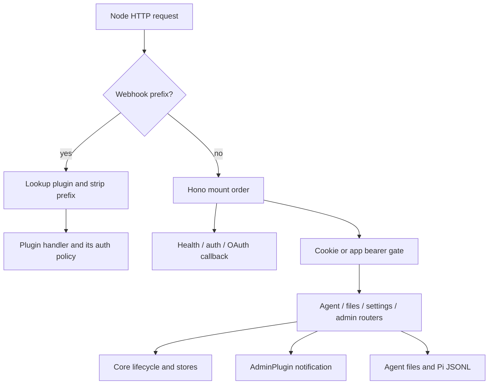

# API low-level design

**Status:** current HTTP implementation. [High-level design](../high-level-design.md) · [Roadmap](../roadmap.md).

## Responsibility and dependencies

API adapts authenticated HTTP commands and queries to [core](core.md), [plugin](plugins.md), and agent-file operations. It owns request validation, credential masking, HTTP status mapping, and route wiring. It does not schedule a second worker pool or serialize Pi history. [Web](web.md) and product backends consume these contracts; a product backend's bearer currently grants full operator access.

| Implementation | Responsibility |
|---|---|
| [core/main.ts](../../packages/harness/src/core/main.ts) | Mount order, global middleware, raw webhook interception, static SPA routes. |
| [auth.ts](../../packages/harness/src/api/auth.ts) | File-backed users, signed cookies, app bearer, auth gates. |
| [agents.ts](../../packages/harness/src/api/agents.ts) | Lifecycle/configuration, session/usage reads, thread overrides, event actions. |
| [admin.ts](../../packages/harness/src/api/admin.ts) | Send through AdminPlugin and abort through AgentRunner. |
| [files.ts](../../packages/harness/src/api/files.ts) | Agent-relative tree/text/raw/upload/delete operations. |
| [secrets.ts](../../packages/harness/src/api/secrets.ts), [models.ts](../../packages/harness/src/api/models.ts), [credentials.ts](../../packages/harness/src/api/credentials.ts) | Mask/merge credentials, persist settings, trigger reloads. |
| [harness.ts](../../packages/harness/src/api/harness.ts), [gws-oauth.ts](../../packages/harness/src/api/gws-oauth.ts) | Timezone and Google Workspace sign-in; callback uses issued state nonce. |
| [webhook.ts](../../packages/harness/src/api/webhook.ts) | Dispatch raw HTTP to running plugins; handlers own authentication. |



## Request flow and design choices

For `PUT /api/agents/support/config`, the auth middleware verifies the caller, the route checks the agent and request fields, writes `agent.json`, and calls `reloadAgent`. The manager may defer runtime replacement until active work drains. A successful settings response and the activation time of those settings are different observations. Lifecycle conflicts map to HTTP errors; views should refetch agent/plugin state after mutation.

For chat, the executable client pattern after authenticating is:

```bash
curl --cookie /tmp/cognisphere.cookies \
  -H 'Content-Type: application/json' \
  --data '{"text":"Summarize workspace/report.md","threadId":"review"}' \
  http://127.0.0.1:3142/admin/support/send
curl --cookie /tmp/cognisphere.cookies \
  'http://127.0.0.1:3142/api/agents/support/events?status=queued,in_flight,done'
```

The send route returns `{ "ok": true }`, not an event ID or model result. Inspect events and session history for processing evidence. Current plugin notifications can fail without propagating through the wrapper, so this is not a guaranteed durable-admission acknowledgment.

| Decision | Reason | Limit |
|---|---|---|
| One Hono API plus raw plugin dispatch | Keep common operator policy and preserve native plugin HTTP handling. | Webhook handlers must enforce their own auth. |
| Cookie or product-server bearer | Supports the console and independently authenticated product apps. | Bearer is operator-level; `X-App-User` does not enforce tenant scope. |
| Read Pi JSONL for history | Preserve original conversation entries and entry IDs. | Live tails may be incomplete; no stream/replay contract today. |
| Masked credential merge | UI can preserve secrets it cannot read back. | File-backed credentials are plaintext on disk; masking is a display boundary. |
| Agent-relative filesystem paths | Restricts ordinary lexical traversal. | Does not resolve symlink escapes, serialize tool writes, or compare expected file revisions. |

Future runtime grants belong to [plan 1.4](../plans/04-ingress-and-operations.md); SSE belongs to [plan 1.6](../plans/06-live-interface.md). Neither route family is available today. The remainder of this document is the authoritative current route reference.

---

## Table of contents

1. [Mount points and auth model](#1-mount-points-and-auth-model)
2. [Public routes](#2-public-routes)
3. [Auth routes — `/api/auth/*`](#3-auth-routes--apiauth)
4. [Agents — `/api/agents/*`](#4-agents--apiagents)
5. [Filesystem — `/api/agents/:id/fs/*`](#5-filesystem--apiagentsidfs)
6. [Secrets — `/api/secrets`](#6-secrets--apisecrets)
7. [Models — `/api/models`](#7-models--apimodels)
8. [Harness — `/api/harness`](#8-harness--apiharness)
9. [Admin chat — `/admin/*`](#9-admin-chat--admin)
10. [Plugin webhooks — `/webhook/*`](#10-plugin-webhooks--webhook)
11. [Conventions](#11-conventions)
12. [FAQ](#faq)

---

## 1. Mount points and auth model

Everything is served by a single Node `http.Server`. Routes split into
three surfaces:

- **Hono routes** mounted in `main.ts`: `/healthz`, `/api/*`, `/admin/*`,
  and the static SPA shell when a web build exists and headless mode is off.
- **Raw `IncomingMessage`/`ServerResponse` dispatch** for
  `/webhook/<agentId>/<pluginId>/*`. The plugin's `handleHttpRequest`
  expects raw req/res; the harness splices a `request` listener onto
  the underlying `http.Server` that intercepts the prefix, strips it,
  and delegates to the plugin. Hono runs only when no `/webhook/`
  match.
- **The SPA** (bundled `dist-web/`, or monorepo `packages/web/dist`, unless headless): `/`, `/login`,
  `/settings`, `/settings/*`, `/agents/*` are served as `index.html`
  so the client-side router can pick up.

**Auth gating** (set up in `core/main.ts`):

| Surface | Auth? |
|---|---|
| `/healthz` | Public |
| `/api/auth/*` | Public (login itself can't require auth) |
| `/api/*` (other) | `requireAuth` middleware — 401 without a valid cookie or app bearer |
| `/admin/*` | `requireAuth` middleware — 401 without a valid cookie or app bearer |
| `/webhook/*` | Per-plugin — handlers own authentication. The `agent-messaging` inbox requires shared `X-Webhook-Secret`; artifacts use route-specific access checks. Telegram and GWS currently poll instead of receiving webhooks. |
| Static SPA pages | `/login` and static assets are public; `/`, `/settings*`, and `/agents/*` use the server redirect gate when the UI is mounted. The client also checks auth. |

`requireAuth` accepts either credential, cookie first:

- **Operator session** — the `pi_sid` cookie, an HMAC-signed session
  payload issued by `POST /api/auth/login`. `user` = the username.
- **App bearer** — `Authorization: Bearer <secret>` where the secret is the
  contents of `<harnessRoot>/.secrets/app-secret` (hex, generated on first
  boot, 0600; `scripts/server.sh secrets` mints it earlier and hands it to
  the app as `HARNESS_APP_SECRET`). This is how a frontend app that owns
  its own user auth (Clerk, Supabase, …) authenticates its *server* to the
  harness. `user` = the `X-App-User` header if present (an opaque id the
  app vouches for; ignored without a valid bearer), else `"app"`. A valid
  bearer has full operator access — the app must gate its own routes.

Failures return `{ "error": "unauthenticated" }` with HTTP 401. Nothing
in the harness reads `c.var.user` today; it is set for plugins/logs.

---

## 2. Public routes

### `GET /healthz`

Liveness probe. Always 200.

```json
{ "ok": true, "agents": 3 }
```

`agents` is the count of loaded `AgentInstance`s — includes
running, stopped, and failed agents. Use it to verify the server is up,
not to gauge agent health (use `/api/agents` for that).

---

## 3. Auth routes — `/api/auth/*`

Implemented in `packages/harness/src/api/auth.ts`. File-backed user store at
`<harnessRoot>/.secrets/users.json`:

```json
{ "users": [{ "username": "admin", "password": "changeme" }] }
```

Plaintext passwords, same trade-off as `secrets.json`. On startup
(`ensureCredentials` in `auth.ts`, called from `main.ts` before the server
binds), if this file is missing, empty, or still holds the default
`admin / changeme`, the operator is prompted on the terminal for a username
and password (password input is echo-muted) and the file is written from
those values. When stdin is not a TTY (e.g. under systemd) the prompt is
skipped and the legacy `admin / changeme` placeholder is created instead —
change it before exposing the server. Sessions are stateless signed cookies; the 32-byte HMAC key
lives at `<harnessRoot>/.secrets/session-key` and is generated on first boot.
Deleting that file invalidates every issued cookie.

### `POST /api/auth/login`

```json
{ "username": "admin", "password": "changeme" }
```

Responses:

- `200 { "ok": true, "username": "admin" }` — sets `pi_sid` cookie
  (`httpOnly`, `sameSite=Lax`, 7-day `maxAge`).
- `400 { "error": "username and password required" }`.
- `401 { "error": "invalid credentials" }`.

Password comparison is timing-safe.

### `POST /api/auth/logout`

Clears the `pi_sid` cookie. Always `200 { "ok": true }`. No server-side
revocation — the cookie is just deleted; existing copies of the same
token elsewhere are still valid until they expire (or until
`session-key` is rotated).

### `GET /api/auth/me`

Always 200. Returns `{ "user": "<username>" }` for an authenticated
session, `{ "user": "<X-App-User or app>" }` for a valid app bearer,
otherwise `{ "user": null }`. Useful for the SPA to decide between
rendering the login form and the app shell, and for webhook plugins to
verify an app request by forwarding its `authorization`/`x-app-user`
(or `cookie`) headers here.

---

## 4. Agents — `/api/agents/*`

Implemented in `packages/harness/src/api/agents.ts`. All routes require auth.

`agents.list()` / `am.get()` / runtime DB methods are the data source;
mutations route through `AgentManager` lifecycle calls described in
[core lifecycle](core.md#agent-lifecycle).

### `GET /api/agents`

```json
{ "agents": [ AgentSummary, ... ] }
```

`AgentSummary` = `{ id, name, installedPlugins, state, error,
runningPlugins, failedPlugins }`. `state` ∈ `running | stopped |
failed`. `installedPlugins` enumerates every dir under
`<agentDir>/plugins/`, including ones that failed to start (so the UI
can show a row to fix). `runningPlugins` / `failedPlugins` are
partitions of that list.

### `GET /api/agents/:id`

```json
{
  "id": "...",
  "name": "...",
  "agentJson": { ... },
  "installedPlugins": [...],
  "state": "running",
  "error": null,
  "changedAt": 1731000000000
}
```

`agentJson` is the parsed `agent.json` (may be `null` when the agent
failed to load due to a parse error — `error` will say why).
`changedAt` is the last lifecycle transition timestamp.

404 if the id is unknown.

### `GET /api/agents/:id/plugins`

```json
{ "plugins": [
  {
    "pluginId": "telegram",
    "manifest": PluginManifest | null,
    "config":   unknown,
    "state":    "running" | "stopped" | "failed",
    "error":    string | null,
    "changedAt": 1731...
  }
]}
```

Iterates every entry in `inst.plugins`, including failed ones. `config`
falls back to reading `<plugin>/config.json` directly when the plugin
entry's cached config is null (so the UI can still render the form
for a plugin that failed during start). `manifest` is null only if the
plugin id is no longer in the registry (e.g. its source dir was deleted
without restarting).

### Lifecycle

| Method | Path | Effect |
|---|---|---|
| POST | `/api/agents/:id/start`   | `am.manualStart(id)`. From `stopped` or `failed` → `running` / `failed`. 409 if already running. |
| POST | `/api/agents/:id/stop`    | `am.manualStop(id)`. Aborts active batches. 409 if not running. |
| POST | `/api/agents/:id/restart` | `am.restartAgent(id)`. Stop (if running) → start. Full re-read of agent.json + plugin configs + secrets. |

Response shape (all three):

```json
{ "ok": true, "state": "running", "error": null }
```

`LifecycleError` codes map to HTTP status:

| `LifecycleError.code` | HTTP | Meaning |
|---|---|---|
| `not_found` | 404 | Unknown agent id |
| `conflict`  | 409 | Already in the requested state, or a transition is already in flight |

Any other error → `500 { "error": <message> }`.

### Editing config (auto-reload, no restart)

| Method | Path | Effect |
|---|---|---|
| PUT | `/api/agents/:id/config` | Write `agent.json`, then `am.reloadAgent(id)` |
| PUT | `/api/agents/:id/plugins/:pluginId/config` | Write `<plugin>/config.json`, then `am.reloadPlugin(id, pid)` |

Both expect `{ "config": <json> }` and validate that `config` is a
plain object (not array, not null). The write is unconditional;
validation against the plugin manifest's `configSchema` happens at
reload time. If the new config fails validation, the plugin moves to
`state="failed"` with `error` populated — the file write succeeded; the
runtime rejection is surfaced in the next `/api/agents/:id/plugins`
response.

`reloadAgent` uses the soft-swap protocol (see [agent lifecycle](core.md#agent-lifecycle)) — zero interruption to
in-flight batches. `reloadPlugin` bounces the single plugin in place
without touching the runner.

Response:

```json
{ "ok": true, "restartRequired": false, "state": "running", "error": null }
```

`restartRequired` is always `false`; the field exists for forward-
compatibility with future settings that *would* need a full restart.

### Sessions browse

| Method | Path | Effect |
|---|---|---|
| GET | `/api/agents/:id/sessions` | List threads under `<agent>/sessions/` and their `.jsonl` files, newest-first. |
| GET | `/api/agents/:id/sessions/:threadId/:sessionId?limit=` | Read the JSONL file as an array of parsed entries. `limit=N` returns only the newest N entries (omitted → all). |
| GET | `/api/agents/:id/sessions/:threadId/usage` | Per-model token + cost totals for the thread. Aggregates every assistant message in every `*.jsonl` under `<agent>/sessions/<threadId>/`. |
| PUT | `/api/agents/:id/sessions/:threadId/model` | Set or clear the thread's model override. Takes effect on the next batch (no agent reload). |
| DELETE | `/api/agents/:id/sessions/:threadId` | Permanently remove a thread — drops every `events` row for the thread, its `threads` row, and the on-disk `<agent>/sessions/<threadId>/` directory (all sessions). Returns `409` if a batch is in-flight; abort it first. |

Session list response:

```json
{ "threads": [
  {
    "threadId": "telegram:42",
    "activeSessionId": "01HX...",
    "sessions": [
      { "sessionId": "01HX...", "modified": 1731..., "size": 12345 },
      ...
    ],
    "lastContext": {
      "tokens": 12345,
      "contextWindow": 200000,
      "model": "anthropic/claude-sonnet-4-6"
    },
    "totalCost": 0.4231,
    "modelOverride": {
      "provider": "openai",
      "modelId": "gpt-5",
      "thinkingLevel": "high"
    }
  }
]}
```

`lastContext` is a tail-read (last ~128 KiB) of the active session's
jsonl: the most-recent non-aborted assistant message's context tokens
(`usage.totalTokens` or the input/output/cacheRead/cacheWrite sum) and
the model's context window resolved the way a spawned pi child would:
pi models.json `modelOverrides` (kept in sync from `.secrets/models.json`,
see [§7](#7-models--apimodels)), then custom model entries in that file,
then pi-ai's built-in catalog. `null` when no assistant message exists
yet (or it's older than the tail window); `contextWindow` is `null` for
model ids in neither source.

`totalCost` is the sum of `usage.cost.total` across every assistant
message in every session file in the thread. Per-file totals are cached by
`(path, mtimeMs)` so unchanged jsonls aren't re-parsed on each 5s
poll. `0` when no assistant messages have landed yet.

Per-session response:

```json
{ "threadId": "...", "sessionId": "...", "entries": [ <jsonl row>, ... ], "hasMore": true }
```

With `limit=N` the file is tail-seeked — read backwards in 256 KiB chunks
until N lines are in hand — so a long session costs the same as a short
one. `entries` holds its newest N rows and `hasMore` says whether older
rows were left above the window. Without `limit` the whole file is read
and `hasMore` is `false`. The web chat paginates backwards on this: it
opens a session at `limit=100` and its **Load 100 more** button re-fetches
with a larger limit.

Malformed JSONL lines are silently skipped. `threadId` and `sessionId`
must each be a single path segment (no `/`, `\`, NUL, leading `.`, or
length > 256) so they can't escape the agent's `sessions/` directory;
otherwise any character — including spaces, parens, brackets, and
unicode — is allowed, since harness-created thread ids reflect external
inputs like email subjects.

Delete response:

```json
{ "ok": true, "threadId": "...", "events": 17, "removedDir": true }
```

`events` is the number of `events` rows deleted; `removedDir` is `false`
if the on-disk directory did not exist (e.g. a thread that only ever had
queued events and was deleted before its first batch ran).

`modelOverride` is the thread's per-thread model override, or `null` when
the thread inherits the agent's `agent.json` model. When set, the runner
uses this provider/model/thinking for the thread's next batch — including
a provider different from the agent default (cross-provider), whose
credentials are injected at spawn time.

Set-model request:

```json
{ "provider": "openai", "modelId": "gpt-5", "thinkingLevel": "high" }
```

`thinkingLevel` is optional (`off|minimal|low|medium|high|xhigh`; omit or
`null` to inherit the agent's thinking level). Sending `provider: null` or
`modelId: null` **clears** the override (the thread reverts to the agent
default). Validation: `provider` must be a configured catalog provider and
`modelId` must be in that provider's `enabledModels` (else `400`). Returns
`409` if the thread has no `threads` row yet (no session bound — send a
message first). Response: `{ "ok": true }`. The override is stored on the
`threads` row and read live by the runner, so no agent reload occurs.

Usage response:

```json
{
  "threadId": "...",
  "main": {
    "agent": "main",
    "models": [
      {
        "provider": "anthropic",
        "model": "claude-sonnet-4-6",
        "input": 1234, "output": 567,
        "cacheRead": 8910, "cacheWrite": 11,
        "cost": {
          "input": 0.0037, "output": 0.0085,
          "cacheRead": 0.0027, "cacheWrite": 0.00004,
          "total": 0.01494
        }
      }
    ],
    "lastContext": {
      "tokens": 12345,
      "contextWindow": 200000,
      "model": "anthropic/claude-sonnet-4-6"
    }
  }
}
```

One row per distinct `<provider>/<model>` — a `model_change` mid-session
yields multiple rows. Tokens and costs come from the `usage` block
`pi-ai` writes onto each assistant message; messages without a `usage`
block (e.g. errored before the API returned) are skipped silently.
`lastContext` tracks the highest-timestamp non-aborted assistant
message seen across the thread's session files (same shape as the
threads-list field).

### Event history

The `events` table stores one mutable lifecycle row per notification, including failed inputs. The UI polls these endpoints; this is not an SSE or WebSocket stream. The planned runtime stream belongs to the [live-interface plan](../plans/06-live-interface.md).

| Method | Path | Effect |
|---|---|---|
| GET    | `/api/agents/:id/events` | List events with filter / sort / pagination |
| POST   | `/api/agents/:id/events/:rowId/requeue` | Requeue a failed row as a warned resend (`attempts=1`, error and entry link cleared) |
| POST   | `/api/agents/:id/events/:rowId/status` | Force a non-in-flight row to a new status (`queued`, `done`, `failed`, `cancelled`) |
| DELETE | `/api/agents/:id/events/:rowId` | Permanently drop a non-in-flight row |

#### `GET /api/agents/:id/events`

Query params (all optional):

| Param | Value | Default |
|---|---|---|
| `status` | comma-separated subset of `queued,in_flight,done,failed,cancelled` | (no filter) |
| `plugin` | exact `pluginId` match | (no filter) |
| `search` | SQLite `LIKE` match against `text` (`%query%`; wildcard characters retain LIKE semantics) | (no filter) |
| `isSilent` | `true` (silent only) or `false` (non-silent only); omit for both | (no filter) |
| `tsFrom`, `tsTo` | epoch ms, filter on row `ts` | (no filter) |
| `updatedFrom`, `updatedTo` | epoch ms, filter on row `updated_at` | (no filter) |
| `sortBy` | one of `ts`, `updated_at`, `status`, `plugin_id`, `thread_id` | `updated_at` |
| `sortDir` | `asc` or `desc` | `desc` |
| `limit` | int, clamped to [1, 1000] | `200` |
| `offset` | int, ≥ 0 | `0` |

Response:

```json
{
  "events": [
    {
      "id": 17,
      "ts": 1731000000000,
      "updatedAt": 1731000004210,
      "pluginId": "telegram",
      "channelId": "chat-42",
      "threadId": "telegram:chat-42",
      "isSilent": false,
      "text": "user message body",
      "metadata": { "_notification": "message" },
      "status": "done",
      "priority": 0,
      "attempts": 0,
      "error": null,
      "piSessionId": "8f2c4f1e-…",
      "piEntryId":   "a1b9d2e7-…"
    }
  ],
  "total": 1234
}
```

`piSessionId` and `piEntryId` link the row to a position in pi's session
JSONL: `<agentDir>/sessions/<threadId>/<piSessionId>.jsonl`, with
`piEntryId` pointing at the user-message entry inside that file.
`piEntryId` is written **in real time** as the message is delivered to the
model (via a harness-owned pi extension), so it is populated while the row
is still `in_flight` and on rows whose batch later failed — it is `null`
when no entry link was captured or an operator cleared it for resend. Multiple rows in the same
prompt share a single `piEntryId` (the runner concatenates queued events
into one prompt); each row added via live steer gets its own. A set
`piEntryId` also marks the row as already-delivered: if it is automatically
requeued, the runner retries it in *continue* mode (a short nudge) rather
than resending the original text.

`total` is the count after filters are applied (before paging) so the
UI can render a pager.

Requeue returns `{ ok: true, id: <rowId> }` — the row id is preserved
(no new row is created). It 404s if the target row does not exist or is
not in `status=failed`. The entry link is cleared and `attempts` becomes 1, so the next delivery resends original text with `Retry: true`. The session ID is retained.

Status-set takes `{ "status": "queued" | "done" | "failed" | "cancelled" }`
and returns `{ ok: true, status }`. Setting `queued` sets `attempts=1` and clears `error` and `piEntryId`, matching the warned-resend behavior above. `in_flight` cannot be set from the UI; it belongs to the runner.

Delete returns `{ ok: true }`. Both delete and status-set 409 when the
target row is currently `in_flight` (abort the batch first), 404 when
the row does not exist. 503 when the agent has no `AgentDb` open (only
possible after early startup validation failure or during shutdown).

---

## 5. Filesystem — `/api/agents/:id/fs/*`

Implemented in `packages/harness/src/api/files.ts`. Used by the web UI's
file editor to browse the agent's directory and edit files in place.

Every route applies lexical path containment through `resolveSafe`: absolute paths and paths that normalize outside the agent directory are rejected. This does not resolve symlinks and is not a filesystem sandbox.

`path` is always relative to the agent dir; `""` and `.` mean the
root.

### `GET /api/agents/:id/fs/tree?path=`

One-level directory listing. Hidden files (`.`-prefixed) are excluded.

```json
{
  "path": ".",
  "entries": [
    { "name": "workspace", "path": "workspace", "isDir": true,  "size": 0,   "modified": 1731... },
    { "name": "agent.json","path": "agent.json","isDir": false, "size": 412, "modified": 1731... }
  ]
}
```

Directories sort before files; alpha within each group.

### `GET /api/agents/:id/fs/file?path=`

Read a text file. Returns:

```json
{ "path": "...", "content": "<utf8 text>", "size": 412, "modified": 1731... }
```

Errors:

- `404` — no such file.
- `400` — not a file (i.e. a directory).
- `413` — file larger than 4 MiB. Refusing prevents the UI from trying
  to load megabyte blobs into an editor.
- `415` — file looks binary (any null byte or control char outside
  `\t\r\n` in the first 1 KiB). Use `/raw` to download instead.

### `PUT /api/agents/:id/fs/file?path=`

```json
{ "content": "<utf8 text>" }
```

Creates parent dirs as needed. Always writes utf-8. Returns:

```json
{ "path": "...", "size": 412, "modified": 1731... }
```

No content-type validation — the UI is trusted. There is **no
plugin/runner notification** after this write; if the file is part of
plugin config or agent.json, the caller is responsible for hitting
the appropriate PUT endpoint that triggers `reloadAgent` /
`reloadPlugin`. Editing `workspace/`, `system_prompts/`, and other
free-form files is fine and doesn't require any reload.

### `GET /api/agents/:id/fs/raw?path=&download=1`

Serves the file as raw bytes with a guessed mime type and a
`content-disposition` header. `?download=1` switches to `attachment`
disposition; otherwise `inline`. Used by the chat UI to display
inline images / attachments produced by the agent.

Errors return empty bodies with status codes only (404, 400) to
keep the response shape clean for `` and download flows.

### `POST /api/agents/:id/fs/upload?dir=<rel>`

Multipart upload. Form field name is `file`. `dir` defaults to
`uploads`. Filename is sanitized to `[A-Za-z0-9._-]+`. Returns:

```json
{ "path": "uploads/photo.jpg", "size": 12345, "name": "photo.jpg" }
```

### `POST /api/agents/:id/fs/mkdir?path=<rel>`

Recursive mkdir. Returns `{ "path": "<rel>" }`.

### `DELETE /api/agents/:id/fs/path?path=<rel>`

Deletes a file or recursively deletes a directory. Returns `{ "path": "<rel>", "isDir": true | false }`. Rejects deleting the agent root (400); missing paths return 404.

---

## 6. Secrets — `/api/secrets`

Implemented in `packages/harness/src/api/secrets.ts`. Both routes require
auth.

The wire and on-disk shapes are identical (bucketed under each agent;
see [credential configuration](agents.md#configuration-and-credentials)). The
reserved bucket id `agent` (`AGENT_BUCKET`) holds keys declared in
`agent.json.secretsSchema`; other ids are plugin ids.

### `GET /api/secrets`

```json
{
  "secrets": { "<agentId>": { "<bucketId>": { "<KEY>": "********" } } },
  "schemas": { "<agentId>": { "<bucketId>": JsonSchema } },
  "agentBucket": "agent",
  "mask": "********",
  "path": "/.../secrets.json"
}
```

- Every value is masked to `********` if it's set, `""` if empty.
- `schemas` includes the agent-level schema (under `agentBucket`) when
  `agent.json.secretsSchema` is set, and one entry per installed
  plugin (including failed ones, so the operator can populate secrets
  to fix a startup failure).
- Agents are surfaced even if they have no entries on disk yet
  (empty bucket map).
- The top-level `_format` / `_usage` / `_example` doc keys in the
  file are filtered out of the response.

### `PUT /api/secrets`

```json
{
  "secrets": {
    "<agentId>": {
      "<bucketId>": {
        "KEY_TO_SET":   "new-value",
        "KEY_TO_KEEP":  "********",
        "KEY_TO_CLEAR": null
      }
    }
  }
}
```

Semantics:

- Plain string → set/overwrite.
- `null` → delete.
- The mask sentinel `"********"` → leave existing untouched (used by
  the UI for round-tripping: it shows masked values, sends them back
  unchanged unless the operator edited them).

The write merges into the existing file, preserves the doc-header
(`_*` keys), and writes at 0600.

After saving, the route calls `am.reloadAgent(aid)` for every agent
named in the body. `reloadAgent` invalidates the secrets cache and
swaps in a fresh runner once active batches drain (see [agent lifecycle](core.md#agent-lifecycle)). Response:

```json
{ "ok": true, "restartRequired": false, "restarted": ["dr-renu"] }
```

`restarted` lists the agents that successfully transitioned (or
remained) running after the reload. Per-agent reload errors are
logged but don't fail the save — the file write already succeeded.

### 6.1 Google Workspace sign-in — `/api/gws/oauth/*`

Implemented in `packages/harness/src/api/gws-oauth.ts`. Browser-driven
Google OAuth for agents with the `gws` plugin — the only supported
sign-in path (the manual `gws auth login` + `gws auth export` flow is
gone). The shared OAuth client is configured on the console's
app-level Settings page; sign-in, sign-out and scope selection live on
each agent's own Settings tab (gws plugin card).

All routes require auth **except the callback**: `start` issues a
random single-use `state` nonce (10-minute TTL, in-memory), and the
callback acts only on a valid nonce. That lets a frontend app on
another origin host the same sign-in button — see
`POST …/start` below and `home-template/app/README.md`.

Prerequisite: the operator creates a "Web application" OAuth client in
their own GCP project (Gmail API enabled) and registers each sign-in
origin's `<origin>/api/gws/oauth/callback` as a redirect URI (console
origin; app origin too if the app hosts the button). The client
id/secret are stored once per harness at
`.secrets/gws/oauth-client.json` and shared by every agent.

#### `GET /api/gws/oauth`

```json
{
  "client": { "clientId": "…", "clientSecret": "********" },
  "agents": [
    {
      "agentId": "dr-renu",
      "name": "Dr. Renu",
      "signedIn": true,
      "email": "renu@example.com",
      "scopes": ["https://www.googleapis.com/auth/gmail.modify", "…"]
    }
  ],
  "mask": "********"
}
```

`agents` lists only agents with the `gws` plugin installed. `signedIn`
is true when the agent's `GOOGLE_WORKSPACE_CLI_CREDENTIALS_FILE`
secret points at the harness-managed credentials file; `email` and
`scopes` are what Google actually granted at sign-in.

#### `PUT /api/gws/oauth/client`

Body `{ "clientId": "…", "clientSecret": "…" }`. The mask sentinel
for `clientSecret` leaves the stored secret untouched. Returns
`{ "ok": true }`.

#### `POST /api/gws/oauth/:agentId/start`

Body `{ "redirectUri": "<origin>/api/gws/oauth/callback", "returnTo": "/optional/path" }`
(the web UI passes its own origin, so dev-proxy and deployed origins
both work; `returnTo` overrides where the callback finally redirects
the browser — app-origin sign-ins pass an app path). Returns
`{ "url": "https://accounts.google.com/…" }` for the browser to
navigate to. The requested scope set is the union of the baseline
(`openid email` for the account display, plus `gmail.modify`) and the
agent's gws plugin config key `oauthScopes` (comma-separated scope
URLs — a developer decision made in config via the scope picker, not
at sign-in time; read from the live plugin entry, or from
`plugins/gws/config.json` on disk when the plugin isn't running).
Gmail is deliberately not granular: `gmail.modify` is Google's
read/write tier (read, drafts, send, labels, mark-read — everything
except permanent deletion, which only `https://mail.google.com/`
grants and is never requested), the poll loop's mark-read requires
it, and the narrower Gmail scopes (`readonly`, `compose`, `send`,
`labels`) are strict subsets of it.
`access_type=offline&prompt=consent` forces a refresh token. 404 if
the agent has no `gws` plugin, 409 if no OAuth client is saved yet.

#### `GET /api/gws/oauth/callback?code=&state=`

Google's redirect target — **public** (mounted outside the auth
wall); the single-use `state` nonce is the auth. Validates `state`
against the pending sign-in, exchanges the code, writes the standard
`authorized_user` JSON to `.secrets/gws/<agentId>/credentials.json`
(0600), records the account email and granted scopes in a sibling
`account.json`, sets the agent's
`gws.GOOGLE_WORKSPACE_CLI_CREDENTIALS_FILE` secret to that path, and
soft-reloads the agent. Redirects to the pending sign-in's `returnTo`
(default `/agents/<agentId>/settings`) with `?gws=signed-in` appended
on success or `?gwsError=<message>` on failure (unknown/expired
`state` falls back to `/settings`).

#### `DELETE /api/gws/oauth/:agentId`

Sign out: best-effort revokes the refresh token with Google, deletes
`.secrets/gws/<agentId>/`, clears the agent's
`GOOGLE_WORKSPACE_CLI_CREDENTIALS_FILE` secret, and soft-reloads the
agent (the gws plugin will then fail to start until the next sign-in
— expected). Returns `{ "ok": true }`.

---

## 7. Models — `/api/models`

Implemented in `packages/harness/src/api/models.ts`. Reads/writes the global
`<harnessRoot>/.secrets/models.json`. All routes require auth.

The provider catalog (id, displayName, `CredField[]`, default model
list, optional notes, optional `oauth` flag) is fixed in
`models-catalog.ts`. Only the per-provider `credentials`,
`enabledModels`, and optional `modelOverrides` (per-model
`contextWindow`/`maxTokens` layered over pi-ai's built-in catalog,
used for context-window reporting) are persisted to models.json;
OAuth subscription tokens
are persisted to pi's own `<piAgentDir>/auth.json` (see
[§7.1](#71-oauth-subscription-login--apimodelsoauth)).

### `GET /api/models`

```json
{
  "providers": [
    {
      "id": "anthropic",
      "displayName": "Anthropic",
      "credentials": [ CredField, ... ],
      "credentialValues": { "apiKey": "********" },
      "configured": true,
      "catalogModels": ["claude-sonnet-4-5", "claude-opus-4-7", ...],
      "enabledModels": ["claude-sonnet-4-5"],
      "modelOverrides": { "claude-sonnet-4-5": { "contextWindow": 1000000 } },
      "notes": "...",
      "oauth": { "supported": true, "connected": false }
    },
    ...
  ],
  "path": "/.../models.json",
  "mask": "********"
}
```

Per-field rules in `credentialValues`:

- Empty / unset → `""`.
- `secret: true` field with a value → `"********"`.
- Non-secret field with a value → the plaintext value (so the UI can
  show region selectors etc.).

`oauth` is present only for providers with subscription OAuth support
(catalog `oauth: true`); `connected` reflects whether OAuth credentials
exist in pi's auth.json.

`configured` is true iff every `required` credential is populated, or
subscription OAuth is connected. Providers with an empty `credentials`
schema (OAuth-only, e.g. `openai-codex`) are configured iff connected.

### `PUT /api/models`

```json
{
  "providers": {
    "anthropic": {
      "credentials": { "apiKey": "sk-ant-..." },
      "enabledModels": ["claude-sonnet-4-5"],
      "modelOverrides": {
        "claude-sonnet-4-5": { "contextWindow": 1000000 }
      }
    }
  }
}
```

Same null / mask / string sentinel semantics as
[`/api/secrets`](#6-secrets--apisecrets) for the `credentials` map.
The models handler additionally treats an empty credential string as deletion;
the secrets handler stores it as an empty value instead.

Filters:

- Providers not in the catalog are silently ignored (preserves the
  store's read-only model for stale entries — won't let the client
  resurrect a deleted catalog id).
- Credential keys not declared on the provider's `CredField[]` are
  ignored.
- `enabledModels` entries must be non-empty strings; non-strings are
  dropped.
- `modelOverrides` merges per model: `null` for a model deletes its
  entry; an object replaces it wholesale. Values must be finite
  positive numbers (`contextWindow`, `maxTokens`) — anything else is
  dropped by the store's normalize on save.

After saving, the route mirrors the stored `modelOverrides` into pi's
own models.json (see `pi-models-sync.ts` in [core design](core.md)) so
newly spawned pi children resolve the overridden context windows
natively, then reloads every running agent whose
`agentJson.model.provider` matches one of the touched providers
(again via `reloadAgent`). Response:

```json
{ "ok": true, "restartRequired": false, "restarted": ["dr-renu"] }
```

### 7.1 OAuth subscription login — `/api/models/oauth/*`

Browser-driven sign-in for subscription providers (Anthropic Claude
Pro/Max, OpenAI Codex). The server drives pi-ai's OAuth flow via
pi-coding-agent's `ModelRuntime`; tokens land in pi's own
`<piAgentDir>/auth.json` (default `~/.pi/agent/auth.json`), never in
models.json. See [credential configuration](agents.md#configuration-and-credentials) for the design
rationale. All routes require auth. `:provider` must be a catalog entry
with `oauth: true`, else 404.

#### `POST /api/models/oauth/:provider/login`

Starts (or restarts — any pending flow for the provider is cancelled
first) a login flow. Resolves once the flow surfaces its first
interaction:

```json
{ "state": "pending", "url": "https://claude.ai/oauth/authorize?...", "instructions": "..." }
```

The pending shape can carry any of (all optional, provider/step
dependent):

- `url` + `instructions` — authorize URL to open in a new tab. If the
  harness server runs on the same machine as the browser, the
  provider's localhost callback server (fixed port, e.g. 53692 for
  Anthropic, 1455 for Codex) completes the flow automatically.
  Otherwise the operator pastes the final redirect URL via the `input`
  route.
- `select` — `{ message, options: [{ id, label }] }`, an outstanding
  choice (e.g. Codex: "Browser login" vs "Device code login"). Answer
  via `input` with `kind: "select"`. Device-code login is the right
  pick when the harness is hosted remotely — no localhost callback
  involved.
- `deviceCode` — `{ userCode, verificationUri }`, shown to the
  operator who enters the code at the verification URL; the server
  polls until authorized. No input needed.
- `prompt` — `{ message, placeholder? }`, an outstanding free-text
  question. Answer via `input` with `kind: "text"`.

#### `POST /api/models/oauth/:provider/input`

```json
{ "value": "<redirect URL, code, or select option id>", "kind": "text" | "select" }
```

Feeds operator input into the pending flow. `kind` defaults to
`"text"` (redirect-URL paste / prompt answer); `"select"` answers an
outstanding `select` with an option id. 400 if `value` is missing,
409 if no pending login is awaiting that kind of input.

#### `GET /api/models/oauth/:provider/status`

Poll while a flow is pending:

```json
{ "state": "idle" | "pending" | "success" | "error", "url": "...", "instructions": "...", "select": {...}, "deviceCode": {...}, "prompt": {...}, "message": "<error only>" }
```

`success`/`error` are the last terminal outcome, cleared on the next
`login`. On success the server has already persisted the tokens and
reloaded running agents using the provider.

#### `POST /api/models/oauth/:provider/cancel`

Aborts a pending flow (no-op if none). `{ "ok": true }`.

#### `DELETE /api/models/oauth/:provider`

Sign out: cancels any pending flow, removes the provider's tokens from
pi's auth.json, reloads running agents using the provider.

```json
{ "ok": true, "restarted": ["dr-renu"] }
```

---

## 8. Harness — `/api/harness`

Implemented in `packages/harness/src/api/harness.ts`. Reads/writes the
harness-wide settings file at `<harnessRoot>/harness.json`. Both routes
require auth.

The file has two keys: `timezone` (IANA string) and `version` (the
data/migration version, written by `cognisphere init` and bumped by the
upgrade skill). `timezone` feeds the `<harness-metadata>` block on every
spawned batch and the scheduler plugin's cron timer; `version` is read-only
over this API (only `timezone` is editable here).

### `GET /api/harness`

```json
{ "timezone": "Asia/Kolkata", "version": "0.3.0", "path": "/.../harness.json" }
```

`timezone` defaults to `UTC` if the file is missing or malformed; `version`
is `""` when the file predates versioning.

### `PUT /api/harness`

```json
{ "timezone": "America/Los_Angeles" }
```

The route validates the string against `Intl.DateTimeFormat` (rejects
unknown IANA ids with 400), writes the file (**preserving** the `version`
stamp), mutates `cfg.timezone` in place, and calls `reloadAgent` on every
loaded agent so the new value reaches running runners and plugin contexts
without a server bounce.
Response:

```json
{ "ok": true, "timezone": "America/Los_Angeles", "restarted": ["dr-renu"] }
```

---

## 9. Admin chat — `/admin/*`

Implemented in `packages/harness/src/api/admin.ts`. Both routes require
auth. Predates the `/api` namespace; the SPA's chat view still calls
these.

### `POST /admin/:agentId/send`

```json
{ "text": "hello", "channelId": "operator", "threadId": "admin:operator" }
```

`channelId` and `threadId` are optional. The admin plugin's
`deliver()` ends up calling `ctx.notify("user_message", { text,
channelId, threadIdOverride })`, which goes through
`runner.notify()` — so it's enqueue-or-steer just like any other
plugin notification. Operator HTTP authentication still applies; the input uses the same queue/steering policy as other sources.

Errors:

- `404` — unknown agent.
- `400` — missing/empty `text`.
- `500` — admin plugin not installed on this agent.
- `503` — admin plugin installed but not currently running (agent is
  stopped/failed).

Success: `{ "ok": true }`.

### `POST /admin/:agentId/abort`

```json
{ "threadId": "admin:operator" }
```

Calls `runner.abort(threadId)` — sends an `abort` RPC frame to the
live `pi` child for that thread and marks the batch cancelled (no
retry). Returns `{ ok: true|false }` where `ok` is whether there was
actually an active batch to abort.

Errors:

- `404` — unknown agent.
- `400` — missing `threadId`.
- `503` — agent not running.

---

## 10. Plugin webhooks — `/webhook/*`

Implemented in `packages/harness/src/api/webhook.ts`. **Not** gated by auth
— this surface bypasses the global middleware; each plugin handler must authenticate its own traffic.

URL shape: `/webhook/<agentId>/<pluginId>/<rest>`. The harness:

1. Strips the prefix.
2. Looks up the agent and the plugin.
3. Rewrites `req.url` to `<rest>?<query>` (the plugin sees a clean
   relative path, not the full webhook path).
4. Awaits `plugin.handleHttpRequest(req, res)`.

The plugin gets the raw Node `IncomingMessage` and `ServerResponse` —
no Hono wrapping. This is intentional: existing plugin ecosystems
(Telegram, GitHub, etc.) speak HTTP at this level and we don't want
to re-implement headers/streaming concerns. The plugin owns
authentication (signature verification, secret-in-URL, allowed IPs,
…) if the upstream service supplies one.

**agent-messaging auth.** The `agent-messaging` inbox
(`POST /webhook/<agent>/agent-messaging/api/send`) is internal-only and
enforces its own two-layer check: (1) the caller must send the shared
`COGNISPHERE_WEBHOOK_SECRET` as an `X-Webhook-Secret` header (seeded into
`process.env` at boot, so every in-harness agent has it in env; missing/wrong
⇒ `401`), and (2) the sender id (`from_agent`, filled by the seeded `send`
script from `$PI_AGENT_ID`, not caller input) must be permitted by the
receiving agent's `allowMessageFrom` config — default `["*"]`, otherwise a
sender not on the list gets `403`. The secret authenticates "in-harness
caller", not "which agent"; `from_agent` remains advisory (a co-resident
agent shares the secret).

**artifacts routes.** The `artifacts` plugin serves agent-published static HTML
on this surface, but it is the **front-end app**, not the harness, that decides
who may read a private one. The app fronts two paths of its own —
`<app>/public/artifacts/<slug>` (open) and `<app>/private/artifacts/<slug>`
(behind the app's login) — and forwards them here:

- `GET /webhook/<agent>/artifacts/public/<slug>` — no auth; serves the artifact
  only while it is flagged `public`, else `404`.
- `GET /webhook/<agent>/artifacts/private/<slug>` — requires the plugin secret
  `ARTIFACTS_APP_SECRET` as `X-Artifacts-Secret` (`401` without it), which only
  the app's server-side route attaches, and only after its own session check.
  Serves any artifact regardless of flag: reaching this path means the app
  vouched for the reader. This is what keeps private artifacts unreachable from
  the open `/webhook/*` surface on either domain.
- `GET  …/private/<slug>/meta` — same secret; the flag plus both links, read by
  the app's protected page to render its share toggle.
- `POST …/private/<slug>/share` — same secret; `{public: bool}` flips the flag.
- `GET  …/api/list` — every artifact with its links, for the seeded
  `scripts/artifacts/artifact` CLI. Insider-only: same `X-Webhook-Secret` check
  as agent-messaging.

Slugs are `[a-z0-9-]{1,64}`; anything else is `404` before touching the
filesystem. **No artifact URL carries a token** — the slug is the whole path and
the flag alone decides access. Artifact responses carry
`Content-Security-Policy: sandbox …` **without** `allow-same-origin` (the
content is agent-authored HTML on the app's own origin — the sandbox denies it
the app's cookies, storage and same-origin APIs), `Referrer-Policy:
no-referrer`, `X-Content-Type-Options: nosniff`, an injected
`<meta name="viewport">` when the author omitted one, and `Cache-Control:
private, no-store` on the private path (`public, max-age=60` on the public one).
The app must relay those headers when it proxies — see the app template's
`artifacts-routes/README.md`.

Responses (the dispatcher's, before the plugin runs):

- `404 missing agentId/pluginId` — URL had too few segments.
- `404 unknown agent: <id>` — agent not in the manager.
- `404 unknown plugin or no http handler: <pid>` — plugin not
  installed, not running, or doesn't implement `handleHttpRequest`.

If the plugin handler throws, the harness logs the error and replies
500 (if headers weren't sent) or just ends the response.

Plugins access the loopback URL via `PluginInstanceContext.httpBaseUrl`
(set only when the plugin declares `handleHttpRequest`). The agent's
pi child sees the prefix as the env var `PI_WEBHOOK_BASE` and is
expected to hit `${PI_WEBHOOK_BASE}/<pluginId>/<rest>` from `bash` /
plugin CLI scripts. See [plugin lifecycle](plugins.md#discovery-and-lifecycle).

---

## 11. Conventions

### Request and response formats

Most control routes use JSON. Handlers commonly catch malformed JSON and treat it as an empty object before field validation; content-type behavior is not a universal validation guarantee. File upload uses multipart form data, raw-file routes return bytes, OAuth callbacks redirect, and static routes serve HTML/assets.

### Error shape

`{ "error": "<message>" }` with an HTTP status code. Routes that take
side-effects also include the post-action state where useful
(`state`, `error`, `restarted`).

### Mask sentinel

`"********"` is the in-band sentinel for "leave this value alone" on
secret PUTs (`/api/secrets`, `/api/models`). `null` means "delete".
Anything else is taken as the new value. This is the only way a GET
followed by an unchanged PUT can round-trip — masked values are never
exposed in GET responses, so the client has nothing to send back.

### IDs and paths

- Agent ids are directory names under `<rootDir>/<harnessId>/agents/`.
  The server doesn't validate the character set on creation (creation
  happens out-of-band in v0), but every route that takes an `:id`
  param falls through to `am.get(id)` which is a Map lookup.
- Filesystem `path` query params are validated against the agent dir
  (`resolveSafe`).
- `threadId` / `sessionId` in session-browse routes must be a single
  path segment: no `/`, `\`, NUL, leading `.`, length ≤ 256.

### Auto-reload on settings PUTs

These mutations trigger an auto-reload of affected agents instead of
requiring a manual restart:

| Endpoint | Reload |
|---|---|
| `PUT /api/agents/:id/config` | `reloadAgent(id)` (soft swap) |
| `PUT /api/agents/:id/plugins/:pid/config` | `reloadPlugin(id, pid)` (plugin bounce only) |
| `PUT /api/secrets` | `reloadAgent(aid)` for every agent named in the body |
| `PUT /api/models` | `reloadAgent(aid)` for every running agent whose `model.provider` matches a touched provider |
| OAuth login success / `DELETE /api/models/oauth/:provider` | same per-provider reload as `PUT /api/models` |
| `PUT /api/harness` | `reloadAgent(aid)` for every loaded agent (timezone is captured at runner construction and in plugin contexts) |

`reloadAgent` waits for active batches to drain before swapping (zero
interruption); `reloadPlugin` stops/starts the one plugin in place
(the runner keeps running). The `restartRequired: false` field in the
response is a forward-compat signal for settings that *would* need a
hard restart.

## FAQ

These questions target API integrators, product-backend developers, and operators. All routes in these answers are current unless explicitly described as planned.

### Which credential should the console, a script, and my product app use?

The console uses the signed `pi_sid` cookie after login. An operator script can use that authenticated cookie; a trusted product backend uses the app bearer stored in `.secrets/app-secret`. Keep the bearer out of browser JavaScript because it grants operator-level access. `X-App-User` supplies attribution only after valid bearer authentication; it does not enforce per-user agent/thread permissions.

### Why does `/healthz` work while my API call returns 401?

Health is public; `/api/*` control routes and `/admin/*` require a valid cookie or app bearer. Check the credential being sent to the correct backend origin and use `/api/auth/me` to inspect its recognized user. Webhooks have their own handler-specific policy; successful operator authentication does not automatically satisfy a webhook's shared-secret/header contract.

### What do `text`, `channelId`, and `threadId` mean when sending chat?

`text` is required. `channelId` identifies the admin source channel and defaults to `operator`; `threadId`, when supplied, is an explicit routing override. Without it, the agent's strategy selects the thread. For example, `{ "text": "Review the report", "threadId": "review" }` targets `review` directly. The admin endpoint does not expose plugin-level `priority`, `isSilent`, or `doNotSteer` options.

### Does chat send return the answer, an event ID, or an idempotency receipt?

It returns `{ "ok": true }`; none of those richer results is part of the current contract. Read events and session entries to observe processing. There is no general idempotency key for admin send, so an uncertain HTTP result should not trigger blind repeated sends. Durable input receipts are part of the planned ingress work.

### Is `PUT /api/agents/:id/config` a partial patch?

No. Its body is `{ "config": <complete agent.json object> }`, and the supplied object replaces the file before reload. Read and preserve fields you are not changing. Plugin-config PUT similarly replaces the supplied plugin config object. A successful write can be followed by failed validation/startup; inspect returned and subsequently refreshed state/error.

### What do the event-query filters, sorting, and paging parameters do?

`status`, `plugin`, `search`, and `isSilent` filter event rows; timestamp bounds use epoch milliseconds. `sortBy`/`sortDir` order the filtered rows, and `limit`/`offset` page them (`limit` defaults to 200 and is capped at 1000). `total` is the filtered count before paging. `search` is a SQLite LIKE match on event input text, not full transcript/tool-history search; see the [exact query table](#get-apiagentsidevents).

### How is session `limit` different from event `limit`, and how do I follow an event into history?

Session `limit` selects the newest N JSONL entries, with `hasMore` indicating older entries exist; omitting it reads the whole session. Event `limit` controls a page of queue lifecycle rows. Use an event's `piSessionId` and `piEntryId` with its thread to find the delivered user entry; multiple inputs batched into one prompt can share that entry.

### How do I change or clear a thread's model, and why might I receive 409?

Use `PUT /api/agents/:id/sessions/:threadId/model` with `provider`, `modelId`, and optional `thinkingLevel`; pass null provider/model values to clear the override. Send an initial message first so the thread binding exists. The override route returns 409 for an absent binding and 400 for invalid/unconfigured choices; selection affects the next batch.

### How do masked credentials behave on update?

`"********"` preserves an existing value; `null` deletes it; an omitted key is unchanged. For `/api/secrets`, an empty string is stored as empty and resolves as unset. For `/api/models`, the handler explicitly treats an empty credential string as deletion. Do not send the display mask as a new real credential or assume all non-credential fields use merge semantics.

### Why can abort return HTTP 200 with `ok: false`, while deleting an event returns 409?

Abort's boolean says whether a matching active batch was found, so “nothing active” is a valid handled request. Event mutation refuses `in_flight` rows, and thread deletion refuses an active thread. Abort first when intended, wait for finalization, then retry the relevant mutation; abort does not synchronously delete queued work or erase side effects.

### Does a file save trigger a configuration reload or prevent overwriting another writer?

No. Generic filesystem writes persist text but do not invoke agent/plugin settings reloads, compare expected hashes, or acquire a workspace writer gate today. Use dedicated settings endpoints for runtime configuration. Avoid simultaneous operator/tool edits; the planned writer/revision contract is in [plan 1.2](../plans/02-workspace-and-provisioning.md).

### Which filesystem formats and path limits should my client handle?

Text read/edit is for nonbinary files; the read endpoint rejects files over 4 MiB. Use raw responses for downloads and multipart form data with a `file` field for upload. Paths must be agent-relative; lexical traversal checks do not resolve symlink escapes. Do not mistake the text-read cap for a universal upload/write limit; see the [filesystem reference](#5-filesystem--apiagentsidfs).

### What happens if I upload a second file with the same name?

The current handler sanitizes the filename and writes it into the selected `dir` (default `uploads`). An existing file at that sanitized path is overwritten; there is no automatic version suffix or collision conflict. Even different original names can sanitize to the same name, so clients should deliberately choose distinct names/directories when preserving both files matters.

### Can I subscribe to live tokens or send runtime-broker requests now?

No. The current console polls events and JSONL-backed history. `/api/agents/:id/stream` and `/runtime/v1/*` are proposed in the live-interface and ingress plans. Their examples are design contracts, not implemented endpoints an integrator can depend on today.
