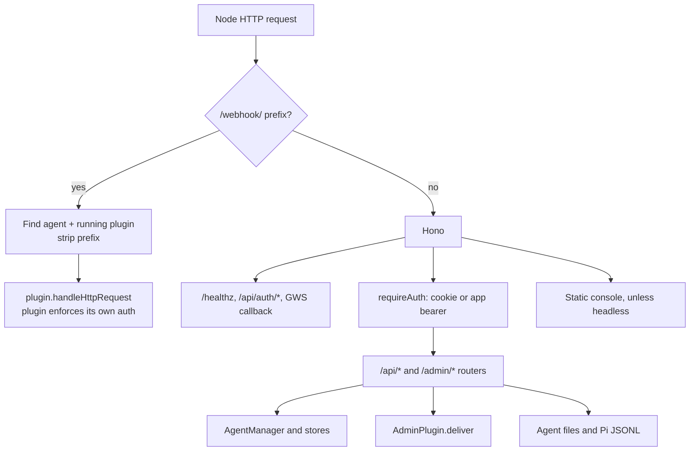
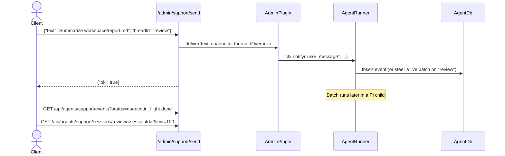

# API low-level design

**Status:** current HTTP implementation. [High-level design](../high-level-design.md) · [Roadmap](../roadmap.md) · [FAQ](#faq).

## In one minute

Everything outside the server talks to it over HTTP: the web console, operator scripts, and product apps.

- **Most routes need a login**, either the console cookie or the app's bearer secret. Both grant full operator access.
- **`/admin/:id/send`** posts a chat message to an agent. It returns `{ ok: true }` straight away; the answer shows up later in the session history.
- **Settings saves** write a file and then reload the agent. "Saved" doesn't mean "active" yet.
- **`/webhook/<agent>/<plugin>/*`** skips the login and goes straight to a plugin, which must check callers itself.

There is no streaming. Clients poll the events and session routes.

## What the API does

The API turns authenticated HTTP requests into calls on [core](core.md) (lifecycle, queue, stores), [plugins](plugins.md) (admin send, raw webhooks), and agent files (sessions, file editor). It owns authentication, request validation, credential masking, HTTP status mapping, and route wiring. It does not run a worker pool or write Pi history. The [web console](web.md) and product backends are its clients; a product backend's bearer currently has full operator access.

| File | Responsibility |
|---|---|
| [core/main.ts](../../packages/harness/src/core/main.ts) | Mount order, global middleware, raw webhook interception, static SPA routes. |
| [auth.ts](../../packages/harness/src/api/auth.ts) | File-backed users, signed cookies, app bearer, auth gates. |
| [agents.ts](../../packages/harness/src/api/agents.ts) | Lifecycle/config, session and usage reads, thread model overrides, event actions. |
| [admin.ts](../../packages/harness/src/api/admin.ts) | Send through `AdminPlugin`; abort through `AgentRunner`. |
| [files.ts](../../packages/harness/src/api/files.ts) | Agent-relative tree/text/raw/upload/mkdir/delete. |
| [secrets.ts](../../packages/harness/src/api/secrets.ts), [models.ts](../../packages/harness/src/api/models.ts) | Save masked credentials and model settings; trigger reloads. |
| [credentials.ts](../../packages/harness/src/api/credentials.ts) | Shared helpers only (no routes): the mask, `applyMaskedPut`, `requiredCredentialsPresent`. |
| [harness.ts](../../packages/harness/src/api/harness.ts), [gws-oauth.ts](../../packages/harness/src/api/gws-oauth.ts) | Timezone; Google Workspace sign-in (callback authenticated by a state nonce). |
| [webhook.ts](../../packages/harness/src/api/webhook.ts) | Dispatch raw HTTP to running plugins; handlers own their auth. |

## Request lifecycle

Every request enters one Node `http.Server`. Webhook traffic is intercepted before Hono; everything else goes through Hono's mount order.


```mermaid
flowchart TB
    HTTP[Node HTTP request] --> Prefix{"/webhook/ prefix?"}
    Prefix -->|yes| Dispatch[Find agent + running plugin<br/>strip prefix]
    Dispatch --> Plugin[plugin.handleHttpRequest<br/>plugin enforces its own auth]
    Prefix -->|no| Hono[Hono]
    Hono --> Public["/healthz, /api/auth/*, GWS callback"]
    Hono --> Gate[requireAuth: cookie or app bearer]
    Gate --> Routes["/api/* and /admin/* routers"]
    Hono --> SPA[Static console, unless headless]
    Routes --> Manager[AgentManager and stores]
    Routes --> Admin[AdminPlugin.deliver]
    Routes --> Files[Agent files and Pi JSONL]
```

### Example: operator sends a chat message


```mermaid
sequenceDiagram
    actor Client
    participant API as /admin/support/send
    participant Admin as AdminPlugin
    participant Runner as AgentRunner
    participant DB as AgentDb
    Client->>API: {"text":"Summarize workspace/report.md","threadId":"review"}
    API->>Admin: deliver(text, channelId, threadIdOverride)
    Admin->>Runner: ctx.notify("user_message", ...)
    Runner->>DB: Insert event (or steer a live batch on "review")
    API-->>Client: {"ok": true}
    Note over Runner: Batch runs later in a Pi child
    Client->>API: GET /api/agents/support/events?status=queued,in_flight,done
    Client->>API: GET /api/agents/support/sessions/review/<sessionId>?limit=100
```

```bash
curl --cookie /tmp/cognisphere.cookies -H 'Content-Type: application/json' \
  --data '{"text":"Summarize workspace/report.md","threadId":"review"}' \
  http://127.0.0.1:3142/admin/support/send
curl --cookie /tmp/cognisphere.cookies \
  'http://127.0.0.1:3142/api/agents/support/events?status=queued,in_flight,done'
```

`{ "ok": true }` is **not a receipt**: it carries no event ID or answer, and the plugin notify wrapper logs and swallows runner errors. Observe progress through the event row (`status`, `piSessionId`, `piEntryId`) and the session JSONL.

### Example: saving agent settings

`PUT /api/agents/support/config` → auth gate → route checks the agent and that `config` is an object → writes `agent.json` → `reloadAgent("support")`. The manager pauses new dequeues and swaps the runner and plugins only after active batches drain ([core agent lifecycle](core.md#agent-lifecycle)). So a 200 response means "saved", not "now running with the new settings"; refetch agent/plugin state to see the result.

## Design decisions

| Choice | Why | Cost |
|---|---|---|
| One Hono API plus raw plugin dispatch | Shared operator policy; plugins keep native Node HTTP handling. | Each webhook handler must enforce its own auth. |
| Cookie or product-server bearer | Serves the console and apps that own their user auth. | Bearer is operator-level; `X-App-User` is attribution, not a tenant scope. |
| Read Pi JSONL for history | Original entries and IDs; no second transcript store. | Live tails may be incomplete; no stream/replay today. |
| Masked credential merge | UI can round-trip secrets it cannot read. | Credentials are plaintext on disk; masking is display-only. |
| Agent-relative file paths | Blocks ordinary lexical traversal. | No symlink resolution, writer serialization, or revision check. |

Planned route families — runtime grants (`/runtime/v1/*`, [plan 1.4](../plans/04-ingress-and-operations.md)) and SSE (`/api/agents/:id/stream`, [plan 1.6](../plans/06-live-interface.md)) — do not exist today. The rest of this document is the authoritative current route reference.

---

## 1. Mount points and auth model

Three surfaces share one server:

- **Hono routes** from `main.ts`: `/healthz`, `/api/*`, `/admin/*`, and the SPA shell.
- **Raw webhook dispatch** for `/webhook/<agentId>/<pluginId>/*`: a `request` listener on the `http.Server` intercepts the prefix before Hono ([§10](#10-plugin-webhooks--webhook)).
- **SPA** (bundled `dist-web/`, or monorepo `packages/web/dist`, unless headless): `/`, `/login`, `/settings`, `/settings/*`, `/agents/*` serve `index.html` for the client router, and `/assets/*` serves static files. When headless or when no web build exists, `GET /` returns JSON `{ name, agents, note }` instead.

| Surface | Auth |
|---|---|
| `/healthz` | Public. |
| `/api/auth/*` | Public. |
| `/api/gws/oauth/callback` | Public; single-use `state` nonce is the auth. |
| other `/api/*`, `/admin/*` | `requireAuth`: 401 `{ "error": "unauthenticated" }` without a valid cookie or app bearer. |
| `/webhook/*` | Per plugin handler (see [§10](#10-plugin-webhooks--webhook)). Telegram and GWS poll instead of receiving webhooks. |
| SPA pages | `/login` and assets public; `/`, `/settings*`, `/agents/*` behind a server redirect gate. The client also checks auth. |

`requireAuth` accepts, cookie first:

- **Operator session** — `pi_sid` cookie, an HMAC-signed payload issued by `POST /api/auth/login`. `user` = username.
- **App bearer** — `Authorization: Bearer <secret>`, where the secret is `<harnessRoot>/.secrets/app-secret` (hex, 0600, generated on first boot; `scripts/server.sh secrets` can mint it earlier and pass it to the app as `HARNESS_APP_SECRET`). For product apps that authenticate their own users (Clerk, Supabase, …) and call the harness from their server. `user` = `X-App-User` header if present (ignored without a valid bearer), else `"app"`. A valid bearer has **full operator access**; the app must gate its own routes.

Nothing in the harness reads `c.var.user` today; it is for plugins and logs.

## 2. Public routes

`GET /healthz` → always `200 { "ok": true, "agents": 3 }`. `agents` counts loaded agent records, including stopped and failed ones. It is liveness only; use `/api/agents` for agent health.

## 3. Auth routes — `/api/auth/*`

Users live in `<harnessRoot>/.secrets/users.json` as plaintext: `{ "users": [{ "username": "admin", "password": "changeme" }] }`.

On startup (`ensureCredentials`, before the server binds), if the file is missing, empty, or still `admin / changeme`, the terminal prompts for a username and password (echo muted). Without a TTY (e.g. under systemd) it only logs a warning; the `admin / changeme` placeholder file is then created on the first login attempt. Change it before exposing the server (the deployment scripts do this via `server.sh secrets`). Sessions are stateless signed cookies; the 32-byte HMAC key is `<harnessRoot>/.secrets/session-key`, generated on first boot. Deleting it invalidates every cookie. The user list is loaded once and kept in memory, so hand edits to `users.json` need a server restart. On deployed servers, `scripts/server.sh` rewrites `users.json` from the deployment `config` on every start ([CLI](cli.md#server-deployment)).

| Method | Path | Body | Response | Errors |
|---|---|---|---|---|
| POST | `/api/auth/login` | `{ username, password }` | `200 { ok: true, username }`; sets `pi_sid` (`httpOnly`, `sameSite=Lax`, 7-day `maxAge`) | 400 `username and password required`; 401 `invalid credentials` |
| POST | `/api/auth/logout` | — | `200 { ok: true }`; clears the cookie | — |
| GET | `/api/auth/me` | — | `200 { user }`: username, `X-App-User`/`"app"` for a bearer, or `null` | — |

Password comparison is timing-safe. Logout has no server-side revocation: copies of the token stay valid until expiry or `session-key` rotation. `/me` lets the SPA pick login vs. shell, and lets webhook plugins verify an app request by forwarding its `authorization`/`x-app-user` (or `cookie`) headers.

## 4. Agents — `/api/agents/*`

All routes require auth. Mutations call `AgentManager` operations described in [core agent lifecycle](core.md#agent-lifecycle).

### Reads

| Method | Path | Response |
|---|---|---|
| GET | `/api/agents` | `{ agents: AgentSummary[] }`, `AgentSummary = { id, name, installedPlugins, state, error, runningPlugins, failedPlugins }` |
| GET | `/api/agents/:id` | `{ id, name, agentJson, installedPlugins, state, error, changedAt }`; 404 if unknown |
| GET | `/api/agents/:id/plugins` | `{ plugins: [{ pluginId, manifest, config, state, error, changedAt }] }` |

- `state` ∈ `running | stopped | failed`. `installedPlugins` lists every dir under `<agentDir>/plugins/`, including failed ones; `runningPlugins`/`failedPlugins` partition it.
- `agentJson` is `null` when `agent.json` failed to parse (`error` says why). `changedAt` is the last lifecycle transition time.
- Plugins include failed entries. `config` falls back to reading `config.json` from disk when the cached config is null, so a failed plugin's form still renders. `manifest` is null only if the plugin ID is no longer in the registry.

### Lifecycle and config

| Method | Path | Effect |
|---|---|---|
| POST | `/api/agents/:id/start` | `manualStart`: `stopped`/`failed` → `running` or `failed`. 409 if running. |
| POST | `/api/agents/:id/stop` | `manualStop`: aborts active batches. 409 if not running. |
| POST | `/api/agents/:id/restart` | `restartAgent`: stop if running, then full reread of `agent.json`, plugin configs, secrets. |
| PUT | `/api/agents/:id/config` | Body `{ config }` = complete `agent.json`. Write file, then `reloadAgent` (soft swap after drain). |
| PUT | `/api/agents/:id/plugins/:pluginId/config` | Body `{ config }` = complete plugin config. Write `config.json`, then `reloadPlugin` (that plugin only; runner untouched). |

- Lifecycle responses: `{ ok: true, state, error }`. Config responses: `{ ok: true, restartRequired: false, state, error }` (`restartRequired` is always `false`; forward-compat).
- `LifecycleError` → `not_found` 404, `conflict` 409 (already in that state or a transition in flight). Other errors → `500 { error }`.
- Config PUTs are **full replacements**, not patches; the only check is that `config` is a plain object. Schema validation happens at reload; a rejected plugin config shows up as `state: "failed"` with `error` in the next `/plugins` read even though the write succeeded.

### Sessions

| Method | Path | Effect |
|---|---|---|
| GET | `/api/agents/:id/sessions` | Threads under `<agent>/sessions/` and their `.jsonl` files, newest first. |
| GET | `/api/agents/:id/sessions/:threadId/:sessionId?limit=N` | Parsed JSONL entries; `limit` returns the newest N (invalid or ≤ 0 → 100; capped at 100,000). |
| GET | `/api/agents/:id/sessions/:threadId/usage` | Per-model tokens and cost for the thread. |
| PUT | `/api/agents/:id/sessions/:threadId/model` | Set/clear the thread model override; next batch, no reload. |
| DELETE | `/api/agents/:id/sessions/:threadId` | Delete the thread's `events` rows, `threads` row and `sessions/<threadId>/` dir. 409 if a batch is in flight. |

Thread list item:

```json
{ "threadId": "telegram:42", "activeSessionId": "01HX...",
  "sessions": [{ "sessionId": "01HX...", "modified": 1731000000000, "size": 12345 }],
  "lastContext": { "tokens": 12345, "contextWindow": 200000, "model": "anthropic/claude-sonnet-4-6" },
  "totalCost": 0.4231,
  "modelOverride": { "provider": "openai", "modelId": "gpt-5", "thinkingLevel": "high" } }
```

- `lastContext` tail-reads ~128 KiB of the active session: the latest non-aborted assistant message's tokens (`usage.totalTokens`, else input+output+cacheRead+cacheWrite), and the context window resolved as a Pi child would — Pi `models.json` `modelOverrides` (synced from `.secrets/models.json`, [§7](#7-models--apimodels)), then custom model entries, then pi-ai's built-in catalog. `null` when no assistant message is in the tail; `contextWindow` is `null` for unknown models.
- `totalCost` sums `usage.cost.total` over all assistant messages in all the thread's files; per-file totals are cached by `(path, mtimeMs)`. `0` when none.
- `modelOverride` is `null` when inheriting `agent.json`. When set, the next batch uses it, including a different provider whose credentials are injected at spawn.

Session read: `{ threadId, sessionId, entries, hasMore }`. With `limit` the file is tail-seeked in 256 KiB chunks, so long sessions cost the same as short ones; `hasMore` says older rows exist. Without `limit` the whole file is read and `hasMore` is `false`. The web chat opens at `limit=100` and **Load 100 more** refetches with a larger limit. Malformed lines are skipped.

`threadId`/`sessionId` must be one path segment: no `/`, `\`, NUL, leading `.`, length ≤ 256. Other characters (spaces, brackets, unicode) are allowed because thread IDs reflect external input such as email subjects.

Set model body: `{ "provider": "openai", "modelId": "gpt-5", "thinkingLevel": "high" }`. `thinkingLevel` is optional (`off|minimal|low|medium|high|xhigh`; omit/`null` inherits). `provider: null` or `modelId: null` clears the override. `provider` must be a catalog provider whose required credential fields are set, and `modelId` must be in its `enabledModels` (else 400; an invalid `thinkingLevel` is also 400). Caveat: this check ignores OAuth, so a provider with no credential fields (e.g. `openai-codex`) passes even when not signed in (see [core](core.md#simplification-review-proposed)). 409 if the thread has no `threads` row yet (send a message first); 503 if the agent has no DB. Returns `{ ok: true }`; the runner reads the override live.

Usage response: `{ threadId, main: { agent: "main", models: [...], lastContext } }` with one model row per distinct `<provider>/<model>` (a mid-session `model_change` yields several):

```json
{ "provider": "anthropic", "model": "claude-sonnet-4-6",
  "input": 1234, "output": 567, "cacheRead": 8910, "cacheWrite": 11,
  "cost": { "input": 0.0037, "output": 0.0085, "cacheRead": 0.0027, "cacheWrite": 0.00004, "total": 0.01494 } }
```

Figures come from the `usage` block pi-ai writes on assistant messages; messages without one are skipped. `lastContext` is the highest-timestamp non-aborted assistant message across the thread's files.

Delete response: `{ ok: true, threadId, events: 17, removedDir: true }` — `events` is rows deleted; `removedDir` is `false` if no directory existed (e.g. the thread never ran a batch).

### Events

One mutable row per notification, including failed ones. The UI polls; there is no stream today.

| Method | Path | Body | Response | Errors |
|---|---|---|---|---|
| GET | `/api/agents/:id/events` | query below | `{ events, total }` | — |
| POST | `/api/agents/:id/events/:rowId/requeue` | — | `{ ok: true, id }` | 404 if missing or not `failed` |
| POST | `/api/agents/:id/events/:rowId/status` | `{ status: queued\|done\|failed\|cancelled }` | `{ ok: true, status }` | 404 missing; 409 row `in_flight` |
| DELETE | `/api/agents/:id/events/:rowId` | — | `{ ok: true }` | 404 missing; 409 row `in_flight` |

When the agent has no open `AgentDb` (early startup validation failure or shutdown), `GET` returns `{ events: [], total: 0 }` and requeue/status/delete return 503.

- **Requeue** keeps the row ID and session ID, clears `error` and `piEntryId`, sets `attempts = 1`; the next delivery resends the original text with `Retry: true`.
- **Status** set to `queued` does the same reset. `in_flight` cannot be set; it belongs to the runner. Abort the batch before changing or deleting an in-flight row.

#### `GET /api/agents/:id/events`

| Param | Value | Default |
|---|---|---|
| `status` | comma list of `queued,in_flight,done,failed,cancelled` | all |
| `plugin` | exact `pluginId` | all |
| `search` | SQLite `LIKE '%query%'` on `text` **or** `metadata` (wildcards keep LIKE meaning) | none |
| `isSilent` | `true`/`1` or `false`/`0` | both |
| `tsFrom`, `tsTo` | epoch ms on `ts` | none |
| `updatedFrom`, `updatedTo` | epoch ms on `updated_at` | none |
| `sortBy` | `ts`, `updated_at`, `status`, `plugin_id`, `thread_id` | `updated_at` |
| `sortDir` | `asc`, `desc` | `desc` |
| `limit` | int; above 1000 becomes 1000; 0, negative or non-numeric falls back to the default | `200` |
| `offset` | int ≥ 0; invalid becomes 0 | `0` |

```json
{ "events": [{
    "id": 17, "ts": 1731000000000, "updatedAt": 1731000004210,
    "pluginId": "telegram", "channelId": "chat-42", "threadId": "telegram:chat-42",
    "isSilent": false, "doNotSteer": false, "text": "user message body", "metadata": { "_notification": "message" },
    "status": "done", "priority": 0, "attempts": 0, "error": null,
    "piSessionId": "8f2c4f1e-…", "piEntryId": "a1b9d2e7-…" }],
  "total": 1234 }
```

`total` is the filtered count before paging. `search` matches input text and metadata, not transcripts.

`piSessionId` + `piEntryId` locate the delivered user entry in `<agentDir>/sessions/<threadId>/<piSessionId>.jsonl`. The harness-bridge Pi extension writes `piEntryId` in real time, so it can be set while `in_flight` and on rows whose batch later failed; it is `null` if never captured or cleared for resend. Rows concatenated into one prompt share an entry; each live steer gets its own. A set `piEntryId` marks the row as delivered: an automatic retry sends a short *continue* nudge instead of the original text.

## 5. Filesystem — `/api/agents/:id/fs/*`

Backs the console file editor. Every route returns 404 for an unknown agent. `path` is relative to the agent directory (`""` or `.` = root). Every route uses `resolveSafe`: absolute paths and paths normalizing outside the agent dir are rejected. It does **not** resolve symlinks and is not a sandbox.

| Method | Path | Body | Response | Errors / notes |
|---|---|---|---|---|
| GET | `fs/tree?path=` | — | `{ path, entries: [{ name, path, isDir, size, modified }] }` | One level; hidden (`.`) entries excluded; dirs first, then alpha. |
| GET | `fs/file?path=` | — | `{ path, content, size, modified }` | 404 missing; 400 directory; 413 > 4 MiB; 415 binary (any byte below 9 or in 14–31 within the first 1 KiB; tab, newline, vertical tab, form feed and CR are allowed). |
| PUT | `fs/file?path=` | `{ content }` | `{ path, size, modified }` | 400 `missing content`. Creates parent dirs; writes UTF-8; no content validation. |
| GET | `fs/raw?path=&download=1` | — | Raw bytes, guessed MIME, `content-disposition` inline (or `attachment` when `download` has any non-empty value) | Errors are status-only (404, 400) with empty bodies, for ``/download use. |
| POST | `fs/upload?dir=` | multipart field `file` | `{ path, size, name }` | 400 if not multipart or no `file` field. `dir` defaults to `uploads`. Characters outside `[A-Za-z0-9._-]` become `_` (an empty name becomes `upload.bin`); an existing file at that name is overwritten. |
| POST | `fs/mkdir?path=` | — | `{ path }` | Recursive. |
| DELETE | `fs/path?path=` | — | `{ path, isDir }` | Recursive for dirs; 400 for the agent root; 404 missing. |

A file PUT triggers **no reload** and no conflict check. To change `agent.json` or plugin config at runtime, use the config PUTs in [§4](#4-agents--apiagents). Free-form files (`workspace/`, `system_prompts/`, …) need no reload; prompts are read at the next child spawn.

## 6. Secrets — `/api/secrets`

Auth required. Wire and disk shapes match: `<agentId> → <bucketId> → KEY → value` (see [credential configuration](agents.md#configuration-and-credentials)). Bucket `agent` (`AGENT_BUCKET`) holds keys from `agent.json.secretsSchema`; other buckets are plugin IDs.

**`GET /api/secrets`**

```json
{ "secrets": { "<agentId>": { "<bucketId>": { "<KEY>": "********" } } },
  "schemas": { "<agentId>": { "<bucketId>": {} } },
  "agentBucket": "agent", "mask": "********", "path": "/.../secrets.json" }
```

Set values show `********`, empty ones `""`. `schemas` includes the agent schema (when declared) and every installed plugin, including failed ones, so secrets can be filled in to fix a startup failure. Agents with no stored entries still appear. The file's `_format`/`_usage`/`_example` doc keys are filtered out.

**`PUT /api/secrets`** — body `{ secrets: { <agentId>: { <bucketId>: { KEY: value } } } }` with [mask semantics](#mask-sentinel): string sets, `null` deletes, `"********"` keeps, omitted is unchanged; an empty string is stored as empty (resolves as unset). The write merges, preserves `_*` doc keys, and writes 0600. Then `reloadAgent` runs for every agent in the body (it invalidates the secrets cache and soft-swaps). Response `{ ok: true, restartRequired: false, restarted: ["dr-renu"] }`; `restarted` lists agents running after reload. Per-agent reload errors are logged but do not fail the save.

### 6.1 Google Workspace sign-in — `/api/gws/oauth/*`

Browser-driven Google OAuth for agents with the `gws` plugin; the only supported sign-in path. The shared OAuth client is set on the console Settings page; sign-in, sign-out and scopes live on each agent's gws plugin card.

**Prerequisite:** the operator creates a "Web application" OAuth client in their own GCP project (Gmail API enabled) and registers `<origin>/api/gws/oauth/callback` for each sign-in origin (console, and the app if it hosts the button). Client ID/secret are stored once at `.secrets/gws/oauth-client.json` and shared by all agents.

| Method | Path | Auth | Body | Response | Errors |
|---|---|---|---|---|---|
| GET | `/api/gws/oauth` | yes | — | `{ client: { clientId, clientSecret: "********" }, agents: [{ agentId, name, signedIn, email, scopes }], mask }` | — |
| PUT | `/api/gws/oauth/client` | yes | `{ clientId, clientSecret }` (mask or omitted keeps the secret) | `{ ok: true }` | 400 if `clientId` isn't a string |
| POST | `/api/gws/oauth/:agentId/start` | yes | `{ redirectUri, returnTo? }` | `{ url }` (Google consent URL) | 400 no `redirectUri`; 404 no gws plugin; 409 no client saved |
| GET | `/api/gws/oauth/callback?code=&state=` | **public** | — | Redirect | see below |
| DELETE | `/api/gws/oauth/:agentId` | yes | — | `{ ok: true }` | 404 no gws plugin |

- **List:** only agents with `gws` installed. `signedIn` is true when the agent's `GOOGLE_WORKSPACE_CLI_CREDENTIALS_FILE` secret points at the harness-managed file; `email`/`scopes` are what Google granted.
- **Start:** issues a random single-use `state` (in memory, 10-minute TTL). `redirectUri` is the caller's origin + callback path, so dev-proxy, deployed and app origins all work; `returnTo` overrides the final redirect (app-origin sign-ins pass an app path). Scopes = baseline `openid email` + `gmail.modify`, plus the gws plugin config `oauthScopes` (comma-separated URLs; read from the live plugin, or `plugins/gws/config.json` if not running). Uses `access_type=offline&prompt=consent` to force a refresh token.
- **Why `gmail.modify`:** it is Google's read/write tier (read, drafts, send, labels, mark-read — everything but permanent delete, which needs `https://mail.google.com/` and is never requested). The poll loop's mark-read needs it, and the narrower Gmail scopes are subsets.
- **Callback:** validates and consumes `state`, exchanges the code, writes the `authorized_user` JSON to `.secrets/gws/<agentId>/credentials.json` (0600), records email and granted scopes in sibling `account.json`, sets `gws.GOOGLE_WORKSPACE_CLI_CREDENTIALS_FILE` to that path, and soft-reloads the agent. Redirects to `returnTo` (default `/agents/<agentId>/settings`) with `?gws=signed-in`, or `?gwsError=<message>` on failure (including an expired `state`). Only an unknown `state` falls back to `/settings`. The exchange fails if Google returns no refresh token. There is no PKCE. A server restart drops pending sign-ins.
- **Delete:** best-effort revokes the refresh token, deletes `.secrets/gws/<agentId>/`, clears the secret, and soft-reloads; the gws plugin then fails to start until the next sign-in (expected).

## 7. Models — `/api/models`

Auth required. Reads/writes `<harnessRoot>/.secrets/models.json`. The provider catalog (id, displayName, `CredField[]`, default models, notes, `oauth` flag) is fixed in `models-catalog.ts`. Only per-provider `credentials`, `enabledModels`, and `modelOverrides` (per-model `contextWindow`/`maxTokens` over pi-ai's catalog) are stored here; subscription OAuth tokens live in Pi's `<piAgentDir>/auth.json` ([§7.1](#71-oauth-subscription-login--apimodelsoauth)).

**`GET /api/models`**

```json
{ "providers": [{
    "id": "anthropic", "displayName": "Anthropic",
    "credentials": [], "credentialValues": { "apiKey": "********" },
    "configured": true,
    "catalogModels": ["claude-sonnet-4-5", "claude-opus-4-7"],
    "enabledModels": ["claude-sonnet-4-5"],
    "modelOverrides": { "claude-sonnet-4-5": { "contextWindow": 1000000 } },
    "notes": "...", "oauth": { "supported": true, "connected": false } }],
  "path": "/.../models.json", "mask": "********" }
```

- `credentialValues`: unset → `""`; secret field → `"********"`; non-secret field → plaintext (e.g. region).
- `oauth` appears only for catalog `oauth: true` providers; `connected` = tokens exist in Pi's `auth.json`.
- `configured` = every required credential set, or OAuth connected. Providers with no credential fields (e.g. `openai-codex`) are configured only when connected.

**`PUT /api/models`** — body `{ providers: { <id>: { credentials, enabledModels, modelOverrides } } }`.

- `credentials` use [mask semantics](#mask-sentinel), except an empty string **deletes** (unlike `/api/secrets`).
- Unknown provider IDs and undeclared credential keys are ignored; non-string/empty `enabledModels` entries are dropped.
- `modelOverrides` merge per model: `null` deletes, an object replaces. Non-finite or non-positive `contextWindow`/`maxTokens` are dropped.
- After saving, overrides are mirrored into Pi's `models.json` (`pi-models-sync.ts`) so new children see them, then every running agent whose `model.provider` was touched is reloaded. Response `{ ok: true, restartRequired: false, restarted: [...] }`.

### 7.1 OAuth subscription login — `/api/models/oauth/*`

Sign-in for subscription providers (Anthropic Claude Pro/Max, OpenAI Codex). The server drives pi-ai's OAuth flow through pi-coding-agent's `ModelRuntime`; tokens go to Pi's `<piAgentDir>/auth.json` (default `~/.pi/agent/auth.json`), never `models.json`. `login` and `DELETE` require a catalog entry with `oauth: true` (else 404); `input`, `status` and `cancel` don't check. One pending flow per provider, held in memory.

| Method | Path | Body | Response | Errors |
|---|---|---|---|---|
| POST | `/:provider/login` | — | First interaction, e.g. `{ state: "pending", url, instructions }` | — |
| POST | `/:provider/input` | `{ value, kind?: "text"\|"select" }` | `{ ok: true }` | 400 no `value`; 409 nothing awaiting that input |
| GET | `/:provider/status` | — | `{ state: idle\|pending\|success\|error, url?, instructions?, select?, deviceCode?, prompt?, message? }` | — |
| POST | `/:provider/cancel` | — | `{ ok: true }` (no-op if none) | — |
| DELETE | `/:provider` | — | `{ ok: true, restarted: [...] }` | — |

Paths are under `/api/models/oauth`. `login` cancels any pending flow first. A pending state can carry:

- `url` + `instructions` — authorize URL. If the server runs on the browser's machine, the provider's fixed-port localhost callback (e.g. 53692 Anthropic, 1455 Codex) completes it; otherwise paste the final redirect URL via `input` (`kind: "text"`).
- `select` — `{ message, options: [{ id, label }] }`, e.g. Codex browser vs. device-code login; answer with `kind: "select"`. Pick device code for a remote harness.
- `deviceCode` — `{ userCode, verificationUri }`; the server polls until authorized, no input needed.
- `prompt` — `{ message, placeholder? }`; answer with `kind: "text"`.

`success`/`error` persist until the next `login` (`message` only on error). On success tokens are saved and running agents using that provider are reloaded. `DELETE` cancels any flow, removes the provider's tokens and reloads the same agents.

## 8. Harness — `/api/harness`

Auth required. `<harnessRoot>/harness.json` holds `timezone` (IANA) and `version` (data/migration version from `cognisphere init` and the upgrade workflow). `timezone` feeds each batch's `<harness-metadata>` and the scheduler's cron timer.

| Method | Body | Response | Notes |
|---|---|---|---|
| GET | — | `{ timezone, version, path }` | `timezone` defaults to `UTC` if missing/malformed; `version` is `""` if unstamped. |
| PUT | `{ timezone }` | `{ ok: true, timezone, restarted: [...] }` | 400 for IDs `Intl.DateTimeFormat` rejects. Preserves `version` (read-only here), updates `cfg.timezone` in place, reloads every loaded agent. |

## 9. Admin chat — `/admin/*`

Auth required. Predates `/api`; the console chat still uses it.

| Method | Path | Body | Response | Errors |
|---|---|---|---|---|
| POST | `/admin/:agentId/send` | `{ text, channelId?, threadId? }` | `{ ok: true }` | 404 agent; 400 empty `text`; 500 admin plugin not installed; 503 admin plugin not running |
| POST | `/admin/:agentId/abort` | `{ threadId }` | `{ ok: true\|false }` | 404 agent; 400 no `threadId`; 503 agent not running |

- **Send:** `AdminPlugin.deliver()` → `ctx.notify("user_message", { text, channelId, threadIdOverride })` → `runner.notify()`: enqueue, or steer a live batch on that thread, like any plugin input. `channelId` defaults to `operator`; `threadId` is an explicit routing override, otherwise the agent's thread strategy decides. `priority`, `isSilent`, `doNotSteer` are not exposed. No idempotency key: don't blindly resend after an uncertain response.
- **Abort:** `runner.abort(threadId)` sends an `abort` RPC to the thread's Pi child and marks the batch's inputs `cancelled` (no retry). `ok` says whether an active batch was found, so `200 { ok: false }` means "nothing to abort". It does not delete queued work or undo side effects.

## 10. Plugin webhooks — `/webhook/*`

**Not** behind `requireAuth`; each plugin handler authenticates its own traffic. For `/webhook/<agentId>/<pluginId>/<rest>` the dispatcher:

1. Strips the prefix and looks up the agent and a **running** plugin with `handleHttpRequest`.
2. Rewrites `req.url` to `<rest>?<query>`.
3. Awaits `plugin.handleHttpRequest(req, res)` with raw Node objects (no Hono), so plugins handle headers/streaming as upstream services expect and own signature/secret/IP checks.

Dispatcher errors: `404 missing agentId/pluginId`, `404 unknown agent: <id>`, `404 unknown plugin or no http handler: <pid>` (not installed, not running, or no handler). If the handler throws, the error is logged and the reply is 500 (or the response is ended if headers were sent).

Plugins get the loopback prefix as `PluginInstanceContext.httpBaseUrl` (only when they declare a handler). Pi children get it as `PI_WEBHOOK_BASE` and call `${PI_WEBHOOK_BASE}/<pluginId>/<rest>` from bash or seeded plugin scripts. See [plugin lifecycle](plugins.md#discovery-and-lifecycle).

**agent-messaging** — `POST /webhook/<agent>/agent-messaging/api/send` is internal-only with two checks:

1. `X-Webhook-Secret` must equal `COGNISPHERE_WEBHOOK_SECRET` (set in `process.env` at boot, so every in-harness agent has it); missing/wrong → 401.
2. `from_agent` (filled by the seeded `send` script from `$PI_AGENT_ID`) must be allowed by the receiver's `allowMessageFrom` config (default `["*"]`); otherwise 403.

Other responses: 400 if `thread_id`, `message`, `from_agent` or `from_thread_id` is missing; 503 if the plugin hasn't started. `GET /webhook/<agent>/agent-messaging/` returns plain-text usage.

The secret proves "in-harness caller", not "which agent"; `from_agent` is advisory because co-resident agents share the secret.

**artifacts** — serves agent-published static HTML. The **product app**, not the harness, decides who reads private artifacts: it fronts `<app>/public/artifacts/<slug>` (open) and `<app>/private/artifacts/<slug>` (behind its login) and forwards here.

| Route (under `/webhook/<agent>/artifacts`) | Auth | Behavior |
|---|---|---|
| `GET /public/<slug>` | none | Serves only while the artifact is flagged `public`, else 404. |
| `GET /private/<slug>` | `X-Artifacts-Secret` = plugin secret `ARTIFACTS_APP_SECRET` (else 401) | Serves regardless of flag; the app attaches the secret only after its own session check. |
| `GET /private/<slug>/meta` | same | Flag plus both links, for the app's share toggle. |
| `POST /private/<slug>/share` | same | `{ public: bool }` flips the flag. |
| `GET /api/list` | `X-Webhook-Secret` (as agent-messaging) | All artifacts with links, for the seeded `scripts/artifacts/artifact` CLI. |

Slugs must match `^[a-z0-9][a-z0-9-]{0,63}$` (else 404 before any filesystem access). Non-GET on a serve route is 405; an unknown sub-route is 404. Publishing is not an HTTP route: the seeded script writes `state/<slug>.<public|private>.html` directly. No artifact URL carries a token; the flag alone decides public access. Responses set `Content-Security-Policy: sandbox allow-scripts allow-forms allow-popups allow-downloads` (**no** `allow-same-origin`; agent HTML on the app origin gets no cookies, storage or same-origin APIs), `Referrer-Policy: no-referrer`, `X-Content-Type-Options: nosniff`, an injected `<meta name="viewport">` if missing, and `Cache-Control: private, no-store` (private) or `public, max-age=60` (public). The app must relay these headers — see the app template's `artifacts-routes/README.md`.

## 11. Conventions

**Formats.** Control routes use JSON; handlers commonly treat malformed JSON as `{}` before field validation, so content type is not a universal guarantee. Upload is multipart, raw routes return bytes, OAuth callbacks redirect, static routes serve HTML/assets.

**Errors.** `{ "error": "<message>" }` with an HTTP status. Side-effecting routes may add post-action state (`state`, `error`, `restarted`).

### Mask sentinel

On `/api/secrets` and `/api/models` credentials: `"********"` = keep existing, `null` = delete, omitted = unchanged, any other string = new value. GETs never expose real values, so this is how GET-then-PUT round-trips.

| Value | `/api/secrets` | `/api/models` | GWS `clientSecret` |
|---|---|---|---|
| `"********"` or omitted | keep | keep | keep |
| `null` | delete | delete | stored as null (reads back empty) |
| `""` | stored empty (treated as unset) | delete | stored empty |
| other string | set | set | set |

**IDs and paths.** Agent IDs are directory names under `<rootDir>/<harnessId>/agents/`; routes look them up in the manager (no character-set validation, since creation is out-of-band). File `path` params go through `resolveSafe`. Session `threadId`/`sessionId` must be a single path segment ([§4](#sessions)).

### Auto-reload on settings PUTs

| Endpoint | Reload |
|---|---|
| `PUT /api/agents/:id/config` | `reloadAgent(id)` — soft swap after active batches drain |
| `PUT /api/agents/:id/plugins/:pid/config` | `reloadPlugin(id, pid)` — that plugin only; runner keeps running |
| `PUT /api/secrets` | `reloadAgent` for each agent in the body |
| `PUT /api/models` | `reloadAgent` for each agent whose default provider appears in the body (even if nothing changed) |
| Model OAuth success / `DELETE /api/models/oauth/:provider` | Same per-provider reload |
| GWS callback / GWS `DELETE` | `reloadAgent(agentId)` |
| `PUT /api/harness` | `reloadAgent` for every loaded agent (timezone is captured by runners and plugin contexts) |

`reloadAgent` on a stopped or failed agent only clears the secrets cache; it does not start it.

Generic file writes (`PUT fs/file`) never reload. `restartRequired: false` is a forward-compat field for settings that would need a hard restart.

## Known issues and suggested improvements

Found in a code audit on 2026-09-28. **Severity** is how much it can hurt: *High* = lost work, security exposure or a wrong result; *Medium* = confusing or wasteful behavior; *Low* = cleanup. None of these is fixed yet. When one is fixed or scheduled, update this table and the [roadmap](../roadmap.md).

| # | Type | Severity | Problem | Why it matters | Suggested change |
|---|---|---|---|---|---|
| 1 | Bug | Medium | The thread-model PUT ignores OAuth: a provider with no credential fields passes even when not signed in (`GET /api/models` checks this correctly). | The override is accepted and then fails when the batch starts. | Use the same resolver as agent startup ([core](core.md#known-issues-and-suggested-improvements)). |
| 2 | Risk | High | The app bearer secret and the console cookie both give full operator access; `X-App-User` isn't checked against anything. | A leaked app secret controls every agent, file and credential. | Scoped tokens (per agent, per action) and per-user authorization for product apps. |
| 3 | Risk | High | Without a terminal, the first login attempt creates `admin / changeme`; passwords are stored in plain text. | A server started under systemd without running `server.sh secrets` is open to the default password. | Refuse to start (or refuse logins) while the default is in place, and store password hashes. |
| 4 | Risk | Medium | GWS `start` accepts any `redirectUri` and `returnTo` from the caller. | Open-redirect after sign-in. | Allow-list origins and return paths. |
| 5 | Risk | Medium | `/admin/:id/send` returns no event ID and has no idempotency key. | Clients can't track their message, and retries after a timeout create duplicates. | Return the event ID from the durable intake and accept an idempotency key ([plan 1.4](../plans/04-ingress-and-operations.md)). |
| 6 | Risk | Medium | File paths are checked lexically; symlinks aren't resolved. | A symlink inside the agent folder can expose files outside it. | Resolve real paths before the containment check. |
| 7 | Risk | Medium | File writes and uploads overwrite with no revision check, and different upload names can map to the same file. | Operator edits and agent edits can silently overwrite each other. | Accept an expected hash on writes and avoid overwriting uploads (add a suffix). |
| 8 | Risk | Low | Logout doesn't revoke the cookie; it stays valid for up to 7 days. | A copied cookie keeps working. | Keep a server-side session list or a revocation counter. |
| 9 | Risk | Low | Malformed JSON bodies are treated as `{}`. | A client bug turns into a confusing validation error instead of "bad JSON". | Return 400 for unparseable JSON. |
| 10 | Risk | Low | Config PUTs replace the whole file and only check that it's an object; schema validation happens at reload. | A bad save is written to disk first and then breaks the agent. | Validate before writing and return the errors. |
| 11 | Risk | Low | Model OAuth `input`, `status` and `cancel` don't check that the provider supports OAuth. GWS `clientSecret: null` is stored as null instead of being deleted. | Inconsistent behavior across similar routes. | Apply the same checks and mask rules everywhere (one helper in `credentials.ts`). |
| 12 | Risk | Low | Event `search` passes `%` and `_` through as LIKE wildcards. | Searches for those characters match too much. | Escape wildcards, or document an explicit pattern mode. |

## FAQ

### Building a product app

#### Which credential should my product app use?

Use the app bearer: `Authorization: Bearer <secret>`, where the secret is `harness/.secrets/app-secret`. `scripts/server.sh secrets` copies it into `app/.env.local` as `HARNESS_APP_SECRET`. Add `X-App-User: <your user id>` so logs show who acted. The bearer has full operator access, so keep it on your server, check your own user first, and only forward the routes you need ([§1](#1-mount-points-and-auth-model), [app template](../../packages/harness/home-template/app/README.md)). Scripts can use the same bearer, or log in and reuse the `pi_sid` cookie for up to 7 days.

#### Can I call the API straight from browser JavaScript?

No. The server sends no CORS headers, and a browser preflight to `/api/*` gets a 401. More importantly, the bearer must never reach a browser. Add route handlers to your app's backend that check your user and then call the harness server-to-server. The console works only because the harness serves it from the same origin.

#### Why does `/healthz` work while my API call returns 401?

`/healthz` is public; `/api/*` and `/admin/*` need a cookie or the bearer. Call `GET /api/auth/me` with the same headers: `{ "user": null }` means the credential wasn't accepted. Check for a stale secret after a rotation, a missing `Bearer ` prefix, or a cookie sent to a different origin. Webhook secrets don't count as operator auth.

#### How do I send a message and get the answer back?

1. `POST /admin/<agent>/send` with `{ "text": "...", "threadId": "..." }`. The reply `{ "ok": true }` carries no event ID and no answer.
2. Poll `GET /api/agents/<agent>/events?plugin=admin&sortBy=ts&sortDir=desc&limit=20`. There is no thread filter, so pick the newest row with your `threadId` in your code. Wait until its `status` is `done` or `failed`.
3. Read `GET /api/agents/<agent>/sessions/<threadId>/<piSessionId>?limit=100`. The answer is the assistant `message` entries after the entry whose `id` equals the row's `piEntryId`.

Rows that were batched together share one entry. If no row shows up, check the agent's state ([example](#example-operator-sends-a-chat-message)).

#### How often should I poll? Is there a stream or a callback when the answer is ready?

There is no stream and no outbound callback. The console polls events every 2 s and the open session every 3 s; similar intervals are fine. Poll only while a row is `queued` or `in_flight`, and use `updatedFrom` to fetch only rows that changed. Live updates over SSE are planned in [plan 1.6](../plans/06-live-interface.md) and don't exist yet.

#### How do I give each of my users their own conversation?

Send your own `threadId` on every message, such as `user-42`. It overrides the agent's thread strategy; without it, a `single`-strategy agent puts every message in thread `default`. A thread ID must be one path segment: no `/` or `\`, no leading `.`, at most 256 characters. By default an agent runs one conversation at a time (`maxConcurrentSlots: 1`), so other users' messages wait in the queue. To reset a user's conversation, `DELETE /api/agents/<agent>/sessions/<threadId>` (409 while it's running).

#### Can one of my users see another user's data?

The harness doesn't stop it. The bearer can read every agent, thread, file and secret, and `X-App-User` is recorded but never checked. Your backend must map each user to their own thread IDs and only forward those. All threads of one agent share the same files, so for hard separation use separate agents or deployments ([known issue 2](#known-issues-and-suggested-improvements)).

#### How do I upload a file for the agent to use?

`POST /api/agents/<agent>/fs/upload?dir=<folder>` as multipart with a `file` field, from your backend. The response `path` is relative to the agent folder; mention it in the message text (the console appends an `attachments:` list). Names are cleaned up and an existing file with the same name is overwritten, so use a unique folder per user or upload. The harness has no size limit, but the shipped nginx setup keeps nginx's 1 MB default body limit for browser traffic; raise `client_max_body_size` in a `scripts/app/setup-server.sh` hook if you need more.

#### Are there rate limits or quotas?

No. There are no request limits, per-user caps or spending limits. Every send adds a queue row, so a flood becomes a backlog and a model bill. Enforce limits in your app.

#### How does pagination work?

- **Events:** `limit` (default 200, at most 1000) and `offset`; `total` is the filtered count. The default sort is `updated_at`, so rows move between pages as they change. Use `sortBy=ts` for stable paging.
- **Session history:** `limit=N` returns the newest N entries and `hasMore`. To go further back, ask again with a bigger `limit`. There is no cursor.
- **Agents and thread lists** are not paged.

#### What errors should my client handle, and is it safe to retry a send?

Errors are `{ "error": "<message>" }` with a status: 400 bad input, 401 bad credential, 404 unknown agent, row or path, 409 conflict (running work or a lifecycle change), 503 agent or admin plugin not running, 500 anything else. Malformed JSON is treated as `{}`, so you get a validation error rather than "bad JSON". Send has no idempotency key, and a retry after a timeout can create a duplicate. Look for your row in events first (`search` matches message text) ([known issues 5 and 9](#known-issues-and-suggested-improvements)).

#### Why can abort return `ok: false` while deleting an event returns 409?

Abort reports whether a batch was running; "nothing to abort" is a valid answer. Event and thread changes refuse running work. Abort, wait for the row to leave `in_flight`, then retry the change.

#### Can two writers clobber each other's file?

Yes. `PUT fs/file` and uploads overwrite with no revision check or lock, and different upload names can clean up to the same file name. Use distinct names and folders. The planned fix is in [plan 1.2](../plans/02-workspace-and-provisioning.md).

#### How do external services send webhooks to an agent?

Through a plugin. `/webhook/<agent>/<plugin>/*` forwards raw HTTP to a running plugin that handles HTTP, with no operator login, so the plugin must check signatures or secrets itself ([§10](#10-plugin-webhooks--webhook)). If the plugin isn't installed or running, the reply is 404. To add a receiver, [write a plugin](plugins.md#contract).

#### How do I serve agent artifacts from my app?

Your app exposes `/public/artifacts/<slug>` and `/private/artifacts/<slug>` and forwards them to the agent's `artifacts` plugin. For private pages, add `X-Artifacts-Secret` only after your own login check, and pass the security headers through. Set `ARTIFACTS_AGENT` in `config` and copy the [artifacts route templates](../../packages/harness/home-template/app/artifacts-routes/README.md) ([§10](#10-plugin-webhooks--webhook)).

#### Is the API versioned? Will an upgrade break my app?

There is no version prefix and no compatibility promise; routes change with harness releases. Breaking changes are listed in each release's changelog, which your app home keeps in `docs/base-harness/CHANGELOG.md`. Pin the version in `harness/package.json` and read the changelog before upgrading. The planned `/runtime/v1/*` routes ([plan 1.4](../plans/04-ingress-and-operations.md)) don't exist yet.

### Running the server

#### I'm locked out. How do I reset the console password?

- **Deployed with the scripts:** `server.sh` rewrites `harness/.secrets/users.json` from `config` on every `secrets`, `start` and `restart`. Set `APP_USER` and `APP_PASS` in `config`, then run `sudo ./scripts/server.sh restart harness`. With `APP_PASS` blank, the current password is kept, and `sudo ./scripts/server.sh secrets` prints it.
- **Local:** edit `harness/.secrets/users.json` (plain text), or delete it and start the server in a terminal to be asked for a new login.

Restart the server either way: it keeps the user list in memory.

#### How do I rotate the app secret or log everyone out?

- **App secret:** delete `harness/.secrets/app-secret` and run `sudo ./scripts/server.sh restart`. It makes a new secret, writes it into `app/.env.local` and restarts both services. Without the scripts, restart the harness (it creates a new one at boot) and update your app's `HARNESS_APP_SECRET`.
- **Console sessions:** delete `harness/.secrets/session-key` and restart. Every `pi_sid` cookie stops working. Logout alone doesn't revoke a cookie ([known issue 8](#known-issues-and-suggested-improvements)).

If you write either file yourself, make it at least 32 characters (32 bytes for the session key); the server refuses to start otherwise.
