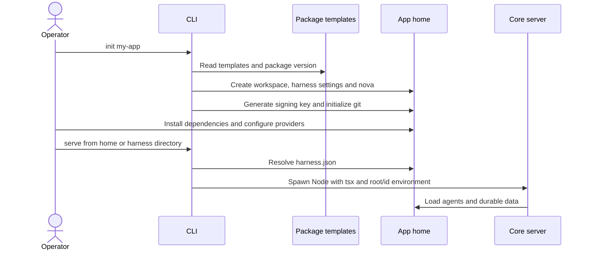

# CLI low-level design

**Status:** implemented CLI, packaging, and app-home operations. [High-level design](../high-level-design.md) · [Roadmap](../roadmap.md). [FAQ](#faq).

## Responsibility and dependencies

CLI assembles a deployment from package-owned runtime/templates and deployment-owned agent/plugin forks. It starts [core](core.md), installs [agent assets](agents.md), selects [plugin definitions](plugins.md), and packages [web](web.md). It does not use the HTTP API to scaffold an agent and does not implement queue dispatch.

| Source | Responsibility |
|---|---|
| [bin/cognisphere.mjs](../../packages/harness/bin/cognisphere.mjs) | Register the TypeScript loader and enter CLI dispatch. |
| [index.ts](../../packages/harness/src/cli/index.ts) | Command selection, usage, version, invalid-command errors. |
| [util.ts](../../packages/harness/src/cli/util.ts) | Package/template paths, app-home resolution, file/subprocess helpers, version comparison. |
| [init.ts](../../packages/harness/src/cli/init.ts) | App-home workspace, templates, session key, dependency version, skills, nova, git initialization. |
| [agent.ts](../../packages/harness/src/cli/agent.ts) | Base fork, developer overlay, skills, starter `agent.json`; rejects collisions/reserved names. |
| [plugin.ts](../../packages/harness/src/cli/plugin.ts) | Fork an optional packaged definition; refuses core IDs and existing targets. |
| [run.ts](../../packages/harness/src/cli/run.ts) | Backend/Vite subprocess supervision and signal forwarding. |
| [upgrade.ts](../../packages/harness/src/cli/upgrade.ts) | Dependency bump, changelog migration window, data-version stamp. |
| [prepack.mjs](../../packages/harness/scripts/prepack.mjs) | Build/copy web assets and bundle changelog, license, skills. |



`requireHarnessDir()` checks cwd for `harness.json`, then `./harness/harness.json`; it does not search arbitrary ancestors. `dev` supervises a watched backend plus Vite when the monorepo web package exists. `serve` starts the backend once; the backend serves the prebuilt console. A child exit shuts down the supervisor's other children. `--headless` suppresses web serving; `--no-web` only skips Vite in dev.

## Design choices and failures

| Choice | Reason | Limit |
|---|---|---|
| Runtime code stays in the package | Deployment upgrades replace code predictably. | Forked assets/data need a separate migration. |
| Filesystem scaffolding | Homes remain inspectable and versionable. | Creating an agent directory does not live-register it; restart for discovery. |
| Code/data versions are separate | Installation success need not imply migrated data. | Operator/workflow must finish and validate migration before stamping. |
| Native subprocess supervision | One command coordinates backend and optional dev UI. | Production service management remains with deployment scripts. |

Commands fail on missing homes, invalid names/options where validated, missing templates, and existing scaffold targets. Scaffolding is a series of filesystem writes, not an all-or-nothing transaction; inspect partial output after failure before rerunning. Forking a plugin definition does not enable it for every agent. Existing imported definitions require a server restart to refresh.

The sections below own installation, package contents, deployment, and upgrades. Future approved runtime provisioning and migration are specified in [plan 1.2](../plans/02-workspace-and-provisioning.md) and [plan 1.7](../plans/07-protection-and-cutover.md); no proposed sandbox CLI flags are claimed here.

## Ownership and layout

```text
<app-home>/
  package.json  pnpm-workspace.yaml  pnpm-lock.yaml
  .npmrc                              registry scope, without a committed token
  config.example                      deployment parameter template
  config                              deployment-owned values, gitignored
  harness/
    package.json                      depends on the harness package
    harness.json                      timezone and data version
    .secrets/                         gitignored credentials and signing keys
    agents/                           deployment-owned agent forks
    plugins/                          optional plugin definition forks
  app/                                optional product application
    auth-routes/                      supplied authentication route templates
    artifacts-routes/                 supplied artifact route templates
  scripts/
    setup-server.sh  server.sh  build.sh
    aws/  contabo/  lib/               provisioning and shared helpers
    app/                              deployment-owned hooks
  docs/
    base-harness/                     shipped user reference
    harness/  app/                    deployment-specific documentation
```

The package owns server code, core plugins, templates, bundled console, and shipped skills. The deployment owns its agent forks, optional plugin forks, product app, configuration, and data. Plugin seed files are copied into agents on startup, so persistent changes to those files belong in the selected plugin source.

`init` creates the developer agent `nova`; its reserved name and developer overlay are handled by CLI scaffolding. Ordinary agents receive the base template and skill-creation support. The developer agent receives the full shipped skill set.

## Installation

The package manifest targets GitHub Packages. Keep the scope mapping in the project `.npmrc` and the token entry in the installing user's `~/.npmrc`, supplied by an environment variable; do not commit token values:

```ini
@cognisphere-sh:registry=https://npm.pkg.github.com
//npm.pkg.github.com/:_authToken=${COGNISPHERE_NPM_TOKEN}
```

With `COGNISPHERE_NPM_TOKEN` supplied in your shell environment:

```bash
npx @cognisphere-sh/cognisphere-harness init my-app
cd my-app
pnpm install
cd harness
pnpm exec cognisphere serve
```

The backend serves the bundled operator console on port 3142 by default. Configure real login credentials, model providers, and enabled models before using the agents. Agent startup can run the base bootstrap script to provision Pi and tool dependencies; failures are logged, so inspect them if a tool is unavailable.

## CLI

Run commands from the app-home root or its `harness/` directory using the installed `cognisphere` binary.

| Command | Effect |
|---|---|
| `init <name> [--timezone <tz>] [--root <dir>]` | Create an app home and `nova`. |
| `agent new <name> [--dev]` | Fork agent files and write starter configuration. Developer agents use the reserved name `nova`. |
| `plugin add <id>` | Fork an optional catalog definition into harness `plugins/`; core IDs cannot be forked through this command. |
| `dev [--port <n>] [--web-port <n>] [--no-web]` | Watch backend code; start Vite when the monorepo web package is available. |
| `serve [--port <n>] [--headless]` | Start the backend; optionally omit the console. |
| `upgrade` | Show the pending data migration window. |
| `upgrade --to <version>` | Change the harness package dependency. |
| `upgrade --set-version <version>` | Record a completed data migration in `harness.json`. |

The CLI resolves runtime data paths from the selected home. Source-repository development uses `pnpm dev` and `pnpm dev:web`; direct server environment defaults are listed in the [core configuration](core.md#server-configuration-and-operations).

## Packaging

`packages/harness` publishes TypeScript source loaded with `tsx`. Its `prepack` script builds/copies the operator console into `dist-web/`, copies the root changelog and MIT license, and bundles the shipped upgrade/plugin/skill authoring skills. Agent and app-home templates ship with the package.

Before publishing, run:

```bash
pnpm check
cd packages/harness
npm pack --dry-run --json
```

Inspect the file list for the runtime source, templates, built console, skills, changelog, and license. Publishing is a separate registry operation; this documentation does not establish whether a release has been published.

## Server deployment

The scaffold supports Ubuntu with systemd and nginx. Platform provisioning is separate from application lifecycle:

| Script | Purpose |
|---|---|
| `scripts/aws/setup.sh` | Provision AWS infrastructure and perform remote bootstrap using its platform config. |
| `scripts/contabo/setup.sh` | Provision Contabo infrastructure and perform remote bootstrap; a first run can place a paid server order. |
| `scripts/lib/remote-bootstrap.sh` | Shared remote setup used by platform scripts. |
| `scripts/setup-server.sh` | Install host prerequisites and configure users, services, nginx/TLS, and backup scheduling. |
| `scripts/build.sh` | Install dependencies and build the console/product app where present. |
| `scripts/server.sh` | Generate runtime secrets and manage deployed services. |
| `scripts/aws/backup.sh` | Backup helper; supports S3-compatible storage configuration. |

Copy each relevant `config.example` to its gitignored `config` and set deployment-specific values before running scripts. The harness runs alone until `app/package.json` exists. An optional product app must provide build/start commands, honor `PORT`, and reach the harness through its configured backend URL.

Common operations on a prepared server:

```bash
sudo ./scripts/server.sh status
sudo ./scripts/server.sh logs
sudo ./scripts/server.sh restart
sudo ./scripts/server.sh restart app
sudo ./scripts/server.sh restart harness
```

`start` and `restart` generate required secrets and build automatically. Target `app` for an app-only update. Renaming a deployment requires explicitly retiring its previous services/nginx configuration; setup is not a service-renaming migration.

Deployment secret generation writes console credentials and a persistent app-to-harness bearer secret. When the product app exists it also writes its environment and a separate app session-signing secret. The app authenticates its own users, then calls the harness from its backend. Artifact configuration can wire a shared artifact secret between the app and plugin.

App-specific hooks belong under `scripts/app/`; they are sourced by lifecycle/provisioning scripts and use the deployment config. Keep customization there so shared script updates do not overwrite it. See the shipped [hook contract](../../packages/harness/home-template/scripts/app/README.md) for names and execution order.

## Upgrades

Code version and data version are separate:

1. Update the package dependency with `cognisphere upgrade --to <version>`.
2. Review the changelog window with `cognisphere upgrade`.
3. Migrate deployment-owned prompts, plugin forks, config, and data using the shipped upgrade workflow.
4. Validate the deployment, then stamp the completed migration using `--set-version`.

Keep migrations reviewable and preserve a consistent backup of runtime data. Do not stamp the data version merely because installation succeeded. Shipped `docs/base-harness/` and shared templates are refreshed by the upgrade workflow; deployment-owned agent/app changes need deliberate migration.

The proposed Process/Docker layout and SDK host are covered in the [SDK runtime plan](../plans/01-sdk-runtime.md) and are not part of the current deployment scripts.

## FAQ

These questions cover first-time users, deployment operators, and contributors working on packaging.

### I am in the repository. Should I use `pnpm dev` or `cognisphere dev`?

Use root `pnpm dev` and `pnpm dev:web` to develop the source checkout. Use `pnpm exec cognisphere dev` or `serve` from a scaffolded app home/harness directory when running that deployment's data. The CLI requires `harness.json` in cwd or `./harness`; it does not search arbitrary parent directories.

### What do `init`'s name, `--root`, and `--timezone` parameters do?

The name creates an app-home directory, `--root` chooses its parent (default cwd), and `--timezone` seeds `harness.json.timezone` (default `UTC`). Use the intended IANA timezone, such as `Asia/Kolkata`, for schedules and displayed metadata. `init` copies templates and creates nova; it does not complete provider configuration or install every deployment dependency for you.

### How do I choose backend/web ports, and are `--no-web` and `--headless` equivalent?

`--port` chooses the backend port (default `PORT` or 3142); `--web-port` chooses the Vite dev port when available (default 7330). `--no-web` skips the separate Vite process in dev, while the backend may still serve a built console. `--headless` disables the backend's console mount too. API/admin/webhook routes remain backend responsibilities; see the [command table](#cli) for supported flags.

### Why does the CLI say this is not a harness directory?

It could not find `harness.json` in the two supported locations. Change into the app-home root or its `harness/` directory, or initialize a new home intentionally. A source checkout, sibling app directory, or deeper nested directory does not automatically resolve to the deployment you meant.

### How do I add an ordinary agent, and why is `nova` reserved?

Use `pnpm exec cognisphere agent new support`. The CLI writes starter files/config, then the server needs a restart to discover it and a configured model to start it. `nova` is the fixed developer-agent identity: `agent new nova --dev` creates it when absent; `--dev` with a different name and ordinary use of `nova` are refused.

### I ran `plugin add telegram`; why is Telegram still absent from my agent?

That command creates a source fork at harness `plugins/telegram/`, overriding the packaged definition. Enable it separately through the target agent's plugin directory/config and credentials. Existing server imports also require a server restart to discover or refresh the fork. Core plugin IDs cannot be forked through this command.

### Installation cannot access GitHub Packages. Where should registry settings go?

The scaffold's project `.npmrc` sets the package-scope registry. Supply the token entry through the installing user's `~/.npmrc`, backed by `COGNISPHERE_NPM_TOKEN` as described in [installation](#installation). Check that the installing shell/service user has the registry access; never add the token value to tracked project files.

### Does `serve` keep running after my terminal or one child process exits?

The CLI is a foreground supervisor, not a service installer. It forwards termination and shuts down its other children when a supervised child exits. Use the scaffold's service/deployment scripts for a managed production lifecycle rather than assuming `serve` daemonizes itself.

### What is the difference between `upgrade --to`, plain `upgrade`, and `--set-version`?

`--to <version>` changes the installed code dependency. Plain `upgrade` reports the gap between installed code and `harness.json.version` and the relevant changelog window. `--set-version <version>` records completed data migration; it does not perform that migration. Apply and validate deployment-owned changes before stamping the data version.

### Can I safely rerun a failed `init` or scaffold command?

Inspect the target first. Scaffolding writes several files and is not transactional; `init` refuses a nonempty destination, while agent/plugin creation refuses an existing target. Preserve useful edits or partial output, then resolve the specific failure before a deliberate retry rather than deleting the directory blindly.

### What do I verify before publishing a package?

Run `pnpm check` and `npm pack --dry-run --json` from the harness package, then inspect runtime source, templates, built `dist-web`, skills, changelog, and license. `prepack` assembles those assets; it does not publish a release. Source-checkout success alone does not prove an installed package contains everything it needs.
