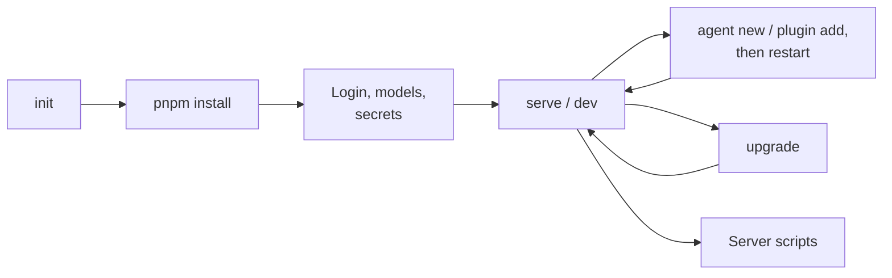
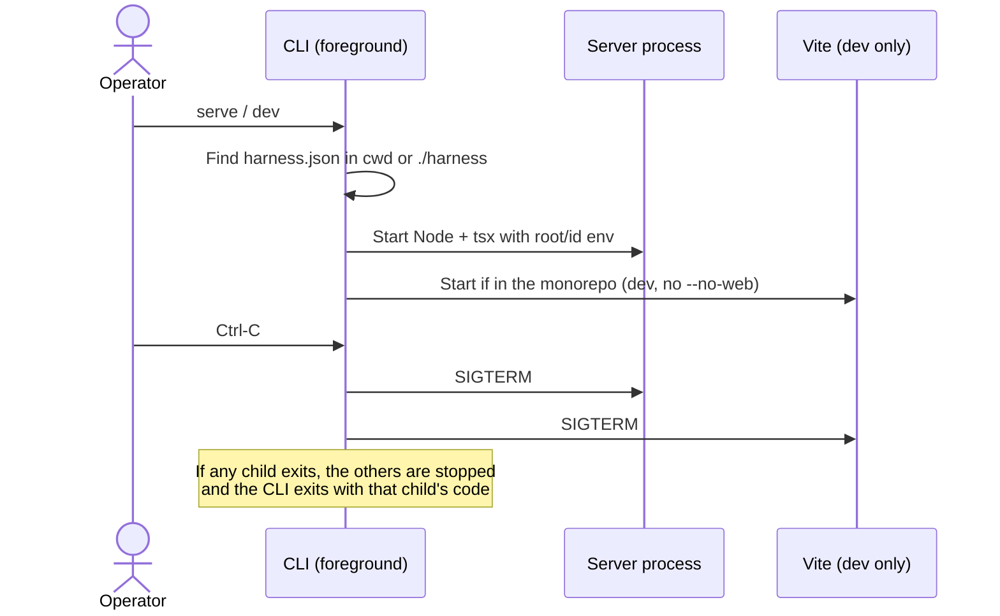

# CLI low-level design

**Status:** implemented. [High-level design](../high-level-design.md) · [Roadmap](../roadmap.md) · [FAQ](#faq)

## In one minute

The `cognisphere` command creates and runs a deployment. A deployment lives in an **app home**: a folder with the harness data, an optional product app, and server scripts.

- `init` creates the app home.
- `agent new` and `plugin add` copy templates into it.
- `serve` and `dev` start the server and keep it running in the foreground.
- `upgrade` moves you to a new package version.

The CLI only writes files and starts processes. It never calls the HTTP API, and it never touches the work queue.

## Who owns what

The **package** (`@cognisphere-sh/cognisphere-harness`) owns the server code, core plugins, templates, the prebuilt console and the shipped skills. You get new versions of these by upgrading.

The **deployment** (your app home) owns everything the CLI copied into it: agents, plugin forks, the product app, configuration and data. Upgrades never overwrite these; you migrate them yourself.

One exception: each plugin's `seed/` files are copied into agents again every time the plugin starts. If you edit those copies, the edits are lost. Edit the plugin source instead ([plugins](plugins.md)).

```text
<app-home>/
  package.json  pnpm-workspace.yaml  pnpm-lock.yaml  .gitignore
  .npmrc                  registry scope (no token)
  CLAUDE.md  AGENT.md     instructions for coding agents working in this home
  .claude/skills/  .agents/skills/   the shipped upgrade/plugin/skill-authoring skills
  config.example → config deployment settings (config is gitignored)
  harness/
    package.json          depends on the harness package
    harness.json          timezone and data version
    .secrets/             credentials and signing keys (gitignored)
    agents/               your agents (nova is created by init)
    plugins/              optional plugin forks
  app/                    optional product application
    auth-routes/  artifacts-routes/   route templates to copy into your app
  scripts/
    setup-server.sh  server.sh  build.sh
    aws/  contabo/        platform provisioning (each has config.example)
    lib/                  shared helpers
    app/                  your own hooks
  docs/
    base-harness/         shipped reference, including CHANGELOG.md
    harness/  app/        your deployment's own docs
```

## Lifecycle of an app home


```mermaid
flowchart LR
    Init[init] --> Install[pnpm install]
    Install --> Configure[Login, models,<br/>secrets]
    Configure --> Run[serve / dev]
    Run --> Extend[agent new / plugin add,<br/>then restart]
    Extend --> Run
    Run --> Upgrade[upgrade]
    Upgrade --> Run
    Run --> Deploy[Server scripts]
```

1. **Create.** `init my-app` does the following:
   - copies the templates;
   - writes `harness.json` (timezone and data version);
   - generates the console session key;
   - installs the three shipped skills;
   - creates the developer agent `nova`;
   - runs `git init`.

   It prints the `~/.npmrc` line you need, but it does not run `pnpm install`.
2. **Install.** Run `pnpm install` in the app home. Registry access is described under [Installation](#installation).
3. **Configure.** On first start the server asks for a console username and password in the terminal. In the console, add a model provider, enable a model, and fill in any required secrets. `init` does none of this.
4. **Run.** `cognisphere serve` for normal use, or `cognisphere dev` while changing harness code. See [process supervision](#process-supervision).
5. **Extend.** `agent new <name>` and `plugin add <id>` only write files. The server discovers new agents and plugin code at boot, so restart it afterwards. A forked plugin still has to be turned on for each agent.
6. **Upgrade.** Code and data are versioned separately. See [Upgrades](#upgrades).
7. **Deploy.** Use the shipped scripts to provision and run a server. See [Server deployment](#server-deployment).

**Example.** You want a support agent on Telegram:

1. `init support-desk --timezone Asia/Kolkata`, then `pnpm install`.
2. Start the server and enable an Anthropic model in the console.
3. `agent new support`, then restart the server.
4. Create `agents/support/plugins/telegram/config.json`, set the bot token in Secrets, and restart the agent.

Support now receives Telegram messages.

## Process supervision


```mermaid
sequenceDiagram
    actor Operator
    participant CLI as CLI (foreground)
    participant Backend as Server process
    participant Vite as Vite (dev only)
    Operator->>CLI: serve / dev
    CLI->>CLI: Find harness.json in cwd or ./harness
    CLI->>Backend: Start Node + tsx with root/id env
    CLI->>Vite: Start if in the monorepo (dev, no --no-web)
    Operator->>CLI: Ctrl-C
    CLI->>Backend: SIGTERM
    CLI->>Vite: SIGTERM
    Note over CLI: If any child exits, the others are stopped<br/>and the CLI exits with that child's code
```

- **Finding the home.** The CLI looks for `harness.json` in the current folder, then in `./harness/`. It never searches parent folders.
- **`serve`** starts the server once. The server hosts the prebuilt console unless you pass `--headless`.
- **`dev`** runs the server under Node's `--watch`, so it restarts when code changes. It also starts Vite if the monorepo web package exists. `--no-web` skips Vite. `--headless` skips Vite and also turns off the server's console.
- **Stopping.** Ctrl-C (SIGINT or SIGTERM) is forwarded to every child as SIGTERM. If one child dies, the CLI stops the rest and exits. The CLI does not run as a daemon; on a server, systemd does that (see below).

## CLI

Run commands from the app home or its `harness/` folder.

| Command | What it does |
|---|---|
| `init <name> [-t\|--timezone <tz>] [--root <dir>]` | Create an app home in `--root` (default: current folder) with `nova`. Timezone defaults to `UTC`. Refuses a folder that isn't empty. |
| `agent new <name> [--dev]` | Copy the agent template and write a starter `agent.json`. Names must match `^[a-z0-9][a-z0-9._-]*$`, ignoring letter case. `--dev` is only allowed with the name `nova`. |
| `plugin add <id>` | Copy a packaged plugin into `harness/plugins/<id>/`. Refuses core plugins (`admin`, `scheduler`, `agent-messaging`) and existing folders. |
| `dev [-p\|--port <n>] [--web-port <n>] [--no-web] [--headless]` | Watched server (port: `--port`, else `$PORT`, else 3142) plus Vite (default 7330). |
| `serve [-p\|--port <n>] [--headless]` | Start the server. |
| `upgrade` | Show the changelog between your data version and the installed code. |
| `upgrade --to <version>` | Change the package version in `harness/package.json`. Takes priority if `--set-version` is also given. |
| `upgrade --set-version <version>` | Record in `harness.json` that data migration to this version is done. |

**Starter `agent.json`** written by `agent new`: model `anthropic` / `claude-sonnet-4-6`, thread strategy `single`, and `devAgent: true` for nova. Ordinary agents get the base template plus the `create-skill` skill; nova gets all three shipped skills.

When developing the harness itself, use `pnpm dev` and `pnpm dev:web` from the repo root instead. Server environment variables are listed in [core configuration](core.md#server-configuration-and-operations).

## Installation

The package is on GitHub Packages. Put the scope line in the project `.npmrc` and the token line in your own `~/.npmrc`. Read the token from an environment variable, and never commit it.

```ini
@cognisphere-sh:registry=https://npm.pkg.github.com
//npm.pkg.github.com/:_authToken=${COGNISPHERE_NPM_TOKEN}
```

With `COGNISPHERE_NPM_TOKEN` set in your shell:

```bash
npx @cognisphere-sh/cognisphere-harness init my-app
cd my-app
pnpm install
cd harness
pnpm exec cognisphere serve
```

Open `http://127.0.0.1:3142`. When an agent starts, it may run its bootstrap script to install Pi and tool dependencies. Bootstrap failures are only logged, so check the logs if a tool is missing.

## Packaging

`packages/harness` publishes TypeScript source, which is run with `tsx`. Its `prepack` step:

1. builds the console into `dist-web/`;
2. copies the root changelog and MIT license;
3. bundles the three shipped skills.

If the web build or a skill is missing, `prepack` aborts. Before publishing:

```bash
pnpm check
cd packages/harness
npm pack --dry-run --json
```

In the file list, make sure the runtime source, templates, `dist-web`, skills, changelog and license are all present. `prepack` does not publish; publishing is a separate step.

## Server deployment

The scripts target Ubuntu with systemd and nginx. Copy each `config.example` to `config` (gitignored) and fill it in first.

| Script | What it does |
|---|---|
| `scripts/aws/setup.sh` | Create AWS infrastructure, then run the remote bootstrap. |
| `scripts/contabo/setup.sh` | Create a Contabo server, then run the remote bootstrap. **The first run can place a paid order.** |
| `scripts/lib/remote-bootstrap.sh` | Shared remote setup used by both platform scripts. |
| `scripts/setup-server.sh` | Prepare the host: apt packages, the GitHub token line in `~/.npmrc`, console credentials (via `server.sh secrets`), each agent's `bootstrap.sh`, systemd units, nginx, certbot TLS, and a backup cron at `/etc/cron.d/<name>-backup`. |
| `scripts/build.sh` | `pnpm install --frozen-lockfile`, then build `app/` if present. The console needs no build, because it ships prebuilt in the package. |
| `scripts/server.sh` | Day-to-day control (subcommands below). |
| `scripts/aws/backup.sh` | Backup helper; supports S3-compatible storage. |

`server.sh` subcommands:

| Subcommand | Effect |
|---|---|
| `start [app\|harness]`, `restart [app\|harness]` | Run `secrets` (below), run the full build, then start or restart the named unit (both if none is named). |
| `stop`, `status`, `logs` | Usual service controls. |
| `build` | Build only. |
| `secrets` | **Rewrite** `harness/.secrets/users.json` from `config` (one user; a blank password is generated once and then reused), and generate the app-to-harness bearer secret, and (when `app/` exists) the app's environment and its own session-signing secret. |
| `harness` | Run `serve --port $HARNESS_PORT` in the foreground. |
| `dev` | Run in development mode. |

```bash
sudo ./scripts/server.sh status
sudo ./scripts/server.sh logs
sudo ./scripts/server.sh restart          # both units
sudo ./scripts/server.sh restart app      # still rebuilds; only bounces the app
```

The product app is optional. The harness runs alone until `app/package.json` exists. An app must provide build and start commands, respect `PORT`, and reach the harness through its configured backend URL. It signs in its own users and then calls the harness from its backend using the bearer secret.

If `ARTIFACTS_AGENT` is set, `server.sh` creates `agents/<that agent>/plugins/artifacts/config.json` and shares an artifact secret between the app and the plugin.

Put your own customization in `scripts/app/` (for example `secrets.sh` and `server.sh` hooks). Shared scripts source these files, so upgrades don't overwrite your changes. See the [hook contract](../../packages/harness/home-template/scripts/app/README.md).

Renaming a deployment is not automatic. Remove the old systemd units, nginx config and `/etc/cron.d/<old-name>-backup` by hand.

## Upgrades

The **code version** is the package version in `harness/package.json`. The **data version** is `harness.json.version`: the release your agents, prompts and config were last migrated to. They are kept separate so that installing new code never pretends your data was migrated.

1. `cognisphere upgrade --to <version>` installs the new code.
2. `cognisphere upgrade` shows the changelog between your data version and the new code.
3. Migrate your prompts, plugin forks, config and data. The shipped upgrade skill guides this.
4. Check that everything works, then run `cognisphere upgrade --set-version <version>`.

`--set-version` only records that migration is done; it doesn't migrate anything. Back up runtime data before step 3. The upgrade workflow refreshes `docs/base-harness/` and shared templates; your agents and app need deliberate changes.

## Design decisions

| Decision | Why | Cost |
|---|---|---|
| Runtime code stays in the package | Upgrades replace code predictably. | Copied agents and data need their own migration. |
| Scaffolding by writing files | The app home is easy to inspect and keep in git. | New agents and plugins need a server restart. |
| Separate code and data versions | Installing code doesn't claim the data is migrated. | You have to migrate and validate before stamping. |
| Foreground supervisor | One command runs the server and dev UI together. | Production needs systemd (provided by the scripts). |

## When things fail

Commands stop on:

- a missing app home;
- an invalid name or option;
- a missing template;
- an existing target.

Scaffolding is a series of file writes, not a transaction. After a failure, look at what was written before rerunning, rather than deleting the folder blindly.

## Planned changes

Approved runtime provisioning and migration are covered by [plan 1.2](../plans/02-workspace-and-provisioning.md) and [plan 1.7](../plans/07-protection-and-cutover.md). The Process/Docker layout and SDK host are in the [SDK runtime plan](../plans/01-sdk-runtime.md). No sandbox CLI flags exist today.

## Known issues and suggested improvements

Found in a code audit on 2026-09-28. **Severity** is how much it can hurt: *High* = lost work, security exposure or a wrong result; *Medium* = confusing or wasteful behavior; *Low* = cleanup. None of these is fixed yet. When one is fixed or scheduled, update this table and the [roadmap](../roadmap.md).

| # | Type | Severity | Problem | Why it matters | Suggested change |
|---|---|---|---|---|---|
| 1 | Cleanup | Low | The `agent new` next-steps hint says `plugin add <id>` adds a catalog plugin. | Users think the plugin is now active for the agent. | Explain creating `agents/<name>/plugins/<id>/config.json` instead. |
| 2 | Risk | Medium | `server.sh restart app` still regenerates secrets and runs the full build. | Slow app-only deploys. | Let the target also choose what to build. |
| 3 | Risk | Medium | Scaffolding isn't transactional. | A failed `init` or `agent new` leaves a half-written folder that blocks a rerun. | Write to a temp folder and rename at the end. |
| 4 | Risk | Low | Renaming a deployment leaves old systemd units and nginx config behind. | Two sets of services, or port clashes. | Add a `server.sh retire` step that removes the old name's units and config. |
| 5 | Risk | Low | Upgrading relies on the operator to migrate and then stamp `--set-version`. | Easy to stamp without migrating, or to forget stamping. | Have `upgrade` check that the migration steps it lists were completed before allowing the stamp. |
| 6 | Risk | High | `setup-server.sh` doesn't raise nginx's `client_max_body_size`, so nginx's 1 MB default applies. | Console uploads larger than 1 MB fail with 413 on a deployed server (they work locally). | Set `client_max_body_size` in the generated nginx config (and make it a `config` value). |
| 7 | Risk | High | The shipped backup doesn't include Pi's sign-in tokens (`~/.pi/agent`), and there is no restore command: you unzip and rename each `*.db.snap` back to `*.db`. | A restore silently loses subscription logins, and the manual steps are easy to get wrong. | Include `~/.pi/agent` (or `PI_CODING_AGENT_DIR`) in backups and add a `server.sh restore` command. |
| 8 | Risk | Medium | Every `start`, `restart` and `secrets` rewrites `users.json` from `config`, keeping one user. | Users or passwords changed any other way are lost on the next restart. | Only write `users.json` when it's missing or `config` changed, or document `config` as the only place to manage logins. |
| 9 | Risk | Medium | Deployments that run as the same OS user share `~/.pi/agent`. | They share subscription logins and overwrite each other's model overrides. | Set `PI_CODING_AGENT_DIR` per deployment in the systemd unit. |

## FAQ

### Operators

#### How do I set up a production server?

1. Point DNS A records for `CONSOLE_DOMAIN` (and `DOMAIN`, if you have an app) at the machine. Certbot needs them.
2. Put the app home on the machine, then `cp config.example config` and fill it in.
3. Run `sudo ./scripts/setup-server.sh` on Ubuntu. It installs everything, creates the services, nginx and HTTPS, and prints the console login.

To create the machine too, run `scripts/aws/setup.sh` or `scripts/contabo/setup.sh` from your laptop first ([server deployment](#server-deployment)).

#### Installation can't reach GitHub Packages.

Check three things:

- the project `.npmrc` has the scope line;
- your `~/.npmrc` has the token line;
- `COGNISPHERE_NPM_TOKEN` is set for the shell or service user doing the install.

The token needs the `read:packages` scope. On a server, `setup-server.sh` uses `COGNISPHERE_NPM_TOKEN` from `config`, or else the run user's `gh` login.

#### "Not a harness directory". What now?

The CLI found no `harness.json` in the current folder or in `./harness`. `cd` into the app home or its `harness/` folder. It doesn't search parent folders.

#### Which port does it use, and how do I put it behind HTTPS or my own proxy?

The server listens on `127.0.0.1:3142`. Change the port with `--port` or `PORT`. The harness itself only speaks plain HTTP. The shipped nginx setup forwards `CONSOLE_DOMAIN` to `HARNESS_PORT` and `DOMAIN` to `APP_PORT`, and certbot adds HTTPS. With your own proxy, forward everything, including `/webhook/*`, to `127.0.0.1:<HARNESS_PORT>`. Setting `BIND_HOST=0.0.0.0` exposes the server directly, with no TLS; avoid it.

#### How do I run it as a service?

`cognisphere serve` runs in the foreground only. `setup-server.sh` creates systemd units named `<APP_NAME>-harness` and `<APP_NAME>-app`, which start at boot and restart on failure. Control them with `sudo ./scripts/server.sh start|stop|restart|status`. Anywhere else, use your own supervisor to run `pnpm exec cognisphere serve --port <n>` from `harness/`. A service has no terminal for the first-login prompt, so create the login first with `server.sh secrets`.

#### Where are the logs?

`sudo ./scripts/server.sh logs` follows both services through `journalctl`. Logs are JSON lines; pipe them through `npx pino-pretty` to read them more easily, and set `LOG_LEVEL=debug` for more detail. When you run the CLI by hand, logs go to the terminal. Backup runs log to `logs/backup.log`.

#### How do backups work, and how do I restore one?

Set `BACKUP_S3_BUCKET` (plus the endpoint and keys for non-AWS storage) in `config` and rerun `setup-server.sh`. That adds a cron job running `scripts/aws/backup.sh`, which zips the whole app home except `node_modules`, `.next` and `.venv`, and takes a consistent copy of each SQLite database. There is no restore command:

1. Unzip the backup in place of the app home.
2. Rename each `*.db.snap` back to `*.db`.
3. Run `./scripts/build.sh`, then `sudo ./scripts/server.sh restart`.

Pi's subscription sign-ins live in the run user's `~/.pi/agent`, which isn't backed up; sign in again or copy that folder. Without an S3 bucket there are no automatic backups ([what a backup must include](core.md#server-configuration-and-operations)).

#### How do I upgrade?

Follow [Upgrades](#upgrades), ideally with the shipped `cognisphere-upgrade` skill. Do it in your working copy and commit both `harness/package.json` and `pnpm-lock.yaml`, because the server build installs with `--frozen-lockfile`. Then deploy with `git pull && sudo ./scripts/server.sh restart`.

#### How do I move to a new server?

There is no migration command. Restore a backup (or copy the app home, including `.secrets`, sessions and databases, while the old server is stopped) onto the new machine. Point DNS at it and run `setup-server.sh`. Stop the old services first, or both copies will answer the same Telegram bot or mailbox. Copy `~/.pi/agent` too, or sign in to model subscriptions again.

#### How do I rename or remove a deployment?

Neither is automated ([known issue 4](#known-issues-and-suggested-improvements)). To rename, change `APP_NAME`, rerun `setup-server.sh`, then remove the pieces left under the old name. To remove a deployment, remove the pieces under its name:

- `systemctl disable --now <name>-harness <name>-app`, then delete their unit files in `/etc/systemd/system/` and run `systemctl daemon-reload`;
- `/etc/nginx/sites-available/<name>` and `/etc/nginx/sites-enabled/<name>`, then reload nginx;
- `/etc/cron.d/<name>-backup`.

To uninstall completely, also delete the certificate with `certbot delete` and delete the app home. Old S3 backups stay under the old name and are never pruned.

#### Can I run several deployments on one machine?

Yes. Give each one its own `APP_NAME`, `HARNESS_PORT`, `APP_PORT` and domains; each gets its own services, nginx site and backup job. Deployments running as the same OS user share `~/.pi/agent`, so they share subscription sign-ins and overwrite each other's model overrides. Use a different `RUN_USER` for each deployment to keep them apart. Locally, give each `cognisphere serve` its own `--port`.

#### Which environment variables can I set?

See [server configuration](core.md#server-configuration-and-operations). The CLI sets some itself: `COGNISPHERE_ROOT_DIR` and `COGNISPHERE_ID` come from the harness folder, `PORT` from `--port`, and `COGNISPHERE_HEADLESS` from `--headless`. The server also reads a `.env` file in the folder it was started from (`harness/` under systemd). The deployment `config` file is read only by the scripts, never by the server.

#### I ran `plugin add telegram`. Why doesn't my agent have Telegram?

`plugin add` only copies the plugin code into `harness/plugins/telegram/`, where it replaces the packaged version. You don't need it to use the packaged plugin. To turn Telegram on for an agent:

1. Create `agents/<agent>/plugins/telegram/config.json`.
2. Set the plugin's secrets in the console.
3. Restart the agent.

After `plugin add` or `agent new`, restart the server, because it looks for plugin code and agents only at boot.

#### Why is `nova` reserved?

`nova` is the developer agent that helps manage the deployment, and it gets all the shipped skills. The name is refused for ordinary agents, in any letter case. `agent new nova --dev` recreates nova if you deleted it.

### Contributors

#### How do I work on the harness locally?

Run `pnpm install` in the repository, then `pnpm dev` and `pnpm dev:web`, and open `http://127.0.0.1:7330`. `pnpm dev` keeps its data in `~/.cognisphere/default` unless `COGNISPHERE_ROOT_DIR` and `COGNISPHERE_ID` say otherwise. To use a real app home instead, run `node <repo>/packages/harness/bin/cognisphere.mjs dev` from it. That runs your checkout's code, with Vite, against the app home's data. `--no-web` skips Vite; `--headless` also stops the server from hosting the console. Run `pnpm check` before you finish.

#### How do I test a local package build in an app home?

1. `cd packages/harness && pnpm pack`. This runs `prepack` and leaves a `.tgz` in that folder.
2. In the app home, run `pnpm add <absolute path to the .tgz> --dir harness`, then start the server.
3. Undo the changes to `harness/package.json` and `pnpm-lock.yaml` before committing.

Packing also leaves `dist-web/` in `packages/harness`, and your checkout's server then serves that copy of the console instead of `packages/web/dist`. Delete it when you're done.

#### How do I publish a release?

Not from your laptop. Bump the version, write the changelog section and run the preflight; publishing a GitHub Release then makes CI publish the package. The [publish-harness skill](../../.claude/skills/publish-harness/SKILL.md) walks through each step, and [Packaging](#packaging) lists what the package must contain.
