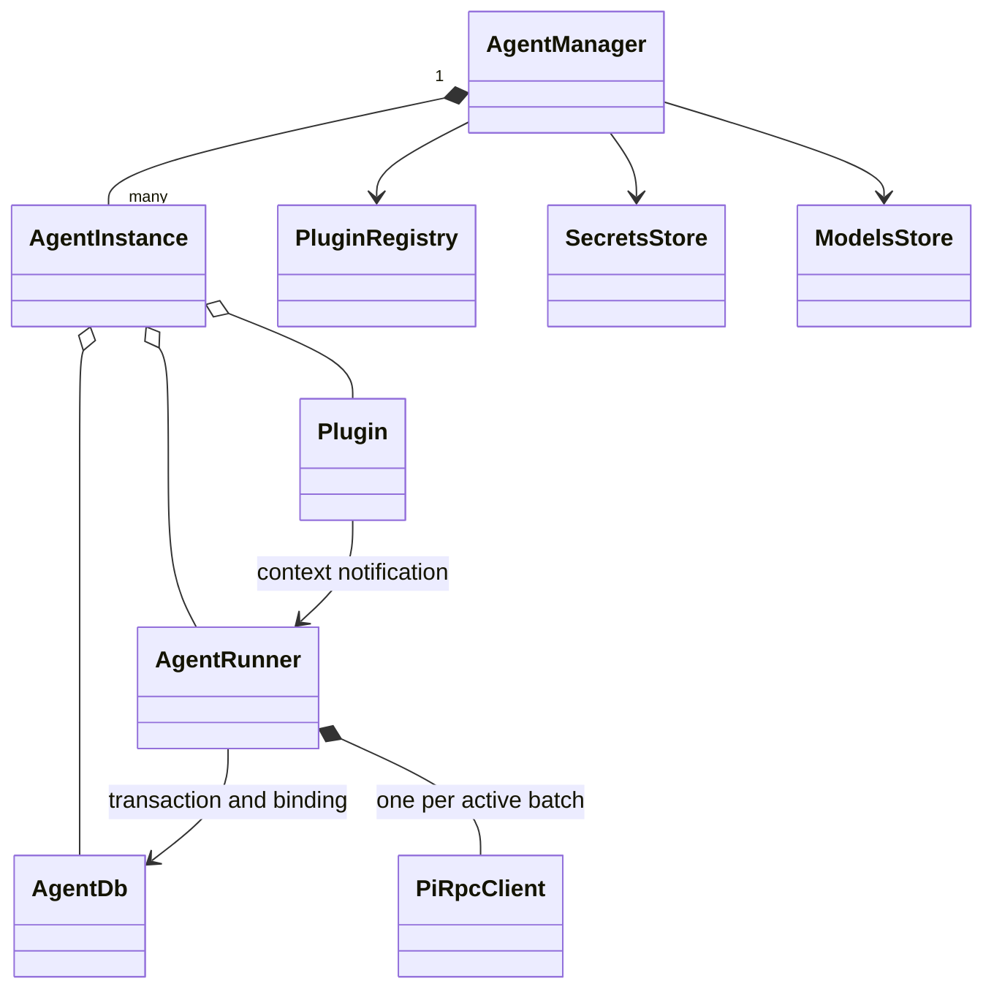
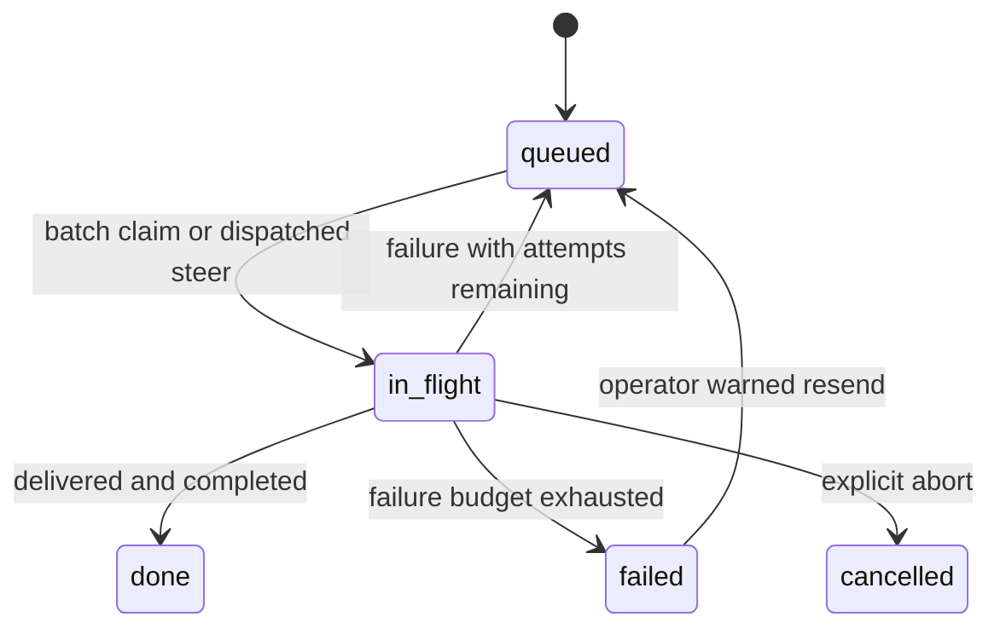
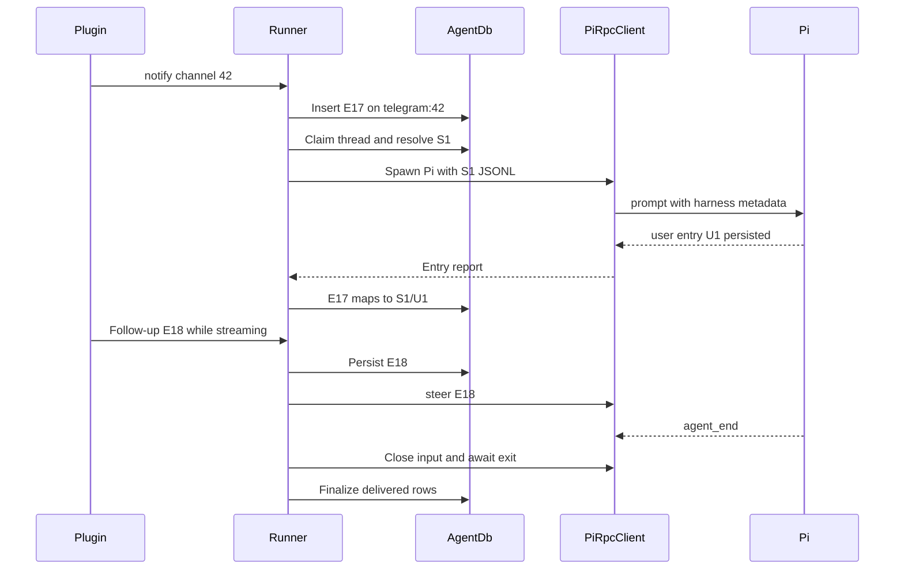

# Core low-level design

**Status:** implemented local-process architecture. [High-level design](../high-level-design.md) · [Roadmap](../roadmap.md). Future runtime interfaces belong to [plan 1.1](../plans/01-sdk-runtime.md). [FAQ](#faq).

## Responsibility and dependencies

Core owns agent/plugin lifecycle, queue state, routing, execution attempts, and model/credential resolution. It consumes [agent assets](agents.md), constructs [plugins](plugins.md), and exposes objects to [API](api.md). It does not render the console or implement Pi's model loop.

Source links below point to the actual implementation:

| Component | Contract and state |
|---|---|
| [main.ts](../../packages/harness/src/core/main.ts) | Composition root: registry scan, manager boot, auth/API/static mounts, janitor, signal shutdown. |
| [AgentManager](../../packages/harness/src/core/agent-manager.ts) | Owns `AgentInstance` records, open DB handles, plugin instances, runner replacement, transition guards, pending settings swaps. |
| [AgentRunner](../../packages/harness/src/core/runner.ts) | Worker pool, active-thread map, notification routing, prompt construction, steer/abort, attempt finalization. |
| [AgentDb](../../packages/harness/src/core/queue.ts) | SQLite transactions for events and canonical thread bindings. |
| [PiRpcClient](../../packages/harness/src/core/rpc.ts) | One child connection: UTF-8 JSON-line framing, request acknowledgment, delivery observations, exit/signals. |
| [PluginRegistry](../../packages/harness/src/core/plugin-registry.ts) | Packaged/user definitions and constructors; manager owns instances. |
| [SecretsStore](../../packages/harness/src/core/secrets.ts) | Cached per-agent secret buckets and collision detection. |
| [ModelsStore](../../packages/harness/src/core/models-store.ts), [catalog](../../packages/harness/src/core/models-catalog.ts) | Provider credentials, enabled models, overrides, credential-to-environment mapping. |
| [OAuthLoginManager](../../packages/harness/src/core/oauth-logins.ts), [model sync](../../packages/harness/src/core/pi-models-sync.ts) | Provider login interactions and Pi-owned OAuth/runtime model state. |
| [types.ts](../../packages/harness/src/core/types.ts), [config.ts](../../packages/harness/src/core/config.ts), [logger.ts](../../packages/harness/src/core/logger.ts) | Shared contracts, deployment path/settings resolution, scoped Pino logging. |

## Agent lifecycle

Boot scans agent directories sequentially. Starting an agent reads `agent.json`, resolves/validates model and environment inputs, opens its database, runs bootstrap, prepares plugin instances, and starts the runner. The [agents design](agents.md#configuration-and-credentials) owns field-level configuration. Bootstrap failures are logged and tolerated. Invalid agent configuration produces a visible `failed` instance; a failed plugin can coexist with a running runner and other plugins.

| Operation | Behavior |
|---|---|
| `manualStart`, `manualStop`, `restartAgent` | Guard against overlapping lifecycle transitions; stop producers and active execution as appropriate. Missing/conflicting operations use `LifecycleError`. |
| `reloadAgent` | Mark settings stale, pause new dequeues, and swap runner/plugins after active batches drain. Eligible input may still steer an active batch. |
| `reloadPlugin` | Stop/recreate only the selected plugin; stop has a five-second timeout. |
| Thread model update | Store override in SQLite; take effect on the next spawn. |
| `deleteThread` | Refuse active threads; delete queue rows, binding, and session directory. |
| Server shutdown | Stop agents/runners and close database handles. |

Stopping an agent does not persist a disabled flag; a later server boot attempts startup again. A new agent directory needs a server restart for discovery. Generic file writes do not invoke settings reloads. Direct secret-file edits require fresh stores (normally server restart); the secrets API invalidates the cache and reloads affected agents.

## Queue and recovery

The database is `agents/<id>/sessions/.events.db`, with WAL enabled and additive migrations. Legacy `.queue.db` is not the active queue. It contains:

| Table | Important fields / invariant |
|---|---|
| `events` | `id`, timestamps, source/channel/thread, text/metadata, priority, silent/steering flags, status, failed-attempt count, error, Pi session/entry IDs. One mutable row per notification. |
| `threads` | Thread key, canonical session ID, optional provider/model/thinking override. Stable conversation selection across child restarts. |

`notify()` first inserts a queued event. `peekHighestPriorityThread()` excludes active threads, selects by highest non-silent priority then oldest qualifying ID, and ignores threads containing only silent rows. `dequeueBatch()` claims the chosen thread transactionally and includes silent rows. A continuation retry is claimed separately from new/resend inputs; eligible remaining work can enter as steers.

Defaults are one worker slot and three failed attempts. A slot cannot overlap another batch on the same thread. More slots permit different threads to run concurrently today, without a workspace writer lock or fleet-wide capacity limit.

Delivery observations map initial prompt groups and subsequent steers to persisted user-entry IDs. Multiple batched events can share one entry. `setRowEntryId()` updates the latest entry binding while preserving an existing session ID with `COALESCE`. On failure:

- A row with a Pi entry ID uses a continuation nudge because its original text is already in history.
- An undelivered row resends original text with `Retry: true` after its first failure.
- Manual failed-row requeue preserves row/session identity, clears the entry link/error, and sets attempts to 1 for one warned resend.
- Startup sweeps `in_flight` rows as failed attempts. This is current local recovery; future providers must reconcile live compute before requeueing.

Retries cannot undo external side effects. Neither queued inputs nor external actions have a global exactly-once guarantee.

## Execution and example

Routing precedence is explicit `threadIdOverride`, then strategy: `single → default`, `plugin → telegram`, or `plugin_channel → telegram:42`. An input for an active streaming thread steers unless `doNotSteer` is true; arrival during spawn is drained after prompt acknowledgment. Silent and no-steer are independent flags.

Example: E17 asks for a report; E18 adds “include last week.” Both can finish in one child. If E18 never reaches a persisted user entry, E17 can become `done` while E18 retries. If the operator aborts, tracked batch inputs become cancelled; unrelated queued work remains.

`spawnPi()` uses cwd=`agentDir`, explicit session/prompt paths, selected model, fixed tools, and explicit skill/extension loading. It inherits `process.env`, overlays resolved credentials/config, adds agent/thread/callback variables, and activates `.venv` when present. This is trusted host execution. [Agents](agents.md#runtime-capabilities) describes the loaded capabilities.

RPC prompt acknowledgment has a 60-second deadline, paused during reported preflight compaction. There is no general streaming deadline. The runner classifies the final assistant message in `agent_end` (`stopReason: stop` means success), closes stdin, waits for actual exit, escalates after five seconds, and sweeps the process group. This cleanup is not an OS sandbox guarantee. Undelivered inputs are retried even when the main answer succeeded.

## Server configuration and operations

`config.ts` attempts `.env` loading from cwd; `<harnessRoot>` is `<COGNISPHERE_ROOT_DIR>/<COGNISPHERE_ID>`.

| Setting | Default | Purpose |
|---|---|---|
| `COGNISPHERE_ROOT_DIR` | `~/.cognisphere` | Parent of deployment roots. |
| `COGNISPHERE_ID` | `default` | Deployment directory. |
| `PORT`, `BIND_HOST` | `3142`, `127.0.0.1` | HTTP listener. |
| `SERVER_BASE_URL` | `http://<bindHost>:<port>` | Plugin/script callback origin. |
| `COGNISPHERE_HEADLESS` | false | Suppress static console. |
| `LOG_LEVEL` | `info` | Log verbosity. |
| `harness.json.timezone` | `UTC` | Scheduling and metadata timestamps. |
| `harness.json.version` | empty if absent | Deployment data version. |
| `COGNISPHERE_WEBHOOK_SECRET` | Generated each boot if absent | Shared insider secret for participating webhook handlers. |

Use logs for lifecycle/process failures, event rows for input state, and JSONL for model/tool history. `/healthz` is liveness plus listed-agent count, not a dependency or agent-readiness probe. The temp janitor removes known debris older than 24 hours at boot and every six hours; there is no automatic durable-history retention policy.

A consistent backup includes SQLite and live WAL state, JSONL, agent/plugin files, `.secrets`, and any required Pi runtime credentials. Do not copy an active database file alone and call it a complete backup.

## Design choices and change seams

| Choice | Benefit | Tradeoff |
|---|---|---|
| One manager, per-agent runners/DBs | Small shared control path with agent-local history. | Server/plugin failures can affect the shared process. |
| Durable inputs, ephemeral Pi children | Work/history survives normal process turnover. | Spawn overhead; recovery depends on delivery evidence. |
| Soft settings swap | Active work can drain under its original configuration. | Settings may be persisted before the new runtime is active. |
| Separate queue and Pi history | Avoid duplicating Pi's conversation model. | Correlation must survive partial delivery and retries. |

[Plans 1.1–1.3](../roadmap.md#1-sandbox-implementation) replace compute ownership, add serialized workspace turns, and introduce archive receipts. [Plan 1.4](../plans/04-ingress-and-operations.md) separates durable ingress from live runners. Update this document only as those changes become implemented.

## FAQ

These answers describe the current runner. They focus on operator troubleshooting and contributor questions; the future SDK/provider behavior is covered in its plans.

### Which server settings choose my data directory, network address, and logging?

`COGNISPHERE_ROOT_DIR` plus `COGNISPHERE_ID` select the deployment's persistent root; changing them can select a different set of agents and data. `PORT` and `BIND_HOST` choose the listener, while `SERVER_BASE_URL` is the reachable origin advertised to plugin/agent callbacks, so check it after a port or proxy change. `COGNISPHERE_HEADLESS` suppresses the console and `LOG_LEVEL` controls logs; neither changes retry policy. See the [configuration table](#server-configuration-and-operations) for defaults and harness timezone/version fields.

### How does automatic retry work, and what does `maxAttempts` count?

A failed harness attempt increments the affected event row's `attempts`. With the default `maxAttempts: 3`, failures one and two requeue it; failure three leaves it `failed`. A saved Pi entry ID selects a continuation nudge, while an input without delivery evidence is resent with `Retry: true`. This counts failed harness attempts, not individual provider API calls or every internal Pi retry.

### Is there a delay between retries? Could an action happen twice?

The runner has no general exponential-backoff policy for queued batch retries; eligible work can be selected again once the previous batch is finalized. Provider/plugin retry behavior is separate. A previous attempt may already have sent a message or changed a file, so retry metadata is a warning to reconcile prior effects, not an exactly-once guarantee.

### How do I retry a failed event manually?

Use the event controls or `POST /api/agents/:id/events/:rowId/requeue`. The operation keeps the row/session identity, clears its error and entry link, and sets `attempts` to 1 so the original text is resent with a retry warning. Inspect the prior session and any external result first; the manual action does not undo completed side effects.

### My message is still queued. What should I check?

Check agent state, free slots, whether its thread is already active, and whether a settings reload paused new dequeues. Then inspect `isSilent`, `doNotSteer`, priority, and errors in the Events view. A thread containing only silent inputs does not start on its own; a non-silent input routed to that same thread can wake it.

### What do `isSilent`, `doNotSteer`, and `priority` change?

| Parameter | Current effect |
|---|---|
| `isSilent: true` | Does not wake an idle thread by itself; can accompany non-silent work and can still steer an active thread. |
| `doNotSteer: true` | Waits for a fresh batch instead of entering a live run; it does not make the input silent. |
| `priority` | Defaults to 0; higher non-silent priority wins selection among runnable threads, with oldest qualifying input breaking ties. It does not preempt a running batch. |

For a background fact that should neither start nor interrupt work, a plugin can set both boolean flags. The admin send endpoint does not expose those flags.

### What do `maxConcurrentSlots` and thread routing mean for throughput?

Slots bound active batches per agent, while each thread is serialized regardless of the slot count. `single` routes ordinary input to `default`; `plugin` groups by source; `plugin_channel` separates source channels. An explicit thread override wins. More slots help only when different threads have work, and they do not make today's shared filesystem conflict-safe.

### Why did a follow-up from a different plugin enter the same active run?

Steering checks the resolved thread, not equality of source plugin/channel. If routing or overrides place both inputs on the same streaming thread, the follow-up can steer unless it sets `doNotSteer`. Use distinct thread keys when the conversations must remain separate.

### What is the difference between aborting, stopping, and reloading?

Abort marks tracked inputs in the selected active batch cancelled without automatic retry. Agent stop/server shutdown interrupts other active batches as retryable failures when budget remains and stops producers; unrelated queued rows remain. Settings reload pauses new batches and drains active work before replacing runtime objects. Stopping does not persist a disabled flag across server boot.

### What happens after a crash while a row is `in_flight`?

Current runner startup sweeps it as a failed attempt, preserving delivery evidence for continue-versus-resend selection. This recovers queue state, but is not a provider-aware orphan-containment guarantee. The planned runtime must inspect and stop/reconcile surviving compute before another writer starts; see [archive recovery](../plans/03-session-archives.md).

### Why did a settings save succeed while work still uses the old settings?

`reloadAgent()` can defer the swap until active batches drain. Eligible follow-ups can still steer during that period, so saving settings is not immediate activation. A per-thread model change also applies on the next batch. Inspect agent/plugin state after the handoff; use the dedicated settings APIs rather than assuming a generic file write triggers reload.

### Is there a timeout for a hung model run?

There is a 60-second initial prompt-acknowledgment deadline, paused during reported preflight compaction, and teardown escalation after five seconds. There is no general maximum streaming-run duration. Inspect the child/logs and use explicit abort/stop when appropriate; the acknowledgment timeout is not a total task deadline.

### Why can `/healthz` be healthy while an agent cannot work?

It reports server liveness and the number of loaded agent records, including failed/stopped agents. Inspect the agent's error, plugin states, model configuration, dependency/bootstrap logs, and event failures for readiness. A healthy HTTP listener does not validate each integration or model provider.

### What must I back up, and does clearing an event erase the conversation?

Back up consistent SQLite/WAL state, JSONL, agent/plugin files, credentials, and relevant Pi runtime state. Deleting an individual event row removes queue evidence but does not erase the separate transcript. Deleting a thread through the manager/API removes its events, canonical binding, and session files, and is refused while that thread is active.
