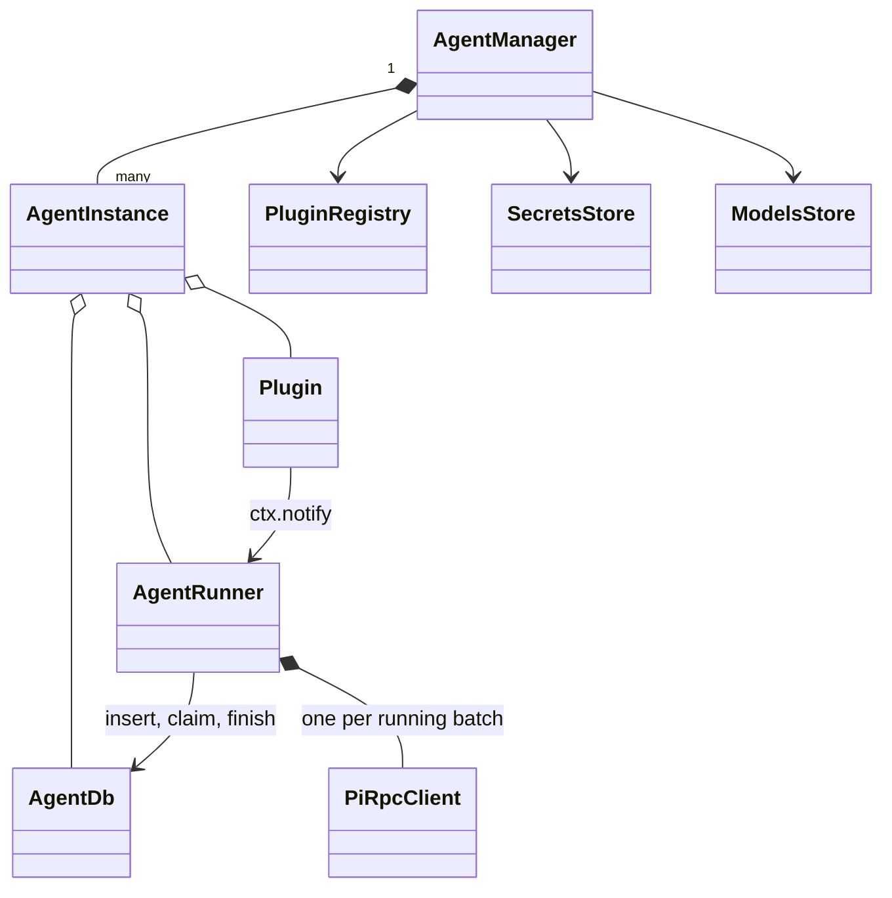
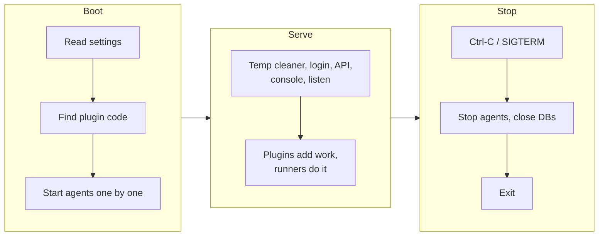
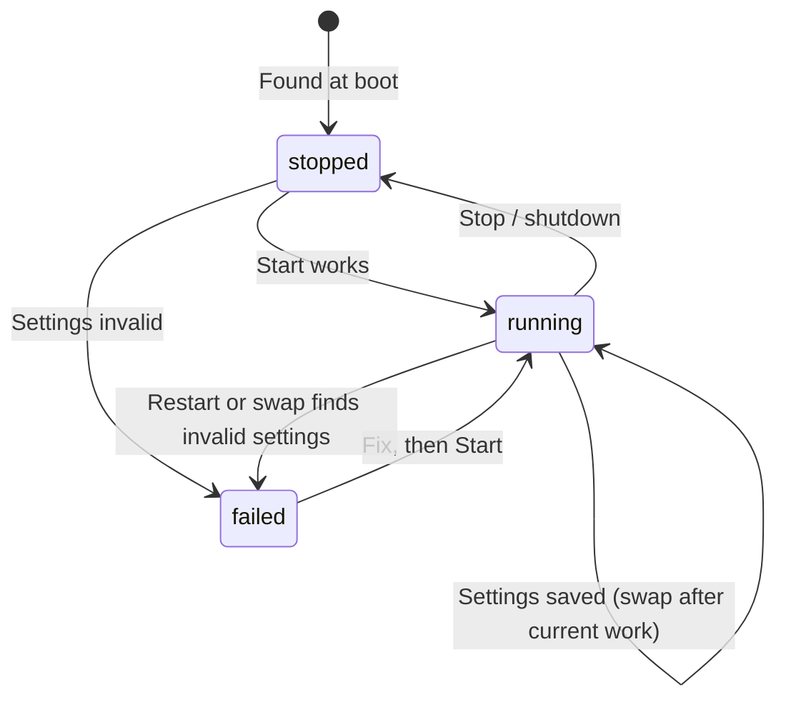
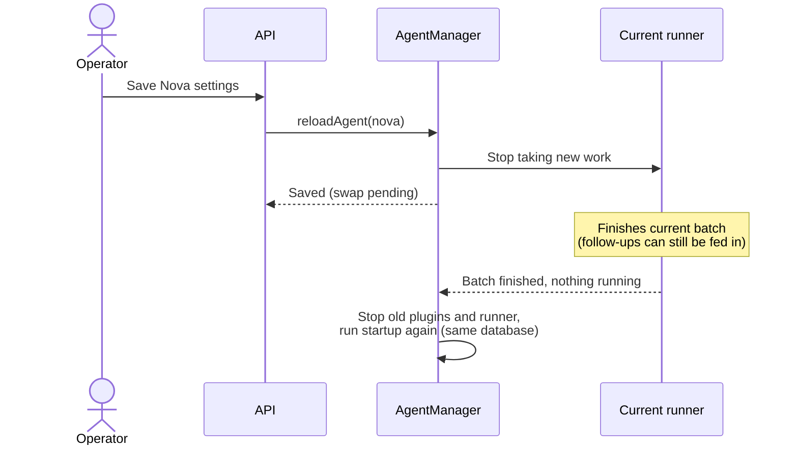
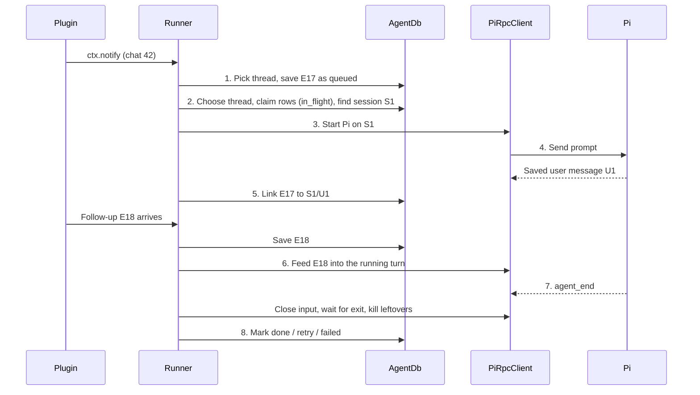
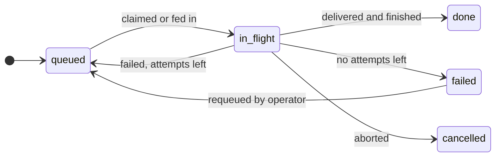

# Core low-level design

**Status:** implemented (local processes). [High-level design](../high-level-design.md) · [Roadmap](../roadmap.md) · [FAQ](#faq). Future runtime interfaces are in [plan 1.1](../plans/01-sdk-runtime.md).

## In one minute

Core is the part of the server that makes agents work. It does four things:

1. **Manages agents.** It starts, stops and reloads each agent and that agent's plugins.
2. **Queues work.** Every input (a Telegram message, a console chat, a scheduled job) becomes a row in the agent's SQLite database.
3. **Runs work.** It picks queued rows, starts a Pi process to handle them, and passes follow-up messages into that process while it runs.
4. **Records outcomes.** It marks each row done, retries it, or marks it failed.

Pi, not core, runs the model and tools and writes the conversation history.

Suggested reading order:

1. [the pieces](#responsibility-and-dependencies);
2. [how long each thing lives](#lifecycle-map);
3. the three lifecycles: [harness](#harness-lifecycle), [agent](#agent-lifecycle) and [event](#event-lifecycle);
4. [configuration](#configuration);
5. [sign-in flows](#oauth-ownership-and-lifecycle).

## Responsibility and dependencies

Everything here runs inside one Node process.

| Piece | Its job | Example |
|---|---|---|
| [main.ts](../../packages/harness/src/core/main.ts) | Build the server, connect the parts, shut everything down together. | On boot: find plugins, load agents, start the temp-file cleaner, open the HTTP port. |
| [AgentManager](../../packages/harness/src/core/agent-manager.ts) | Start, stop and reload agents and their plugins. | After Nova's settings change, wait for current work to finish, then rebuild Nova's runner and plugins. |
| `AgentInstance` (same file) | A plain record for one agent: its settings, runner, database, plugins, state and last error. | Keeps Nova listed as `failed`, with the reason, even though nothing could start. |
| [AgentRunner](../../packages/harness/src/core/runner.ts) | Choose queued work, run it in Pi, pass in follow-ups, handle abort, decide what finished and what retries. | Runs "summarize the report", then feeds in "include last week" while Pi is still working. |
| [AgentDb](../../packages/harness/src/core/queue.ts) | The agent's SQLite database: inputs (`events`) and which Pi session each thread uses (`threads`). | After a restart, finds the interrupted input and its session. |
| [PiRpcClient](../../packages/harness/src/core/rpc.ts) | Talk to one running Pi process over stdin/stdout and notice when it exits. | Sends the prompt, follow-ups and abort; reports which messages Pi saved. |
| [PluginRegistry](../../packages/harness/src/core/plugin-registry.ts) | Find the plugin code that is available. | Finds the Telegram plugin so the manager can start it for Nova. |
| [SecretsStore](../../packages/harness/src/core/secrets.ts) | Read agent and plugin secrets from `.secrets/secrets.json` (plain text, cached). | Looks up Nova's Telegram token. |
| [ModelsStore](../../packages/harness/src/core/models-store.ts) | Save model-provider keys, enabled models and context-size overrides (`.secrets/models.json`, plain text). | Remembers which models Nova may use. |
| [models-catalog.ts](../../packages/harness/src/core/models-catalog.ts) | A fixed list of supported providers, their credential fields and suggested models. | Tells the console which fields Anthropic needs. |
| [OAuthLoginManager](../../packages/harness/src/core/oauth-logins.ts) | Connect Pi's "sign in with your subscription" flow to the console. Pi stores the token. | Shows a sign-in link or device code and passes back your answer. |
| [pi-models-sync.ts](../../packages/harness/src/core/pi-models-sync.ts) | Copy model overrides into Pi's own config; work out context limits for the console. | A bigger context window reaches new Pi processes and the usage display. |
| [types.ts](../../packages/harness/src/core/types.ts), [config.ts](../../packages/harness/src/core/config.ts), [logger.ts](../../packages/harness/src/core/logger.ts) | Shared types and the fixed tool list; server settings and paths; labelled logs. | A log line labelled `plugin:nova:telegram`. |


```mermaid
classDiagram
    AgentManager "1" *-- "many" AgentInstance
    AgentManager --> PluginRegistry
    AgentManager --> SecretsStore
    AgentManager --> ModelsStore
    AgentInstance o-- AgentRunner
    AgentInstance o-- AgentDb
    AgentInstance o-- Plugin
    Plugin --> AgentRunner : ctx.notify
    AgentRunner --> AgentDb : insert, claim, finish
    AgentRunner *-- PiRpcClient : one per running batch
```

In short:

| Piece | Holds |
|---|---|
| Registry | Plugin code that is available. |
| Manager | Live agents and plugins. |
| Runner | The work. |
| Database | Durable records of the work. |
| Pi | The conversation. |

## Lifecycle map

Different things live for different lengths of time. A running server can hold a stopped agent. A running agent usually has **no** Pi process: one is started only while there is work.

| Thing | Named by | Owned by | What remains when it ends |
|---|---|---|---|
| Harness | Its folder `<rootDir>/<harnessId>` (one server process per boot) | `main.ts` | All files. In-memory state (managers, listeners, pending sign-ins) is lost. |
| Agent | Folder name, such as `nova` | `AgentManager` | Settings, events, files and history. |
| Plugin instance | Agent + plugin, such as `nova/telegram` | `AgentManager` | The plugin's `state/` and `inbox/` files. The listener is recreated. |
| Event | Row ID, such as E17 | `AgentDb` stores it; `AgentRunner` moves it along | The row, until someone deletes it. |
| Thread → session | Thread `telegram:42` uses Pi session S1 | The DB stores the link; Pi writes the file | Both. Later batches reopen S1. |
| Batch → Pi process | A group of claimed inputs plus follow-ups, handled by one process | `AgentRunner`, `PiRpcClient` | Each input's outcome and its link into the history. |

E17 and E18 can be handled in the same batch. They can even share one saved user message if they were joined into a single prompt.

## Harness lifecycle

This follows the code in [main.ts](../../packages/harness/src/core/main.ts). It is not a saved state.


```mermaid
flowchart LR
    subgraph Boot
        direction TB
        Config[Read settings] --> Registry[Find plugin code]
        Registry --> Agents[Start agents one by one]
    end
    subgraph Serve
        direction TB
        HTTP[Temp cleaner, login, API,<br/>console, listen] --> Work[Plugins add work,<br/>runners do it]
    end
    subgraph Stop
        direction TB
        Signal[Ctrl-C / SIGTERM] --> Down[Stop agents, close DBs] --> Exit[Exit]
    end
    Boot --> Serve --> Stop
```

1. **Read settings.** `config.ts` loads `.env` from the current folder, environment variables and `harness.json`. This decides the data folder, port, timezone and whether to serve the console. If `COGNISPHERE_WEBHOOK_SECRET` isn't set, a new random one is created for this boot.
2. **Find plugin code.** The registry loads `<pluginId>/index.ts` from the package, then from `<harnessRoot>/plugins/`. If both have the same ID, the deployment's copy wins. Nothing runs yet.
3. **Start agents, one after another.** The manager copies model overrides into Pi, lists the agent folders, and starts each agent ([startup steps](#startup-steps)). An agent that can't start is shown as `failed` and the others carry on. A slow bootstrap script delays every later agent *and* the HTTP port.
4. **Serve.** Start the temp-file cleaner, which deletes known leftovers older than 24 hours, at boot and then every 6 hours. Then set up console login, mount the API, plugin webhooks and (optionally) the console, and start listening. `/healthz` only says the server is up.
5. **Stop.** On Ctrl-C or SIGTERM, every running agent is stopped (interrupted work goes back into the queue; see [retries](#queue-and-recovery)), every DB is closed, and the process exits. The HTTP server isn't closed first, and a second signal during shutdown isn't guarded against. A hard kill skips all of this; the next boot cleans up.

**Example.** A deployment has Nova and Support, but Support is missing a required secret. After boot, Nova is `running` and Support is `failed` with the reason, and the API shows both. A deployment with no agents still serves the API. If `main()` throws, the error is logged and the process exits with code 1.

## Agent lifecycle

An agent is in one of three states: `stopped`, `running` or `failed`. (`starting` and `stopping` exist only as an internal lock so two commands can't overlap.)


```mermaid
stateDiagram-v2
    [*] --> stopped: Found at boot
    stopped --> running: Start works
    stopped --> failed: Settings invalid
    failed --> running: Fix, then Start
    running --> running: Settings saved (swap after current work)
    running --> failed: Restart or swap finds invalid settings
    running --> stopped: Stop / shutdown
```

- **`running`** means "the runner is on and the plugins were started". It does not mean a Pi process exists.
- **Stop is not remembered.** The next server boot starts every agent again.

### The agent folder

The folder `<harnessRoot>/agents/<id>/` *is* the agent: its name is the agent ID, and no other list of agents exists. The full layout is in [agents](agents.md#persistent-layout); this section covers when things appear in it.

**Created.** `cognisphere init` (the developer agent, `nova`) and `cognisphere agent new <name> [--dev]` both call `scaffoldAgent()` in [cli/agent.ts](../../packages/harness/src/cli/agent.ts). It refuses an existing folder, then:

1. copies the template `src/agents/base-agent/` (`system_prompts/0-base_prompt.md` and `1-agent.md`, `bootstrap/`, `extensions/`, `scripts/`, `knowledge/`, `workspace/`);
2. with `--dev`, copies the developer persona on top;
3. copies shipped skills into `skills/agent/` (`create-skill` for every agent, the full set for `nova`);
4. writes a starter `agent.json` (Anthropic Sonnet, `single` thread).

A folder made by hand or copied from another agent works the same way.

**Found.** Only at server boot: `AgentManager.boot()` lists `agents/*` (skipping hidden folders) and starts each one. A folder added while the server runs is ignored until the next restart.

**Filled in over time:**

| When | Written into the agent folder |
|---|---|
| Every start (boot, Start, Restart, settings swap) | `system_prompts/0.1-agent-directory.md` if missing; every plugin's `seed/` files (overwritten); `plugins/<id>/state/` and `inbox/`; `.venv/` from bootstrap |
| First start after server boot | `sessions/` and `sessions/.events.db` |
| Each batch | `sessions/<threadId>/<sessionId>.jsonl` and `.system-prompt.md` |
| While the agent works | Whatever it writes itself (`workspace/`, new skills, notes) |

**Removed.** No command; stop the server and delete the folder ([FAQ](#how-do-i-delete-or-rename-an-agent)).

#### Which plugins an agent has

Decided by folders, on every start (`startAgent()`):

```text
plugins = core plugins (admin, scheduler, agent-messaging)   ← always, folder or not
        + every folder under agents/<id>/plugins/
```

- **Turn a plugin on:** create `agents/<id>/plugins/<pluginId>/`, empty or with a `config.json`, then restart the agent. The name must match a plugin ID the registry knows, or that plugin is `failed` with "unknown plugin id".
- **Turn it off:** delete that folder. Its seeded prompt, scripts and skills stay in the agent folder; nothing removes them.
- `agent.json` doesn't list plugins.
- `cognisphere plugin add <id>` **doesn't turn a plugin on for any agent.** It only copies the plugin's code into the deployment (below).

#### Where plugin code and prompts come from

| Place | Holds | Applies to |
|---|---|---|
| `packages/harness/src/plugins/<id>/` | Built-in code: `index.ts` + `seed/` | Every deployment |
| `<harnessRoot>/plugins/<id>/` | A copy made by `plugin add`, or your own plugin | **Every agent** in the deployment |
| `agents/<id>/plugins/<pluginId>/` | Turns the plugin on; its `config.json`, `state/`, `inbox/` | One agent |

- **Which code runs.** `PluginRegistry.scan()` runs once at server boot. It reads the built-in folder, then `<harnessRoot>/plugins/`; on the same ID the deployment's copy wins for every agent. One agent can't use the built-in copy while another uses the edited one. Core plugins can't be copied, so they always come from the package. Code changes need a server restart; a reload doesn't re-read code.
- **Plugin prompts and scripts.** A plugin's `seed/` mirrors the agent layout (`system_prompts/plugin-<id>.md`, `scripts/<id>/…`, `skills/<id>/…`) and is copied over the agent folder on **every** start of that plugin. An edit to `agents/nova/system_prompts/plugin-telegram.md` is lost on the next start. To change it for good, edit the `seed/` file in `<harnessRoot>/plugins/<id>/` (run `plugin add` first for a built-in plugin); that affects every agent using it. For one agent only, put the change in its own file (`1-agent.md`, or a new `2-….md`).
- **The agent's own prompts.** Before each batch the runner joins every `system_prompts/*.md` sorted by name, so the order is `0-base_prompt.md`, `0.1-agent-directory.md`, `1-agent.md`, then the `plugin-*.md` files. `0-base_prompt.md` is copied **once**, at creation; updating the harness package never refreshes it (`cognisphere upgrade` leaves that to the `/cognisphere-upgrade` skill). Plugin prompts are the opposite: refreshed on every start.

**Example.** Nova has `agents/nova/plugins/telegram/config.json`, and `cognisphere plugin add telegram` was run. At boot the registry picks `<harnessRoot>/plugins/telegram/index.ts` over the built-in one. When Nova starts, that copy's `seed/` overwrites `agents/nova/system_prompts/plugin-telegram.md` and `scripts/telegram/*`, then Telegram starts with Nova's `config.json`.

### Startup steps

These run on every start: at boot, when you press Start or Restart, and when saved settings are swapped in.

| # | Step (done by `AgentManager`) | If it goes wrong |
|---|---|---|
| 1 | If there are two or more agents and `system_prompts/0.1-agent-directory.md` is missing, write it (a list of the other agents). Copy model overrides into Pi. Make the plugin list: the core plugins (`admin`, `scheduler`, `agent-messaging`) plus every folder under `plugins/`. All plugins start as `stopped`, so their settings are visible. | — |
| 2 | Read `agent.json` and check it: the model and provider, the agent's secrets, and `config` against `configSchema`. | The agent becomes `failed` with the reason. Two sources defining the same environment variable name also fail. |
| 3 | Open `sessions/.events.db` the first time this agent starts after server boot; later starts reuse the open connection. At that first open, any thread folder with session files but no `threads` row is linked to its most recently changed `.jsonl`, so older deployments keep their history instead of starting a new session. | Nothing is reset on Stop, Start, Restart or a settings swap. |
| 4 | Run `bootstrap/bootstrap.sh` if it exists, and wait for it. | A non-zero exit is logged and ignored. There is no time limit. |
| 5 | Create the runner with the settings, database and a snapshot of the environment variables. | — |
| 6 | Start plugins **one after another**. For each one: copy its `seed/` files into the agent, validate its config, look up its secrets, create it, create `state/` and `inbox/`, then call `start()`. | Only that plugin becomes `failed`. The others and the runner carry on. A folder under `plugins/` with no matching code fails with "unknown plugin id". |
| 7 | Start the runner. It first marks any rows still `in_flight` from last time as a failed attempt, then begins picking work. The agent is now `running`. | — |

> **Watch out:** plugins start *before* the runner. While the runner isn't running, `notify()` throws and the plugin's context silently swallows the error, **so that input is lost**. This window opens on every Start, Restart and settings swap: anything a plugin sends between its own `start()` and the runner starting is dropped. (The GWS plugin waits 5 seconds before its first poll for this reason.) While an agent is fully stopped its plugins aren't running, and the console's send route answers 503, so nothing is silently lost then. Once the runner is running, `notify()` writes the row to SQLite before returning; but if something fails, the plugin still isn't told. [Plan 1.4](../plans/04-ingress-and-operations.md) fixes this with a separate intake.

### Commands

| Command | What happens |
|---|---|
| **Start** | Starts a stopped or failed agent. Errors if it is already running. |
| **Stop** | Stops the plugins, then the runner. Work in progress is interrupted and requeued, **using up one attempt**. Files and the database stay. |
| **Restart** | Stop (if running), re-read everything, run the startup steps again. Also uses up an attempt for interrupted work. |
| **Reload** (every settings save) | For a running agent: stop taking new work, let current work finish, then swap in a new runner and plugins. New messages for the running conversation can still be fed in meanwhile. Saving several times in a row results in one swap, using the latest files. **For a stopped or failed agent, reload only clears the secrets cache.** It won't start the agent, so press Start. |
| **Reload one plugin** (plugin config save) | Stop that plugin (waiting up to 5 s) and create it again. The runner and the rest of the agent are untouched. Does nothing if the agent isn't running. |
| Set a thread's model | Saved in SQLite; used from that thread's next batch. |
| Delete a thread | Refused while the thread is running. Deletes its events, its session link and its session folder. |

Start, Stop, Restart and Delete thread report an unknown agent as an error. The reload commands just return nothing for an unknown agent.

**Things that don't happen automatically:**

- New agent folders are only found at server boot.
- Saving a file in the editor never reloads anything.
- Only the Secrets page and settings saves clear the secrets cache. Start and Restart don't, so if you edited `.secrets/secrets.json` by hand, restart the server.

### Example: saving settings while the agent is busy


```mermaid
sequenceDiagram
    actor Operator
    participant API
    participant Manager as AgentManager
    participant Runner as Current runner
    Operator->>API: Save Nova settings
    API->>Manager: reloadAgent(nova)
    Manager->>Runner: Stop taking new work
    Manager-->>API: Saved (swap pending)
    Note over Runner: Finishes current batch<br/>(follow-ups can still be fed in)
    Runner-->>Manager: Batch finished, nothing running
    Manager->>Manager: Stop old plugins and runner,<br/>run startup again (same database)
```

If Nova was idle, the swap happens straight away. So **"saved" doesn't mean "active"**: check the agent's state afterwards.

If the new settings are invalid, Nova becomes `failed`. A single plugin can also fail on its own. For example, GWS fails while Google isn't connected, but Nova's console chat still works. Connecting Google (which works even while GWS is failed) triggers a reload that starts GWS.

## Event lifecycle

An **event** is one input, saved as a row in SQLite. It is not a Pi streaming event. The event exists from the moment its row is written, not from when an HTTP request returns.

### End to end


```mermaid
sequenceDiagram
    participant Plugin
    participant Runner
    participant DB as AgentDb
    participant RPC as PiRpcClient
    participant Pi
    Plugin->>Runner: ctx.notify (chat 42)
    Runner->>DB: 1. Pick thread, save E17 as queued
    Runner->>DB: 2. Choose thread, claim rows (in_flight), find session S1
    Runner->>RPC: 3. Start Pi on S1
    RPC->>Pi: 4. Send prompt
    Pi-->>RPC: Saved user message U1
    Runner->>DB: 5. Link E17 to S1/U1
    Plugin->>Runner: Follow-up E18 arrives
    Runner->>DB: Save E18
    Runner->>RPC: 6. Feed E18 into the running turn
    Pi-->>RPC: 7. agent_end
    Runner->>RPC: Close input, wait for exit, kill leftovers
    Runner->>DB: 8. Mark done / retry / failed
```

1. **Arrive.** A plugin calls `ctx.notify(name, payload)`. The context adds the plugin ID and `metadata._notification = name` and hands it to the runner. The runner [picks the thread](#routing) and saves a `queued` row.

   If that thread is already running and the input doesn't say `doNotSteer`, it is fed into the running turn instead (step 6).
2. **Choose.** A free worker asks the database for the next thread. The database:
   - skips threads that are already running;
   - skips threads that only have silent rows;
   - otherwise takes the highest priority, and the oldest row on a tie.

   It then claims that thread's rows in one transaction and marks them `in_flight`.

   If some rows are **retries of inputs Pi already saw**, only those are claimed first, and the prompt is a short "please continue" nudge. The other queued rows are fed in together right after Pi accepts the prompt. `doNotSteer` rows wait for the next batch.
3. **Start Pi.** The model is the thread's own setting if it has one and it can still be used, otherwise the agent default ([model check](#model-check)). The runner builds the system prompt and starts Pi on the thread's session file ([details](#execution-and-example)).
4. **Prompt.** The claimed rows are joined into one prompt, with a metadata block per input. Each block carries `EventId: <row id>`. Pi must accept the prompt within 60 seconds. This timer pauses while Pi compacts old history first. Anything that arrived while Pi was starting is fed in as one combined follow-up once the prompt is accepted.
5. **Receipt.** A small Pi extension, [delivery-receipts](../../packages/harness/src/core/pi-delivery-receipts.ts), reads the `EventId` lines of each user message Pi saves and reports `{entryId, eventIds}`. That one receipt marks those rows *delivered* and links them to the saved message (filled in once, never overwritten). Rows joined into one prompt share one entry. The runner loads the extension from the package, not the agent folder, so an agent can't remove or edit it.
6. **Follow-ups.** A new input for the same running thread is saved, marked `in_flight`, and sent straight into the turn. There is no reply to confirm it arrived. If sending fails, the row stays `queued`. Inputs for other threads wait for a free worker.
7. **Finish.** Pi sends `agent_end`. The batch **succeeded** only if the very last message is from the assistant with `stopReason: stop`. A trailing tool result means Pi stopped part-way, and `stopReason: error` is recorded as `[agent_error]`. The runner then closes Pi's input, waits for it to exit (after 5 seconds it kills Pi's whole process group), and kills any processes Pi left behind.
8. **Record.** Inputs with a receipt are marked `done`. Inputs that failed or never reached Pi are retried or marked `failed` ([rules](#queue-and-recovery)). The thread is freed and the workers look for more work.

The answer is in Pi's session file. **Nothing is sent back to Telegram or email automatically**; the agent has to run the plugin's send script.

### Input fields (`NotifyPayload`)

| Field | Default | What it does | Example |
|---|---|---|---|
| `text` | required | The message the model reads. | `Summarize the report.` |
| `channelId` | required | The source conversation. Used to pick the thread. | Telegram chat `42` |
| `pluginId` | set by the context | Which plugin sent it. Used to pick the thread. | `telegram` |
| `threadIdOverride` | — | Use exactly this thread. | `weekly-report` |
| `metadata` | `{}` | Extra facts shown to the model. Keys are rendered in PascalCase, and a few reserved labels can't be overridden. `Retry: true` is added whenever this row has failed before. | `{ "attachment": "plugins/telegram/inbox/report.pdf" }` |
| `priority` | `0` | Higher goes first when choosing the next thread. Never interrupts a running batch. | `10` beats `0` |
| `isSilent` | `false` | Doesn't wake an idle thread by itself. It waits and goes along with the next normal input. It *can* still be fed into a running turn. | "FYI: the customer replied" |
| `doNotSteer` | `false` | Never fed into a running turn; waits for the next batch. | Scheduled jobs |

Set both flags for background information that should neither wake the agent nor interrupt it. The console's send endpoint only exposes `text`, `channelId` and `threadId`.

### Routing

The thread is `threadIdOverride` if given. Otherwise it depends on the agent's `threadIdStrategy`:

| Strategy | Thread for a Telegram message in chat 42 |
|---|---|
| `single` | `default` (one conversation for everything) |
| `plugin` | `telegram` (one per source) |
| `plugin_channel` | `telegram:42` (one per chat) |

Follow-ups are matched by thread only. If two sources end up on the same thread, one can be fed into the other's running turn.

**Thread ID = folder name.** The thread ID is used unchanged as a folder name: `sessions/<threadId>/<sessionId>.jsonl`, for example `sessions/telegram:42/3f2a….jsonl`. On a thread's first batch the runner creates a random session ID and saves it in the `threads` table; later batches look it up there. So the folder is implied by the thread ID, and the `threads` row picks which `.jsonl` in that folder Pi continues (older files may sit alongside it). The ID isn't checked for path safety when the input is written ([known issue 18](#known-issues-and-suggested-improvements)).

### Queue and recovery

The database is `agents/<id>/sessions/.events.db` (SQLite WAL mode, `synchronous=NORMAL`, schema changes only ever add columns; an old `.queue.db` is ignored).

| Table | What's in it |
|---|---|
| `events` | One row per input: time, plugin, channel, thread, text, metadata, priority, silent / do-not-steer flags, status, number of failed attempts, last error, and the Pi session and message it was delivered as. |
| `threads` | For each thread: its Pi session, and optionally its own provider, model and thinking level. |


```mermaid
stateDiagram-v2
    direction LR
    [*] --> queued
    queued --> in_flight: claimed or fed in
    in_flight --> done: delivered and finished
    in_flight --> queued: failed, attempts left
    in_flight --> failed: no attempts left
    in_flight --> cancelled: aborted
    failed --> queued: requeued by operator
```

| Change | When | What's saved |
|---|---|---|
| New → `queued` | `notify()` | New row with 0 attempts. |
| `queued` → `in_flight` | Claimed, or fed into a running turn. | Being sent is not the same as being finished. |
| → `done` | Pi received it and the batch succeeded. | Links kept. The attempt count isn't reset. |
| → `queued` or `failed` | The batch failed, the input never reached Pi, the agent was stopped or restarted, or leftover rows were found at startup. | Attempts go up by 1. Below `maxAttempts` (default 3) the row is queued again, otherwise `failed`. The message link is kept. |
| → `cancelled` | Operator pressed Abort. | Attempts unchanged. Other queued rows are untouched. |
| `failed` → `queued` | Operator requeue. | Same row and session; message link and error cleared; attempts set to 1. |

**How a retry is sent** depends on whether Pi already saved the input:

- **Pi saved it** (the row has a message link): the text is already in the history, so the next batch just sends a short "please continue" nudge.
- **Pi never saved it**: the original text is sent again, marked `Retry: true`.

**Example.** Pi saves E17 as U1, then crashes. E17 goes back to `queued` with 1 attempt and keeps its link to U1. The next batch reopens S1 and sends the nudge; if that works, E17 is `done` (still showing 1 attempt). Without U1, the original text would be sent again with `Retry: true`. After 3 failures E17 stays `failed` until someone requeues it.

**Good to know:**

- One signal decides both *delivered* and *nudge or resend*: the delivery receipt. So a `done` row always has a message link. Receipts also re-report earlier batches' history; the runner ignores rows outside the current batch, and a row whose earlier copy is in the history is linked to that copy.
- There is no wait between retries, and **no exactly-once guarantee**: a failed attempt may already have sent an email or changed a file.
- Requeueing, or forcing any non-running row back to `queued`, sets attempts to 1. So the row gets `maxAttempts − 1` more tries.
- You can change the status of any row except `in_flight` ones. Deleting an event only deletes the queue record, not the conversation. Deleting a thread deletes both.

### Execution and example

While a batch runs, the runner keeps it in one of four phases (in memory only):

| Phase | What the runner does | A new input for the same thread… |
|---|---|---|
| `spawning` | Builds the prompt, starts Pi, waits for Pi to accept. | waits, then is fed in once the prompt is accepted. |
| `streaming` | Watches Pi's messages; feeds in follow-ups or aborts. | is fed in, unless `doNotSteer`. |
| `completing` | Closes Pi's input, waits for exit, kills leftovers, records outcomes. | waits for the next batch. |
| `exited` | Frees the thread and wakes the workers. | can start a new batch. |

The thread stays "busy" until clean-up is finished. So a row that already shows `queued` or `cancelled` doesn't prove the old Pi process is gone.

**How Pi is started** (`spawnPi()`):

- **Mode:** RPC. Pi reads JSON on stdin and writes JSON on stdout.
- **Process group:** Pi gets its own (`detached`), so the whole tree can be killed afterwards.
- **Working folder:** the agent's folder.
- **Arguments:**
  - the session file;
  - the system prompt file;
  - the model;
  - the seven fixed tools;
  - the package's delivery-receipts extension, then the agent's skills and extensions, listed explicitly (an old `extensions/harness-bridge.ts` copy is skipped).

  Pi's own discovery of prompts, templates, themes and context files is turned off.
- **Environment:** the server's own environment variables, plus `PI_AGENT_ID`, `PI_THREAD_ID`, `PI_WEBHOOK_BASE`, `HARNESS_BASE_URL` and `VIRTUAL_ENV` (with `.venv/bin` added to `PATH` if it exists). Then the agent's secrets, config and model credentials are applied on top, so a secret with the same name as one of those variables wins. If a thread uses another provider, that provider's credentials are added too.

All of this runs directly on the host. It is not a sandbox. See [agents](agents.md#runtime-capabilities) for what Pi loads.

If Pi asks an interactive question through an extension (select, confirm, text input), the harness cancels it automatically. The last 16 KB of Pi's stderr is kept, and its final 512 characters are copied into a failed row's error.

**Example.** E17 asks for a report. E18 ("include last week") arrives while Pi is working and is fed in. If E18 was never seen as delivered before `agent_end`, E17 is marked `done` and E18 is retried as a normal input. If the operator presses Abort instead, both become `cancelled`.

## Configuration

Settings come from three places:

1. **Operator settings**: files and the console.
2. **Wiring**: objects core creates and passes to each other.
3. **Fixed limits** in the code.

The fields themselves are described in [agents](agents.md#configuration-and-credentials) and [plugins](plugins.md); this section says **when each change takes effect**.

### Agent and plugin settings

| Setting | Default | What it does | Takes effect |
|---|---|---|---|
| `model.provider`, `model.id` | required | The default model. Known providers are checked (credentials or a connected sign-in, and the model must be enabled). Unknown providers are passed to Pi as-is. | Next swap, next Pi process |
| `model.thinkingLevel` | `medium` | `off`, `minimal`, `low`, `medium`, `high` or `xhigh`. | Next Pi process (a thread's own setting wins) |
| `threadIdStrategy.type` | required | `single`, `plugin` or `plugin_channel` ([routing](#routing)). | Next swap. Rows already queued keep their thread. |
| `maxConcurrentSlots` | 1 (minimum 1) | How many batches can run at once, always on different threads. **There is no file lock** between them. | Next swap |
| `maxAttempts` | 3 | Failed attempts before an input becomes `failed`. | Next swap. Existing counts aren't reset. |
| `configSchema` and `config` | — | Non-secret environment variables. **Both or neither**: either one alone fails, even an empty `config: {}`. Values must be strings, and empty strings are dropped. | Next swap |
| `secretsSchema` | — | The agent's own secret fields. A missing *required* one stops the agent starting. | Next start or swap |
| Plugin `config.json` | `{}` plus schema defaults | Becomes the plugin's `ctx.config`. | Reload of that plugin |
| A thread's own model (SQLite) | none (use the agent's) | Provider, model and thinking level for one thread. Checked when set and again at each batch; if it can no longer be used, the batch runs on the agent's model and logs `thread model unavailable; using agent default`. | That thread's next batch |

Only some fields are validated; `agent.json` doesn't have a full schema. The planned shared-workspace design will require `maxConcurrentSlots: 1`; today's runner doesn't.

```json
{
  "name": "support",
  "description": "Summarizes customer reports.",
  "model": { "provider": "anthropic", "id": "claude-sonnet-4-6", "thinkingLevel": "medium" },
  "threadIdStrategy": { "type": "plugin_channel" },
  "maxConcurrentSlots": 1,
  "maxAttempts": 3
}
```

With this file, Telegram chats 42 and 43 each have their own conversation, but only one runs at a time. A new chat-42 message is fed into chat 42's running turn, while chat 43 waits.

#### Model check

One rule, `modelUnavailableReason()` in [model-access.ts](../../packages/harness/src/core/model-access.ts), decides whether a provider and model can be used. Agent startup, the thread-model endpoint and every batch call it. A model can be used when its provider has its required credentials stored *or* a connected subscription sign-in (a provider with no credential fields, like `openai-codex`, needs the sign-in), and the model is enabled on the Models page. Providers outside the catalog always pass; Pi reads their keys from the environment.

| Where | If the model can't be used |
|---|---|
| Agent startup (default model) | The agent is `failed` with the reason. |
| Setting a thread's model | `400` with the reason. |
| Each batch (thread's model) | The batch uses the agent's own model instead, and logs a warning. The thread's setting is kept, so it applies again once the model is usable. |

### Models, secrets and other inputs

| Source | Who uses it | When it's read |
|---|---|---|
| `.secrets/models.json`: provider credentials, enabled models, per-model `contextWindow` and `maxTokens` | `ModelsStore`. The catalog maps credentials to environment variables. For Vertex, the service-account JSON is written to `<agentDir>/.vertex-sa.json` (mode 0600) while the agent runs. | On each read. Saving on the Models page copies overrides into Pi and reloads every agent whose default provider was in the save. |
| `.secrets/secrets.json`: `agent → bucket → key` | `SecretsStore`. Each plugin gets its own bucket's declared keys; Pi gets every non-empty key. The file is created (0600) if missing; invalid JSON makes every agent fail. Top-level keys starting with `_` are notes and are ignored. | Cached. Saving on the Secrets page clears the cache and reloads. |
| Pi's `auth.json` and `models.json` (in `~/.pi/agent`, or `PI_CODING_AGENT_DIR`) | Pi keeps subscription sign-in tokens here. The harness writes only the overrides. | Each Pi start |
| `system_prompts/`, `skills/`, `extensions/`, `.venv/` | The runner assembles or loads them. | Each Pi start (plugin seed files were copied at agent start) |

### Fixed limits

| Where | Limit |
|---|---|
| `AgentManager` | Stopping a plugin waits at most 5 s, then moves on; it can't force the plugin to stop. Plugin start and bootstrap have **no** time limit. |
| `PiRpcClient` | Pi has 60 s to accept a prompt. The timer stops while Pi compacts history and restarts in full afterwards. This is **not** a limit on how long a turn can run; there isn't one. |
| `AgentRunner` | At the end of a batch: close Pi's input, wait up to 5 s, then kill the process group, wait for exit, and kill leftovers. |
| `types.ts` | Tools: `read`, `bash`, `edit`, `write`, `grep`, `find`, `ls`. This list isn't a sandbox. |
| `main.ts` | The temp cleaner removes known leftovers older than 24 h, at boot and every 6 h. Conversation history is never deleted automatically. |

## Server configuration and operations

`<harnessRoot>` is `<COGNISPHERE_ROOT_DIR>/<COGNISPHERE_ID>`. All of these are read once at boot.

| Setting | Default | What it's for |
|---|---|---|
| `COGNISPHERE_ROOT_DIR` | `~/.cognisphere` | Parent folder of deployments. Changing it points at different data. |
| `COGNISPHERE_ID` | `default` | Name of this deployment's folder. |
| `PORT`, `BIND_HOST` | `3142`, `127.0.0.1` | Where the HTTP server listens. |
| `SERVER_BASE_URL` | `http://<BIND_HOST>:<PORT>` | Address given to plugins and Pi for calling back. Set it when behind a proxy. |
| `COGNISPHERE_HEADLESS` | off (`1`, `true` or `yes` turn it on) | Don't serve the console; the API still runs. |
| `LOG_LEVEL` | `info` | How much to log. |
| `COGNISPHERE_WEBHOOK_SECRET` | new random value each boot | Shared secret for internal webhooks. Every Pi process inherits it. |
| `harness.json` `timezone` | `UTC` | Used in timestamps and by the scheduler. Changing it on the Settings page reloads all agents. |
| `harness.json` `version` | `""` | The deployment's data version (see [CLI upgrades](cli.md#upgrades)). |

**Example.** With `COGNISPHERE_ROOT_DIR=/srv/cognisphere` and `COGNISPHERE_ID=team`, agents live in `/srv/cognisphere/team/agents/`.

**Where to look when something is wrong:**

| Question | Look in |
|---|---|
| Did the agent or a process fail? | Server logs |
| What happened to an input? | Its event row |
| What did the model and tools do? | The session file |

**Backups** must include:

- the SQLite database *together with* its WAL file;
- the session files;
- agent and plugin files;
- `.secrets`;
- any Pi sign-in tokens you rely on.

Copying a database file while it's in use is not a complete backup.

## OAuth ownership and lifecycle

There are three different kinds of "sign-in". They are unrelated.

| What | Where in the console | Backend | Where it's saved |
|---|---|---|---|
| Operator login to the console | [Login page](../../packages/web/src/pages/login.tsx) | [auth.ts](../../packages/harness/src/api/auth.ts): username and password, then a signed cookie (or the app bearer secret). Not OAuth. | Harness auth files |
| Model subscription sign-in (`anthropic`, `openai-codex`) | [Models page](../../packages/web/src/pages/models.tsx) | [models API](../../packages/harness/src/api/models.ts) → `OAuthLoginManager` → Pi | Pi's token file. A sign-in in progress lives only in memory. |
| Google Workspace | Client ID in [Settings](../../packages/web/src/pages/settings.tsx); Connect on the [GWS card](../../packages/web/src/components/gws-signin-block.tsx) | [gws-oauth.ts](../../packages/harness/src/api/gws-oauth.ts) | `.secrets/gws/oauth-client.json` (shared) and `.secrets/gws/<agentId>/` (per agent) |

**Model subscription sign-in**

1. The Models page calls `POST /api/models/oauth/:provider/login`.
2. The manager starts Pi's sign-in flow, cancelling any earlier one for that provider.
3. The page polls `status` and shows a link, a device code or a question. Your answers go to `input`.
4. On success, Pi saves the token and every agent whose default provider is this one reloads.

`cancel` stops a sign-in, and sign-out deletes the token and reloads. A server restart loses sign-ins in progress, not saved tokens. You still have to enable a model on the Models page.

**Google Workspace sign-in**

```mermaid
sequenceDiagram
    actor Operator
    participant Web
    participant API as GWS OAuth API
    participant Google
    participant Manager as AgentManager
    Operator->>Web: Connect Google Workspace
    Web->>API: start (agent, redirectUri, returnTo)
    API->>API: Check GWS is installed and a client is saved;<br/>remember a one-time state (10 min, in memory)
    API-->>Web: Google consent link
    Web->>Google: Operator approves
    Google-->>API: callback (code, state) — public route
    API->>Google: Swap code for tokens (needs a refresh token)
    API->>API: Save credentials and account.json;<br/>point the GWS secret at the file
    API->>Manager: reloadAgent(agentId)
    API-->>Web: Redirect to returnTo
```

- **Scopes:** `openid`, `email` and `gmail.modify`, plus any extra in the plugin's `oauthScopes`. Changing scopes means signing in again.
- **Works while GWS is failed.** Setup doesn't need the plugin to be running.
- **Disconnect:** tries to revoke the token, deletes the saved files and reloads the agent.
- **If the agent itself is stopped or failed**, the reload won't start it; press Start.
- **Current limits:**
  - no PKCE;
  - the redirect and return addresses come from the logged-in caller;
  - old unused states are cleaned up only when a new sign-in starts;
  - the displayed email isn't an identity check.

## Design choices

| Choice | Why | Cost |
|---|---|---|
| One manager; a runner and database per agent | A small shared control path; each agent's history stays in its own folder. | A crash in the server or a plugin affects every agent. |
| Durable inputs; one short-lived Pi process per batch | Work and history survive restarts, and idle agents use nothing. | Starting Pi takes time; recovery depends on knowing what Pi received. |
| Settings swap after current work | Running work finishes with the settings it started with. | "Saved" is not the same as "active". |
| Queue kept separate from Pi's history | No second copy of the conversation. | Rows and history must be matched up across partial delivery and retries. |

What changes later: [plan 1.1](../plans/01-sdk-runtime.md) replaces how Pi is run; [plan 1.2](../plans/02-workspace-and-provisioning.md) defines the folders and one-turn-at-a-time workspace; [plan 1.4](../plans/04-ingress-and-operations.md) moves intake out of the runner.

## Known issues and suggested improvements

Found in a code audit on 2026-09-28. **Severity** is how much it can hurt: *High* = lost work, security exposure or a wrong result; *Medium* = confusing or wasteful behavior; *Low* = cleanup. Rows marked *Fixed* stay so their numbers don't change. When one is fixed or scheduled, update this table and the [roadmap](../roadmap.md).

| # | Type | Severity | Problem | Why it matters | Suggested change |
|---|---|---|---|---|---|
| 1 | Bug | High | Plugins start before the runner. While the runner isn't running, `notify()` throws and the plugin context swallows the error, so the input is **lost**. This happens on every Start, Restart and settings swap. | Messages that arrive in that window disappear with only a log line. GWS works around it with a 5 s delay. | Start the runner (without claiming work) before plugins, or queue the row even when the runner is stopped. Longer term, the durable intake in [plan 1.4](../plans/04-ingress-and-operations.md). |
| 2 | Fixed | — | ~~Agent startup and the thread-model endpoint checked providers differently, and a thread's model wasn't re-checked at batch time.~~ | — | Fixed: one [model check](#model-check) everywhere; an unusable thread model falls back to the agent's model. |
| 3 | Risk | Medium | Reloading a stopped or failed agent only clears the secrets cache. It doesn't start the agent. | After fixing a secret or completing a Google sign-in, the operator expects the agent to recover, but it stays `failed`. | On reload, try to start agents that are `failed` (not ones the operator stopped), or show a clear "press Start" hint in the console. |
| 4 | Risk | Medium | Start and Restart don't clear the secrets cache. | Hand edits to `secrets.json` are ignored until a server restart, even after pressing Restart. | Clear the cache in `restartAgent` and `manualStart`. |
| 5 | Risk | Medium | Operator Stop and Restart count as failed attempts. | Repeated restarts during a deploy can push healthy inputs to `failed` without any real error. | Requeue interrupted work without incrementing attempts when the interruption was operator- or shutdown-initiated. |
| 6 | Risk | Medium | Requeue sets `attempts = 1` (that's how `Retry: true` is triggered), so a requeued row only gets `maxAttempts − 1` more tries. | Surprising retry budget after manual requeue. | Track "is a retry" separately from the failure count and reset attempts to 0. |
| 7 | Risk | Medium | There's no maximum turn duration. Only the 60 s prompt acceptance has a timer. | A hung model or tool holds the thread (and, with one slot, the whole agent) indefinitely until someone aborts. | Add an optional per-agent turn deadline that aborts and retries or fails the batch. |
| 8 | Risk | Medium | Bootstrap runs on every start, including settings swaps, with no time limit. Agents boot one at a time before the HTTP port opens. | One slow or hanging bootstrap delays every later agent and makes the whole server unreachable. | Add a bootstrap timeout, skip it when nothing changed (e.g. hash the requirements), and open the HTTP port before booting agents. |
| 9 | Risk | Medium | The Pi process inherits the server's full environment (including `COGNISPHERE_WEBHOOK_SECRET`), and agent secrets can silently override `PI_*` and `HARNESS_BASE_URL`. | Wider credential exposure than needed; a badly named secret can break routing back to the harness. | Pass an explicit allowlist of environment variables, and reject secret or config names that clash with reserved harness variables. |
| 10 | Risk | Low | Shutdown has no guard against a second signal and never closes the HTTP server. | A double Ctrl-C can run shutdown twice; requests can still arrive while agents are stopping. | Add a shutdown-once guard and call `server.close()` first. |
| 11 | Risk | Low | Saving the Models page reloads every agent whose provider appears in the request, even when nothing changed. | Unneeded swaps and bootstrap runs. | Reload only agents whose provider settings actually changed. |
| 12 | Risk | Low | Invalid JSON in `secrets.json` makes every agent fail validation. | One typo takes down all agents. | Report the parse error once, clearly, in the console and logs. |
| 13 | Risk | High | With `maxConcurrentSlots` above 1, different threads edit the same folder with no lock. | Lost or mixed edits to shared files. | Keep 1 as the default; the planned workspace gate ([plan 1.2](../plans/02-workspace-and-provisioning.md)) serializes turns. |
| 14 | Risk | High | Secrets and model keys are stored in plain text and handed to Pi as environment variables. | Anything the agent runs can read every credential. | The vault and broker in [plan 1.4](../plans/04-ingress-and-operations.md) and [1.8](../plans/10-agent-simplification.md#4-secret-vault-and-operation-broker). |
| 15 | Risk | Medium | GWS sign-in has no PKCE, takes `redirectUri` and `returnTo` from the caller, and prunes expired states only when a new sign-in starts. | Weaker than current OAuth guidance; an attacker with operator access could send a user to another site after sign-in. | Allow-list callback origins and return paths, add PKCE, prune on each request ([reusable plugin OAuth](#reusable-plugin-oauth-proposed)). |
| 16 | Risk | Medium | There is no automated test suite for the queue, retry and lifecycle logic. | Changes to the most delicate code (retries, steering, reloads) can't be checked automatically. | Add focused tests for the event state machine and startup/reload ordering, using a fake Pi process. |
| 17 | Risk | Medium | The default `maxConcurrentSlots` is 1, so one busy conversation blocks every other conversation of that agent. | With many users on one agent, messages queue behind a long turn. | Document this clearly for product apps; use several agents, or wait for per-agent capacity in the planned runtime. |
| 18 | Risk | Medium | Thread IDs become folder names (`sessions/<threadId>/`) but are only checked (`isSafeId` in `api/agents.ts`) on read routes. The `threadId` on `POST /admin/:id/send`, a plugin's `threadIdOverride`, and a `channelId` joined into `<plugin>:<channel>` aren't checked. | A `/` creates nested folders whose thread the API can never read (the read check rejects it). A `../` puts Pi's session file outside `sessions/`. Only an operator or plugin code can set these, so it isn't public. `:` and `[` are fine on macOS and Linux but not on Windows. | Check the thread ID in `AgentRunner.notify()` using the same rule as `isSafeId`, and reject it (or clean it up) before the row is saved. |

## Simplification review (proposed)

**Not built yet.** The [roadmap](../roadmap.md) tracks delivery. The idea: remove duplicated decisions and setup paths, but keep the four separate jobs (manage agents, run work, record inputs, run Pi).

| Area | Proposal | Plan |
|---|---|---|
| Manager and runner | Keep both. Move file resolution and provisioning out of the manager, and process launching out of the runner, behind the provider boundary. | [1.1](../plans/01-sdk-runtime.md), [1.2](../plans/02-workspace-and-provisioning.md) |
| Registry, config, types, logger, `AgentInstance` | Leave as they are. Merging them saves files, not work. | — |
| Pi RPC | Remove `PiRpcClient` and `spawnPi()` once the SDK path matches it; Process and Docker share one `AgentHostClient`. | [1.1](../plans/01-sdk-runtime.md) |
| Model decisions | The shared [model check](#model-check) exists. Next: take metadata from Pi and drop the copied provider list. Remove `pi-models-sync.ts` once the SDK host and console share resolved config. | [1.1](../plans/01-sdk-runtime.md) |
| Secrets | One `SecretProvider` and typed broker actions; `ModelsStore` keeps only policy and references. | [1.4](../plans/04-ingress-and-operations.md), [1.8](../plans/10-agent-simplification.md#4-secret-vault-and-operation-broker) |
| Bootstrap and seed copying | Replace with approved provisioning plus base files and agent-managed overrides, through one resolver. | [1.2](../plans/02-workspace-and-provisioning.md), [1.8](../plans/10-agent-simplification.md#resolution-and-override-rules) |
| Intake | A durable intake outside the runner, used by both the API and plugins. | [1.4](../plans/04-ingress-and-operations.md) |

**Keeping the planned core small:**

- **One queue and one owner of execution.** `AgentSandboxManager` handles admission and recovery, not scheduling.
- **Pi keeps its sessions on persistent files,** with no archive or snapshot copies ([plan 1.2](../plans/02-workspace-and-provisioning.md#pi-owned-sessions)).
- **Keep both the writer gate and the broker.** One slot doesn't stop plugins writing files, and a vault doesn't decide which actions are allowed.
- **Editable automation comes later.** Script routers, cron and daemons are not needed for the first runtime.

[Search](../plans/08-session-search.md) reads Pi's files directly.

### Reusable plugin OAuth (proposed)

Keep model sign-in as a thin wrapper around Pi. For integrations, move the Google-specific code from `api/gws-oauth.ts` into a GWS adapter (for example `plugins/gws/oauth.ts`) that is registered with the **plugin code**, not the running instance. That way you can sign in before the plugin is able to run. Today's webhook route needs a running instance, which is exactly what a disconnected GWS doesn't have.

| Part | Shared by all plugins | Specific to each plugin |
|---|---|---|
| Setup API and callback | Login checks; tie each sign-in to who started it, which agent and which adapter; one-time state; allowed callback and return addresses; PKCE. | Setup fields |
| Adapter | start, callback and disconnect functions | Endpoints, scopes, token exchange and revocation (using a maintained OAuth library) |
| Storage | Trusted credential store; returns status or a reference | Token format (the GWS file format is kept for migration) |
| Console | One generic Connect / status widget | Label and scope fields (replaces the special case for `gws`) |

Example routes. **These don't exist today:**

```text
POST   /api/agents/:agentId/plugins/:pluginId/oauth/start
GET    /api/agents/:agentId/plugins/:pluginId/oauth/status
DELETE /api/agents/:agentId/plugins/:pluginId/oauth
GET    /api/plugins/:pluginId/oauth/callback
```

The callback must take the agent and the person from the saved state, never from the callback URL ([RFC 9700](https://www.rfc-editor.org/rfc/rfc9700.html#section-2.1)). Keep today's Google callback address working during the migration. Never store model tokens and plugin credentials together in one unscoped store.

## FAQ

### Operators

#### My message is still `queued`. What should I check?

1. Is the agent `running`? A stopped or failed agent takes no work.
2. Is there a free slot? With the default of one slot, one busy thread makes every other thread wait.
3. Is its own thread already running a batch that the message couldn't join (for example because it is `doNotSteer`)?
4. Is a settings swap waiting for current work to finish? While it waits, no new thread starts.
5. Look at the row in the Events tab. A thread with only silent rows never starts on its own. A non-zero attempt count and an error mean it failed before and is waiting for its retry.

See [routing](#routing) and [queue and recovery](#queue-and-recovery).

#### The console said the message was sent, but no event appeared.

If the agent is stopped or failed, the send is refused with an error, so this is not the cause. The usual cause is timing: the message arrived while the agent was starting or swapping in new settings. Plugins start before the runner, so for a moment `notify()` fails, the error is only logged (`notify failed`), and the input is lost. Send it again once the agent shows `running`. This is [known issue 1](#known-issues-and-suggested-improvements).

#### An event has been `in_flight` for a long time. Is it stuck?

Maybe not. There is no time limit on a turn, and Pi may be compacting a long history, which can take minutes (look for `pi compaction start` in the logs). Open the conversation to see whether new tool calls or messages are still appearing. If nothing is moving, press Abort: the inputs become `cancelled`, and you can set them back to `queued` in the Events tab if you want them to run again. See [known issue 7](#known-issues-and-suggested-improvements).

#### What happens when the model provider returns an error or rate-limits?

Pi retries temporary errors such as rate limits or overload by itself first. This is Pi's own retry setting, which is on by default; the harness doesn't configure it. If the turn still ends in an error, the harness saves it as `[agent_error] ...`, counts a failed attempt and puts the input straight back in the queue. The harness has no backoff or rate limiting of its own, so a long outage can use up every attempt within minutes and leave the rows `failed`. Fix the quota or credentials, then requeue them.

#### What does `maxAttempts` count? Is there a delay between retries?

It counts every time the row's batch ended without success:

- Pi crashed, or the turn ended in an error or stopped part-way;
- the input never reached Pi;
- the agent was stopped or restarted, or the server shut down, while the row was running;
- the row was still `in_flight` when the agent next started.

Errors that Pi retried and recovered from don't count. With the default of 3, the first two failures put the row back in the queue, and the third marks it `failed`. There is no delay: the row can run again as soon as the previous batch has finished cleaning up.

#### How do I retry a failed event, and is it safe?

In the Events tab, set the row's status back to `queued`, or call `POST /api/agents/:id/events/:rowId/requeue`. It keeps the same row and conversation, clears the error, and sends the original text again marked `Retry: true`. It can't undo anything the earlier attempts already did, such as sending an email. Read the conversation and check the outside system first. A requeued row gets one try fewer than `maxAttempts` allows ([known issue 6](#known-issues-and-suggested-improvements)).

#### I fixed a secret, but the agent is still `failed`.

Saving settings only reloads agents that are running. Press Start. If you edited `.secrets/secrets.json` by hand instead of using the Secrets page, restart the whole server, because Start and Restart keep the old cached values ([known issues 3 and 4](#known-issues-and-suggested-improvements)).

#### Abort, Stop, or Reload?

| Action | Effect |
|---|---|
| Abort | Cancels one thread's running batch. Its inputs become `cancelled` and are not retried. |
| Stop, Restart, server shutdown | Interrupts all of the agent's work. Each interrupted input uses up one attempt and is queued again. |
| Reload (any settings save) | Waits for current work to finish, then swaps in the new settings. Nothing is interrupted. |

None of these is remembered after a server restart; every agent starts again at boot. See [commands](#commands).

#### What happens to running work after a crash or a restart?

On the next start of the agent, every row still marked `in_flight` counts as one failed attempt and goes back in the queue (or to `failed` if no attempts are left). If Pi had already saved the input, the retry is a short "please continue" nudge; otherwise the original text is sent again. The harness doesn't look for Pi processes that survived a hard kill of the server, so check for stray `pi` processes after one. See [queue and recovery](#queue-and-recovery).

#### What happens when a conversation gets longer than the model's context window?

Pi handles it. When the history gets close to the limit, Pi summarizes older messages (called compaction) before continuing. The harness only pauses its 60-second prompt timer while this runs and logs the start and end with token counts. You can change a model's context window and output limit on the Models page; new Pi processes use the new values. If a conversation is beyond saving, deleting the thread starts it fresh, but its history is lost.

#### Why is `/healthz` OK while an agent can't work?

It only says the server is up and how many agents it knows about, including failed and stopped ones. For a problem agent, check:

- the agent's state and error;
- its plugin states;
- its model settings on the Models page;
- the bootstrap output in the logs;
- its failed events.

#### Where are the logs, and how do I read them?

The server writes one JSON log line per event to standard output. On a server installed by the setup scripts, run `sudo ./scripts/server.sh logs`. Locally, pipe the output through `npx pino-pretty`. The `scope` field says who wrote the line, for example `agent-manager`, `agent:support` or `plugin:support:telegram`. Set `LOG_LEVEL=debug` to also see Pi's error output and each process start. What the model and tools did is in the session file, not the logs.

#### How do I look inside the database and the session files?

Each agent's queue is `agents/<id>/sessions/.events.db`, with an `events` table and a `threads` table ([queue and recovery](#queue-and-recovery)). Open it read-only; reading while the server runs is safe:

```sh
sqlite3 -readonly agents/support/sessions/.events.db \
  "SELECT id, status, attempts, thread_id, substr(error, 1, 80) FROM events ORDER BY id DESC LIMIT 20;"
```

Times are stored as Unix milliseconds. Change rows through the console or API, not with SQL, so that the running-row rules are respected and the runner wakes up. Conversations are in `agents/<id>/sessions/<threadId>/<sessionId>.jsonl`, one JSON entry per line; the `threads` table says which session file a thread uses. The same folder holds `.system-prompt.md`, the exact system prompt of the latest batch.

#### How do I back up and restore?

What a backup must contain is listed under [server configuration and operations](#server-configuration-and-operations). If `BACKUP_S3_BUCKET` is set, the deployment scripts install a scheduled backup that zips the whole app home. It takes consistent SQLite snapshots (`*.db.snap`) and skips `node_modules` and `.venv`. It does not include Pi's sign-in tokens, which live outside the app home (`~/.pi/agent` by default). There is no restore command: stop the server, unzip, rename each `*.db.snap` back to `*.db`, then start.

#### Which time zone does the harness use?

The `timezone` in `harness.json` (an IANA name such as `Europe/Berlin`, default `UTC`). It is used for the `Timestamp` line the model sees on every input and by the scheduler. Changing it on the Settings page reloads every running agent after its current work. The database stores times as Unix milliseconds, so they don't depend on the time zone. The `{{Timezone}}` placeholder in the base prompt is currently not filled in ([agents known issues](agents.md#known-issues-and-suggested-improvements)).

#### How much does it cost, and can I cap spending?

The harness has no spending cap, budget or rate limit. Pi records token use and cost on each model reply in the session file, and the console's usage view adds these up per conversation. Retries, "please continue" nudges and compaction are all extra model calls. Set spending limits with your model provider.

#### How many conversations can run at once?

Each agent runs up to `maxConcurrentSlots` batches at a time (default 1), always on different threads; other threads wait in the queue. There is no limit across agents, so the real limits are your host's CPU and memory and your provider's rate limits. Every batch starts a new Pi process, which adds some startup time to each turn. New messages for a thread that is already running are fed into that turn instead of waiting. Raising slots above 1 lets threads overwrite each other's files ([known issue 13](#known-issues-and-suggested-improvements)).

#### Does deleting an event erase the conversation?

No, it only deletes the queue record. Deleting a thread removes its events, its session link and its session files. That is refused while the thread is running, so abort it first.

#### How do I delete or rename an agent?

There is no command for this. The folder name is the agent ID. With the server stopped:

1. Delete or rename `agents/<id>/`. This includes its database and history, so back it up first.
2. Remove or rename the agent's block in `.secrets/secrets.json`, and its `.secrets/gws/<id>/` folder if it has one.
3. Delete `system_prompts/0.1-agent-directory.md` in the other agents, so they rebuild their list of agents on the next start.
4. Start the server. Anything else that names the old ID, such as notes in other agents' files, must be updated by hand.

#### Can I move or rename the whole deployment?

Yes, with the server stopped. Everything lives under `<COGNISPHERE_ROOT_DIR>/<COGNISPHERE_ID>`, and the database stores session IDs rather than full paths. Point the settings at the new folder, or run the CLI from it. Things outside that folder need manual steps: Pi's sign-in tokens, and the systemd and nginx configuration ([server deployment](cli.md#server-deployment)). Python `.venv` folders contain full paths, so delete them and the agent's bootstrap will rebuild them on the next start.

### Integrators

#### How do I control which conversation a message joins?

`POST /admin/<agentId>/send` takes `text`, an optional `channelId` (default `operator`) and an optional `threadId`. A `threadId` is used exactly. Without one, the agent's `threadIdStrategy` picks the thread from the plugin (`admin`) and the channel ([routing](#routing)). A message for a thread that is already running is fed into that turn, whatever its source. Priority, silent and do-not-steer flags can't be set through this endpoint; only a plugin can set them ([input fields](#input-fields-notifypayload)).

### Developers

#### How do I run and debug core locally?

- Run `pnpm dev` from the repo root; it restarts the server when code changes. Add `pnpm dev:web` for the console.
- The server uses `~/.cognisphere/default` unless you set `COGNISPHERE_ROOT_DIR` and `COGNISPHERE_ID`. To keep real data safe, make a scratch app home with `cognisphere init`, then set `COGNISPHERE_ROOT_DIR` to that folder and `COGNISPHERE_ID=harness`.
- The runner starts the `pi` command from `PATH`. Agent bootstrap installs the pinned version; if `pi` is missing, every batch fails with a spawn error.
- Set `LOG_LEVEL=debug` to see Pi's error output and each process start.
- There is no automated test suite. `pnpm check` (types and lint) must pass, and you check behavior by hand.
