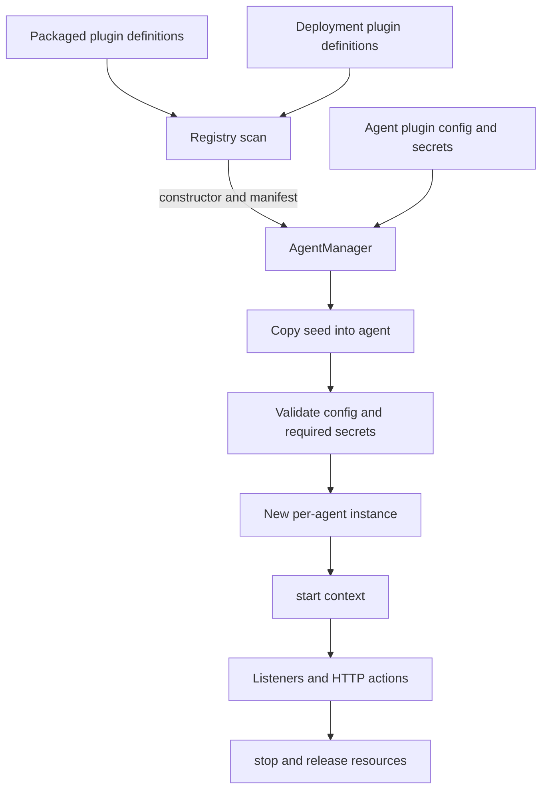
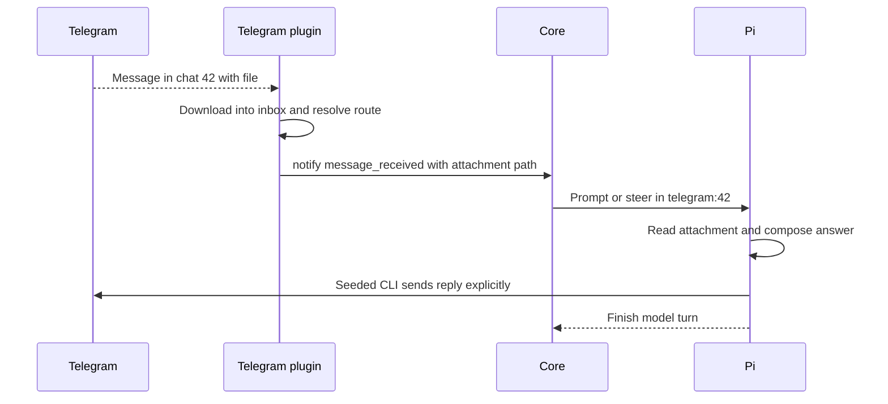

# Plugins low-level design

**Status:** current implementation. [High-level design](../high-level-design.md) · [Roadmap](../roadmap.md). [FAQ](#faq).

## Responsibility and dependencies

Plugins adapt external sources and scheduled work to `NotifyPayload`, maintain integration state, and supply agent-facing actions. They run in the trusted server process. Pi extensions run in the agent child and are a different mechanism, documented under [agents](agents.md#runtime-capabilities).

The [Plugin interface](../../packages/harness/src/core/types.ts) is the core dependency. [PluginRegistry](../../packages/harness/src/core/plugin-registry.ts) discovers definitions; [AgentManager](../../packages/harness/src/core/agent-manager.ts) instantiates them. API dispatches optional raw HTTP handlers. CLI forks source definitions. Agents consume copied prompts, skills, and scripts.

## Contract

```ts
interface Plugin {
  manifest: PluginManifest;
  start(ctx: PluginInstanceContext): Promise<void>;
  stop(): Promise<void>;
  handleHttpRequest?(req: IncomingMessage, res: ServerResponse): void | Promise<void>;
}
```

`PluginManifest` contains display name/description and config/secrets JSON schemas. The manager validates/defaults configuration with Ajv and resolves declared secret keys before `start`. Required missing secrets fail the plugin. The context provides:

| Context member | Use |
|---|---|
| `agentId`, `agentDir` | Owning identity and agent filesystem root. |
| `stateDir`, `inboxDir` | Plugin-local durable state and received files. |
| `config`, `secrets` | Validated config and declared plugin credentials. |
| `timezone`, `log` | Harness timezone and scoped logger. |
| `httpBaseUrl` | Callback prefix when an HTTP handler exists. |
| `notify(name, payload)` | Attach `_notification` metadata and call the current runner. Returns `void`. |
| `resetThread(channelId, override?)` | Delegate thread deletion to the manager; refuses active threads. |

`NotifyPayload` requires `text` and `channelId`, with optional `metadata`, `threadIdOverride`, `priority`, `isSilent`, and `doNotSteer`. Routing and delivery belong to [core](core.md#execution-and-example). Do not infer durable acceptance from the `void` notification call: the current wrapper catches/logs runner errors, and an absent runner does not produce a receipt.

## Discovery and lifecycle



The scan imports `<pluginId>/index.ts` from packaged then deployment roots. A deployment definition overrides the same packaged ID. Core IDs `admin`, `scheduler`, and `agent-messaging` are always included; optional IDs come from the agent's `plugins/` directories. CLI refuses to fork core IDs even though registry precedence is general.

On each start, the manager copies the selected definition's `seed/` into the agent directory, reasserts executable scripts, validates config/secrets, creates `state/` and `inbox/`, then starts a fresh instance. Namespaced seed files are overwritten; edit their selected source to preserve a change across restart. The [agents layout](agents.md#persistent-layout) shows destinations.

`stop()` must cancel poll/timer/watch activity and release resources. One plugin's startup failure is recorded without automatically stopping the other plugins. Reload replaces only that instance, with a five-second stop timeout. Definition imports/scanning happen at server boot; source edits are not an automatic live-reload contract.

## Built-in implementations

| Plugin/source | Ingress and state | Agent action / design choice |
|---|---|---|
| [admin](../../packages/harness/src/plugins/admin/index.ts) | `deliver()` from authenticated admin API; no external state. | Inline answer is read from session JSONL by the console. |
| [scheduler](../../packages/harness/src/plugins/scheduler/index.ts) | Watches `state/schedules.json`; cron and one-time jobs use harness timezone. | Fires `schedule_fire` with `doNotSteer: true`, so a job starts as queued work; seeded CLI edits schedules. |
| [agent-messaging](../../packages/harness/src/plugins/agent-messaging/index.ts) | HTTP inbox guarded by shared `X-Webhook-Secret`; explicit target thread. | Seeded `agent-msg/send` calls target inbox; silent mode sets both silent and no-steer. |
| [telegram](../../packages/harness/src/plugins/telegram/index.ts) | Long-polls Bot API; routes messages/edits and downloads attachments into inbox. | Seeded CLI sends explicit Bot API actions with environment credentials. No incoming webhook mode. |
| [gws](../../packages/harness/src/plugins/gws/index.ts) | Gmail polling through GWS CLI, routes/settings/ingestion ledger; silent backlog; `-1` polling interval is passive mode. | Explicit Workspace CLI actions. Polls do not overlap; settings overlay is re-read each tick. |
| [artifacts](../../packages/harness/src/plugins/artifacts/index.ts) | HTTP publication and serving, stored artifact metadata/files. | Public/private HTML access with route-specific checks; agent script publishes explicitly. |

## Example: a Telegram attachment and explicit reply



For a custom producer, the invocation is conceptually:

```ts
ctx.notify("ticket_received", {
  text: "Summarize ticket T42; attachment: plugins/helpdesk/inbox/t42.txt",
  channelId: "ticket-T42",
  metadata: { ticketId: "T42" },
  doNotSteer: true,
});
```

This snippet assumes the plugin has already created the referenced file. Under `plugin_channel`, it routes to `helpdesk:ticket-T42`; an override would take precedence. Source IDs in metadata aid correlation, but the queue does not automatically deduplicate the producer's external IDs.

## HTTP boundary and failure behavior

`/webhook/<agentId>/<pluginId>/*` bypasses global Hono authentication. The [dispatcher](../../packages/harness/src/api/webhook.ts) looks up the running instance, strips the prefix while preserving the query, and forwards raw Node request/response objects. Each handler owns authentication, body limits, methods, status codes, and response completion. Exact current routes are in the [API design](api.md#10-plugin-webhooks--webhook).

The shared webhook secret is an insider credential, not a per-agent security identity. Current agent tools can read exported credentials; plugins and agent filesystem state are not isolated by OS permissions. Producers should persist cursors carefully, stop reliably, and expose failures in logs. A successful external action cannot be reversed by queue retry, and a plugin cursor update is not equivalent to model completion.

## Design choices and planned changes

| Choice | Reason | Limit |
|---|---|---|
| Small common notification contract | New sources reuse queueing, routing, and steering. | Current notify lacks an acceptance receipt. |
| Per-agent plugin instances | Isolate configuration and integration cursors logically. | All instances still share the server process. |
| Seeded tools/prompts | Keep integration instructions and scripts versioned with source. | Agent-local copies are overwritten at start. |
| Explicit outbound actions | Agent decides when and where a reply belongs. | External delivery needs its own evidence and deduplication. |

[Plan 1.4](../plans/04-ingress-and-operations.md) adds durable ingress, scoped broker operations, operation receipts, and staged file publication through the agent workspace gate. [Plan 1.2](../plans/02-workspace-and-provisioning.md) moves private plugin control state outside compute. These are planned changes, not protections provided by the current `PluginInstanceContext`.

## FAQ

Questions here come from integration operators and plugin authors. The answers describe today's in-process plugins; broker/staging behavior remains planned.

### How do I enable an optional plugin for one agent?

Create `agents/<agent>/plugins/<pluginId>/config.json` with settings accepted by that plugin's manifest, configure its declared secrets, and restart the agent. A packaged definition can be used directly. Run `cognisphere plugin add <id>` only when you need a deployment-owned source fork; forking alone does not enable it for any agent.

### How do I add a completely new plugin?

Create a deployment definition at `<harnessRoot>/plugins/<id>/index.ts` that default-exports a class implementing `Plugin`: manifest, `start`, `stop`, and optionally HTTP handling. Add its agent-local configuration and restart the server so the registry discovers/imports it. Use a bundled plugin as the contract example; the CLI `plugin add` command forks catalog entries rather than generating arbitrary new plugins.

### What belongs in `config`, `secrets`, `stateDir`, and `inboxDir`?

Config holds operator settings validated by `configSchema`; secrets hold credentials declared by `secretsSchema`. `stateDir` holds integration cursors/routes/schedules or other durable plugin data, while `inboxDir` holds received attachments. Put agent-visible instructions/helpers in the definition's namespaced `seed/`. Directory ownership is a convention today, not isolation from agent shell access.

### How do I learn what a particular plugin parameter does?

Read its `manifest.configSchema` and `manifest.secretsSchema`, also exposed through the plugins API/settings UI. Schemas specify defaults, required fields, constraints, and descriptions. For example, Telegram's `pollTimeoutSec` controls a long-poll request, whereas GWS's `pollIntervalSec` controls time between polling ticks and accepts `-1` for passive mode. These settings are not the model-run timeout.

### How do I choose the destination conversation for a notification?

Set `channelId` to a stable source conversation ID and let the agent's routing strategy derive the thread, or supply `threadIdOverride` for an explicit destination. Keep reset operations consistent with any override. Two sources using the same resolved thread share that conversation and can steer each other; see [core routing and flags](core.md#faq).

### Can I add background context without interrupting the agent?

Set both `isSilent: true` and `doNotSteer: true`. Silent alone only suppresses waking an idle thread and can still steer active work. The combined flags keep the input queued until a later batch is triggered by non-silent work. Scheduler jobs use no-steer so scheduled requests run as fresh work.

### Does returning from `ctx.notify()` mean my source can acknowledge delivery?

It does not provide a durable receipt: the wrapper returns `void`, logs and swallows runner errors, and can have no active runner. A plugin needs a deliberate cursor/recovery strategy; it cannot infer model completion or guaranteed admission from this call. [Plan 1.4](../plans/04-ingress-and-operations.md) introduces durable ingress acknowledgments and source deduplication.

### Will an assistant answer automatically become an email or Telegram reply?

No. The agent must explicitly invoke the relevant integration action with its destination. The admin console reads inline answers from JSONL, but external services are separate delivery paths. When diagnosing a missing reply, inspect the action/tool result as well as whether the model turn finished.

### Why did my edited plugin prompt or helper disappear after restart?

The manager recopies the selected definition's `seed/` on every plugin start. Change the packaged source when developing the harness, or fork the optional definition and edit its seed in the deployment. Editing only the copied file under an agent does not survive that reseed.

### Do I need a public webhook URL for every plugin?

No. Telegram long-polls and GWS polls through its CLI; scheduler and admin also do not require incoming external webhooks. A custom HTTP plugin gets a raw handler under `/webhook/<agent>/<plugin>/...`, which bypasses global operator auth. That handler must enforce its own authentication and request rules.

### What happens when one plugin fails, or when I edit its source while running?

A startup failure is recorded for that plugin and does not automatically stop sibling plugins or the runner. Reload replaces an instance using the registry's imported definition; it is not a source hot-reload guarantee. Restart the server to rescan edited/new definitions, and inspect plugin state after applying config or credentials.

### What must my `stop()` method do, and who prevents duplicate notifications?

Cancel polls, timers, watchers, and any retained resources so an old instance cannot keep producing work after replacement. Stop has a bounded wait, so plugins must implement cleanup reliably. The current queue does not deduplicate arbitrary external IDs in metadata; source deduplication and uncertain external-action handling need explicit integration logic.
