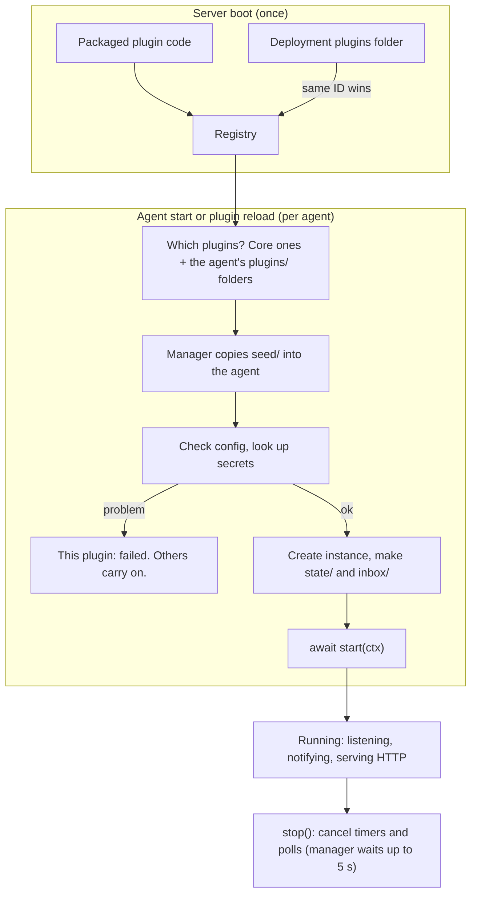
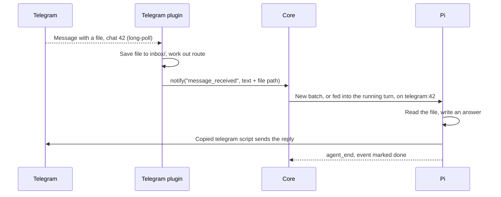

# Plugins low-level design

**Status:** implemented. [High-level design](../high-level-design.md) · [Roadmap](../roadmap.md) · [FAQ](#faq)

## In one minute

A plugin connects **one agent** to **one source of work**, such as Telegram, Gmail, a schedule or the console. It has three jobs:

1. **Listen.** Poll, watch a file, or accept HTTP requests, and turn each new input into a `ctx.notify(...)` call. Core then queues it ([event lifecycle](core.md#event-lifecycle)).
2. **Remember.** Keep its own state (cursors, routes, schedules) and store any downloaded attachments.
3. **Equip the agent.** Ship prompts, skills and scripts in a `seed/` folder. They are copied into the agent so it knows how to use the integration and can *act* (for example, send a reply).

Plugins run **inside the server process**, one copy per agent. They are trusted code. Pi extensions are something else: they run inside the Pi process ([agents](agents.md#runtime-capabilities)).

| Who | Role |
|---|---|
| [Plugin interface](../../packages/harness/src/core/types.ts) | The contract, defined by core. |
| [PluginRegistry](../../packages/harness/src/core/plugin-registry.ts) | Finds plugin code when the server boots. |
| [AgentManager](../../packages/harness/src/core/agent-manager.ts) | Creates, starts, reloads and stops each agent's plugins, and copies their seed files. |
| [Webhook route](../../packages/harness/src/api/webhook.ts) | Passes raw HTTP requests to a running plugin. |
| `cognisphere plugin add` | Copies a packaged plugin's code into your deployment so you can edit it. |

## Contract

```ts
interface Plugin {
  manifest: PluginManifest;   // displayName, description, configSchema, secretsSchema
  start(ctx: PluginInstanceContext): Promise<void>;
  stop(): Promise<void>;
  handleHttpRequest?(req: IncomingMessage, res: ServerResponse): void | Promise<void>;
}
```

What the plugin receives in `ctx`:

| Field | What it's for |
|---|---|
| `agentId`, `agentDir` | Which agent this copy belongs to, and that agent's folder. |
| `stateDir`, `inboxDir` | `plugins/<id>/state/` for the plugin's own data; `plugins/<id>/inbox/` for received files. |
| `config` | The plugin's `config.json`, checked against `configSchema` with defaults filled in. |
| `secrets` | The secret keys the plugin declared, taken from its bucket. |
| `timezone`, `log` | The harness timezone, and a logger labelled `plugin:<agent>:<plugin>`. |
| `httpBaseUrl` | The local URL of the plugin's webhook route. Only set if the plugin has `handleHttpRequest`. |
| `notify(name, payload)` | Send an input to the agent. `name` is saved as `metadata._notification`. Returns nothing. |
| `resetThread(channelId, override?)` | Ask core to delete a conversation. Refused while it's running. |

The payload needs `text` and `channelId`. It can also carry `metadata`, `threadIdOverride`, `priority`, `isSilent` and `doNotSteer` ([what each field does](core.md#input-fields-notifypayload)).

> **`notify()` is not a receipt.** Anything a plugin sends before its agent's runner has started (during the plugin's own `start()`, on every agent Start, Restart or settings swap) is **dropped**, with only a log line. After the agent is stopped, `notify()` silently does nothing, not even a log line (a well-behaved plugin has stopped by then anyway). When the runner is running, the row is saved before `notify()` returns, but the plugin still isn't told about failures. So don't advance an external cursor just because `notify()` returned.

## Discovery and lifecycle

A plugin has two lifetimes:

- **Its code** is loaded once, when the server boots.
- **Its instance** (one per agent) is created fresh every time the agent starts or the plugin is reloaded.


```mermaid
flowchart TB
    subgraph Boot["Server boot (once)"]
        Builtin[Packaged plugin code] --> Registry[Registry]
        User[Deployment plugins folder] -->|same ID wins| Registry
    end
    subgraph Start["Agent start or plugin reload (per agent)"]
        Registry --> Select[Which plugins? Core ones + the agent's plugins/ folders]
        Select --> Seed[Manager copies seed/ into the agent]
        Seed --> Validate[Check config, look up secrets]
        Validate -->|problem| Failed[This plugin: failed. Others carry on.]
        Validate -->|ok| New[Create instance, make state/ and inbox/]
        New --> StartCall["await start(ctx)"]
    end
    StartCall --> Running[Running: listening, notifying, serving HTTP]
    Running --> Stop["stop(): cancel timers and polls (manager waits up to 5 s)"]
```

### Step by step

1. **Find the code (server boot).** The registry loads `<pluginId>/index.ts` from the package, then from `<harnessRoot>/plugins/`. If both have the same ID, your deployment's copy wins. It creates one throwaway instance of each plugin to read its manifest. Code you edit later isn't picked up until the server restarts.
2. **Choose which plugins an agent gets.** Every agent gets the core plugins `admin`, `scheduler` and `agent-messaging`. You turn on any other plugin for an agent by creating `agents/<agent>/plugins/<id>/` (normally with a `config.json` inside). If there's no matching code, the plugin fails with "unknown plugin id".
3. **Copy seed files.** The manager copies the plugin's `seed/` folder into the agent (for example `scripts/telegram/`, `skills/telegram/` and a prompt in `system_prompts/`) and makes the scripts executable. This happens on **every** start, and overwrites the copies. Edit the plugin's source instead of the copies. Removing a plugin later does **not** delete its copied files.
4. **Check config and secrets.** The config is validated and defaults are filled in, then the declared secrets are looked up. A missing *required* secret or an invalid config marks only this plugin `failed`. The agent's other plugins and its runner still start.
5. **Start.** The manager creates the instance, makes `state/` and `inbox/`, and waits for `start(ctx)`. There is no time limit. If `start()` throws, the plugin is marked `failed`, but `stop()` isn't called, so anything it had already set up (a timer, say) keeps running. Plugins start one after another.
6. **Run.** The plugin listens and calls `ctx.notify()`, and it may serve `/webhook/<agent>/<plugin>/*`. The agent uses the copied scripts to act.
7. **Reload.** Saving the plugin's **config** reloads just that plugin: stop it (waiting up to 5 s), then run steps 3–5 again. The agent's runner is untouched. This only works while the agent is running, and only for a plugin the agent already loaded. For a newly added plugin folder, restart the agent. Saving the plugin's **secrets** reloads the whole agent, so the Pi process gets the new values too.
8. **Stop.** When the agent stops, restarts or reloads, or the server shuts down, `stop()` must cancel every poll, timer and file watcher. The manager waits at most 5 seconds and then carries on; it can't force a plugin to stop.

**Example: turning on Google Workspace (GWS) for Support.**

1. Create `agents/support/plugins/gws/config.json` and restart Support.
2. The manager copies the GWS seed (the `scripts/gws/email`, `routes` and `settings` helpers, a skill and a prompt) and checks the config. The required secret `GOOGLE_WORKSPACE_CLI_CREDENTIALS_FILE` is missing, so GWS shows `failed`. Support's console chat and scheduler work normally.
3. Click **Connect** on the GWS card and approve in Google. The harness saves the credentials, sets that secret and reloads Support.
4. GWS starts, waits 5 seconds (so the runner is ready), and begins polling Gmail.

## Built-in plugins

| Plugin | How work arrives | Notification names | How the agent acts |
|---|---|---|---|
| [admin](../../packages/harness/src/plugins/admin/index.ts) | Messages sent from the console (`/admin/:id/send`). No state. | `user_message` (channel `operator`) | Nothing is sent anywhere. The console reads the answer from the session file. |
| [scheduler](../../packages/harness/src/plugins/scheduler/index.ts) | Watches `state/schedules.json`. Jobs use cron syntax in the harness timezone. A one-time job is a cron job that pauses itself after firing. Each job goes to the thread saved with it, with `doNotSteer: true`, so it never interrupts a running turn. | `schedule_fire` | A copied script adds and edits schedules. |
| [agent-messaging](../../packages/harness/src/plugins/agent-messaging/index.ts) | Other agents post to its webhook with the shared `X-Webhook-Secret`. The receiver's `allowMessageFrom` (default: everyone) decides who may send. The sender picks the target thread. | `agent_message` (channel `agent`) | The copied `agent-msg/send` script. Its "silent" option sets both `isSilent` and `doNotSteer`. |
| [telegram](../../packages/harness/src/plugins/telegram/index.ts) | Long-polls the Telegram Bot API (there is no webhook mode). Downloads attachments to `inbox/`. Can be limited with `allowedChatIds` and routed with `state/routes.json`. Handles `/reset` itself by deleting that chat's thread. The poll position is kept in memory only. | `message_received`, `edited` | A copied script calls the Bot API using the token from the environment. |
| [gws](../../packages/harness/src/plugins/gws/index.ts) | Polls Gmail through the GWS CLI; polls never overlap. The thread is `<Subject> [<gmailThreadId>]`, and `routes.json` rules can change it. Unread mail is marked read. Settings in `state/` are re-read on every poll. `pollIntervalSec: -1` turns polling off. In backlog mode, the first email of each thread wakes the agent, and later ones arrive as silent (without `doNotSteer`, so they *can* join a running turn). Already-seen threads are listed in `ingested-threads.jsonl`. | `email_received`, `email_silent`, `gws_settings` (channel `main`) | Copied `scripts/gws/*` helpers and the GWS CLI. |
| [artifacts](../../packages/harness/src/plugins/artifacts/index.ts) | Serves agent-written HTML pages. The agent publishes by having a copied script write `state/<slug>.<public\|private>.html`; the file name holds the visibility. | — | The copied `scripts/artifacts/artifact` script. Serving rules are in [API §10](api.md#10-plugin-webhooks--webhook). |

### Why core plugins can't be copied

`admin`, `scheduler` and `agent-messaging` are *core* plugins: every agent runs them, and `cognisphere plugin add` refuses them (the code calls a copy "a footgun"). The other plugins are a *catalog* you may copy and edit. The reasons:

1. **The server calls `admin` directly.** `POST /admin/:id/send` fetches the running `admin` instance with `getAdminPlugin()` and calls its `deliver()` method as the packaged class. An edited copy without that method breaks console sends, and the type checker can't see it because the copy loads at runtime.
2. **A copy replaces the plugin for every agent at once.** Core plugins run on every agent, and a copy in `<harnessRoot>/plugins/` wins over the package for all of them. `agent-messaging` is how agents reach each other's webhooks, so a broken copy breaks agent-to-agent messages across the deployment.
3. **Copies miss upgrades.** A copied plugin no longer gets package updates. That's the point for catalog plugins, but for core plugins it leaves new server code talking to an old plugin.

To change what a core plugin tells the agent, add your own prompt file (such as `1-agent.md`) rather than editing its seed. The refusal is only in the CLI: a copy made by hand is still loaded ([known issue 15](#known-issues-and-suggested-improvements)).

## Example: a Telegram attachment and an explicit reply


```mermaid
sequenceDiagram
    participant Telegram
    participant Plugin as Telegram plugin
    participant Core
    participant Pi
    Telegram-->>Plugin: Message with a file, chat 42 (long-poll)
    Plugin->>Plugin: Save file to inbox/, work out route
    Plugin->>Core: notify("message_received", text + file path)
    Core->>Pi: New batch, or fed into the running turn, on telegram:42
    Pi->>Pi: Read the file, write an answer
    Pi->>Telegram: Copied telegram script sends the reply
    Pi-->>Core: agent_end, event marked done
```

If Pi finishes without running the send script, the user gets nothing, even though the event is `done`.

**Writing your own plugin's notify call:**

```ts
ctx.notify("ticket_received", {
  text: "Summarize ticket T42; attachment: plugins/helpdesk/inbox/t42.txt",
  channelId: "ticket-T42",
  metadata: { ticketId: "T42" },
  doNotSteer: true,
});
```

- Save the file before calling `notify`.
- With `threadIdStrategy: plugin_channel`, this lands on thread `helpdesk:ticket-T42`.
- The queue **doesn't remove duplicates** by `ticketId`. If your source can deliver the same ticket twice, your plugin has to check.

## HTTP and safety

`/webhook/<agentId>/<pluginId>/*` skips the console login. The route finds the **running** plugin, removes the prefix (keeping the query string) and passes the raw Node request and response to `handleHttpRequest`. The handler is responsible for checking who is calling, size limits, allowed methods, status codes and ending the response. Routes are listed in [API §10](api.md#10-plugin-webhooks--webhook).

Keep in mind:

- The shared webhook secret proves a caller is *inside the harness*, not *which* agent.
- The agent can read the credentials passed to it, and plugin files aren't protected from the agent's shell.
- Advancing a cursor doesn't mean the model has finished, and a retry can't unsend a message.

## Design choices

| Choice | Why | Cost |
|---|---|---|
| One small `notify` contract | Every source reuses the same queue, routing and follow-up handling. | No receipt; input can be dropped when the runner is off. |
| A separate copy per agent | Each agent has its own config and cursors. | All copies share one server process. |
| Prompts and scripts ship with the plugin | Instructions stay in step with the plugin's code. | Local edits to the copies are lost. |
| Replies are explicit agent actions | The agent decides whether and where to reply. | Delivery needs its own evidence and duplicate checks. |

**Planned** (none of this exists yet):

- [Plan 1.4](../plans/04-ingress-and-operations.md): a durable intake with receipts, scoped broker actions, and safe file publishing.
- [Plan 1.2](../plans/02-workspace-and-provisioning.md): moves private plugin state out of the agent's reach.
- The [reusable OAuth proposal](core.md#reusable-plugin-oauth-proposed): lets a plugin register sign-in on its code, so it works before the plugin can run.

## Known issues and suggested improvements

Found in a code audit on 2026-09-28. **Severity** is how much it can hurt: *High* = lost work, security exposure or a wrong result; *Medium* = confusing or wasteful behavior; *Low* = cleanup. None of these is fixed yet. When one is fixed or scheduled, update this table and the [roadmap](../roadmap.md).

| # | Type | Severity | Problem | Why it matters | Suggested change |
|---|---|---|---|---|---|
| 1 | Bug | High | `notify()` during a plugin's `start()` (on every agent Start, Restart or settings swap) throws inside the runner and the error is swallowed; after the agent stops, `notify()` is a silent no-op. Either way the input is dropped. | Lost messages; plugins can't tell. GWS relies on a 5 s delay to avoid it. | See the core fix: start the runner first, or always persist. Return a result from `notify()` so plugins can hold their cursor on failure. |
| 2 | Bug | Medium | A plugin whose `start()` throws part-way is marked `failed` but `stop()` isn't called. | Timers or polls it already set up keep running, and a later reload can create a second, duplicate producer. | Call `stop()` (with the 5 s limit) after a failed `start()`. |
| 3 | Risk | Medium | Seed copying only adds and overwrites; it never deletes, and a seed can write anywhere in the agent folder. | Removed plugins leave prompts and scripts behind that still instruct the agent; a bad seed can overwrite agent files. | Record which files each plugin seeded and remove them when the plugin is removed; restrict seeds to namespaced paths. |
| 4 | Risk | Medium | The Telegram bot token isn't a required secret. Without it (or if Telegram rejects it) the plugin logs a warning and shows `running` while doing nothing. | Looks healthy but receives nothing. | Make the token required, or report a `failed` state with the reason. |
| 5 | Risk | Medium | Telegram keeps its poll position only in memory. | After a restart, Telegram may resend recent updates, and the queue doesn't dedupe them, so the agent can answer twice. | Save the offset in `state/` after each successful `notify()`. |
| 6 | Risk | Medium | The queue never removes duplicates by source ID. | Any plugin that re-delivers causes repeated work and repeated replies. | Add an optional dedup key to `NotifyPayload` (planned with the intake in [plan 1.4](../plans/04-ingress-and-operations.md)). |
| 7 | Risk | Low | GWS backlog emails arrive as `isSilent` without `doNotSteer`. | Old emails can be fed into an unrelated running turn on the same thread. | Set `doNotSteer` on backlog rows too, unless steering is intended. |
| 8 | Risk | Low | Saving config for a plugin the agent hasn't loaded returns 404; `reloadPlugin` does nothing while the agent is stopped. | Newly added plugins seem "stuck" until the agent is restarted. | Allow the config save to load a newly added plugin, or tell the operator to restart the agent. |
| 9 | Risk | Low | The registry creates a throwaway instance of each plugin at scan time to read its manifest. | Constructor side effects run once at boot for every plugin, even unused ones. | Read the manifest from a static export instead of an instance. |
| 10 | Cleanup | Low | `packages/harness/src/plugins/outlook/` exists locally with only a `seed/` folder and no `index.ts`. | The registry logs a "no index.ts; skipping plugin" warning on every boot. | Delete the folder or finish the plugin. |
| 11 | Cleanup | Low | The GWS plugin's header comment says no helper CLI is shipped, but `scripts/gws/*` are seeded. | Misleading for contributors. | Update the comment. |
| 12 | Cleanup | Low | The shipped `create-plugin` skill says the notification name isn't delivered to the agent (it is, as `Notification: <name>`), lists only `admin` and `scheduler` as always-on (it misses `agent-messaging`), and links a stale `docs/server.md`. | Agents that write plugins follow wrong guidance. | Update the skill. |
| 13 | Cleanup | Low | The `scheduler-cli` help says `--once` deletes the schedule after it fires; the plugin actually pauses it. | Agents and operators expect it to disappear. | Fix the help text (or make the behavior match). |
| 14 | Cleanup | Low | A comment in the Telegram plugin says pending updates are dropped at start; the code doesn't do that. | Misleading for contributors; relates to the redelivery risk above. | Fix the comment, or implement it deliberately. |
| 15 | Risk | Medium | Only `plugin add` refuses core plugin IDs. `PluginRegistry.scan()` doesn't, so a hand-made `<harnessRoot>/plugins/admin/` (or `scheduler`, `agent-messaging`) silently replaces the packaged plugin for every agent. The only sign is `scope: user` in the "plugin loaded" log line. | Can break console sends (`getAdminPlugin()` expects the packaged class), agent-to-agent messages, or scheduling for the whole deployment, and the copy misses upgrades. | Have the registry skip deployment copies of core IDs with a clear warning, or fail boot loudly. |

## FAQ

### Operators

#### How do I turn on a packaged plugin for one agent?

1. Create `agents/<agent>/plugins/<id>/config.json` with the settings you want. Missing settings get their defaults.
2. Set the plugin's secrets on the Secrets page.
3. Restart the agent. A plugin folder added while the agent runs isn't picked up until then.

You don't need `cognisphere plugin add`. That only copies the code so you can change it. Each setting is explained in the plugin's `configSchema` and `secretsSchema`, which the settings page shows.

#### How do I set up Telegram?

1. Create `agents/<agent>/plugins/telegram/config.json`.
2. Put the bot token in `TELEGRAM_BOT_TOKEN` (Telegram bucket) and restart the agent.
3. Check the logs for `telegram authenticated`.

The token isn't a required secret. If it's missing or Telegram rejects it, the plugin logs a warning and shows `running` while doing nothing ([issue 4](#known-issues-and-suggested-improvements)). Don't use one bot token on two agents: both would poll the same bot. A user who sends `/reset` wipes that chat's thread. With the default `single` strategy that is the agent's one shared thread.

#### How do I restrict who can message my agent?

Each plugin has its own filter, and each is off by default:

- **Telegram:** `allowedChatIds`. It lists **chat** IDs, not user IDs, so anyone in an allowed group gets through. Messages from other chats are dropped without a reply or a log line. To find a chat's ID, message the bot once with the list empty and read `Channel` in that thread's history.
- **Gmail (GWS):** `allowedSenders` (patterns like `*@abc.com`) and `requireAgentInTo`. Mail from other senders is marked read and skipped.
- **Agent messaging:** `allowMessageFrom` lists which agents may message this one. Others get a 403.

#### How do I connect Gmail, and why is new mail slow to arrive?

Follow the [GWS example](#step-by-step): create `plugins/gws/config.json`, restart, then click **Connect** on the GWS card. By default the plugin polls every 900 seconds (15 minutes). Lower `pollIntervalSec` to poll more often; the smallest gap is 10 seconds. The agent can override these settings itself in `plugins/gws/state/settings.json`, and its values win over `config.json`. So check that file if a change seems ignored.

#### A message arrived, but the agent never replied. Why?

The agent's written answer isn't sent anywhere. It must run the plugin's send script, such as `telegram-cli send-message`. The event can be `done` even though nothing was sent ([example](#example-a-telegram-attachment-and-an-explicit-reply)). Open the thread's history to see what it did. If there is no event at all, check that the plugin is `running`, that no allow-list filtered the message, and the [core FAQ](core.md#faq).

#### Why didn't my schedule fire, or why did it fire at the wrong time?

Check these, in order:

1. **The agent was stopped.** Schedules fire only while it runs, and missed fires aren't replayed later.
2. **The schedule is paused.** A one-time (`--once`) job pauses itself after it fires.
3. **The cron is invalid.** It's skipped and logged as `invalid cron`. If `schedules.json` isn't valid JSON, the old timers keep running, and at the next start the scheduler fails.
4. **The timezone is wrong.** Cron uses the harness timezone from **Settings**. Saving it reloads running agents.
5. **The thread is busy.** A fire never interrupts a running turn on its thread, so it waits for that turn to end.

#### How do agents message each other?

Every agent has the `agent-messaging` plugin. The agent runs `scripts/agent-msg/send --to-agent <id> --thread-id <thread> --message "..."`. The receiver sees `From` and `FromThread`, so it can reply. With `--silent`, the note waits on that thread until something else wakes it. A 403 means the receiver's `allowMessageFrom` doesn't list the sender. A 404 means a wrong agent ID, or that agent isn't running.

#### How does an agent publish an HTML page?

Turn on the `artifacts` plugin. It needs `appBaseUrl` (your front-end app's address) and the `ARTIFACTS_APP_SECRET` secret. Your app must also forward `/public/artifacts/*` and `/private/artifacts/*` to the plugin ([API §10](api.md#10-plugin-webhooks--webhook)). The agent then runs `scripts/artifacts/artifact publish <file>`. Pages are private (signed-in users only) unless published with `--public`.

#### Do I need a public webhook URL?

No. Telegram and GWS poll, and admin, scheduler and agent-messaging are internal. Only a plugin that receives HTTP from outside needs one, such as a custom webhook plugin. It gets `/webhook/<agent>/<plugin>/...`, which skips the console login, so its handler must check callers itself.

### Plugin authors

#### How do I write and test a new plugin?

1. Create `<harnessRoot>/plugins/<id>/index.ts` that default-exports a class with `manifest`, `start()` and `stop()`. The `create-plugin` skill has a tested template, and the built-in plugins are good examples.
2. `stop()` must cancel every timer, poll and watcher. The manager waits only 5 seconds.
3. Turn it on for a test agent (see the operator steps above).
4. Run `cognisphere dev` and look for `plugin loaded` with `"scope":"user"`, then `agent started` with your ID in `runningPlugins`.

If the load fails, the log says `failed to load plugin`. If the start fails, the plugin shows `failed` with the error. Your own `ctx.log` lines go to the server's standard output as JSON, labelled `plugin:<agent>:<plugin>`. Set `LOG_LEVEL=debug` for more detail.

#### Where should each kind of data go?

| Data | Put it in |
|---|---|
| Operator settings | `config`, described by `configSchema` |
| Credentials | `secrets`, described by `secretsSchema` |
| Cursors, routes, schedules | `stateDir` |
| Received files | `inboxDir` |
| Instructions and helpers for the agent | `seed/` |

Nothing enforces this. `stateDir` survives restarts, but the agent can read and change it. Write files atomically (write a temp file, then rename), as the scheduler does.

#### How do I declare config and secrets?

Describe them as JSON Schema in the manifest. The config is validated and defaults are filled in at every start. Only secrets listed in `required` stop the plugin from starting. Every non-empty key in the plugin's bucket is also passed to the agent as an environment variable. Two buckets with the same key make the whole agent fail, so use prefixed names like `ACME_API_KEY`.

#### What does the agent see when I call `notify()`?

It sees `text` after a `<harness-metadata>` block. The block holds `Timestamp`, `Plugin`, `Channel` and `ThreadId`, plus your `metadata` with keys changed to PascalCase. The notification name appears as `Notification: <name>`. Reserved keys such as `Channel` or `ThreadId` in your metadata are dropped, and `null` or `undefined` values are skipped. Describe every field in your seed prompt, because that is the agent's only manual.

#### How do I choose which thread an input lands on?

By default, the agent's `threadIdStrategy` picks the thread from your plugin ID and `channelId` ([routing](core.md#routing)). Use one stable `channelId` per conversation, such as a chat or ticket ID. Pass `threadIdOverride` to pick an exact thread. Telegram and GWS do this with a `routes.json` rule file.

#### Is `notify()` guaranteed to deliver?

No. It returns nothing. If the agent's runner isn't running, the input is dropped. That includes calls made during your own `start()`. That's why GWS waits 5 seconds before its first notify ([issue 1](#known-issues-and-suggested-improvements)). Otherwise the input is saved before `notify()` returns, but you still can't learn about failures. Don't treat a return as proof the model got it.

#### How do I avoid duplicates and floods?

The queue never removes duplicates, and it has no size limit or rate limit. Your plugin must:

- remember which source IDs it has already sent, and save that in `stateDir`;
- schedule the next poll only after the current one finishes, as GWS does;
- batch or summarize bursts, since every `notify()` becomes a row.

Use `priority` to make important threads go first.

#### How do I add background information without interrupting the agent?

Set both `isSilent: true` and `doNotSteer: true`. A silent input doesn't wake an idle thread; it waits for the next normal input. Silent alone can still be fed into a running turn.

#### How do I secure my HTTP handler?

The webhook route does no checks of its own. It only forwards requests to a **running** plugin (otherwise it returns 404). Your handler must check the method, body size and caller, and always end the response. For calls from agents, compare the `X-Webhook-Secret` header with `process.env.COGNISPHERE_WEBHOOK_SECRET`. That proves the caller is inside the harness, not which agent it is. For outside services, check their own signature or a secret you declare. See [HTTP and safety](#http-and-safety).

#### How does an agent's script call back into my plugin?

The Pi process gets `PI_WEBHOOK_BASE`, which is `<server>/webhook/<agent>`. A seed script calls `${PI_WEBHOOK_BASE}/<plugin-id>/<path>` and sends `X-Webhook-Secret: $COGNISPHERE_WEBHOOK_SECRET`. The artifacts `list` command is a working example. `PI_AGENT_ID` and `PI_THREAD_ID` tell the script which agent and thread are calling.

#### What goes in `seed/`, and why did my edit to a copied file disappear?

`seed/` mirrors the agent folder: `system_prompts/plugin-<id>.md`, `scripts/<id>/` and `skills/<id>/`. A prompt file outside `system_prompts/` is copied but never loaded. The copy happens on every plugin start and overwrites the agent's copies, so edit the plugin source instead. Keep the prompt short and move longer procedures into a skill. Removing the plugin doesn't delete its copied files ([issue 3](#known-issues-and-suggested-improvements)).

#### When do my code and config changes take effect?

- **Plugin code:** on server restart. `cognisphere dev` restarts the backend when a loaded file changes, but a new plugin folder needs a restart.
- **Config saved in the console:** that plugin reloads right away, if the agent is running.
- **`config.json` edited by hand, or a new plugin folder on an agent:** restart the agent.
- **Secrets:** saving reloads the whole agent once its running turns finish.
