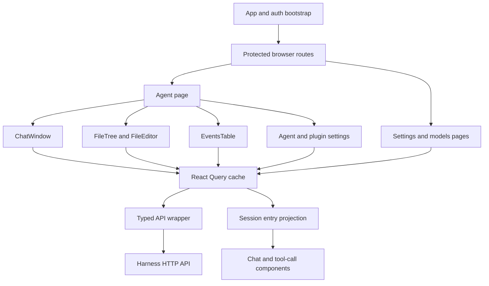
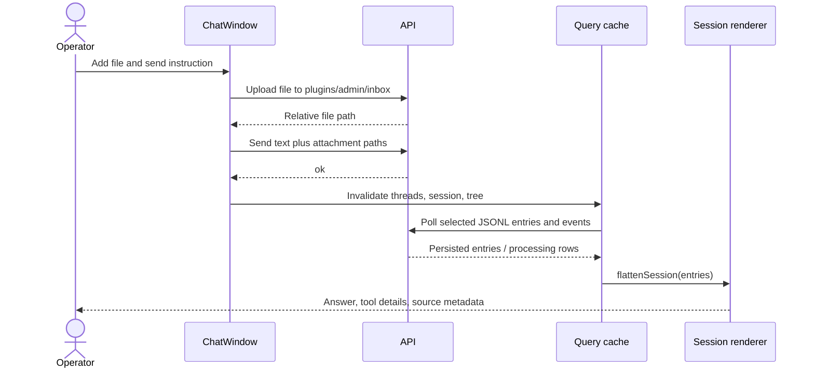

# Web low-level design

**Status:** implemented React operator console with HTTP polling. [High-level design](../high-level-design.md) · [Roadmap](../roadmap.md). [FAQ](#faq).

## Responsibility and dependencies

Web exposes agent lifecycle, chat/history, events, files, plugins, credentials, and model settings. It depends on the [API contract](api.md), not backend classes or direct filesystem/SQLite access. It is distinct from the optional product `app/` created by [CLI](cli.md); that app owns its own end-user authentication.

| Source | Responsibility |
|---|---|
| [App.tsx](../../packages/web/src/App.tsx) | Query client, browser router, auth bootstrap, protected routes, toast/theme providers. |
| [lib/api.ts](../../packages/web/src/lib/api.ts) | Cookie-authenticated fetch, `ApiError`, typed endpoint wrappers, multipart uploads. |
| [lib/auth.ts](../../packages/web/src/lib/auth.ts) | External auth store via `useSyncExternalStore`; unknown/anonymous/authenticated state. |
| [lib/session.ts](../../packages/web/src/lib/session.ts) | Convert Pi entries into user/assistant chunks, join tool results by call ID, split harness metadata. |
| [pages/agent.tsx](../../packages/web/src/pages/agent.tsx) | Agent header/lifecycle and chat/files/events/plugins/settings tabs. |
| [chat-window.tsx](../../packages/web/src/components/chat-window.tsx) | Thread/session selection, history paging, attachments, send/abort, usage and model override. |
| [events-table.tsx](../../packages/web/src/components/events-table.tsx) | Filter/sort/page event state and perform allowed row/bulk actions. |
| [file-tree.tsx](../../packages/web/src/components/file-tree.tsx), [file-editor.tsx](../../packages/web/src/components/file-editor.tsx) | Browse/upload/delete files and edit text with lazy-loaded CodeMirror. |
| [agent-settings-pane.tsx](../../packages/web/src/components/agent-settings-pane.tsx), [schema-form.tsx](../../packages/web/src/components/schema-form.tsx) | Model/routing/config/plugin forms using backend schemas. |
| [settings.tsx](../../packages/web/src/pages/settings.tsx), [models.tsx](../../packages/web/src/pages/models.tsx) | Harness timezone, Workspace sign-in, model credentials/allowlist and OAuth. |

## Composition and data flow

`/login` is public in the client router. `/`, `/agents/:id/*`, `/settings`, and `/settings/models` render under `RequireAuth` and `AppShell`. Agent subroutes are chat, files, events, plugins, and settings; the old queue route redirects to events. Startup calls `/api/auth/me`; a 401 from the API wrapper navigates to login. The server independently enforces authentication.

The QueryClient disables automatic query retries and refetch-on-window-focus. Successful mutations invalidate related keys so subsequent reads reflect backend state. Component state holds drafts, selection, and attachments; it is not the processing source of truth.

| Query | Typical key | Refresh |
|---|---|---|
| Agent list | `['agents']` | 5 seconds. |
| Agent detail | `['agent', id]` | 3 seconds in agent page. |
| Plugins / threads | `['plugins', id]`, `['threads', id]` | 5 seconds. |
| Selected session | `['session', agent, thread, session, ...]` | 3 seconds; enabled with selection, includes history window. |
| Events | `['events', agent, params]` | 2 seconds. |
| Thread usage | `['usage', agent, thread]` | 5 seconds while its panel is visible. |
| File text / settings | Scoped file/settings keys | Fetch and explicit invalidation; no universal polling rule. |

These are polling intervals, not delivery latency guarantees. The current console has no SSE or token-delta channel.

## Example: send, observe, and inspect an input

Upload occurs before send and is not one atomic operation with queue admission. A failed send can leave an uploaded file; no end-to-end delivery should be inferred solely from the send mutation's success toast. API event status and persisted entries provide later evidence.

`flattenSession()` renders `message` entries, preserving entry IDs for navigation. It groups each tool result under the assistant tool call with the matching ID; unmatched results in partial windows are omitted. Custom/header entries are not all rendered as ordinary chat bubbles. The UI projection is therefore not a lossless session serializer. Loading older messages increases the requested tail window; event links use session/entry IDs to locate a message.

## Settings, files, and errors

Agent and plugin schemas drive typed settings controls. Secrets use the API mask sentinel `********`; callers preserve it for unchanged values and use explicit deletion semantics. Model settings return enabled choices and provider setup state. OAuth forms poll pending login state and forward requested selections/input; the browser does not hold the product-app bearer.

FileEditor sends full text on save and invalidates file/tree queries. Current writes have no expected-hash conflict contract and generic file saves do not reload agent configuration. Mobile files navigation shows tree or editor; desktop can show both. A lazy editor keeps the initial console bundle smaller.

Non-2xx fetch responses become `ApiError(message, status, body)` for views/toasts. Failed agents/plugins retain visible error state so their settings can be repaired. Mutation pending state means an HTTP operation is pending; it is distinct from queued/running agent work. Event mutation conflicts are enforced by the server, including refusal to edit active rows.

## Build and design choices

[Vite configuration](../../packages/web/vite.config.ts) proxies `/api`, `/admin`, and `/webhook` to `PI_SERVER_URL` (default backend port 3142). Dev web port is 7330. Production builds are copied to the harness package's `dist-web/`; core serves the SPA unless headless. React/router, Markdown, and Radix dependencies have separate chunks.

| Choice | Reason | Tradeoff |
|---|---|---|
| Typed HTTP wrapper | One place for credentials, errors, and route calls. | Types mirror backend contracts manually and can drift. |
| React Query polling | Simple recovery by rereading durable state. | Repeated reads and delayed progress; no live token display. |
| Pi history projection | Shows model/tool evidence without another transcript store. | Must tolerate partial windows and unknown entry types. |
| Schema-driven settings | Plugin forms follow declared config/secrets. | Backend remains the validation authority. |

[Plan 1.6](../plans/06-live-interface.md) adds authorized SSE, reconnect cursors, deduplication, and separate execution/persistence indicators. [Plan 2](../plans/08-session-search-memory.md) later adds scoped search with links into history. Those interfaces are not implemented by the polling client described here.

## FAQ

These questions reflect console users, support operators, and frontend contributors. They describe the polling console currently implemented.

### I clicked Send. Why is no answer visible immediately?

The send response is separate from model execution, and chat refreshes persisted session entries on a polling interval. Check the Events view for queued/in-flight/failed state and the selected thread/session for history. If no event appears, inspect the agent/plugin state and server notification logs; an HTTP success is not a guaranteed durable-admission receipt today.

### Is chat streaming tokens? What do the refresh intervals mean?

No token stream is implemented. Selected history polls roughly every 3 seconds, events every 2 seconds, and thread/plugin lists every 5 seconds. These intervals are read schedules, not response-time guarantees. [Plan 1.6](../plans/06-live-interface.md) defines future SSE and reconnect behavior.

### Will closing the tab stop my agent? Will a draft survive a refresh?

Backend work already queued continues independently of the browser. Use explicit abort to cancel an active batch. Composer text, selected uploads, and file-editor drafts are component state rather than a promised durable draft store, so save/send as appropriate before navigating away or refreshing.

### Where did my message go when I selected another thread?

The composer sends into the selected thread, and the history panel reads the selected session. Check the thread list and Events view rather than assuming the agent-wide page combines every conversation. Event session/entry links can take you to the actual delivered input; batched inputs can share one history entry.

### My attachment uploaded but Send failed. Should I upload it again?

Upload happens before send and is not atomic with it. A failed send can leave files under `plugins/admin/inbox`; inspect the Files view before retrying and check whether the input already entered Events. Repeat uploads can overwrite the same sanitized filename, and repeat sends can duplicate messages because the current send contract has no idempotency receipt.

### Why is an old tool result missing, or why does chat differ from raw JSONL?

Chat renders a projection of message entries, not every session record. Tool results attach to matching assistant tool-call IDs; a tail window can omit the corresponding older call, so unmatched results are not shown. Load older history or inspect JSONL when you need complete evidence, including custom entries.

### How do I change a model, and when will the choice take effect?

Use the thread header for an existing thread's override or agent settings for the default. Both affect a future batch; they do not change an already-running model turn. A thread override continues to win over the default until cleared. Model availability and validation come from the backend's configured providers/allowlist.

### Why did settings say saved but the agent remains failed or uses old settings?

A successful mutation can persist settings before a draining runner is replaced, or save values that fail startup validation. Refetch the agent/plugin state and read its error. Required credentials, invalid schemas, and unavailable models need repair; a success toast is not a complete readiness check.

### Can I edit a file while the agent is changing it? Does Save reload configuration?

The current editor sends the entire draft with no expected-revision conflict check. Coordinate edits to avoid overwriting newer tool output, and save drafts deliberately. Generic file save does not trigger configuration reload; use the settings forms for that lifecycle behavior. The planned workspace gate will cover managed operator writes too.

### How do I retry work or reset a conversation from the console?

Use Events to inspect and requeue/change the status of eligible rows; active rows are protected by the server. Use chat's thread deletion/reset flow only when that conversation is no longer active. Reset deletes its history and events, not shared work products or external actions. See [core retry semantics](core.md#faq) before replaying a request with side effects.

### Why do I keep returning to login, and should I put the app bearer in frontend config?

The API wrapper redirects on 401; verify session validity and that browser API requests reach the intended backend/proxy. The console uses same-origin cookies. Do not put the operator-level product-app bearer in frontend code; a separate product backend holds that credential and enforces its own user access.

### I am adding a screen. Where do queries, mutations, and errors belong?

Add or reuse a typed wrapper in `lib/api.ts`, use scope-specific React Query keys, and invalidate affected keys after mutations. Render `ApiError` and pending/error states at the view rather than pretending a mutation result is model completion. Keep the backend API contract synchronized and use the [component map](#responsibility-and-dependencies) to extend the existing page structure.
