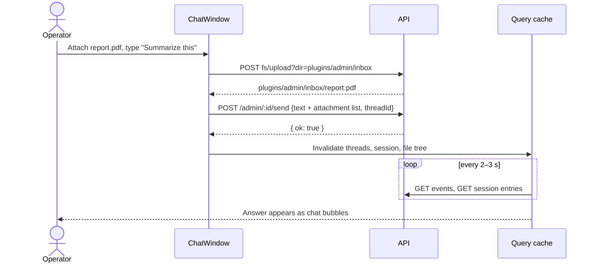

# Web low-level design

**Status:** implemented React console that refreshes by polling. [High-level design](../high-level-design.md) · [Roadmap](../roadmap.md) · [FAQ](#faq)

## In one minute

The web console is the operator's control panel. It lets you:

- start and stop agents;
- chat with an agent and read its history;
- watch the event queue;
- edit agent files;
- change settings, secrets and models.

It talks only to the [HTTP API](api.md) and never reads the database or agent files directly. It is not the optional product app in `app/`: that app has its own users and login.

The console does **not stream**. It re-reads the server every few seconds, so answers show up with a short delay.

## Responsibility and dependencies

| File | What it does |
|---|---|
| [App.tsx](../../packages/web/src/App.tsx) | Sets up React Query, routes, the login check, toasts and theme. |
| [lib/api.ts](../../packages/web/src/lib/api.ts) | One typed function per API call. Sends the session cookie and turns errors into `ApiError`. |
| [lib/auth.ts](../../packages/web/src/lib/auth.ts) | Remembers whether you are logged in: *unknown*, *anonymous* or *authenticated*. |
| [lib/session.ts](../../packages/web/src/lib/session.ts) | Turns Pi's history entries into chat bubbles and attaches tool results to their tool calls. |
| [pages/agent.tsx](../../packages/web/src/pages/agent.tsx) | Agent page: header with start/stop, plus tabs for chat, files, events, plugins and settings. |
| [chat-window.tsx](../../packages/web/src/components/chat-window.tsx) | Picks the thread and session, pages through history, and handles attachments, send/abort, usage and the per-thread model. |
| [events-table.tsx](../../packages/web/src/components/events-table.tsx) | Filters, sorts and pages events, with row and bulk actions. |
| [file-tree.tsx](../../packages/web/src/components/file-tree.tsx), [file-editor.tsx](../../packages/web/src/components/file-editor.tsx) | Browse, create files and folders, delete, and edit text (CodeMirror, loaded on demand). |
| [agent-settings-pane.tsx](../../packages/web/src/components/agent-settings-pane.tsx), [schema-form.tsx](../../packages/web/src/components/schema-form.tsx) | Settings forms built from the backend's JSON schemas. |
| [settings.tsx](../../packages/web/src/pages/settings.tsx), [models.tsx](../../packages/web/src/pages/models.tsx) | Harness timezone, Google Workspace client, model credentials, enabled models and model sign-in. |

**One rule to remember:** the server is the source of truth. React Query caches what the server returned. Component state only holds things you haven't sent yet, such as drafts, selections and pending attachments. Automatic retries and refetch-on-focus are off. After a successful change, the console invalidates the related queries so they re-read.

## Lifecycle 1: opening the console and logging in

1. The app starts by calling `GET /api/auth/me` and shows "loading…" until it gets an answer.
2. If you are logged in, it shows the app. If not, protected pages send you to `/login`, remembering where you were going.
3. Logging in calls `POST /api/auth/login`, and the server sets the `pi_sid` cookie.
4. **Any** later request that returns 401 (for example, an expired cookie) sends you back to `/login`.

| Route | Page |
|---|---|
| `/login` | Login (public) |
| `/` | Agent list |
| `/agents/:id/chat` (also `files`, `events`, `plugins`, `settings`) | One agent. The old `/queue` route redirects to `events`. |
| `/settings`, `/settings/models` | Harness settings and models |
| anything else | Redirects to `/` |

The login check in the browser only affects navigation. The server enforces authentication on its own. The browser never holds the product app's bearer secret.

## Lifecycle 2: sending a message and seeing the answer

```mermaid
sequenceDiagram
    actor Operator
    participant Chat as ChatWindow
    participant API
    participant Cache as Query cache
    Operator->>Chat: Attach report.pdf, type "Summarize this"
    Chat->>API: POST fs/upload?dir=plugins/admin/inbox
    API-->>Chat: plugins/admin/inbox/report.pdf
    Chat->>API: POST /admin/:id/send {text + attachment list, threadId}
    API-->>Chat: { ok: true }
    Chat->>Cache: Invalidate threads, session, file tree
    loop every 2–3 s
        Cache->>API: GET events, GET session entries
    end
    Cache-->>Operator: Answer appears as chat bubbles
```

1. **Upload.** Each attachment is uploaded to `plugins/admin/inbox/` first. Upload and send are separate requests.
2. **Send.** The console appends the file paths to your text as an `attachments:` list and posts `{ text, threadId, channelId }` to `/admin/:id/send`. The reply `{ ok: true }` only means the server handled the request. It doesn't mean the message was queued safely or answered.
3. **Refresh.** Thread, session and file-tree queries are invalidated.
4. **Poll.** The Events tab and the open session keep re-reading. You'll see the event go `queued` → `in_flight` → `done`, and the answer appear once Pi has written it.
5. **Render.** `flattenSession()` shows only `message` entries; other Pi entry types (headers, custom entries) are never shown. Tool results are attached to the tool call with the same ID. If the matching call is outside the loaded window, the result is hidden. So the chat is a *view* of the history, not the full record.

The chat opens the newest 100 entries. **Load 100 more** asks for a bigger window. Clicking an event's link loads the whole session so it can jump to that entry.

If send fails after the upload succeeded, the file stays in the inbox.

### How often things refresh

| Data | Query key | Refresh |
|---|---|---|
| Agent list | `['agents']` | 5 s on the home page; 30 s in the sidebar |
| One agent | `['agent', id]` | 3 s |
| Threads | `['threads', id]` | 5 s |
| Plugins | `['plugins', id]` | 5 s on the plugins tab; not polled in the settings pane |
| Open session | `['session', agent, thread, session, …]` | 3 s while a session is selected |
| Events | `['events', agent, params]` | 2 s (keeps showing the previous page while loading) |
| Thread usage | `['usage', agent, thread]` | 5 s while the panel is open |
| Model sign-in status | — | 1 s while a sign-in is pending |
| File text, settings | scoped keys | Only when loaded or invalidated |

These are how often the console asks, not promises about how fast the agent answers.

## Lifecycle 3: changing settings

1. The form is generated from the backend's schemas: agent config, plugin `configSchema` and `secretsSchema`, and the model catalog.
2. Secrets arrive as `********`. If you leave a field alone, the form sends `********` back, which means "keep it". If you type a new value, it replaces the old one. Clearing a field deletes it.
3. **Save.** The server writes the file and reloads the affected agent or plugin. An agent reload waits until the agent's current work finishes.
4. The console re-reads agent and plugin state. **"Saved" does not mean "active".** The new settings may still be waiting for current work to finish, or may have failed validation. In that case the agent or plugin shows `failed` with an error you can fix.

Model sign-in forms poll the pending sign-in every second and send your choices or pasted codes back to the server. When sign-in succeeds, the server reloads the agents that use that provider.

The **file editor** works differently from settings forms. It saves the whole file, has no conflict check, and does **not** reload anything. Use the settings forms for anything that changes how the agent runs. On mobile, the Files tab shows either the tree or the editor; on desktop it shows both.

## Errors

- Any non-2xx response becomes `ApiError(message, status, body)`, which views show as a toast or an inline message.
- A failed upload shows a generic `upload failed: <status>`.
- A button's "pending" spinner means the HTTP request hasn't returned yet. It says nothing about agent work.
- Bulk actions in Events skip `in_flight` rows. The server also refuses to change them.

## Build

[vite.config.ts](../../packages/web/vite.config.ts) forwards `/api`, `/admin` and `/webhook` to `PI_SERVER_URL` (default: the backend on port 3142). The dev server runs on port 7330. A production build is copied into the harness package's `dist-web/`, and the harness serves it unless started headless. React and the router, Markdown, and Radix are split into their own chunks. The editor loads on demand.

## Design decisions

| Decision | Why | Cost |
|---|---|---|
| One typed API wrapper | Cookies, errors and routes are handled in one place. | Types are copied from the backend by hand and can drift. |
| Polling with React Query | Easy recovery: just re-read the server. | Extra requests, delayed progress, no live tokens. |
| Render Pi's history directly | No second copy of the conversation. | Must cope with partial windows and unknown entry types. |
| Forms from schemas | New plugin settings appear automatically. | The backend stays responsible for validation. |

## Planned changes

- [Plan 1.6](../plans/06-live-interface.md): live updates over SSE, with reconnect and separate "running" and "saved" indicators.
- [Plan 2](../plans/08-session-search.md): search across history.

Neither exists today.

## Known issues and suggested improvements

Found in a code audit on 2026-09-28. **Severity** is how much it can hurt: *High* = lost work, security exposure or a wrong result; *Medium* = confusing or wasteful behavior; *Low* = cleanup. None of these is fixed yet. When one is fixed or scheduled, update this table and the [roadmap](../roadmap.md).

| # | Type | Severity | Problem | Why it matters | Suggested change |
|---|---|---|---|---|---|
| 1 | Bug | Low | The comment in `lib/api.ts` says a 401 calls `onUnauthenticated` "once", but it fires on every 401. | Misleading for contributors; several parallel 401s trigger several redirects. | Fix the comment, or actually debounce the redirect. |
| 2 | Risk | Medium | Upload and send are separate requests with no idempotency. | A failed send leaves an orphaned file; retrying can duplicate the message or overwrite the upload. | Send with an idempotency key and a unique upload name (depends on the API change). |
| 3 | Risk | Medium | Polling only, at 2–5 s per open view. | Delayed feedback and constant load with many tabs open. | Live updates over SSE ([plan 1.6](../plans/06-live-interface.md)). |
| 4 | Risk | Medium | The file editor saves the whole file with no conflict check. | Silently overwrites changes the agent made while you were editing. | Send the loaded file's hash and show a conflict dialog (needs the API change). |
| 5 | Risk | Low | Tool results whose tool call is outside the loaded window are hidden; non-message entries are never shown. | The chat can look incomplete compared with the raw history. | Show a "load earlier context" marker for orphaned tool results. |
| 6 | Risk | Low | The sidebar polls the agent list every 30 s but the home page every 5 s. | Agent state can look different in two places at once. | Use one interval for the shared `['agents']` query. |
| 7 | Risk | Low | API types are copied from the backend by hand. | The console can silently drift from the API. | Share types from one package or generate them. |
| 8 | Risk | Low | Upload errors show only `upload failed: <status>`. | Hard to diagnose. | Show the server's error message. |
| 9 | Bug | Medium | The file editor's **Reload** button refetches the file but doesn't replace the text you're looking at. | You keep editing the old content and can overwrite the agent's newer version. | Replace the editor content on reload (warning if there are unsaved changes). |
| 10 | Bug | Low | The sidebar's empty-state hint hard-codes `~/.cognisphere/default/agents/`. | Wrong path for any other root or deployment ID. | Show the real path from the server. |
| 11 | Risk | Low | The server prefers `packages/harness/dist-web` over `packages/web/dist`. A `dist-web` left over from `pnpm pack` hides later console rebuilds in the monorepo. | "My UI change doesn't show up" when serving from the monorepo. | Delete `dist-web` after packing, or prefer the newer of the two. |

## FAQ

### Using the console

#### I clicked Send. Why is there no answer, or no event at all?

Answers appear only when polling sees them in the saved history, so check the Events tab first:

- If the event is `queued`, the agent hasn't started it yet.
- If it's `in_flight`, the agent is working on it.
- If it's `failed`, the event shows the error.

If no event appears at all, check that the agent and its admin plugin are running, and read the server logs. A successful send is not proof the message was queued ([core FAQ](core.md#faq)).

#### Why does something look out of date?

The console re-reads each view on a timer, and some things aren't re-read at all ([refresh table](#how-often-things-refresh)). Refetch-on-focus is off, so a tab left in the background shows the last result until its next timer. An open file is not re-read when the agent changes it, and the editor's **Reload** button doesn't replace text that is already open. Reload the browser page to get a fresh copy of everything.

#### How do I switch threads, start a new one, or read older sessions?

- **Switch:** pick a thread from the list (a dropdown on narrow screens). The search box filters by thread ID, and task threads are nested under the thread that started them.
- **New thread:** click **New** above the thread list and type an ID. The thread only exists on the server after you send the first message.
- **Older sessions:** use the session picker in the thread header. Older sessions are read-only; switch back to the latest one to send.

An event's link in the Events tab opens the chat at that exact message.

#### Will closing the tab stop my agent? Will drafts survive a refresh?

Closing the tab doesn't stop anything; use the abort button to cancel running work. Drafts, staged attachments and unsaved editor changes live only in the page, so a refresh loses them.

#### How do attachments work?

Each file is uploaded to `plugins/admin/inbox/` before the message is sent, and the file paths are appended to your text as an `attachments:` list. A file with the same name overwrites the old one. If the upload worked but Send failed, check the Files tab and Events before retrying: sending again can create a duplicate message. Behind the shipped nginx setup, files over 1 MB fail with `upload failed: 413`. The Files tab has no upload button.

#### How do I change the model?

- **Agent default:** the agent's Settings tab.
- **One thread:** the model picker in the thread header. It lists the enabled models of every configured provider; "Agent default" clears the choice. You can set a thinking level only while a thread model is chosen.

Models must first be enabled on the Models page (Settings, then Models). A change applies from the next batch, never the one already running. A brand-new thread can't take a model until its first message has been sent.

#### What can I do in the Events tab?

- **Retry:** set a row's status to `queued`. It keeps the same thread and sends the original text again.
- **Mark or remove:** set `done`, `failed` or `cancelled`, or delete the row. Delete has no confirmation step.
- **Stop running work:** `in_flight` rows show an abort button instead of delete.
- **Bulk actions:** select rows, then set status, delete or abort. Status and delete skip `in_flight` rows.

To reset a whole conversation, delete the thread in Chat. That removes its history and events, but not shared files or anything already sent outside. Read the [core retry rules](core.md#faq) before replaying work with side effects.

#### Is it safe to edit agent files here?

For free-form files, mostly. Save writes the whole file, has no conflict check and reloads nothing, so it can silently overwrite a change the agent made meanwhile ([known issue 4](#known-issues-and-suggested-improvements)). Use the Settings tab for `agent.json`, plugin config and secrets, because those saves reload the agent. Hidden files and folders (names starting with `.`) aren't listed. Binary files and files over 4 MiB show a download link instead of the editor.

#### How do I add an agent or turn on a plugin?

The console can't create agents. Run `cognisphere agent new <name>` and restart the server ([CLI](cli.md#cli)). To turn on a plugin that the harness already has:

1. In the Files tab, create `plugins/<plugin>/config.json`.
2. Fill in its secrets in the agent's Settings tab.
3. Press Restart in the agent header (Start, if the agent is stopped).

#### Is there a dark mode? Does it work on a phone?

Yes to both. The light/dark switch is at the bottom of the sidebar and on the login page. It starts from your system setting and is remembered in this browser. On a narrow screen the sidebar opens from the menu button, threads are a dropdown, and the Files tab shows either the tree or the editor.

### Frontend developers

#### How do I run the console in development?

From the repository root, run `pnpm dev` (the server on port 3142) and `pnpm dev:web` (Vite on port 7330), then open `http://127.0.0.1:7330` and log in there. Vite forwards `/api`, `/admin` and `/webhook` to `PI_SERVER_URL` ([Build](#build)). `cognisphere dev`, run with the repository's CLI, starts both for you.

#### I rebuilt the console, but the server still shows the old one.

The server serves `packages/harness/dist-web/` if it exists, and falls back to `packages/web/dist` only if it doesn't. `pnpm pack` leaves `dist-web/` behind, so a later `pnpm build:web` doesn't show up. Delete `packages/harness/dist-web/`, or use the Vite dev server. Published packages get a fresh `dist-web/` when they are packed.

#### I'm adding a screen. Where do queries and mutations go?

1. Add a typed function to `endpoints` in `lib/api.ts`. The API types there are copied from the backend by hand ([known issue 7](#known-issues-and-suggested-improvements)).
2. Add the route in `App.tsx` (or in `pages/agent.tsx` for an agent tab).
3. Use a query key that names what it's scoped to, and invalidate the affected keys after a change.
4. Show `ApiError` and pending states in the view.

Run `pnpm check`, and keep the [API doc](api.md) in sync.
