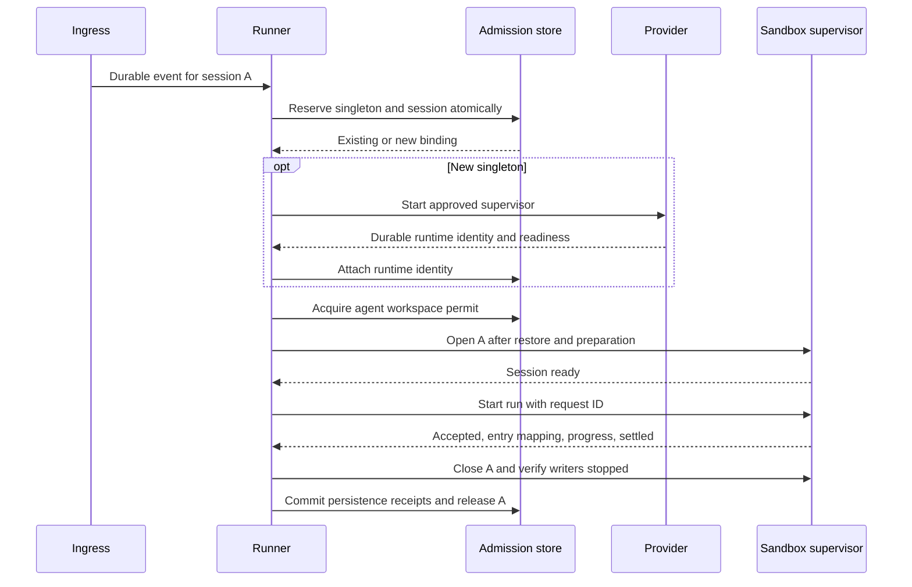

# Plan 1.1: shared execution contract and Pi SDK host

**Status:** planned; no provider cutover has shipped. **Depends on:** none for contract/parity work; production activation also requires plans 1.2–1.4 and the cutover checks. **Layers:** [core](../low-level/core.md), [agents](../low-level/agents.md), [CLI](../low-level/cli.md). [Roadmap](../roadmap.md#1-sandbox-implementation). [FAQ](#faq).

## Objective and design decision

Replace `AgentRunner.spawnPi()` and `PiRpcClient` with shared orchestration, `AgentSandboxManager`, a `RuntimeProvider` registry, and `AgentHostClient`. Integrate the pinned Pi SDK directly inside the execution child. Do not build a remote stock `pi --mode rpc` stage or run the untrusted SDK/tool loop inside the trusted server.

The Process adapter is the first parity target and is labeled **Process [no sandbox]**. Docker uses the same host and commands. Queueing, delivery correlation, routing, steering, cancellation, retries, and persistence sequencing stay above the adapter. The current RPC path stays only until verified cutover, then is removed; there is no automatic fallback to RPC or host execution after a runtime failure.

## Session placement and capacity

A **logical session** is an agent/thread conversation with its own Pi history. A **run** is one batch/turn of that session. A **sandbox** is the sole Process supervisor or Docker container assigned to the agent. Workspace identity belongs to the agent, independently of any session, run or sandbox generation.

Proposed `agent.json` settings (not accepted by the shipped runtime yet):

```json
{
  "maxConcurrentSlots": 1,
  "sandbox": {
    "maxSessionsPerSandbox": 4,
    "lifecycle": { "mode": "idle", "idleMinutes": 15 }
  }
}
```

| Setting / invariant | Meaning |
|---|---|
| One sandbox per agent | At most one allocated/provisioning/live sandbox generation for `(harnessId, agentId)`. This is mandatory, not an autoscaling setting. No `maxSandboxesPerAgent` option. |
| `sandbox.maxSessionsPerSandbox` | Positive integer; proposed default **4**. Limits admitted live session reservations in the sole sandbox. Excess sessions remain queued. It does not permit concurrent workspace writers. |
| `maxConcurrentSlots` | **1**, required by the initial shared-workspace profile. Reject larger values rather than imply arbitrary concurrent shell commands are conflict-safe. |
| `sandbox.lifecycle` | `idle` (proposed default, 15 minutes), `per_turn`, or `always_on`. Compute lifetime is independent of workspace and history lifetime. |

Admitted slots include reserved, waiting-for-workspace, starting, running, finalizing and `persistence_pending` sessions. Archived/inactive history does not consume capacity. Workspace execution is a separate permit: several session slots may wait while one run holds it. Waiting sessions receive no tool capability and run no agent extensions, shell commands or initialization code. Closing a turn releases its session slot after required persistence; subsequent events can reopen the same logical history in the same sandbox.

1. Persist the event and resolve its trusted agent/thread/logical-session key. An event for an already admitted session reuses its slot; an actively executing session receives a steer or queued follow-up under the existing rules.
2. Under a trusted database transaction, reserve the agent's singleton sandbox if absent, or attach to its existing/provisioning record. Provider calls run outside the transaction; concurrent arrivals observe the reservation instead of creating duplicates.
3. Reserve a session slot if capacity permits. Otherwise retain work in the queue. A new session waits for the workspace permit even when it has a slot. Avoid starvation with FIFO ordering within existing priority classes; finalize turns before admitting an unlimited stream of steers.
4. When the permit becomes available, reconcile prior writers, acquire the workspace lease, then prepare/read current files and start that session's Pi child. Check both sandbox and child readiness before prompting.
5. Preserve the session binding through settlement, child cleanup and persistence. Events arriving during finalization stay queued. Release the permit and slot only after successful durability and verified writer cleanup, then schedule the next session.

With `maxSessionsPerSandbox: 2`, S1 runs in A-box-1 and S2 can wait there. S3 stays in the queue. When S1 persists and closes, S2 runs in **the same A-box-1 and cwd**, sees S1's saved changes, and S3 can take the free admission slot. Another event for S1 never creates A-box-2. Agent B has its own singleton and workspace.

Record each sandbox's launch capacity. Effective admission capacity is the smaller of launch capacity and the current configured limit. Reductions drain without killing sessions; increases beyond launch capacity require a drained replacement. Profile/image/asset updates also drain the old generation. A replacement starts only after provider-confirmed termination/resource release of the old generation; no overlapping warm replacement is allowed. Stopped historical records and durable data may remain.

## Shared interfaces and ownership

[Runtime contracts](runtime-contracts.ts) define `SessionKey`, `RunIdentity`, `SandboxIdentity`, `AgentSandboxStore`, `RuntimeProvider`, `AgentHostClient`, and provider skeletons. They are design references, not implemented OS/Docker/storage drivers.

| Component | Proposed responsibility |
|---|---|
| `AgentRunner` | Select durable work and execute one full workspace turn using the shared services. |
| `AgentSandboxManager` | Reserve/reuse one sandbox, admit bounded sessions, route later events to existing reservations, coordinate drain/recovery. |
| `AgentSandboxStore` | Transactional singleton/slot state, generation and fence checks, receipt-based release. |
| `RuntimeProvider` | `ensureRuntime`, `start`, `inspect`, `stop`, `dispose`, `listOwned` for the entire supervisor. |
| `AgentHostClient` | Session open/start/steer/abort/state/close; sandbox drain/shutdown; normalized events. |
| `PiSdkSessionHost` | File-backed SDK session, approved resources/extensions, nonblocking command processing, delivery/settlement observations. |

Proposed control records include singleton identity/compatibility/provider reference, launch capacity, state, session reservations, run IDs, and fences. Enforce uniqueness on `(harnessId, agentId)` for the allocated singleton and on live session binding; do not include profile/image in singleton uniqueness. Persist reservations before provider calls and keep those calls outside database transactions. See [workspace fencing](02-workspace-and-provisioning.md) and [archive receipts](03-session-archives.md).



## Pi host and transport

Use the SDK directly **inside the execution environment**, not inside the trusted harness server. In Docker this is a child process within the agent's sole container; Process runs the same child as an explicitly trusted local runtime. Keep `AgentHostClient` as a narrow versioned transport across that boundary. It is our command/event channel, not the stock Pi CLI RPC protocol. Local pipes or an authenticated remote stream can carry it without changing session behavior.

Use a small file-backed SDK host in both providers. Each session has its own Pi instance and history, while `SessionManager.open(file, sessionDir, cwdOverride)` receives the **same agent workspace cwd**. Pi continues to own serialization, compaction and conversation history. Restoring one session's JSONL never rolls back the shared workspace to that session's older view.

The supervisor accepts session open/prompt/steer/abort/state/close commands plus distinct sandbox drain/shutdown commands. Frames identify sandbox generation, logical session, run/fence, request and per-run event sequence. Reject delayed frames after reuse; bound buffers and frame sizes. Preserve the existing delivery mapping and `doNotSteer`/silent-input behavior. Transport acknowledgments, SDK input acceptance, session settlement and durable run completion are distinct states; a reconnect must not blindly replay an uncertain prompt.

The initial SDK integration targets the installed/locked `@earendil-works/pi-coding-agent@0.84.4`. Keep the host, SDK and runtime image versions compatible; exercise changes through the same integration fixtures before upgrading.

| Harness operation | SDK host behavior |
|---|---|
| Open session | After acquiring the workspace lease, call `createAgentSession` with explicit cwd, file-backed `SessionManager`, resource loader, settings, model runtime and allowed tools. Bind approved extensions before reporting ready. |
| Prompt | Call `session.prompt`; retain and handle its completion/rejection without blocking the command reader from receiving steer/abort. Do not acknowledge model completion merely because the command was received. |
| Steer / follow-up | Use `session.steer` or `session.followUp` according to harness policy; waiting logical sessions still remain in the harness queue. |
| Events / entry mapping | Subscribe through `session.subscribe`, then reconcile newly persisted user entries with `session.sessionManager.getEntries()` at verified post-append points. In 0.84.4, ordinary message events precede persistence and `entry_appended` is emitted for custom extension entries, not every message. Retain the existing verified user-entry sweep until its SDK-host replacement passes initial/steered input correlation tests; do not infer persistence from event names alone. |
| State | Read the SDK session state and active session/file/leaf identifiers; expose only the fields needed by the harness. |
| Abort / close | Use bounded SDK abort/shutdown/disposal, then verify child/descendant termination externally before releasing the workspace gate. `dispose()` alone is not proof that background writers stopped. |

Configure resources explicitly so SDK defaults cannot discover ambient global credentials or unapproved workspace extensions. Model credentials remain brokered. Do not implement a second conversation serializer, compactor or model loop in the host. If a future feature replaces the active SDK session object, rebind its event subscription and approved extensions before admitting input.

Wait for session-level `agent_settled`; `agent_end` can precede automatic retries or compaction. Capture active file/session/leaf mappings before orderly child close. Waiting sessions cannot execute tools while another owns the gate. If dormant SDK children are retained later, they need an enforceable quiescence boundary; the baseline keeps waiting sessions as supervisor metadata and starts agent code only after permit acquisition.

Use distinct per-session HOME/config, browser profiles, socket names and temporary paths; allocate ports rather than assuming every session owns the same listener. Project files, memory and project dependencies are shared. Long-lived processes with workspace write access must retain explicit ownership or stop before handoff. Multiple logical sessions do not imply multiple simultaneously executing Pi turns.

## Implementation sequence

[Plan 1.8](10-agent-simplification.md#3-main-agent-and-sub-agent-configuration) builds on this host with exact role-specific resource manifests and asynchronous specialist delegation. The parent closes/persists and releases admission before a child takes the same sandbox's writer gate, including at capacity one; it is not a parallel SDK execution path.

1. Extract runner policy from child creation while preserving current notification/attempt fixtures.
2. Implement transactional admission and the SDK host/transport with explicit protocol version, generation, run fence, request ID, frame limit, and event sequence validation.
3. Implement the Process driver with PID plus start identity, declared capabilities, and verified stop behavior. An anonymous stdio connection is not reconnectable; use an authenticated reconnect channel or stop the orphan before replacement.
4. Add input correlation: initial prompt groups, steers, continuation nudges, undelivered input, and late frames after close. Tie entry evidence to the actual persisted user entry rather than a receipt acknowledgment.
5. Wire volume, archive, broker, and event services from later plans. Cut over only after the full lifecycle contract passes; remove RPC launch/reporting code after parity.

## Failure handling and acceptance

An uncertain provider creation holds the singleton reservation until owned process/container identity is reconciled. A disconnected accepted prompt is not blindly replayed. A stale frame cannot change a newer run. Waiting sessions execute no extension/bootstrap/tool code. Capacity reductions drain; increasing past launch capacity requires a drained replacement with confirmed old-process exit.

Acceptance fixtures must cover restored host-path JSONL with runtime cwd override, initial and steered input mappings, silent/no-steer behavior, cancellation, compaction/retry before `agent_settled`, prompt uncertainty, child crash, late frames, and cleanup. With capacity 2, A and B share one runtime, C waits, and a second event for A reuses its slot. Assert at most one singleton and one workspace writer through admission races, finalization, and restart.

The SDK baseline is the installed/locked 0.84.4 behavior, not a promise about future versions. Revalidate event ordering and resource/credential discovery against the actual locked package whenever it changes. Session capacity and idle defaults remain proposed settings until schema/API implementation lands.

## FAQ

These answers explain the proposed SDK runtime for implementers and operators. Its settings and services are not yet available in the shipped runner.

### Why import the Pi SDK instead of first putting today's RPC process in Docker?

The chosen target needs explicit session/resource/model ownership and a lifecycle boundary that includes settlement and persistence. A direct SDK host provides that integration point while one harness-owned transport works for Process and Docker. Building a remote stock-RPC layer first would add an intermediate architecture to migrate away from; current RPC remains only for verified cutover.

### What do the proposed capacity and lifecycle parameters mean?

| Parameter | Intended effect |
|---|---|
| `sandbox.maxSessionsPerSandbox` | Positive admission limit; proposed default 4. Includes reserved, waiting, starting, running, finalizing, and persistence-pending sessions. |
| `maxConcurrentSlots` | Must be 1 in the initial shared-workspace profile; bounds executing turns separately from admission. |
| `sandbox.lifecycle.mode` | `idle`, `per_turn`, or `always_on` controls whole-sandbox compute lifetime. |
| `sandbox.lifecycle.idleMinutes` | Proposed default 15 in idle mode; timer begins only when all ownership/persistence obligations are clear. |

There is no `maxSandboxesPerAgent` scaling option: the single sandbox is an invariant. These are proposed semantics, not extra settings today's runner will enforce.

### If capacity is 2 and three sessions arrive, what happens?

A and B reserve the same agent sandbox; only the current workspace owner executes. C stays durably queued until an admission slot is released. A follow-up for an already admitted A reuses A's reservation and follows steering/queue policy; it does not consume another slot or create another sandbox.

### Does an old conversation permanently occupy a session slot?

No. Archived/inactive history consumes storage but no live admission capacity. A reservation lasts through waiting, execution, cleanup, and required persistence; later input can reopen the logical history. Releasing capacity must not discard the stable conversation identity or its history.

### Can I lower capacity, raise it, or change assets while work is running?

A reduction stops further admission as needed and drains without evicting existing sessions. Effective capacity is bounded by the smaller of configured and launch capacity; increasing beyond launch capacity requires drained replacement. Incompatible asset/profile changes also wait for the old generation to stop before a replacement starts.

### Why are there sandbox generations, run IDs, and multiple fences?

They identify different ownership lifetimes. Sandbox generation distinguishes compute incarnations, run ID identifies the batch attempt, session fence distinguishes a session binding, and workspace fence distinguishes the current writer. A delayed message must match the live binding across these dimensions before it can affect state; one matching agent name is insufficient.

### When may an SDK child start, and can waiting sessions preload extensions?

Only after admission, workspace permission, restore, and approved preparation. Waiting sessions are supervisor metadata in the baseline and do not run Pi initialization, extensions, or tools. Preloading arbitrary session code before the gate could read stale shared files or create uncontrolled writers, even if no prompt has been sent.

### Why is `agent_settled` different from `agent_end` or a prompt acknowledgment?

A command acknowledgment shows acceptance, while `agent_end` can precede automatic retries or compaction-related continuation. The host waits for session-level settlement before closing/capturing the run. Even settlement is not durable completion: descendant cleanup and archive/workspace receipts still have to finish.

### How should I correlate queued inputs with Pi history entries?

Preserve the mapping from initial input groups and steers to actual persisted user-entry IDs. For the target 0.84.4 behavior, sweep `sessionManager.getEntries()` at verified post-append points; ordinary message events occur before persistence, and `entry_appended` does not report every ordinary message. Cover restored history and mixed initial/steered inputs in parity tests before removing the current reporting bridge.

### What if the command channel disconnects after my prompt was accepted?

Treat the outcome as uncertain and reconcile session/run state and delivery evidence. Do not blindly replay the prompt or start another runtime while the old writer may still exist. Reconnect needs an explicit authenticated channel; with unrecoverable stdio, externally stop and reconcile the old process before replacement.

### I am implementing an adapter. Which logic belongs in it?

Implement runtime preparation, whole-supervisor start/inspect/stop/dispose, identity discovery, and truthful capability reporting. Keep queue selection, steering decisions, attempts, workspace coordination, and storage sequencing in shared orchestration. A provider failure must not silently switch to the old RPC path or trusted host execution.
