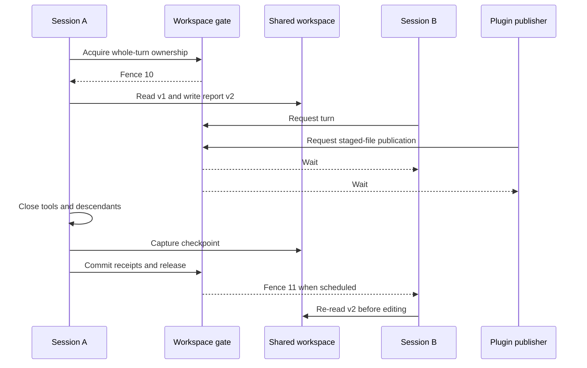

# Plan 1.2: persistent workspace and native provisioning

**Status:** planned. **Depends on:** [1.1 execution identities/admission](01-sdk-runtime.md). **Layers:** [core](../low-level/core.md), [agents](../low-level/agents.md), [plugins](../low-level/plugins.md), [API](../low-level/api.md), [CLI](../low-level/cli.md). [Roadmap](../roadmap.md#1-sandbox-implementation). [FAQ](#faq).

## Objective and contracts

Give each agent one persistent shared workspace, separate session histories/profiles, immutable approved asset releases, and versioned native dependencies. Every managed workspace reader/writer in an executing turn participates in one agent-wide writer gate. Session capacity is independent of execution permission.

[Plan 1.8](10-agent-simplification.md#1-base-assets-workspace-and-images) extends this layout with all agent/plugin defaults in the selected base release, workspace prompt/skill/script overrides, and post-base image installation steps. It owns resolution/order and base-publication permissions; this plan owns persistence and writer coordination.

[Runtime contracts](runtime-contracts.ts) define `AgentVolumeProvider.prepare/sessionPaths/checkpoint`, `AgentPaths`, `SandboxPaths`, `WorkspaceWriteLease`, `RuntimeRecipe`, `MemoryProvider`, and `PluginWorkspaceManager`. These providers prepare directories and capture revisions; they do not serialize Pi conversations. Lease ownership/fencing is enforced by trusted control state, not a lock file a shell command can ignore.

## Data boundaries

```text
<harnessRoot>/
  control/
    runs.db                           queue, singleton, slots, writer leases,
                                      operation/event records and workspace head
    plugins/<agent>/<plugin>/         private cursors, schedules, authorization
    secrets/                          protected credentials / vault references
    incoming/<agent>/<file-id>/        durable attachment staging
    archives/                         optional local archive backend
  runtime-installations/<agent>/<platform>/<recipe-hash>/
                                      approved versioned Process dependencies
  agents/<agent>/
    agent.json                        operator-controlled settings
    assets/releases/<revision>/       approved immutable runtime assets
    workspace/                        one cwd shared by every session
      files/ scripts/ skills/ prompts/ shared agent-authored work and overrides
      install/ config/ resources.json image steps, nonsecret preferences, resource additions
      memory/ .deps/                  shared notes and project dependencies
      plugins/<plugin>/               attachments/, files/, rebuildable cache/
    sessions/<thread>/<session>/       separate live Pi JSONL histories
    profiles/<thread>/<session>/       separate HOME/browser state; credentials policy applies
    runs/<run>/spec/                   nonsecret run settings
    scratch/<session>/<run>/           temporary session files
```

| Resource | Process | Docker |
|---|---|---|
| Assets | Resolved immutable release | `/assets` packaged in read-only image; versioned read-only mount is an alternative |
| Shared workspace / cwd | Agent `workspace/` | `/workspace`, read-write |
| Session histories | Agent `sessions/<thread>/<session>` | `/sessions/<thread>/<session>`, Pi-writable |
| Run specification | Nonsecret per-run directory | Preplanned read-only transfer root or supervisor channel |
| Session profiles/scratch | Scoped directories | Separate writable roots from the shared cwd |
| Dependencies | Approved native installation | `/opt/runtime` in a pinned image; project installs use the gate |

Plan mounts when the sandbox starts; opening a session does not add Docker bind mounts. Never expose the control database, other agents, host HOME, Docker socket or real harness credentials. Build an allowlisted environment instead of spreading `process.env`; disable ambient credential/global Pi discovery.

Same-agent sessions share trust and can potentially access one another's files or grants under the same OS identity. Paths and routing prevent accidental mixing, not malicious-session isolation. Keep secrets in the trusted broker. Approved Pi extensions come from immutable assets; workspace scripts must never become privileged host hooks.

The Docker baseline allows Pi to write history and ordinary tools share its identity. Strict workspace-only tools need a separate execution identity/service without session mounts. Process is explicitly trusted/unsandboxed and cannot claim host isolation or enforceable immutability for same-owner assets.

## Why a single sandbox alone does not avoid conflicts

Two processes in the same container can both read version 1 of a file, independently edit it, and overwrite each other's changes. Git operations, package installs, generated output, browser profiles and shared memory files have similar conflicts. A common filesystem removes divergent copies, but it does not serialize multi-step read/modify/write operations.

The initial design prevents **overlapping participating writers**, using these rules:

- Acquire the agent-wide writer lease **before reads or agent-code startup** and keep it for the entire tool-enabled turn, including installs, background descendants, workspace checkpointing and finalization. Locking only `write`/`edit` misses arbitrary shell writes and stale reads.
- Route plugin file publication, shared-memory changes, dependency maintenance and operator edits through the same gate. Downloads may continue in trusted staging; publishing into `/workspace` waits until the active turn releases it.
- Before handing ownership to the next session, close the prior child and prove workspace-writing descendants have stopped. A detached build or file watcher cannot retain untracked write access. If cleanup cannot be established, stop/fence the sole sandbox before another run.
- Re-read affected files after acquiring the lease; do not apply edits based only on old conversation snippets. For structured edits, compare the expected content/hash and reject stale updates. These checks protect instrumented edit paths, not every arbitrary shell command or mistaken model assumption. Serialization does not automatically make old model context current.
- Use safe atomic publication for individual files and durable checkpoints for recovery. Atomic rename prevents partial-file visibility; it does not merge competing semantic changes.

This prevents the harness from intentionally running conflicting turns concurrently. It is not an absolute guarantee against buggy edits, a hostile process that escapes cleanup, or a person/tool modifying the host-mounted directory outside the gate. Do not expose direct host workspace editing as a supposedly safe parallel path. Keep the workspace private to managed writers; pause/drain before manual maintenance.

**Trade-off:** sessions share files immediately, but their tool-enabled turns execute sequentially. Concurrent unrestricted turns remain unsafe. Future parallelism would require an enforced read-only execution boundary or a mutation service that coordinates all writes and validates read versions; a prompt instruction or an advisory file lock that arbitrary commands can ignore is insufficient.

## Lease algorithm and example

Persist a workspace head and a lease containing agent identity, workspace fence, owner kind, operation/run identity, and expiry. A run owner also binds the session/run fence and sandbox generation. Acquire history ownership and admission before the workspace gate in a fixed order; do not hold a database transaction while waiting on tools or storage. Renew from trusted control only.



Example: A changes `report.md` from hash H1 to H2. B's old conversation remembers H1. B must read H2 after admission; an instrumented edit carrying expected hash H1 is rejected. An arbitrary bash command can still make a bad semantic edit, so serialized execution must not be described as universal stale-write detection.

Plugin publication, memory changes, dependency installs, background jobs, and operator file APIs must use the same gate. Maintenance gets an auxiliary lease and publishes its checkpoint before release. Work that arrives while a turn runs is staged/queued. Fair scheduling and bounded turns prevent endless steers from starving publication. A turn cannot synchronously wait for another owner to acquire its own held gate: use a coordinated subordinate action at a tool boundary or return a pending receipt, as [plan 1.4](04-ingress-and-operations.md) specifies.

## Native provisioning

An approved recipe records asset revision, Pi/Node/Python versions, platform, dependency lockfile/hash, and setup entry point. Provision Process dependencies into `runtime-installations/<agent>/<platform>/<recipe-hash>/` under a provisioning lock. Build in a temporary location, verify required executables/imports and versions, then publish the new installation path. Failed setup must not mark it ready or mutate the previous approved installation.

Do not execute workspace-edited bootstrap as trusted host code. Project dependencies under shared `workspace/.deps/` are agent data and install under the workspace gate. Runtime dependencies are approved releases. Docker realizes the same recipe as a digest-pinned image in [plan 1.5](05-docker-runtime.md). Plan 1.8 permits snapshotted workspace installation steps after base/plugin setup in an isolated image builder; that permission never authorizes host bootstrap execution.

## Implementation and migration

1. Add layout manifests and safe path construction; reject traversal/symlink escapes at privileged boundaries.
2. Add transactional run/auxiliary lease operations and expected-head checkpoint commits. Start with local directories and explicit Process capability reporting.
3. Move private plugin control data and queue state outside agent-visible roots; preserve one existing workspace without per-session copies or online merges.
4. Route file APIs, plugin publication, memory hooks, and maintenance through the gate. Operator text edits need expected revision/hash validation; drain before external/manual host maintenance.
5. Provision approved native recipes, then pass explicit cwd, HOME/config, profiles, scratch, and allowlisted environment to the SDK host.

A snapshot provides capture consistency, not proof a lingering writer stopped. If child containment is uncertain, stop the whole Docker sandbox, confirm termination, checkpoint, and restart for the next turn. Process must disclose or reject guarantees its OS driver cannot enforce. Expiry alone never hands the gate to a competing writer.

## Acceptance

Verify shared files persist across runs while histories/profiles stay distinct; paths/mounts cannot expose trusted control or another agent; assets and native installations resolve to explicit releases. Repeated provisioning reuses a verified recipe and failed provisioning leaves the old installation usable. Race two sessions, a plugin publisher, a memory update, and an operator edit: only one managed owner accesses the workspace for its turn, stale expected-hash writes fail, and descendants/pending checkpoints block handoff. Finalization and storage recovery are completed in [plan 1.3](03-session-archives.md).

## FAQ

These answers describe the planned shared-workspace contract from the perspectives of agent authors, operators, and storage/runtime developers.

### Where do shared files, session history, secrets, and temporary files belong?

Use the agent's shared `workspace/` for projects, notes, scripts, and project dependencies; separate `sessions/`, `profiles/`, and scratch paths by session/run. Approved capabilities live in versioned asset releases. Queue/private plugin state and credentials stay under trusted control storage. The [boundary table](#data-boundaries) maps these roots to Process paths and Docker mounts.

### If every session has the same cwd, why do we also need a writer gate?

Shared paths prevent divergent copies but do not serialize read-modify-write operations. A and B could both read H1 and overwrite each other's edits. The gate covers the whole tool-enabled turn, including preparation reads, descendants, and checkpointing, so participating sessions do not intentionally overlap those operations.

### Can a waiting session read files or run a supposedly read-only shell command?

The baseline does not start arbitrary agent/tool code before it owns the gate. A shell command or extension described as read-only may still write or start a process, and even a stale read can later cause an overwrite. Parallel read-only execution would need an enforced boundary and a separate design, not just a prompt instruction.

### What do `assetRevision`, `recipeHash`, workspace fence, and expected hash identify?

`assetRevision` selects approved immutable capabilities; `recipeHash` identifies the dependency recipe/platform realization to provision or reuse. The workspace fence identifies the current trusted owner. An expected file hash/content check validates an instrumented edit's base. These checks complement one another; a valid lease does not prove an edit was based on current content.

### My old conversation remembers a previous file version. What should it do?

Reread the actual file after acquiring its turn's gate, then compute the edit from the current contents. If an instrumented edit expects H1 but the file is H2, reject/rebase the edit. This protects checked paths; it does not make every arbitrary shell command or model assumption semantically correct.

### How can a plugin download an attachment while another session is working?

Download into trusted staging and persist its publication intent. Publishing the final agent-visible path waits for the shared gate and checkpoint. Ingestion can therefore continue without racing the active workspace writer; the [ingress plan](04-ingress-and-operations.md#faq) explains ready-state and notification ordering.

### What if a turn calls a plugin action that also needs the workspace lock?

Do not have that action independently wait for the caller's already-held lock. Use a coordinated subordinate action under the current fence at a serialized tool boundary, or stage the result and return a pending receipt. The turn must not wait synchronously for a handoff it prevents from happening.

### Can I edit the host-mounted workspace directly or leave a file watcher running?

Unmanaged host edits bypass the planned coordination guarantee, so drain/pause before manual maintenance. A background writer must retain explicit ownership or stop before the next turn. If descendants cannot be proven stopped, recovery blocks handoff and can stop the whole container; a parent process's exit alone is insufficient.

### What happens when a lease expires or storage fails?

Expiry triggers recovery, not permission for a second writer: trusted control must establish that the previous writer can no longer act. A failed required checkpoint retains ownership and recoverable files as persistence pending. New turns wait while storage/recovery completes; see [archive recovery](03-session-archives.md#faq).

### How do I add a native dependency without running an agent-edited installer on the host?

Change the approved recipe, provision under its lock into a new versioned installation, verify readiness, and publish that installation. Failure leaves the previous approved installation intact. Project dependencies are a separate workspace concern and install under the gate; workspace-edited bootstrap must never become a trusted host provisioning hook.

### If I restore one older conversation, do its old workspace files come back?

No. Its history restore selects that session's JSONL, while the shared workspace follows its independent latest validated head. Restoring the whole workspace is a drained exclusive recovery operation with an explicitly selected revision. This prevents one session from silently rolling back another's newer files.
