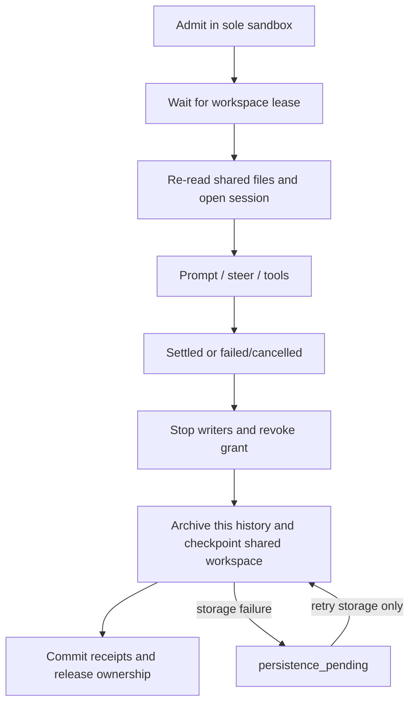
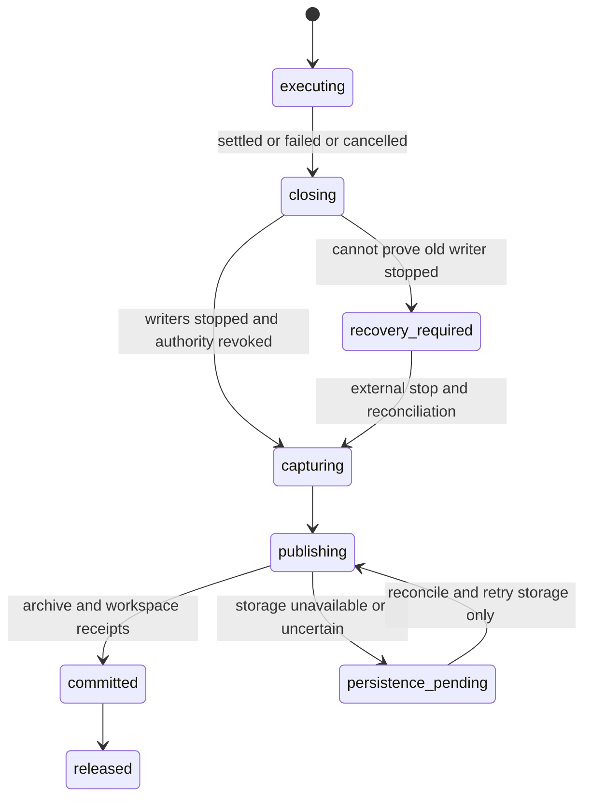

# Plan 1.3: session archives and recovery

**Status:** planned. **Depends on:** [1.1 SDK lifecycle](01-sdk-runtime.md) and [1.2 writer/volume contracts](02-workspace-and-provisioning.md). **Layers:** [core](../low-level/core.md), [agents](../low-level/agents.md), [API](../low-level/api.md). [Roadmap](../roadmap.md#1-sandbox-implementation). [FAQ](#faq).

## Objective and data model

Keep Pi responsible for live JSONL while making history restorable through local, cloud, or database archival. Keep the shared workspace's latest validated head independent of any one conversation. Database archival is optional in this stage; derived search belongs to [plan 2](08-session-search-memory.md).

[Runtime contracts](runtime-contracts.ts) define `SessionStorageManager.beforeBatch/afterBatch`, `SessionFiles.prepare/capture`, `SessionArchiveStore.load/save`, `ArchiveWrite`, `ArchiveHead`, and `SessionReleaseReceipt`.

| Record | Required information / invariant |
|---|---|
| Session key | Agent/thread/logical-session identity, within a trusted harness namespace; survives sandbox replacement. |
| Run identity | Run ID, session fence, sandbox generation/binding, workspace fence. Reject mismatched identity before saving. |
| JSONL file | Safe relative path, original bytes, SHA-256, Pi header session ID when present. Preserve all touched/new/switched files and lineage. |
| Archive revision | Integrity (`valid`/`partial`), active relative file, files, outcome. No reserialization from UI messages. |
| Archive write | Expected head, idempotency key such as `<run>:final`, restore eligibility, run and workspace ownership. |
| Heads | Latest stored revision may be partial; restorable session revision remains the latest validated eligible one. Workspace has its own head. |
| Run receipt | Archive revision or explicit no-transcript result, required workspace revision, grant revocation and verified closure. |

The reference `SessionKey` omits a harness field; adapters must receive a trusted harness namespace and include it in physical keys/access checks. A database/object store shared by deployments must never collide on just agent/thread names.

## Batch flow and persistence

1. Claim the logical session's history lease and a sandbox admission slot; acquire the agent-wide workspace lease in a fixed order before any workspace reads, initialization or agent-code execution.
2. Reconcile prior writers/live files. Restore that session's history and resolve approved runtime assets. The workspace follows its independent current head, not the age of this session's transcript. Restore the whole workspace only during exclusive recovery.
3. Prepare memory and required staged plugin inputs under the held gate, then mint a short-lived run capability and start the session child. A publisher acting for this run is a coordinated subordinate, not a second independent lease owner; serialize writes with child startup/capture. Inputs arriving during execution remain staged for later publication.
4. On settlement, block new steers for this run and preserve its active session mapping. Allow bounded orderly finalization; abort revokes action authority immediately. Close writers and revoke normal-run grants before slow persistence work.
5. With plugin publication and maintenance excluded, capture this session's original JSONL bytes and a consistent shared-workspace checkpoint. A guest-reported child exit does not prove that detached writers are gone: enforce quiescence with external stop/freeze or storage snapshot facilities as required. A storage snapshot gives a consistent capture, not permission for a lingering writer to overlap the next turn. If child containment/cleanup cannot be established, stop the sole Docker sandbox, confirm termination, checkpoint, then restart for the next turn. Process profiles disclose/reject guarantees they cannot enforce.
6. Archive with checksums, idempotency and expected-head revisions; commit a run receipt referencing both its session archive and workspace revision. Keep workspace and session restore pointers separately. Do not report durable completion or grant the next writer before the required receipts exist.
7. Release ownership and the session slot, then allow queued publications/maintenance or the next session to acquire the gate. Apply sandbox lifecycle only when work and persistence obligations are clear.

A storage failure retains the workspace gate, slot and recoverable files as `persistence_pending`; subsequent tool turns wait. Revoke tool authority and retry storage only, not model execution. Empty transcripts are recorded without inventing history. Preserve partial captures for inspection, but retain the last validated restorable head.

Pi owns all touched/new/switched JSONL files and lineage. Raw bytes are authoritative; streamed UI messages are not a restore artifact. Local archives publish atomically; cloud archives verify uploaded objects before manifests; databases transact bytes and metadata. An external action receipt is independent of both archives: uncertain delivery is reconciled, not repeated just because a checkpoint failed.

An older session can resume against newer shared files. It must re-read them before edits. Likewise, rolling back one conversation does not roll back another session's file changes; whole-workspace rollback requires a drained, exclusive operation and explicit revision selection.

## Adapter publication rules

| Backend | Commit design | Retry behavior |
|---|---|---|
| Local | Write captured files and manifest to staging, verify checksums, then atomically publish the manifest/head with expected-revision enforcement. Define directory/file durability at the selected filesystem boundary. | A committed idempotency key returns the original revision; incomplete staging is recoverable/collectable. |
| Cloud | Upload immutable objects, verify bytes/metadata, then conditionally publish manifest and head. Never expose a head pointing to missing objects. | Lost acknowledgment reconciles by idempotency key before upload/head retry. |
| Database | Transactionally store raw bytes, file metadata, manifest, idempotency key, and expected-head update. | Conflict does not overwrite a newer revision; return the prior receipt for an identical retry. |

Reusing an idempotency key with different bytes/metadata is a conflict. The adapters must enforce expected-head comparison themselves; the thin reference wrappers do not implement that concurrency protection. Across archive storage and control DB, use durable publication receipts and recoverable finalization rather than assume one cross-store transaction.

## Example: storage fails after an answer

A completes run R7 and changes `report.md`. Its child and descendants stop, but archive upload times out. R7 becomes `persistence_pending`; the answer may be visible, while B and plugin publication still wait for the workspace gate. A trusted finalizer checks whether `<R7>:final` committed, retries storage as needed, checkpoints the same workspace capture, commits both receipt references, and releases ownership. It does not ask the model to generate the answer again or repeat an external action.

## Restart and implementation sequence

1. Implement local capture/restore and manifest validation. Restore original Pi bytes to the session root and pass explicit runtime cwd override.
2. Add a recoverable finalization record and expected-head/idempotency enforcement; atomically release slot/gate only when required receipts are committed.
3. Replace startup's unconditional `in_flight` sweep with reconciliation of durable reservations, provider identities, supervisor children, grants, live files, and finalization receipts.
4. Add cloud and database adapters behind the same conformance suite. Restore per-session histories separately and recover the shared workspace once from its validated head.
5. Add inspection/recovery API states for partial archives, no-transcript failures, and pending persistence. Do not describe partial capture as a complete restore point.

Closing one session neither archives siblings nor stops their sandbox by default. A whole-supervisor failure invalidates every resident grant; sibling reservations must be reconciled before another turn. Whole-workspace rollback is a drained exclusive operation with an explicit revision selection, never an implicit consequence of restoring an older session.

## Acceptance

For every backend, restore/resume initial and switched sessions with stable entry IDs, verify original bytes/checksums, reject traversal and manifest corruption, preserve the prior restore head on partial capture, and handle no-transcript runs without inventing history. Inject crashes after object upload, manifest commit, workspace checkpoint, and control receipt commit. Retried finalization must be idempotent, keep live files until safe, block later writers until recovered, and never rerun completed model work. Validate per-session close, sibling survival, and restart reconciliation.

## FAQ

These answers describe planned persistence and recovery. They are useful to operators choosing storage and developers implementing archive drivers.

### Does this plan replace Pi's live files with a database conversation writer?

No. Pi still appends live JSONL in the execution environment. The archive layer captures original files/bytes and restore metadata after the correct lifecycle/cleanup boundary. Local, cloud, and database backends share that contract; a database archive stores raw bytes rather than reconstructing a Pi transcript from streamed messages.

### How do I choose local, cloud, or database storage?

Implement local first for the initial restore/recovery path, then use the same adapter contract for cloud or database deployment needs. Whichever backend is selected must pass byte, revision, and recovery conformance checks. The operator-facing selection schema is implementation work; no archive-setting field in today's `agent.json` enables these adapters. Database archival alone does not enable search.

### What do the important archive parameters mean?

| Field | Purpose |
|---|---|
| `expectedHeadRevision` | Reject a save if its base no longer matches the stored head. |
| `idempotencyKey` | Identify one logical finalization so identical retries return its original receipt. |
| `integrity` | Distinguish a valid capture from a partial capture. |
| `promoteRestore` | Request advancement of the restore pointer only when the capture is eligible. |
| `activeRelativePath` | Identify the active Pi history within the captured session root. |
| `workspaceFence` | Verify the saving run still owns the relevant workspace finalization authority. |

Adapters must validate these fields; the reference wrappers do not supply transactional checks automatically. Paths, scope, bytes/checksums, and lineage also form part of the validated manifest.

### Why are the latest stored revision and the restore revision different?

The latest capture may be partial and still useful for diagnosis. Advancing the storage head records that evidence, while the restore pointer stays on the last validated eligible revision. Silently treating the newest partial file as the normal restore point could destroy usable history.

### The user already saw an answer, but archive storage is down. Do we retry the model?

No. Close/revoke tool authority and retain the gate, reservation, and captured/live files as `persistence_pending`. Retry or reconcile storage only, then commit both archive and workspace receipts. The visible answer and any external action receipt remain separate from durable completion; neither justifies replaying the model or sending the action again.

### What if the upload committed but its acknowledgment was lost?

Look up the same finalization idempotency key before retrying. An identical request returns its original revision; a changed payload with the same key conflicts. Immutable objects without a committed manifest/head are not enough to declare completion, and a committed archive without the control receipt still needs recoverable finalization.

### What if the archive succeeds but the workspace checkpoint or control commit fails?

Keep the finalization obligation and ownership pending. Reconcile the already-published receipt, finish the remaining checkpoint/control step idempotently, and release only when the required pair is recorded. Separate storage systems do not share an implicit all-or-nothing transaction, so this recovery record is essential.

### Does cancelling a run let us skip archival and immediately free capacity?

No. A cancelled/failed turn can still have history or workspace changes to capture after its writers stop. Record the actual outcome and preserve useful partial evidence; do not invent a successful transcript. A never-started waiting reservation can follow the separate cancellation path only if it holds no writer/grant obligation.

### What if Pi never created a transcript at all?

Record an explicit no-transcript result instead of fabricating JSONL. Required workspace finalization still matters if preparation acquired ownership or changed files. The release receipt can have no archive revision while still requiring the workspace revision and verified closure/revocation evidence.

### Will closing one session archive or stop every other session in its sandbox?

Normally it finalizes only that logical session and releases only its reservation after persistence. The sandbox lifecycle is a separate decision. If containment failure requires stopping the whole sandbox, reconcile sibling bindings/history independently and recover the shared workspace once before another turn starts.

### How should startup recover after the harness crashes?

Reconcile provider identity, live supervisor/children, reservations, grants, live files, and durable receipts before requeueing model work. The current runner's unconditional interrupted-row sweep cannot simply be reused for a provider whose process/container might survive. Unknown prior writers keep recovery blocked until externally stopped or safely reattached.

### Can I restore from web chat messages or roll back the workspace with one session?

Neither is the normal restore contract. Restore Pi's original JSONL and lineage with an explicit runtime cwd override; keep the shared workspace on its own validated head. An exclusive whole-workspace rollback is a separate operator action. Chat projection/stream deltas are not a lossless history archive.
