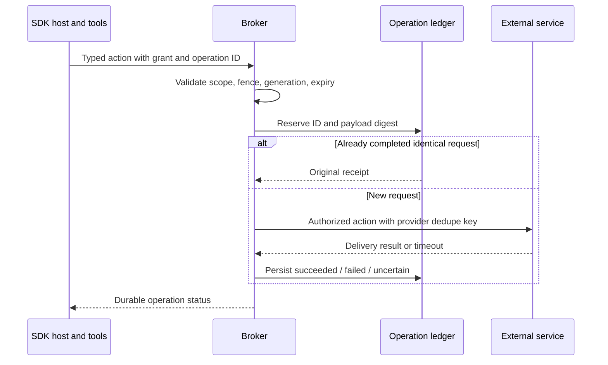

# Plan 1.4: trusted ingress and plugin operations

**Status:** planned. **Depends on:** [1.1 identities](01-sdk-runtime.md), [1.2 workspace gate](02-workspace-and-provisioning.md), and [1.3 recoverable receipts](03-session-archives.md). **Layers:** [plugins](../low-level/plugins.md), [core](../low-level/core.md), [API](../low-level/api.md), [agents](../low-level/agents.md). [Roadmap](../roadmap.md#1-sandbox-implementation). [FAQ](#faq).

## Objective and interfaces

Move accepted input and privileged integration actions out of the compute lifecycle. Plugins keep polling, credentials, cursors, schedules, and authorization in trusted services even when no session child is executing. Replace the current `void` notification path with a durable ingress result; source acknowledgment/cursor advancement follows durable persistence, not a live runner reference.

[Plan 1.8](10-agent-simplification.md#5-script-routing) uses these contracts for customizable routing, cron scripts and plugin daemons, replacing static route rules and the built-in GWS monitor. It owns isolated script workers, immutable publication/reload and `AutomationPrincipal` for producers without an active agent run. Trusted adapters keep credentials; editable monitoring logic never receives the privileged plugin context.

[Runtime contracts](runtime-contracts.ts) define `AgentPrincipal`, `PluginOperationBroker`, `PluginOperation`, `StagedPluginFile`, and `PluginWorkspaceManager`. Proposed ingress records add a stable source key, input ID, trusted routing, attachment references, admission time, and publication readiness. Deduplicate on trusted source/agent scope plus source event ID, with changed-payload conflicts; do not trust caller-supplied sender identity.

## Plugins, credentials and callbacks

Trusted plugins keep polling, cursors, schedules and secrets outside compute. Their agent-visible files live in shared `workspace/plugins/<id>/`. Downloads enter durable staging while another session runs. The publisher acquires the same agent workspace gate, validates paths/ownership and symlinks, atomically publishes a server-named file, then records readiness and queues the corresponding event. Stable file IDs let different sessions reference the same shared file without duplicate mutable copies.

Publication and notification are recoverable (`staged → publishing → published`); retries deduplicate file IDs and verify checksums. Never block ingestion on an active session's lease. Bound turn duration so queued publications are not starved; a notification whose file is not published yet must not claim the path is ready.

Avoid reentrant-lock deadlocks: a turn must not await a plugin action that independently waits for the lease that turn holds. Authorize an in-turn workspace action under the current owner's fence and serialize it at a coordinated tool boundary; if that cannot be enforced, stage the output and return a nonblocking pending receipt. Do not report the file as published or wait synchronously for a future handoff. Owning one lease is not permission for uncontrolled parallel child/broker writes.

Use a separate `/runtime/v1/*` API with short-lived grants bound to agent/session/run/fence, sandbox generation, workspace ownership, expiry and allowed operations. Waiting sessions have no grant. Reject stale ownership; revocation happens on bounded close before persistence. Same-OS peers can copy capabilities, so do not claim those identities are a security boundary between sessions.

| Surface | Purpose |
|---|---|
| `/runtime/v1/messages` | Durable message to an allowed destination. |
| `/runtime/v1/plugins/:plugin/operations` | Typed authorized plugin action; workspace-mutating actions also use the held gate. |
| `/runtime/v1/operations/:id` | Owning agent inspects accepted/succeeded/failed/uncertain outcomes. |
| `/runtime/v1/progress` | Scoped progress, without finalization authority. |
| `/runtime/v1/image-requests` | Dependency-release request for trusted review/build. |
| Runtime events / heartbeat | Adapter-ingested lifecycle evidence, never guest-controlled queue completion. |

Upstream credentials remain in the broker. Adapt Telegram, GWS, messaging, scheduler and artifact CLIs to typed operations. Docker profiles claiming hidden credentials also need enforced external network policy. Persist outgoing operation IDs/receipts independently, reject changed-payload reuse, and reconcile uncertain external outcomes before retrying.

## Operation ledger and flow

An operation record carries trusted principal/scope, stable operation ID, payload digest, action type, provider correlation/idempotency key, state, receipt/error, and timestamps. Suggested states are `accepted`, `executing`, `succeeded`, `failed`, and `uncertain`. A provider timeout after sending is uncertain unless provider evidence proves failure. Never automatically repeat an irreversible action solely because the HTTP reply or session archive was lost.

Lifecycle/finalization evidence is ingested through the trusted adapter. `/runtime/v1/progress` cannot mark a queue row complete or release a writer. Grants are readable by tools, so the broker must enforce allowed operations without returning upstream secrets. Same-identity session peers are not mutually isolated by grant fields alone. Payment or other privileged execution stays in the trusted operation service if added; no guest-controlled completion claim authorizes it.

## Example: attachment during another session's turn

Telegram receives file F42 while A owns the workspace. The listener downloads it to `control/incoming/<agent>/F42/`, verifies its checksum, and persists ingress/staging records without waiting on A. A publisher later acquires the workspace gate, rejects unsafe paths/symlinks, publishes to a server-chosen `workspace/plugins/telegram/attachments/` path, checkpoints, and atomically records ready state plus the notification intent. Recovery resumes `staged → publishing → published`; replay does not create duplicate files or inputs.

An in-turn operation needing to publish a file either uses A's existing fence at a coordinated tool boundary or returns a pending receipt for later publication. It must not block A waiting for an independent gate acquisition. An event cannot claim an attachment path is ready before publication commits.

## Implementation and migration

1. Add trusted ingress, source deduplication, staging, and recoverable notification/publication records independently of `AgentRunner` instances.
2. Add grant issuance/revocation and typed broker action schemas. Resolve agent identity from the grant; validate destination/action scope and rate/size limits.
3. Implement messaging, Telegram, GWS, scheduler, and artifact adapters. Preserve useful CLI syntax while replacing direct-secret/env calls with typed broker requests. Token-in-path and credential-file clients need explicit adapters.
4. Add operation IDs/receipts and provider-specific reconciliation. A stable local ID alone cannot guarantee exactly-once delivery when the external provider has no dedupe/query capability.
5. Remove credential export/ambient discovery in the new host path. For profiles claiming hidden credentials, enforce outbound network policy outside the guest, including model traffic, rather than rely on proxy environment settings alone.

## Acceptance

Ingest work with idle or restarting compute; replay source events without duplicate queue rows; fail persistence before source acknowledgment. Reject forged/expired/stale grants, changed-payload ID reuse, unauthorized destinations, and guest lifecycle claims. Exercise uncertain external send and reconciliation, publication crashes, a path/symlink escape, plugin/session races, and the in-turn deadlock case. An accepted operation, delivered reply, and archived run remain separately observable facts.

The new runtime endpoints are proposed protocol surfaces. Do not mount them under operator-wide bearer semantics or claim they exist in the current API until implemented and tested.

## FAQ

These answers describe the planned trusted ingress/broker boundary for integration authors, product developers, and operators.

### Will plugins still receive work when agent compute is idle or restarting?

Yes, once this design is implemented: trusted listeners persist ingress independently of live SDK children. They return or advance source acknowledgment/cursors only after the required durable record exists. If persistence fails, they must not report durable acceptance. This replaces today's `void` notification behavior rather than assuming it already has those guarantees.

### What is the difference between source deduplication and operation deduplication?

A stable external source event ID prevents one incoming event from producing repeated accepted inputs in its trusted scope. A stable operation ID prevents one requested outgoing action from being executed again on an identical retry. These are different ledgers; neither a queue event ID nor a successful model turn alone proves external delivery.

### What do the grant fields authorize?

Agent/session/run identity, sandbox generation, and session/workspace fences bind the request to current ownership. `scopes`, `allowedPlugins`, and a trusted `policyId` restrict action types, destinations/accounts/files; expiry bounds lifetime. The broker resolves these permissions server-side and does not accept a caller's sender/agent field as authentication. Waiting sessions receive no execution grant.

### Can an agent read the run grant? Can it use that grant to fetch my real API key?

The grant is available to tools so they can request allowed actions. It is a restricted capability, not the upstream credential, and the broker must never offer a credential-retrieval operation as a workaround. Same-OS peers may copy a capability, so grants alone do not establish hostile-session isolation; the provider/profile must match the claimed boundary.

### How do I migrate an existing credential-file or token-in-URL CLI?

Implement a typed trusted adapter that owns the upstream client/credentials and accepts only approved operation inputs. Preserve useful agent-facing command syntax by routing it to the broker. Do not just move the secret into another guest-readable file or rely on proxy variables; profiles claiming credential/network protection also require enforcement outside the guest.

### What should happen if I reuse an operation ID with a different message body?

Reject it as a conflict. A repeated identical operation may return its original receipt, but the ID cannot silently be reused for a new action. Generate a new ID for a deliberately new action after authorization; keep the payload digest and provider correlation in trusted state for reconciliation.

### The provider timed out after I sent an email. Should the broker send it again?

Treat the result as `uncertain` unless there is evidence it failed before delivery. Query or reconcile using the provider's correlation/idempotency support before replay. If the provider cannot establish the outcome, preserve uncertainty for operator resolution; a local ledger cannot manufacture exactly-once delivery for an unsupported external API.

### Why is an attachment accepted but not yet visible in the workspace?

Acceptance can mean its ingress/staging record is durable while another turn owns the workspace. Publication waits for the common gate, safe-path/checksum validation, and checkpointing. Only then can the ready notification advertise the final path. Retrying publication uses the same file identity instead of making competing mutable copies.

### What if the active turn asks for a download and waits for publication?

The action must either publish under a coordinated subordinate use of the current fence or return a pending receipt without waiting for an independent lease. Waiting for the active turn's own gate would deadlock. Owning the gate also does not authorize uncontrolled concurrent broker and child writes.

### Can `/runtime/v1/progress` report a run complete or release its writer gate?

No. Guest progress is scoped informational data. Trusted adapter observations, verified writer cleanup, and persistence receipts control finalization and release. This prevents a guest from spoofing lifecycle completion while tools or descendants still have write access.

### Will successful reply delivery wait for session archiving?

An explicit reply's operation receipt is independent of the archive receipt. It can be delivered and visible while storage finalization is pending. A later archive failure must not trigger another send; a later delivery failure must not erase a valid archived conversation.
