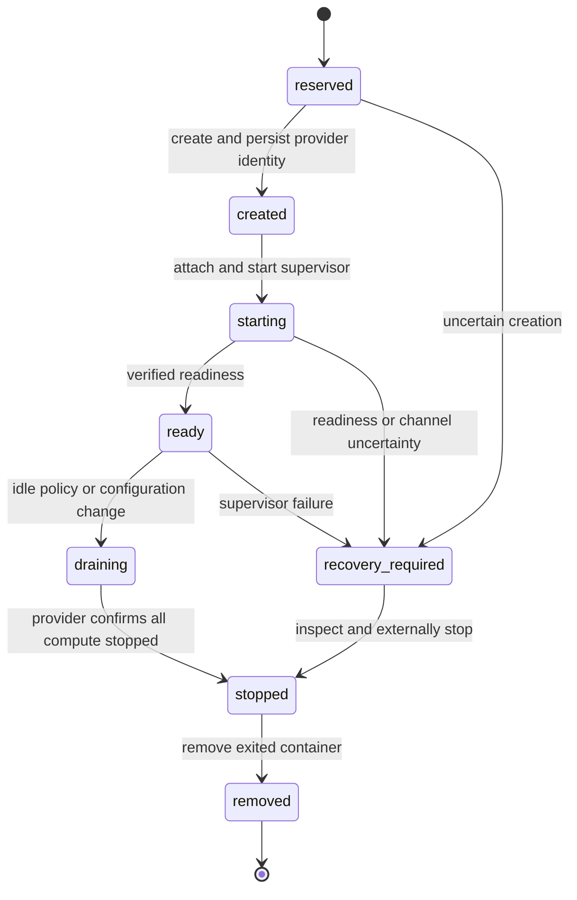

# Plan 1.5: Docker runtime

**Status:** planned. **Depends on:** [1.1 SDK runtime](01-sdk-runtime.md), [1.2 layout](02-workspace-and-provisioning.md), [1.3 persistence](03-session-archives.md), and [1.4 broker](04-ingress-and-operations.md). **Layers:** [core](../low-level/core.md), [agents](../low-level/agents.md), [CLI](../low-level/cli.md). [Roadmap](../roadmap.md#1-sandbox-implementation). [FAQ](#faq).

## Objective and provider contract

Run the same SDK host/supervisor under Docker without duplicating queue, steer, retry, archive, or delivery policy. Each agent has one long-lived singleton container at most; admitted sessions have independent histories, while only one session turn holds workspace execution permission. Waiting sessions are supervisor metadata in the baseline, not idle Pi children free to run extensions.

[Runtime contracts](runtime-contracts.ts) define `DockerRuntimeProvider`, `DockerDriver`, `DockerCreateSpec`, `RuntimeRef`, and `RuntimeCapabilities`. The driver implements image preparation, create, durable identity registration, attach/start, inspect, stop, removal of exited compute, and enumeration by owned labels. Its supervisor channel is distinct from individual session lifetime.

## Image and mount design

Build approved recipes outside agent compute; record Node/Pi/Python/platform/lockfile versions, smoke-test the SDK host and tools, and pin the resulting image digest. Image updates change compatibility and require drained replacement, not in-place mutation by the agent.

[Plan 1.8](10-agent-simplification.md#1-base-assets-workspace-and-images) packages the agent's base and selected plugin resources in this image and adds isolated post-base workspace installation steps. Runtime overrides remain persistent workspace data; installer changes produce a new digest through controlled activation.

| Boundary | Baseline policy |
|---|---|
| Root filesystem / user | Read-only root, non-root identity, dropped capabilities and explicit CPU/memory/PID/scratch limits. |
| `/assets` | Immutable approved release packaged in the read-only image, or a matching versioned read-only mount; choose one source per launch. |
| `/workspace` | One agent-wide durable read-write cwd. |
| Session roots | Preplanned parent mount with per-session Pi-writable histories. |
| Profiles / scratch / run specs | Separate session paths; nonsecret run spec over approved read-only transfer parent or supervisor channel. |
| Control state / credentials | No control DB, host HOME, other agents, Docker socket, or real upstream credentials mounted. |
| Network | Externally enforced policy for profiles claiming broker-only credential/service access. Proxy configuration alone is insufficient. |

All parent mounts are fixed at container creation; opening another session cannot add a bind mount. Path separation is not mutual isolation between sessions sharing one OS identity. The baseline permits tools to access Pi's live history roots; [plan 1.7](07-protection-and-cutover.md) defines a stricter tool boundary when required.

## Creation, recovery, and lifecycle

Persist the singleton reservation before create and container ID before attach/start. Labels identify harness, agent, sandbox ID, and generation; they enable reconciliation after a response is lost. Unknown create outcome reserves the singleton until reconciliation finds or excludes the old container. Never create a second candidate while the first is uncertain.

| Configured mode | Whole-sandbox behavior |
|---|---|
| `idle` | Proposed 15-minute timer starts only when there are no admitted sessions, owners, finalizers, pending persistence, or background leases. Health checks do not extend it. |
| `per_turn` | Persist/close each turn; stop compute when no admitted/queued work needs it and no gate is held. One session finishing must not stop waiting siblings. |
| `always_on` | Retain healthy empty compute; still drain and replace on failure or incompatible config/assets. |

Admission and draining share one transactional guard. Draining blocks new session startup. Replacement waits for provider-confirmed termination and write revocation; lease expiry, channel loss, or the exit of a Docker CLI client proves neither. Cleanup retries are independent of model execution and must never remove a live replacement generation.

Closing/aborting A targets A's child and preserves B's reservation/history. Before workspace handoff, prove A's actual descendants cannot write. If containment cannot establish this, stop the sole container, reconcile all resident bindings, checkpoint after confirmed termination, and restart before the next turn. Never pretend a guest exit report proves a hostile detached writer is gone.

## Example and implementation sequence

Capacity is 2. A runs in container C1 with workspace fence 8; B is admitted but waiting. A settles, closes, and persists, so B can read A's new files in C1. A configuration update now requests image D2. New opens wait; B drains and persists; C1 is externally stopped and removed before C2 is created with D2. The brief availability gap preserves the singleton rule. If stopping C1 is uncertain, C2 is not created.

1. Produce recipe/image build and smoke-test tooling using [native recipe metadata](02-workspace-and-provisioning.md#native-provisioning).
2. Implement durable Docker identity/labels, inspect/stop/remove and conservative uncertain-create recovery.
3. Wire fixed mounts, resource/security profile checks, SDK supervisor routing, and independent session close.
4. Add whole-sandbox lifecycle timers, config/asset drain, and orphan reconciliation.
5. Run the same shared behavior/restore suite as Process, plus Docker enforcement tests on Linux and Docker Desktop.

## Acceptance

Assert one live/uncertain container per agent under simultaneous arrivals and lost create/start responses. Verify assets are read-only, omitted host/control paths remain unavailable, workspace/history survive container removal, unsupported protection requirements fail closed, and network policy matches the claimed profile. Test descendant cleanup, supervisor crash, scoped abort, idle/per-turn with siblings, drain races, storage-pending shutdown suppression, old-generation cleanup retries, and digest change without overlapping writers. Docker supplies a boundary only to the extent the selected profile enforces it; do not label the trusted Process adapter isolated.

## FAQ

These answers describe the proposed Docker adapter, including its operational limits. No new Docker CLI/config surface is implied before implementation.

### Does each thread get a separate container?

No. An agent has one singleton container/supervisor, with multiple admitted logical sessions and independent histories. One session turn owns the shared workspace at a time. Other agents have their own singleton; excess sessions queue instead of creating more containers for the same agent.

### What changes when I choose Docker instead of Process?

The provider supplies the container lifecycle and enforced mounts/resources/profile rather than a trusted native process. Shared queueing, session routing, retries, SDK host, and archive semantics stay the same. Process must remain labeled `[no sandbox]`; the selected Docker profile also has to prove the specific protections it advertises.

### What do `cpu`, `memoryBytes`, `pids`, and `stopGraceMs` control?

They are provider start-spec limits for compute resources, process count, and graceful-stop duration before escalation. They are not admission capacity, history retention, or model context/token limits. The plan does not prescribe universal default resource sizes; implement validation and choose a profile appropriate to the approved workload.

### Does the baseline make tools strictly workspace-only?

No. Pi needs writable history roots, and ordinary tools share its identity/mounts in the baseline. Read-only assets and an omitted control root protect different boundaries. A strict `workspaceOnlyTools` requirement needs the separate tool execution boundary in [plan 1.7](07-protection-and-cutover.md); an unsupported requirement must fail rather than silently weaken the claim.

### Can a new session add another bind mount to the running container?

No. The sandbox starts with preplanned parent mounts for session roots, profiles/scratch, and any approved run-spec transfer area. New sessions allocate validated subpaths within those roots or use the supervisor channel. They must not gain arbitrary host mounts as a side effect of opening a conversation.

### What happens to files and histories when the container is removed?

Approved persistent workspace/session data outlives compute because it uses durable roots and validated archives/checkpoints. Ephemeral scratch is not durable state. Removal is only safe after stop/finalization obligations are satisfied; deleting a container is not a substitute for committing an outstanding capture.

### How do `idle`, `per_turn`, and `always_on` interact with waiting siblings?

The policy applies to the whole sandbox. Idle timing starts only after admitted sessions, owners, finalizers, pending persistence, and background leases clear; per-turn must not stop compute just because A finished while B still needs it. Always-on retains healthy empty compute, but still permits controlled drain/replacement after failures or incompatible updates.

### Docker create timed out. Why not immediately try creating another container?

The first request may have succeeded despite a lost response. Hold the singleton reservation and reconcile by trusted labels/provider identity. Another create before resolving that outcome could produce two live runtimes or writers for one agent. Unknown allocation is a recovery state, not evidence that capacity is absent.

### What if the Pi child exits but a browser, build, or file watcher remains?

Do not hand the workspace to the next session until descendants are externally proven unable to write. If per-child containment cannot establish that, stop the sole container, reconcile all admitted bindings, capture after confirmed termination, and restart for the next turn. A guest-reported exit or a Docker CLI process exiting is insufficient proof.

### Can I roll out a new image without any downtime or fall back to host execution on failure?

The baseline accepts a brief drain/stop/replacement gap to preserve the singleton invariant; it does not overlap warm generations. It also forbids automatic Docker-to-host fallback, which would change the protection boundary. Pin approved image digests, test the replacement, and use the documented exclusive rollback process if activation fails.

### What must an adapter developer test beyond the shared Process suite?

Test actual mount/identity/resource/network enforcement, Linux and Docker Desktop path behavior, uncertain create/start results, owned-container discovery, descendant cleanup, and removal of only the intended stopped generation. Also exercise sibling-aware lifecycle, image changes, and pending-persistence suppression of shutdown. A passing interface type-check is not enforcement evidence.
