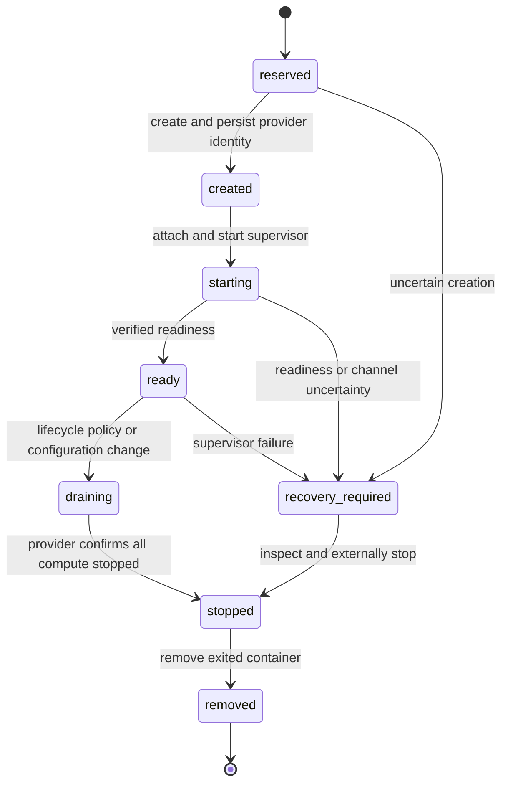

# Plan 1.5: Docker runtime

**Status:** planned topic reference; the [roadmap delivery order](../roadmap.md#delivery-order) owns sequencing and status. **Prerequisites for the M5 pilot:** M1 directories/resources, M2 SDK Process with singleton/gate and Pi-owned persistent files, and M4 durable ingress/status plus one encrypted secret backend/model broker. These are selected slices of plans [1.1](01-sdk-runtime.md), [1.2](02-workspace-and-provisioning.md), [1.4](04-ingress-and-operations.md) and [1.8](10-agent-simplification.md), not completion of every integration. **Layers:** [core](../low-level/core.md), [agents](../low-level/agents.md), [CLI](../low-level/cli.md). [FAQ](#faq).

## Objective and provider contract

Run the same SDK host/supervisor under Docker without duplicating queue, steer, retry, or delivery policy. Each agent has one long-lived singleton container at most. Its existing top-level `maxConcurrentSlots` is validated as **1** in the shared-workspace baseline. One execution reservation spans reserved, waiting-for-workspace, starting, running and finalizing states; unresolved cleanup or file errors block handoff in `recovery_required`. Every other session stays in the durable queue. There is no separate admitted-session pool or launch-capacity setting, and historical sessions are not limited by the execution slot.

Start M5 with a fresh operator-only agent, directly mounted persistent directories, the selected Docker baseline and `per_turn` lifecycle. Use existing REST/polling status; disable unimplemented integrations, lifecycle modes and protection requirements. Applicable safety and recovery checks from [plan 1.7](07-protection-and-cutover.md) still gate this supported pilot. Other plugin adapters, SSE and strict workspace-only tools do not block it. M6 adds the first Telegram round trip and one existing-agent migration; idle/always-on are an independent M5 extension; M10 completes remaining supported-adapter/platform parity and wider migration.

[Runtime contracts](runtime-contracts.ts) define `DockerRuntimeProvider`, `DockerDriver`, `DockerCreateSpec`, `RuntimeRef`, and `RuntimeCapabilities`. The driver implements image preparation, create, durable identity registration, attach/start, inspect, stop, removal of exited compute, and enumeration by owned labels. Its supervisor channel is distinct from individual session lifetime.

## Image and mount design

Build approved recipes outside agent compute; record Node/Pi/Python/platform/lockfile versions, smoke-test the SDK host and tools, and pin the resulting image digest. Image updates change compatibility and require drained replacement, not in-place mutation by the agent.

[Plan 1.8](10-agent-simplification.md#1-base-assets-workspace-and-images) packages the agent's base and selected plugin resources in this image and adds isolated post-base workspace installation steps. Runtime overrides remain persistent workspace data; installer changes produce a new digest through controlled activation.

| Boundary | Baseline policy |
|---|---|
| Root filesystem / user | Read-only root, non-root identity, dropped capabilities and explicit CPU/memory/PID/scratch limits. |
| `/assets` | Immutable approved release from `agents/<id>/base/releases/<revision>`, packaged in the read-only image or supplied as a matching read-only mount; choose one source per launch. |
| `/workspace` | `agents/<id>/agent-managed/`, the agent-wide durable read-write cwd. |
| `/sessions` | `agents/<id>/sessions/`, mounted read-write so Pi writes and resumes its original session files directly. |
| Profiles / scratch / run specs | Separate session paths; nonsecret run spec over approved read-only transfer parent or supervisor channel. |
| Control state / credentials | No control DB, host HOME, other agents, Docker socket, or real upstream credentials mounted. |
| Network | Externally enforced policy for profiles claiming broker-only credential/service access. Proxy configuration alone is insufficient. |

All parent mounts are fixed at container creation; opening another session cannot add a bind mount. [Pi owns session storage](02-workspace-and-provisioning.md#pi-owned-sessions); the harness selects validated session paths and retains identity mappings, without copying JSONL, creating restore heads or checkpointing the workspace. Path separation is not mutual isolation between sessions sharing one OS identity. The baseline permits tools to access Pi's live history roots; [plan 1.7](07-protection-and-cutover.md) defines a stricter tool boundary when required.

## Creation, recovery, and lifecycle

```mermaid
stateDiagram-v2
    [*] --> reserved
    reserved --> created: create and persist provider identity
    created --> starting: attach and start supervisor
    starting --> ready: verified readiness
    ready --> draining: lifecycle policy or configuration change
    draining --> stopped: provider confirms all compute stopped
    stopped --> removed: remove exited container
    removed --> [*]
    reserved --> recovery_required: uncertain creation
    starting --> recovery_required: readiness or channel uncertainty
    ready --> recovery_required: supervisor failure
    recovery_required --> stopped: inspect and externally stop
```

Persist the singleton reservation before create and container ID before attach/start. Labels identify harness, agent, sandbox ID, and generation; they enable reconciliation after a response is lost. Unknown create outcome reserves the singleton until reconciliation finds or excludes the old container. Never create a second candidate while the first is uncertain.

Implement `per_turn` first in M5. The table retains the full target: warm `idle` and `always_on` follow as an independent M5 extension after their timer/recovery tests, without waiting for cron, GWS or editable daemons. Reject modes that are not implemented rather than treating the proposed eventual 15-minute idle default as available in the first pilot.

| Configured mode | Whole-sandbox behavior |
|---|---|
| `idle` | Proposed 15-minute timer starts only when there is no reserved/queued work, workspace owner, finalizer, unresolved recovery, or background lease. Health checks do not extend it. |
| `per_turn` | Revoke grants, close the SDK child and verify descendant cleanup after each turn; stop compute when no reserved/queued work needs it and no gate is held. Preserve all queued sessions and mounted files. |
| `always_on` | Retain healthy empty compute; still drain and replace on failure or incompatible config/assets. |

Admission and draining share one transactional guard. Draining blocks new session startup. Replacement waits for provider-confirmed termination and write revocation; lease expiry, channel loss, or the exit of a Docker CLI client proves neither. Cleanup retries are independent of model execution and must never remove a live replacement generation.

Closing/aborting A targets A's child and preserves B/C's queued inputs and histories. Revoke grants before bounded close. Before workspace handoff, prove A's actual descendants cannot write. If containment cannot establish this, stop the sole container, reconcile the active reservation and existing mounted files, and restart only after recovery is safe. Never pretend a guest exit report proves a hostile detached writer is gone.

Missing/unreadable mounts, write failures or Pi session/close errors enter visible `recovery_required`. Preserve the existing directories and block new execution while repairing access and checking the original session through Pi. Do not create an empty replacement directory, invent a transcript, or rerun a completed model turn to repair storage. Persistent mounts retain files across compute replacement; their durability still depends on the underlying filesystem and Pi's write behavior.

## Example and implementation sequence

With `maxConcurrentSlots: 1`, A runs in container C1 with workspace fence 8; B and C remain in the durable queue without reservations or SDK children. Pi writes A's session directly to `/sessions`. A settles, loses its grant, closes without reported file errors and proves descendant cleanup before releasing the slot. B can then reserve it and read A's new files in the same shared cwd. If image D2 is requested while A runs, draining blocks B/C's startup; A finalizes, then C1 is externally stopped and removed before C2 mounts the same persistent directories. B/C remain queued through the brief gap. If stopping C1 is uncertain, C2 is not created.

1. Produce recipe/image build and smoke-test tooling using [native recipe metadata](02-workspace-and-provisioning.md#native-provisioning-and-image-builds).
2. Implement durable Docker identity/labels, inspect/stop/remove and conservative uncertain-create recovery.
3. Wire fixed mounts, resource/security profile checks, SDK supervisor routing, and independent session close.
4. Deliver `per_turn`, config/asset drain and orphan reconciliation for the first mounted-directory operator pilot. Add `idle`/`always_on` and their timers as an independent M5 extension; singleton and writer fencing are required from the first delivery.
5. Run applicable shared behavior/Pi-resume and Docker enforcement tests on the pilot's supported platform/profile. Extend the same suite to every newly supported profile, integration and platform; full target coverage includes Linux and Docker Desktop. A later adapter must not fork queue or session ownership policy.

## Acceptance

For every enabled release, assert one live/uncertain container per agent under simultaneous arrivals and lost create/start responses. Verify assets are read-only, omitted host/control paths remain unavailable, workspace/history survive container removal, unsupported protection requirements fail closed, and network policy matches the claimed profile. Test descendant cleanup, supervisor crash, scoped abort, enabled lifecycle behavior with queued work, drain races, missing/read-only/full-volume failures, old-generation cleanup retries, and digest change without overlapping writers. M5 proves these for its selected baseline, persistent mounts, operator ingress and `per_turn`; later modes/platforms pass their additional cases before enablement. A file failure must remain visible and block normal handoff, without blank reset or replay of confirmed work. Docker supplies a boundary only to the extent the selected profile enforces it; do not label the trusted Process adapter isolated.

## FAQ

These answers describe the proposed Docker adapter, including its operational limits. No new Docker CLI/config surface is implied before implementation.

### Does each thread get a separate container?

No. An agent has one singleton container/supervisor and one execution reservation under `maxConcurrentSlots: 1`. Other logical sessions stay in the durable queue with independent histories; they receive no SDK child or tool grant until selected. Other agents have their own singleton. The setting limits execution reservations, not how many historical sessions the agent can keep.

### What changes when I choose Docker instead of Process?

The provider supplies the container lifecycle and enforced mounts/resources/profile rather than a trusted native process. Shared queueing, session routing, retries, SDK host, and direct Pi session-file semantics stay the same. Process must remain labeled `[no sandbox]`; the selected Docker profile also has to prove the specific protections it advertises.

### What do `cpu`, `memoryBytes`, `pids`, and `stopGraceMs` control?

They are provider start-spec limits for compute resources, process count, and graceful-stop duration before escalation. They are not execution-slot capacity, history retention, or model context/token limits. The plan does not prescribe universal default resource sizes; implement validation and choose a profile appropriate to the approved workload.

### Does the baseline make tools strictly workspace-only?

No. Pi needs writable history roots, and ordinary tools share its identity/mounts in the baseline. Read-only assets and an omitted control root protect different boundaries. A strict `workspaceOnlyTools` requirement needs the separate tool execution boundary in [plan 1.7](07-protection-and-cutover.md); an unsupported requirement must fail rather than silently weaken the claim.

### Can a new session add another bind mount to the running container?

No. The sandbox starts with preplanned parent mounts for session roots, profiles/scratch, and any approved run-spec transfer area. New sessions allocate validated subpaths within those roots or use the supervisor channel. They must not gain arbitrary host mounts as a side effect of opening a conversation.

### What happens to files and histories when the container is removed?

The agent-managed directory and Pi session directory outlive compute because they are persistent mounts. A replacement mounts those same directories, and Pi resumes its own files in place. Ephemeral scratch is not durable state. Removal is only safe after stop/cleanup obligations are satisfied; removing a container must not delete its mounted directories. Disk or Pi-file errors require visible recovery rather than an empty reset.

### How do `idle`, `per_turn`, and `always_on` interact with queued sessions?

The policy applies to the whole sandbox. M5 implements `per_turn` first: after finalization, queued work can take the freed execution slot; normal shutdown waits until no reserved/queued work or gate remains. An independent M5 extension adds `idle` and `always_on`: idle timing starts only after queued/reserved work, owners, finalizers, unresolved recovery and background leases clear; always-on retains healthy empty compute while permitting controlled drain/replacement. Explicit drain/recovery may stop compute while preserving queued inputs and mounted files. Unsupported modes fail validation until their lifecycle and recovery cases pass.

### Docker create timed out. Why not immediately try creating another container?

The first request may have succeeded despite a lost response. Hold the singleton reservation and reconcile by trusted labels/provider identity. Another create before resolving that outcome could produce two live runtimes or writers for one agent. Unknown allocation is a recovery state, not evidence that capacity is absent.

### What if the Pi child exits but a browser, build, or file watcher remains?

Do not hand the workspace to the next session until descendants are externally proven unable to write. If per-child containment cannot establish that, stop the sole container, reconcile the active reservation and mounted files, and restart only when recovery is safe. A guest-reported exit or a Docker CLI process exiting is insufficient proof.

### Can I roll out a new image without any downtime or fall back to host execution on failure?

The baseline accepts a brief drain/stop/replacement gap to preserve the singleton invariant; it does not overlap warm generations. It also forbids automatic Docker-to-host fallback, which would change the protection boundary. Pin approved image digests, test the replacement, and use the documented exclusive rollback process if activation fails.

### What must an adapter developer test beyond the shared Process suite?

Test actual mount/identity/resource/network enforcement, uncertain create/start results, owned-container discovery, descendant cleanup, and removal of only the intended stopped generation. Also exercise enabled lifecycle modes with queued sessions, image changes, direct Pi resume and file-access errors that block subsequent execution. Start with the declared pilot platform; test Linux and Docker Desktop path behavior before claiming support for both. A passing interface type-check is not enforcement evidence, and a limited pilot does not certify unimplemented profiles.
