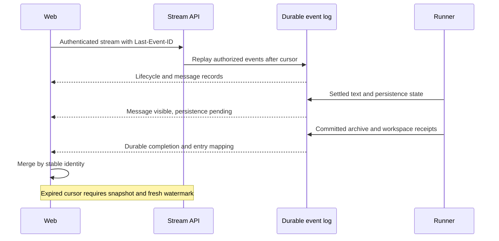

# Plan 1.6: live interface and delivery

**Status:** planned; current web uses polling. **Depends on:** [1.1 run/session identities](01-sdk-runtime.md), [1.3 archive receipts](03-session-archives.md), [1.4 operation receipts](04-ingress-and-operations.md); full runtime controls also depend on [1.5 Docker](05-docker-runtime.md). **Layers:** [API](../low-level/api.md), [web](../low-level/web.md), [core](../low-level/core.md), [plugins](../low-level/plugins.md). [Roadmap](../roadmap.md#1-sandbox-implementation). [FAQ](#faq).

## Objective and contracts

Expose live progress without confusing text availability, external delivery, and durable completion. REST remains the command/history surface; proposed `GET /api/agents/:id/stream` provides authenticated SSE. [Runtime contracts](runtime-contracts.ts) define `HarnessEvent` and `RunEventSink`; implementation must also define retention, audience authorization, cursor expiry, and snapshot reconciliation.

Persist lifecycle, final user-facing message, and operation state needed for recovery. Token deltas can be transient and must never become the source for restoring Pi history. Store agent/session/run identity, sandbox generation, per-run sequence, event ID/cursor, audience, event type, and payload. Bind message identity to the final archive entry when available. Stream records exclude credentials and private audiences the caller cannot access.

| Observation | Meaning |
|---|---|
| Input accepted | Durable ingress record exists. |
| Session waiting / run active | Admission and workspace execution state. |
| Text delta / final message | Content is visible; may precede persistence. |
| Operation succeeded | Explicit external/product delivery has its own receipt. |
| `persistence_pending` | Writers are closed; required storage receipts are still missing; later workspace work waits. |
| Durable run completion | Required archive/workspace receipts committed and cleanup verified. |

## Streaming and reconnect algorithm



1. Authenticate and resolve agent/thread/product audience before any replay or snapshot. The current broad operator bearer does not by itself create end-user isolation; product backends enforce their own allowed audience.
2. Subscribe with a cursor/snapshot watermark handoff that does not lose events between snapshot read and live subscription. Cursor identifies stream position, not just per-run sequence.
3. Replay retained authorized records and suppress duplicates by event ID; reject stale generation/run identities. Per-run sequence detects missing deltas.
4. If retention no longer covers the cursor, emit a defined resync response/event and fetch a scoped REST snapshot plus watermark. Transient delta gaps are resolved using persisted content/history.
5. Bound buffers and per-client backpressure. Slow consumers disconnect/resync instead of blocking the runner or retaining unbounded memory. Recheck authorization at connection/reconnect and terminate revoked sessions.

Illustrative SSE shape (proposed, not currently callable):

```text
id: cursor-1042
event: run.persistence_pending
data: {"id":"cursor-1042","agentId":"support","threadId":"review","logicalSessionId":"S1","runId":"R7","sandboxId":"B1","type":"run.persistence_pending","occurredAt":"2026-09-21T09:00:00Z","payload":{"sandboxGeneration":3,"sequence":18}}
```

This envelope matches the reference `HarnessEvent`; generation/sequence are illustrative payload fields. The implementation must give each event payload a typed schema and enforce audience policy in trusted storage/dispatch; the reference envelope does not yet define those fields or policies.

## Example: one answer through reconnect

The console receives message M7 while R7 is closing, disconnects, then replays M7 and the final `S1/U9` entry mapping. It keeps one answer, replacing its transient representation with the persisted entry, and changes status to durable only after the archive/workspace receipt event. If a Telegram operation succeeded earlier, its receipt remains visible even while storage recovery is pending; no second send follows from replay.

## Web and API changes

Add a stream client/cache projection keyed by agent, logical session, run, message, and event ID. Keep history REST queries for initial load and resync. Display configured/ready/idle state separately from active execution; show provider and storage selection, the singleton sandbox, admitted session count/capacity, workspace owner and queue, pending publications, and recovery/persistence waits. Settings validation must reject unsupported combinations rather than imply current multi-slot arbitrary writes are safe.

REST send/cancel remains independently usable. Product/plugin replies continue through explicit broker operations and do not wait for archive completion. Do not make “model finished” automatically mean “send this answer to every integration.”

## Implementation and acceptance

Implement persisted events and authorized replay first, then live transport, snapshot watermark handoff, web reconciliation, and runtime settings/status controls. Replace polling only where the event contract covers the same information; retain query-based recovery.

Test authorized audiences, cookie/bearer failures, reconnect before/after archive mapping, duplicate/out-of-order frames, cursor expiry, token-delta gaps, slow consumers, revocation, provider replacement, and pending persistence. Verify one final answer, no cross-scope text leakage, accurate execution/durability indicators, and delivery receipts unaffected by storage retry. Current-layer API/web docs change when routes and client behavior actually ship.

## FAQ

These answers describe the planned streaming contract for frontend/product developers and operators. Today's console still polls.

### Why can an answer be visible while the run says `persistence_pending`?

Text availability, external delivery, and durable storage are separate observations. The model may have settled and writers may be closed while archive/workspace receipts are still missing. Show the answer with honest persistence state; only receipt-backed finalization can report durable completion or release later workspace work.

### What are the roles of event ID, per-run sequence, run ID, and sandbox generation?

The server-issued event ID is a replay cursor across the relevant stream; per-run sequence detects order/gaps within one run. Run ID groups one execution attempt, and generation distinguishes compute incarnations. Clients and trusted dispatch must use the correct identity dimensions so late frames cannot update a replacement run.

### How should a client reconnect after losing its connection?

Send the last retained cursor using `Last-Event-ID`, replay only authorized retained records, and deduplicate by stable event/message identities. If the cursor has expired, obtain a scoped snapshot with a fresh watermark and resume without a snapshot-to-subscription gap. Do not infer that disconnection cancelled the backend run.

### How do we avoid displaying the same answer twice after replay or archival?

Keep a stable message identity for transient/final text and bind it to the persisted session entry when available. Replace or merge that representation when the archive mapping arrives instead of appending another bubble. A repeated event receipt and a newly readable JSONL entry can describe the same answer.

### What happens if some token deltas are never replayed?

Token deltas may be transient, so a gap triggers reconciliation with retained final content or persisted history. Do not claim byte-for-byte replay of every token or use the stream to reconstruct restorable Pi JSONL. Lifecycle/final-message records have a stronger durable purpose than transient display updates.

### Does a slow browser or a revoked login keep a run blocked?

The planned transport bounds buffers and disconnects/resyncs slow consumers rather than blocking the runner indefinitely. Authorization is checked for connection/reconnect and revoked sessions must terminate. This transport backpressure is distinct from a genuine workspace block caused by pending persistence.

### Can a product user subscribe to all operator events with `X-App-User`?

No such authorization follows from that header. Today's product bearer is operator-level; the product backend must enforce its user's allowed scope, and future stream replay/snapshots must filter the authorized audience before returning text. Event IDs, counts, and resync paths cannot become side channels around that policy.

### Which REST calls remain after streaming is introduced?

REST remains for send/cancel commands, settings, initial history, and snapshot/resync reads. Replace a polling query only where the event contract carries sufficient equivalent information. A stream connection is not an alternative command authorization path or a durable session archive.

### Which status should the UI show for waiting versus running versus idle?

Show agent configured/ready state separately from compute/sandbox lifecycle and session/run activity. Distinguish waiting for admission, waiting for the workspace gate, active execution, and pending persistence/recovery. An idle sandbox can be healthy, and an admitted session can still have no permission to execute tools.

### Does every final answer automatically become a product, email, or Telegram reply?

No. Explicit broker operations still decide destinations and produce their own delivery receipts. SSE shows authorized progress/content; archive completion does not itself command delivery. A successful reply can precede archiving, and stream replay must never repeat that external action.
