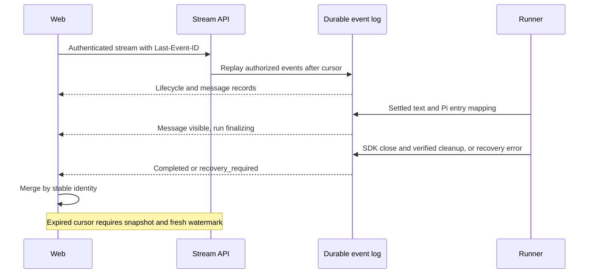

# Plan 1.6: live interface and delivery

**Status:** planned; current web uses polling. **Delivery:** M2/M4 minimal REST/polling execution and ingress status, M12 SSE and richer UI in the [delivery order](../roadmap.md#delivery-order). **Depends on:** implemented [run/session identities](01-sdk-runtime.md), [Pi-owned persistent sessions](02-workspace-and-provisioning.md#pi-owned-sessions) and enabled [operation receipts](04-ingress-and-operations.md); Docker controls require [that provider](05-docker-runtime.md). SSE does not block an otherwise verified pilot/cutover. **Layers:** [API](../low-level/api.md), [web](../low-level/web.md), [core](../low-level/core.md), [plugins](../low-level/plugins.md). [Roadmap](../roadmap.md#1-agent-foundation-and-sandbox-implementation). [FAQ](#faq).

## Objective and contracts

Expose live progress without confusing text availability, external delivery, and completed execution. REST remains the command/history surface; proposed `GET /api/agents/:id/stream` provides authenticated SSE. [Runtime contracts](runtime-contracts.ts) define `HarnessEvent` and `RunEventSink`; implementation must also define retention, audience authorization, cursor expiry, and UI snapshot reconciliation.

Persist lifecycle, message identities, and operation state needed for reconnect. Token deltas can be transient; Pi's original files in `/sessions` remain authoritative history. Store agent/session/run identity, sandbox generation, per-run sequence, event ID/cursor, audience, event type, and payload. Bind display messages to Pi entry IDs when observed, and read the existing files for history/resync. The harness does not reconstruct, copy or restore JSONL from stream events. Stream records exclude credentials and private audiences the caller cannot access.

| Observation | Meaning |
|---|---|
| Input accepted | Durable ingress record exists. |
| Session waiting / run active | Admission and workspace execution state. |
| Text delta / final message | Content is visible; may precede successful SDK close and cleanup. |
| Operation succeeded | Explicit external/product delivery has its own receipt. |
| `recovery_required` | Mounted files, SDK/session close or ownership need reconciliation; later workspace work waits. |
| Run completed | SDK settled/closed without reported file errors, grants revoked and descendant cleanup verified; control-state completion recorded. This is not an independent storage durability guarantee. |

## Streaming and reconnect algorithm


```mermaid
sequenceDiagram
    participant Web
    participant API as Stream API
    participant Log as Durable event log
    participant Runner
    Web->>API: Authenticated stream with Last-Event-ID
    API->>Log: Replay authorized events after cursor
    Log-->>Web: Lifecycle and message records
    Runner->>Log: Settled text and Pi entry mapping
    Log-->>Web: Message visible, run finalizing
    Runner->>Log: SDK close and verified cleanup, or recovery error
    Log-->>Web: Completed or recovery_required
    Web->>Web: Merge by stable identity
    Note over Web,API: Expired cursor requires snapshot and fresh watermark
```

1. Authenticate and resolve agent/thread/product audience before any replay or snapshot. The current broad operator bearer does not by itself create end-user isolation; product backends enforce their own allowed audience.
2. Subscribe with a cursor/snapshot watermark handoff that does not lose events between snapshot read and live subscription. Cursor identifies stream position, not just per-run sequence.
3. Replay retained authorized records and suppress duplicates by event ID; reject stale generation/run identities. Per-run sequence detects missing deltas.
4. If retention no longer covers the cursor, emit a defined resync response/event and fetch a scoped REST snapshot plus watermark. Transient delta gaps are resolved using persisted content/history.
5. Bound buffers and per-client backpressure. Slow consumers disconnect/resync instead of blocking the runner or retaining unbounded memory. Recheck authorization at connection/reconnect and terminate revoked sessions.

Illustrative SSE shape (proposed, not currently callable):

```text
id: cursor-1042
event: run.recovery_required
data: {"id":"cursor-1042","agentId":"support","threadId":"review","logicalSessionId":"session-1","runId":"R7","sandboxId":"B1","type":"run.recovery_required","occurredAt":"2026-09-22T09:00:00Z","payload":{"sandboxGeneration":3,"sequence":18,"reason":"session_write_failed"}}
```

This envelope matches the reference `HarnessEvent`; generation/sequence are illustrative payload fields. The implementation must give each event payload a typed schema and enforce audience policy in trusted storage/dispatch; the reference envelope does not yet define those fields or policies.

## Example: one answer through reconnect

The console receives message M7 while R7 is closing, disconnects, then replays M7 and its `session-1/U9` Pi entry mapping. It keeps one answer, reconciling its transient representation with the existing session file, and reports completion only after verified execution finalization. If Pi reports a disk error, show `recovery_required` and retain the visible answer without inventing missing history. A successful Telegram receipt remains visible; neither reconnect nor a file error causes a second send.

## Web and API changes

Add a stream client/cache projection keyed by agent, logical session, run, message, and event ID. Keep read-only history REST queries for initial load and resync. Display configured/ready/idle state separately from active execution; show provider, persistent-mount health, the singleton sandbox, active execution slot, durable queued-session count, workspace owner, pending publications, and recovery waits. Settings validation must reject unsupported combinations rather than imply current multi-slot arbitrary writes are safe.

REST send/cancel remains independently usable. Product/plugin replies continue through explicit broker operations and do not wait for SDK close. Do not make “model finished” automatically mean “send this answer to every integration.”

## Implementation and acceptance

In M2/M4, expose execution/workspace waits, durable ingress acceptance and recovery errors through REST and existing polling. That status is required for the first supported pilot. In M12, implement retained stream events and authorized replay, then SSE, UI snapshot watermark handoff and web reconciliation; extend controls for capabilities that have shipped. Replace polling only where the event contract covers the same information; retain query-based recovery. Automation features and session search are not prerequisites for streaming.

Test authorized audiences, cookie/bearer failures, reconnect before/after Pi entry mapping, duplicate/out-of-order frames, cursor expiry, token-delta gaps, slow consumers, revocation, provider replacement, and session/mount errors. Verify one final answer, no cross-scope text leakage, accurate execution/recovery indicators, and delivery receipts unaffected by file-access recovery. Current-layer API/web docs change when routes and client behavior actually ship.

## FAQ

These answers describe the planned streaming contract for frontend/product developers and operators. Today's console still polls.

### Why can an answer be visible while the run says `recovery_required`?

Text may have streamed before a Pi session write/close error or uncertain descendant cleanup. Keep the answer visible with the recovery error, block later workspace execution, and preserve the original files and operation receipts. Repair access and reconcile through Pi and the trusted runtime; do not reset the session or rerun completed work to reconstruct it.

### What are the roles of event ID, per-run sequence, run ID, and sandbox generation?

The server-issued event ID is a replay cursor across the relevant stream; per-run sequence detects order/gaps within one run. Run ID groups one execution attempt, and generation distinguishes compute incarnations. Clients and trusted dispatch must use the correct identity dimensions so late frames cannot update a replacement run.

### How should a client reconnect after losing its connection?

Send the last retained cursor using `Last-Event-ID`, replay only authorized retained records, and deduplicate by stable event/message identities. If the cursor has expired, obtain a scoped snapshot with a fresh watermark and resume without a snapshot-to-subscription gap. Do not infer that disconnection cancelled the backend run.

### How do we avoid displaying the same answer twice after replay or history refresh?

Keep a stable message identity for transient/final text and bind it to Pi's persisted entry when available. Replace or merge that representation when the entry mapping arrives instead of appending another bubble. A repeated event and a newly readable JSONL entry can describe the same answer.

### What happens if some token deltas are never replayed?

Token deltas may be transient, so a gap triggers reconciliation with retained final display content or Pi's existing history. Do not claim byte-for-byte replay of every token or use the stream to reconstruct Pi JSONL. Lifecycle/message identifiers have a stronger durable purpose than transient display updates.

### Does a slow browser or a revoked login keep a run blocked?

The planned transport bounds buffers and disconnects/resyncs slow consumers rather than blocking the runner indefinitely. Authorization is checked for connection/reconnect and revoked sessions must terminate. This transport backpressure is distinct from a genuine workspace block caused by file or ownership errors.

### Can a product user subscribe to all operator events with `X-App-User`?

No such authorization follows from that header. Today's product bearer is operator-level; the product backend must enforce its user's allowed scope, and future stream replay/snapshots must filter the authorized audience before returning text. Event IDs, counts, and resync paths cannot become side channels around that policy.

### Which REST calls remain after streaming is introduced?

REST remains for send/cancel commands, settings, initial history, and UI snapshot/resync reads. Replace a polling query only where the event contract carries sufficient equivalent information. A stream connection is not an alternative command authorization path or the authoritative session store.

### Which status should the UI show for waiting versus running versus idle?

Show agent configured/ready state separately from compute/sandbox lifecycle and session/run activity. Distinguish waiting for the execution slot, waiting for the workspace gate, active execution, finalizing, and recovery required. An idle sandbox can be healthy, and a reserved run waiting for a publisher can still have no permission to execute tools.

### Does every final answer automatically become a product, email, or Telegram reply?

No. Explicit broker operations still decide destinations and produce their own delivery receipts. SSE shows authorized progress/content; SDK completion does not itself command delivery. A successful reply can precede close, and stream replay must never repeat that external action.
