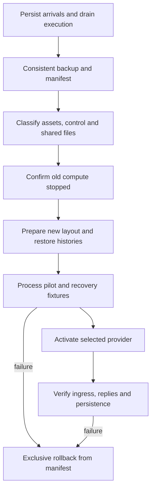

# Plan 1.7: protection profiles and cutover

**Status:** planned release gate. **Depends on:** [1.1](01-sdk-runtime.md), [1.2](02-workspace-and-provisioning.md), [1.3](03-session-archives.md), [1.4](04-ingress-and-operations.md), [1.5](05-docker-runtime.md), and [1.6](06-live-interface.md). **Layers:** all six. [Roadmap](../roadmap.md#1-sandbox-implementation). [FAQ](#faq).

## Objective and protection profiles

Migrate existing agents to the SDK/provider path without losing inputs, histories, plugin files, or delivery evidence, and publish only protection claims that are enforced. The type-checkable [reference contracts](runtime-contracts.ts) are not evidence that any protection or recovery driver works.

| Profile | Claim allowed | Required proof |
|---|---|---|
| Process `[no sandbox]` | Trusted local execution using shared lifecycle/storage contracts. | Truthful capability reporting; refuse requirements the OS driver cannot enforce. |
| Docker baseline | Container/mount/resource/network protection as configured. | Entire SDK/tool guest contained; assets/control/credentials boundary verified; disclose Pi-live-session write access. |
| Strict workspace-only tools | Tool execution cannot access live session/control/asset-write roots. | Separate identity/service without those mounts; enforce every tool path, extension path, and descendant process. |

Pi must write live histories. If tools share its identity/mounts, they can also reach those histories. Strict mode therefore separates the tool executor from the Pi session writer. A prompt, tool name allowlist, or wrapper around bash alone is insufficient. Keep credential and privileged operation authority outside the entire guest. Same-agent session routing and per-session directories do not claim hostile-session isolation.

[Plan 1.8](10-agent-simplification.md) applies these boundaries to narrow sub-agent roles and editable automation. It adds vault-provider migration and separately isolated script workers; promoting an agent-authored script must never import it into the credential-bearing harness process. Its additional activation/acceptance gates remain required after this runtime cutover.

## Migration state and flow

A trusted migration record carries agent identity, old/new code/layout/config/asset/recipe revisions, backup manifest/checksums, queue high-water mark, session mappings, workspace head, provider identity, phase, verification result, and rollback target. Each step is restartable and refuses unexpected source revisions.

1. Start with one drained agent and durable ingress; accepted arrivals remain queued through cutover. Preserve input IDs and external delivery records.
2. Capture a consistent backup of DB/WAL, sessions, plugin files/state, agent configuration/assets/workspace, credentials, and relevant Pi runtime state. Do not expose secrets in the manifest.
3. Classify approved assets versus agent-authored files. Move queue/private plugin state outside compute, attachments to staged/shared plugin paths, and retain the **single existing workspace**. Preserve ambiguous edits for review.
4. Preserve original JSONL bytes, stable logical/Pi IDs, entry correlations, thread model overrides, and session lineage. Use runtime cwd override, not transcript rewriting, for host-path history.
5. Stop/revoke old compute before activating a replacement. Migrate singleton/slot ownership and checkpoint pointers consistently, then run parity/recovery validation before accepting tool work.
6. Observe ingress, explicit integration replies, file access, restored context, stream reconciliation, and durable receipts. Retain the old backup until validation succeeds and retention policy allows removal.

If independent session workspaces are encountered, reconcile offline before selecting the shared tree; do not silently merge or overwrite active directories. Config/image/asset upgrades use the same drain-stop-replace ordering.

## Rollback and failure handling

Rollback is a trusted exclusive operation: stop new compute, reconcile uncertain sends, preserve newly accepted input and useful output, select a consistent backup/checkpoint, restore code/config/layout together, and resume only after verifying one active runtime/writer. Do not restore an old queue snapshot over newly accepted work. Record reconciliation of events and operation receipts created after the backup so rollback cannot silently drop notifications or replay confirmed sends.

An uncertain old runtime or detached writer blocks replacement until externally stopped. A failed archive/checkpoint keeps ownership in recovery/persistence pending. There is no automatic fallback from Docker to trusted host execution or from SDK to CLI RPC. After successful cutover, remove the old `PiRpcClient` launch path and redundant extension-UI reporting transport only once persisted-entry parity is demonstrated.

## Acceptance matrix

| Scenario | Required result |
|---|---|
| Capacity 2; A/B/C; repeat A input | A/B use same physical sandbox/cwd with independent history; C queues; A reuses reservation. |
| Parallel arrivals and provisioning timeout | One singleton reservation/provider identity; unknown outcome blocks another create. |
| Two writing turns plus plugin/background/operator write | Same gate serializes participating writers; current files are reread and instrumented stale edits fail. |
| Descendant outlives child or cleanup is uncertain | Next writer waits; externally stop/fence before capture/handoff. |
| Storage outage after model success | Preserve live files; storage-only retries; no duplicate model run or external action. |
| Close/abort one session | Release only that session after required cleanup/persistence; preserve siblings. |
| Capacity/config/image change | Drain without eviction; old compute is confirmed stopped before replacement. |
| Harness/supervisor crash and late callbacks | Reconcile reservations/children; stale generations/grants cannot finalize newer runs. |
| Forged/expired credential or cross-agent path | Broker and provider reject access at enforced boundaries. |
| Strict tools attempt read/write/bash/extension escape | Tool service cannot access prohibited roots or bypass operation authority. |
| Cutover or rollback while ingress continues | No lost input/files/history; uncertain delivery reconciled before replay. |

Run shared Process/Docker lifecycle suites plus enforcement cases on Linux and Docker Desktop. Record fixture versions, provider/profile, backup/restore results, and known limitations. Update [high-level design](../high-level-design.md), all affected layer docs, and shipped app-home docs in the implementation change. The roadmap marks delivery complete only when evidence satisfies these gates.

## FAQ

These answers guide release reviewers and deployment operators through the planned migration. They do not claim the profiles are already enforced.

### Which protection profile should an operator select?

Choose based on the boundary the deployment actually needs and can verify. Process is trusted `[no sandbox]`; Docker baseline adds its tested container/mount/resource/network policies but includes a live-session write exception. Strict workspace-only tools require the separate executor boundary. Do not select a stronger label when the driver reports that it cannot enforce the corresponding requirements.

### Why isn't a bash wrapper or a read-only asset mount enough for strict tools?

Tools can reach files through read/write/edit, arbitrary subprocesses, extensions, and descendants. Pi itself must write session history. Strict tools need an identity/service that lacks prohibited mounts/authority across all those paths, while approved assets stay immutable. A prompt or one intercepted command does not provide that isolation.

### What should I back up before migrating the first agent?

Capture consistent DB/WAL state, sessions and identity mappings, plugin state/attachments, configuration, assets/workspace, credentials, and relevant Pi runtime state. Record checksums and the queue high-water mark in the migration manifest without exposing secrets. Include rollback code/layout/revision choices so recovery does not pair incompatible data and binaries.

### Can messages continue arriving while I migrate?

The target migration keeps durable ingress available while tool execution drains. New accepted events must remain queued and accounted for through activation or rollback. Today's notification wrapper is not sufficient for that promise by itself, so durable ingress is a prerequisite rather than a migration-time assumption.

### What if existing sessions have different private workspace copies?

Reconcile those differences offline before choosing the one shared workspace. Preserve ambiguous/conflicting edits for review instead of silently overwriting or live-merging them. The normal target is one existing shared directory with independent session histories; migrating history does not require manufacturing per-session workspace copies.

### How do I know the new provider is ready to cut over?

Require shared behavior/restore fixtures, actual profile-enforcement tests, admission/cleanup/persistence races, and one-agent pilot evidence. Check inputs, explicit delivery results, restored context, files, and stream reconciliation. A successful container start, smoke test, or contract type-check alone does not satisfy the full acceptance matrix.

### The old runtime is unresponsive. Can I activate a replacement after its lease expires?

No. Confirm externally that old compute and workspace-writing descendants have stopped or lost enforceable write access. Unknown old ownership blocks activation because expiry and channel loss are not termination evidence. This also applies to configuration/image rollouts; there is no overlapping warm replacement in the baseline.

### What if the new code fails after users have already sent more messages?

Stop/reconcile new compute and preserve accepted inputs plus useful output and operation receipts created since the backup. Roll back code/config/layout consistently and reconcile those later records before resuming. Restoring an old queue snapshot over them would lose work or repeat completed external actions, so it is not a valid rollback procedure.

### Does reverting the asset release undo file edits, emails, or payments?

No. Asset selection controls future capabilities, not past workspace mutations or external effects. Whole-workspace rollback is a separate exclusive revision choice; external outcomes need their own reconciliation. Keep that distinction visible in the rollback record so “reverted” does not imply effects that were never reversed.

### When may we remove the old RPC and entry-reporting bridge?

After the SDK host reproduces delivery-entry correlation and the shared lifecycle/recovery fixtures pass with rollback preparation complete. Remove the obsolete path as part of verified cutover, without retaining automatic fallback. Update the current layer docs, FAQs, API/client behavior, and shipped user reference to reflect the actual implementation.
