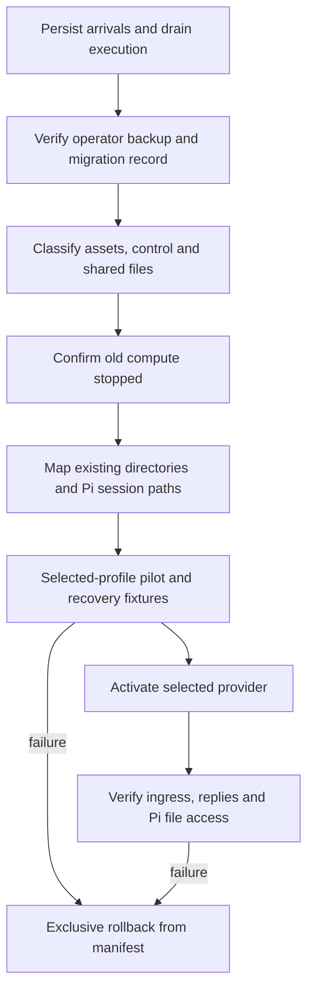

# Plan 1.7: protection profiles and cutover

**Status:** planned cross-cutting release criteria, applied incrementally. The [roadmap delivery order](../roadmap.md#delivery-order) owns sequencing and status. **Prerequisites:** the implemented runtime, persistent-directory, ingress/broker and protection features selected for each release; streaming checks apply only when [SSE](06-live-interface.md) is enabled. M5 covers a fresh Docker pilot, M6 the first existing-agent production cutover, and M10 remaining supported-profile parity, migration and RPC retirement. **Layers:** all six. [FAQ](#faq).

## Objective and protection profiles

Migrate existing agents to the SDK/provider path without losing inputs, histories, plugin files, or delivery evidence, and publish only protection claims that are enforced. The type-checkable [reference contracts](runtime-contracts.ts) are not evidence that any protection or recovery driver works.

This plan is not a final barrier that waits for every other plan to finish. Apply its relevant safety and recovery checks to each delivered slice. M2 is Process SDK parity work, explicitly `[no sandbox]`; it is not an existing-agent migration or a hidden-secret guarantee. M5 may support a fresh Docker agent using directly mounted durable directories, a model broker, durable operator ingress and REST/polling status. Additional plugin adapters, SSE, idle/always-on modes and strict tools are separately gated before their own enablement; unfinished features remain unavailable.

| Profile | Claim allowed | Required proof |
|---|---|---|
| Process `[no sandbox]` | Trusted local execution using shared lifecycle and direct Pi session-file contracts. | Truthful capability reporting; refuse requirements the OS driver cannot enforce. |
| Docker baseline | Container/mount/resource/network protection as configured. | Entire SDK/tool guest contained; assets/control/credentials boundary verified; disclose Pi-live-session write access. |
| Strict workspace-only tools | Tool execution cannot access live session/control/asset-write roots. | Separate identity/service without those mounts; enforce every tool path, extension path, and descendant process. |

Pi must write live histories. If tools share its identity/mounts, they can also reach those histories. Strict mode therefore separates the tool executor from the Pi session writer. A prompt, tool name allowlist, or wrapper around bash alone is insufficient. Keep credential and privileged operation authority outside the entire guest. Same-agent session routing and per-session directories do not claim hostile-session isolation.

[Plan 1.8](10-agent-simplification.md) contributes resource/role configuration in M1, local specialist delegation in M3 and one encrypted secret-provider/model-broker path in M4. Additional adapters and editable automation follow in later slices. Apply their additional gates when enabling them; do not postpone the early credential boundary until the whole simplification plan is complete. Agent-authored automation must run in separately isolated workers, never be imported into the credential-bearing harness process.

## Fresh pilot versus existing-agent migration

A fresh M5 pilot proves the selected profile's singleton/writer ownership, actual isolation, credential boundary, persistent mounts, stopped-compute ingress, cancellation, restart and direct Pi resume. It may use operator input and polling without Telegram or SSE. Record the supported platform and disabled features. It has no legacy history to migrate, so passing this pilot does not certify legacy-data migration.

M6 adds an end-to-end Telegram path and migrates one eligible existing agent. Require operator backup/rollback readiness, identity/history mapping, continued-ingress accounting, uncertain-delivery recovery and exclusive rollback below for that agent and every integration it retains. Do not silently drop an unsupported integration during migration. Later migrations repeat these checks for their selected features; M10 completes supported-profile parity and broader migration before global RPC retirement.

## Migration state and flow

A trusted migration record carries agent identity, old/new code/layout/config/asset/recipe revisions, operator backup reference, queue high-water mark, existing session mappings and directory paths, provider identity, phase, verification result, and rollback target. Each step is restartable and refuses unexpected source revisions. An operator's deployment backup is separate from the runtime: the harness adds no session archive, JSONL-copy or workspace-checkpoint pipeline.

```mermaid
flowchart TB
    Drain[Persist arrivals and drain execution] --> Backup[Verify operator backup and migration record]
    Backup --> Classify[Classify assets, control and shared files]
    Classify --> Stop[Confirm old compute stopped]
    Stop --> Move[Map existing directories and Pi session paths]
    Move --> Verify[Selected-profile pilot and recovery fixtures]
    Verify --> Activate[Activate selected provider]
    Activate --> Observe[Verify ingress, replies and Pi file access]
    Verify -->|failure| Rollback[Exclusive rollback from manifest]
    Observe -->|failure| Rollback
```

1. Start with one drained agent and durable ingress; accepted arrivals remain queued through cutover. Preserve input IDs and external delivery records.
2. Verify an operator-managed consistent backup and recovery procedure for control DB/WAL, existing files, configuration and credentials before destructive layout changes. Record its reference without exposing secrets; this does not introduce a harness backup service.
3. Classify approved assets under `agents/<id>/base/releases/<revision>` and agent-authored content under `agent-managed/`. Keep `sessions/` separate, queue/private plugin state outside compute, and attachments under the agent-managed plugin paths. Retain the **single existing working tree** and preserve ambiguous edits for review.
4. Preserve original Pi files, stable logical/Pi IDs, entry correlations and thread model overrides. Pi resumes from the existing `sessions/` directory, mounted at `/sessions`; `/workspace` maps to `agent-managed/`. Use runtime cwd override for host-path history, without rewriting or recreating JSONL. See [Pi-owned sessions](02-workspace-and-provisioning.md#pi-owned-sessions).
5. Revoke grants and confirm old compute/descendants stopped before changing active mount paths or activating replacement compute. Reconcile singleton/slot ownership and session-path mappings, then run parity/Pi-resume validation before accepting tool work.
6. Observe enabled ingress and integration replies, original session continuity, mounted-file access, REST/polling recovery status, and external-operation receipts. Verify stream reconciliation only if streaming is enabled. Keep operator rollback material until validation succeeds and retention policy allows removal.

If independent session workspaces are encountered, reconcile offline before selecting the shared tree; do not silently merge or overwrite active directories. Config/image/asset upgrades use the same drain-stop-replace ordering.

## Rollback and failure handling

Rollback is a trusted exclusive operation: stop new compute, reconcile uncertain sends, preserve newly accepted input and useful output, and revert code/config/layout only when compatible with the existing persistent directories. Resume after verifying one active runtime/writer and Pi can read its original session. Do not replace current sessions or queues with older copies automatically. If operator recovery from a backup is necessary, separately reconcile subsequent files, inputs and operation receipts so recovery cannot silently drop notifications or replay confirmed sends.

An uncertain old runtime or detached writer blocks replacement until externally stopped. Missing/unreadable persistent directories, volume-write errors or SDK session/close errors enter `recovery_required` and block the next writer. Revoke grants, close/contain the process, retain the existing files, and repair access before reconciling with Pi; never blank-reset a directory, synthesize history or replay a completed model turn to repair storage. There is no automatic fallback from Docker to trusted host execution or from SDK to CLI RPC. Unmigrated agents may retain their explicitly selected existing runtime during staged delivery; an SDK runtime failure never silently switches them back. Retire the old `PiRpcClient` launch path and redundant extension-UI reporting transport in M10 only after all supported migration/profile cases have demonstrated persisted-entry and lifecycle parity, and rollback preparation is verified. One successful pilot does not authorize global removal.

## Acceptance matrix

Apply shared ownership, cleanup and persistent-file cases from the first runnable release. Cases for a particular integration, lifecycle mode, platform or stronger protection claim gate that feature's enablement, not unrelated limited-profile releases. Existing-agent migration/rollback cases apply before moving existing data. Record each release's supported scope and evidence in the roadmap.

| Scenario | Required result |
|---|---|
| `maxConcurrentSlots: 1`; A/B/C; repeat A input | A owns the sole execution reservation through SDK close and verified cleanup; B/C stay queued without SDK children. A reuses its binding; later turns use the same agent sandbox/cwd with independent Pi history. |
| Parallel arrivals and provisioning timeout | One singleton reservation/provider identity; unknown outcome blocks another create. |
| Two writing turns plus plugin/background/operator write | Same gate serializes participating writers; current files are reread and instrumented stale edits fail. |
| Descendant outlives child or cleanup is uncertain | Next writer waits; externally stop/fence before handoff. |
| Missing/read-only/full volume or Pi session error | Visible `recovery_required`; preserve original files, repair access and reconcile through Pi; no blank reset, fabricated transcript, duplicate model run or external action. |
| Close/abort one session | Revoke grants before bounded SDK close; release its reservation only after error-free finalization and verified cleanup; preserve every other session's queued input and history. |
| Unsupported capacity or config/image change | Reject `maxConcurrentSlots` values other than `1`; drain config/image updates without dropping queued work, and confirm old compute stopped before replacement. |
| Harness/supervisor crash and late callbacks | Reconcile reservations/children; stale generations/grants cannot finalize newer runs. |
| Forged/expired credential or cross-agent path | Broker and provider reject access at enforced boundaries. |
| Strict tools attempt read/write/bash/extension escape, when enabled | Tool service cannot access prohibited roots or bypass operation authority; otherwise reject the strict requirement. |
| Existing-agent cutover or rollback while ingress continues | No lost input/files/history; uncertain delivery reconciled before replay. |
| Stream disconnect/reconnect, when SSE is enabled | Scope, cursor/replay and history reconciliation preserve delivery without unauthorized exposure. |

Run shared lifecycle and actual enforcement cases for each enabled provider/profile/platform. Broaden to Linux and Docker Desktop as each becomes supported; full target coverage remains required before claiming both. Record fixture versions, enabled features, direct Pi resume/operator-recovery results, and known filesystem durability limits. Update [high-level design](../high-level-design.md), affected layer docs, and shipped app-home docs in each implementation change. The roadmap marks the relevant delivery slice complete only when its applicable gates pass; a baseline release does not certify untested volumes or strict profiles.

## FAQ

These answers guide release reviewers and deployment operators through the planned migration. They do not claim the profiles are already enforced.

### Which protection profile should an operator select?

Choose based on the boundary the deployment actually needs and can verify. Process is trusted `[no sandbox]`; Docker baseline adds its tested container/mount/resource/network policies but includes a live-session write exception. Strict workspace-only tools require the separate executor boundary. Do not select a stronger label when the driver reports that it cannot enforce the corresponding requirements.

### Why isn't a bash wrapper or a read-only asset mount enough for strict tools?

Tools can reach files through read/write/edit, arbitrary subprocesses, extensions, and descendants. Pi itself must write session history. Strict tools need an identity/service that lacks prohibited mounts/authority across all those paths, while approved assets stay immutable. A prompt or one intercepted command does not provide that isolation.

### What should I back up before migrating the first agent?

Use the deployment's operator-managed backup procedure for consistent DB/WAL state, existing sessions and identity mappings, plugin state/attachments, configuration, base/agent-managed files and credentials. Record the backup reference and queue high-water mark without exposing secrets. Include rollback code/layout/revision choices so recovery does not pair incompatible data and binaries. This is migration readiness, not a new runtime session-copy service.

### Can messages continue arriving while I migrate?

The target migration keeps durable ingress available while tool execution drains. New accepted events must remain queued and accounted for through activation or rollback. Today's notification wrapper is not sufficient for that promise by itself, so durable ingress is a prerequisite rather than a migration-time assumption.

### What if existing sessions have different private workspace copies?

Reconcile those differences offline before choosing the one shared workspace. Preserve ambiguous/conflicting edits for review instead of silently overwriting or live-merging them. The normal target is one existing shared directory with independent session histories; migrating history does not require manufacturing per-session workspace copies.

### How do I know the new provider is ready to cut over?

Require shared behavior/direct-Pi-resume fixtures, actual selected-profile enforcement, slot/cleanup/file-error races, and pilot evidence. Check enabled inputs/replies, existing conversation continuity, mounted files and recovery status; add stream reconciliation only when SSE is enabled. An existing-agent cutover additionally needs operator-backup/migration/rollback evidence for the retained integrations. Unimplemented adapters, SSE and strict tools do not block a supported baseline, but a successful container start or type-check alone does not meet that baseline's gates.

### The old runtime is unresponsive. Can I activate a replacement after its lease expires?

No. Confirm externally that old compute and workspace-writing descendants have stopped or lost enforceable write access. Unknown old ownership blocks activation because expiry and channel loss are not termination evidence. This also applies to configuration/image rollouts; there is no overlapping warm replacement in the baseline.

### What if the new code fails after users have already sent more messages?

Stop/reconcile new compute and preserve accepted inputs plus current files and operation receipts. Roll back compatible code/config/layout and verify access to the same Pi session and agent-managed directories before resuming. Replacing current session files or the queue with older copies could lose work or repeat external actions, so it is not an automatic rollback step.

### Does reverting the asset release undo file edits, emails, or payments?

No. Asset selection controls future capabilities, not past workspace mutations or external effects. Restoring working files from an operator backup is a separate exclusive action; external outcomes need their own reconciliation. Keep that distinction visible in the rollback record so “reverted” does not imply effects that were never reversed.

### When may we remove the old RPC and entry-reporting bridge?

In M10, after the SDK host reproduces delivery-entry correlation for every supported migration/profile case, the applicable lifecycle/recovery suites pass, broader migration is complete and rollback preparation is verified. Keep the legacy path only for explicitly unmigrated agents before that point; never use it as automatic fallback. Update current layer docs, FAQs, API/client behavior and shipped user reference when retirement actually occurs.
