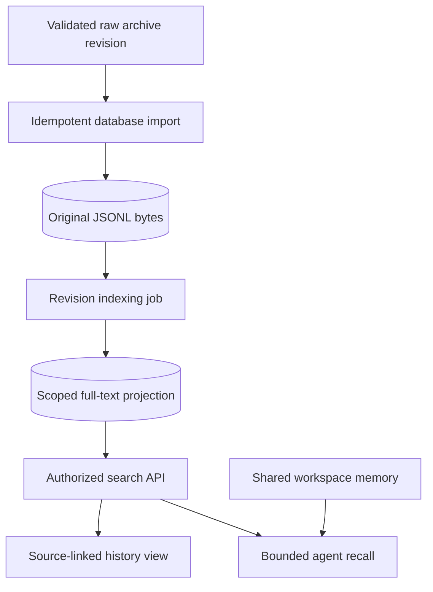

# Plan 2: session search and memory

**Status:** planned after the sandbox workstream. **Depends on:** stable [session archives](03-session-archives.md), [scoped access](04-ingress-and-operations.md), and [workspace coordination](02-workspace-and-provisioning.md), with workstream 1 cut over. **Layers:** [core](../low-level/core.md), [API](../low-level/api.md), [web](../low-level/web.md), [agents](../low-level/agents.md). [Roadmap](../roadmap.md#2-session-search-and-memory). [FAQ](#faq).

## Objective and design choices

Make archived conversations searchable with source-entry links and provide bounded recall while preserving editable workspace notes. Start with full-text search. Embeddings and extracted summaries are optional later backends, not prerequisites or additional committed roadmap items. Retrieved text is evidence, not trusted instructions or automatically verified memory.

Pi remains the live JSONL writer. The search phase makes raw JSONL revisions available in database storage even for deployments previously using local/cloud archives. Derived text/indexes are rebuildable; they cannot replace the archived bytes or become a second conversation serializer.

## Components and proposed data model

| Element | Responsibility / key |
|---|---|
| Raw archive importer | Idempotently copy validated manifest, original files/bytes, checksums, lineage and restore metadata into database archive storage. |
| Revision job | Trusted harness/agent/thread/session/revision plus index format version; queued/running/complete/failed. |
| Entry projection | Archive revision, relative JSONL file, entry ID/parent ID, role/type, timestamp, searchable text, source offsets. Preserve branch provenance. |
| Full-text index | Searchable message/tool text with scope columns and stable source keys. Rebuilt from raw revisions. |
| Search service/API | Enforce scope before query/snippets/counts, bound excerpts and result count, return stable cursor and source links. |
| Memory provider | Retrieve bounded context; [MemoryProvider](runtime-contracts.ts) continues to prepare/checkpoint shared workspace notes. |
| Workspace memory | Agent-wide `workspace/memory/` notes and indexes, read/changed under the same writer gate as tool turns. |

Proposed logical tables are `archive_revisions`, `archive_files`, `index_jobs`, `session_entries`, and a full-text projection. Their implementation may share the database archive adapter, but indexing transactions and failures must not change archive restore eligibility. Include trusted harness scope in every physical key even where a reference type omits it.



## Index and query algorithms

1. After archive publication, enqueue `(scope, revision, indexVersion)` once. Backfill uses the same path and a durable manifest cursor.
2. Verify checksums and parse raw lines defensively. Preserve entry/branch relationships and mark partial captures distinctly; malformed files are inspectable failures, not silently promoted restore heads.
3. Build entries/index rows in a staging transaction, publish the completed revision projection, and atomically update its index head. Default results should not repeat identical entries merely because several archive revisions contain them; choose an explicit latest validated projection and preserve revision-specific inspection.
4. Authorize agent/thread scope before executing full-text search or computing counts/snippets. Apply bounded query length, excerpt size, result count, time range and optional entry-type filters.
5. Return a stable cursor tied to the query/scope and index snapshot plus rank/tie-break identity. If that snapshot expires, require restart rather than silently skipping/duplicating pages.
6. Recall selects relevant excerpts within a configured context budget and retains source pointers. Search/index failure degrades recall explicitly without making the original session unrestorable or rerunning a model turn.

Illustrative proposed request/result (route name and schema must be finalized in implementation):

```json
{
  "request": { "agentId": "support", "threadId": "telegram:42", "query": "refund policy", "limit": 10 },
  "result": {
    "excerpt": "The policy applied to ticket T42...",
    "source": { "logicalSessionId": "S1", "revision": "r8", "file": "S1.jsonl", "entryId": "U9" },
    "nextCursor": null
  }
}
```

## Example and memory semantics

Support receives a follow-up about T42. Recall searches only authorized support/thread history, returns the policy excerpt with S1/r8/U9, and links to the original entry for inspection. The agent may draft a durable note under `workspace/memory/`; that is a separate workspace write with its own checkpoint, not a rewrite of the source transcript.

Every agent has one workspace and independent session histories. Restoring an older conversation sees the latest shared notes/files, so tools reread them before editing. Whole-workspace restoration uses its independent validated head under exclusive recovery. Archived session keys survive sandbox replacement.

## Retention, rollout, and acceptance

Deletion/retention applies to raw revisions, entry projections, indexes, pending jobs, and recalled caches. Persist tombstones or equivalent generation checks so an old backfill job cannot resurrect deleted material. Restrict archive credentials/indexing authority to trusted services; keep operational audit evidence separate from editable notes. Do not expose another scope through result counts or highlighted snippets.

Implement raw database backfill, then revision indexing, scoped paginated API and web links, bounded recall, and retention/rebuild tooling. An index-format upgrade builds a new projection/version before switching readers; raw bytes remain unchanged and rollback selects the earlier index version.

Acceptance: backfill local/cloud/database histories without byte or lineage loss; duplicate jobs remain idempotent; failed indexing does not affect restore; stable pagination avoids duplicate revisions; source links resolve; access tests cover snippets/counts/cursors across agents and threads; deletion survives in-flight jobs; rebuilding reproduces results from raw archives; recall honors scope/budget and workspace writes use the gate.

## FAQ

These answers describe planned search/recall for users investigating history and developers implementing indexing and access control.

### How is full session search different from the current Events search box?

Events search currently filters notification input text stored in the queue database. This plan derives searchable conversation/tool entries from archived JSONL and returns exact source pointers. It can therefore support questions about what the agent actually said or did, rather than only what input was submitted.

### Will search work only if I originally chose database archival?

No. The planned importer backfills original raw revisions from local/cloud archives into database storage using the same idempotent revision-job path. Checksums, bytes, lineage, and restore metadata must survive the import. Having a database archive already can simplify ingestion, but does not eliminate indexing/access-control work.

### What do the proposed search parameters and source fields mean?

`agentId`/`threadId` identify the requested scope, `query` is bounded search text, and `limit` bounds results. Authorization must verify scope rather than trust those requested IDs. Each result points to logical session, archive revision, relative JSONL file, and entry ID; a cursor also binds to query/scope and an index snapshot. Final route/schema names remain implementation decisions.

### How do I verify an excerpt instead of trusting a generated summary?

Follow its source pointer to the original archived entry/revision, including branch provenance where relevant. Recall should retain those links within its context budget. An excerpt or summary is evidence to inspect, not a newly authoritative instruction or an automatic correction to durable memory.

### Will every older revision create duplicate search results?

Default search should use an explicit latest validated projection and stable entry identity so identical entries repeated across snapshots do not appear as separate discoveries. Revision-specific inspection remains available for audit. The index must preserve lineage rather than flatten incompatible branches into an invented single conversation.

### What happens if indexing fails, a JSONL file is malformed, or the index is rebuilt?

Index jobs can retry independently of model execution and archive publication. Mark invalid/partial evidence explicitly and preserve the last valid restore state; an indexing failure must not make the original bytes unrestorable. Rebuilding regenerates derived projections from raw archives under an index version, with a controlled reader switch.

### Why does pagination need a snapshot-bound cursor?

Ranking and available revisions may change while indexing continues. Binding the cursor to the query, scope, snapshot, and a stable tie-break avoids silently skipping or duplicating pages. If the retained snapshot expires, require a fresh search rather than pretending the old offset still represents the same result set.

### Can one agent search another agent's history, or can snippets leak private content?

Only with explicit authorized scope. Apply access checks before searching, counting, ranking snippets, replaying cursors, or serving raw source links. A filtered result list is insufficient if counts/highlights or a source URL can still cross the boundary; index/archive credentials stay in trusted services.

### What is the difference between recall and `workspace/memory/` notes?

Recall retrieves bounded source-linked evidence for a task. Workspace memory holds editable agent-authored notes shared across that agent's sessions and changed under the workspace gate. Neither replaces Pi history. An old conversation must reread current notes/files before editing instead of restoring its old workspace view implicitly.

### Are embeddings required, and how much history is sent to the model?

The initial plan uses full-text search; embeddings or extracted summaries are optional later backends. Recall must enforce a configured relevance/scope/context budget, not dump every matching session into the prompt. Exact budget defaults are not specified here and must be made explicit when implemented.

### What happens when a session is deleted while an import job is still running?

Retention/deletion must cover raw revisions, projections/indexes, pending jobs, and recalled caches. Tombstones or equivalent generation checks stop stale backfill/index jobs from resurrecting deleted content. Verify that behavior during implementation rather than treating deletion of one visible result row as complete erasure.
