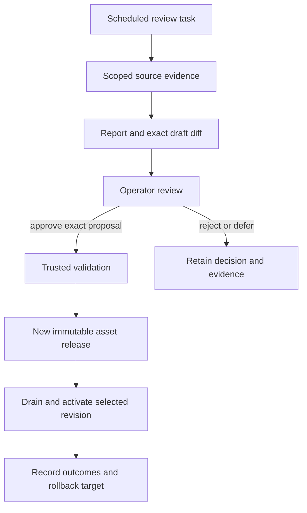

# Plan 3: agent improvement

**Status:** planned after searchable history. **Depends on:** [plan 2 evidence/search](08-session-search-memory.md), [approved assets/workspace gate](02-workspace-and-provisioning.md), and [trusted publication/cutover](07-protection-and-cutover.md). **Layers:** [agents](../low-level/agents.md), [plugins](../low-level/plugins.md), [core](../low-level/core.md), [API](../low-level/api.md), [CLI](../low-level/cli.md), [web](../low-level/web.md). [Roadmap](../roadmap.md#3-agent-improvement). [FAQ](#faq).

## Objective and release boundary

Produce useful review-only reports first, then support controlled application of approved changes. The reviewer is an ordinary scoped agent run using the same queue/runtime/archive services; it cannot mutate another agent's active assets or execute privileged host builds. No automatic self-modification or arbitrary change quota is introduced by this workstream.

[Plan 1.8](10-agent-simplification.md) separately permits ordinary own-workspace overrides and permission-scoped publication of scripts/base releases. This plan concerns evidence-driven review and application; its review-only first release does not prohibit those explicitly configured customization capabilities.

## Components and records

| Component / proposed record | Responsibility |
|---|---|
| Review schedule | Target agent, evidence window, cadence, policy revision; scheduler creates a normal review task. |
| Evidence selector | Authorized session/archive entry links, event failures, repeated workflows, observed skill usage. Search results remain untrusted evidence. |
| Review report | Problem pattern, supporting/counterevidence, expected benefit, limits, and optional proposed changes. |
| Proposal | Stable ID, target, base asset/workspace revision, evidence pointers, exact diff, validation plan/result, review decision, rollback revision. |
| Trusted validator/publisher | Validate approved changes outside the guest; publish a new immutable release through the controlled rollout. |
| Outcome record | Proposal/release/run correlation, regressions or improvements observed, application/rollback result. |

Store review decisions and publication receipts in trusted control state, separate from agent-editable draft files. Reuse a stable review-task key for target/window/policy so scheduler retries do not create duplicate applied proposals. A new base revision makes an old approval/diff stale and requires revalidation/review.



## Review algorithm and example

1. Gather bounded evidence for the target/window; separate observations from inferred causes and account for missing or partial sessions.
2. Group recurring failures, successful repeated workflows, duplicate/conflicting skills, outdated notes, and expensive context patterns. Avoid deleting material solely because it is old.
3. Write a report and, when justified, an exact proposal under the reviewer's workspace. Cite archive revision/file/entry IDs, explain expected behavior, and name the base revision.
4. Keep the first delivered mode review-only. Later, accept a trusted operator decision for the exact diff and base, then run the stated validation.
5. Publish an approved asset release, drain old runtime generations before activation, and record outcomes. Shared workspace note/skill changes use the target agent's same writer gate and expected-content checks.

Example proposal:

```text
Proposal: support-skill-17
Observation: three ticket sessions repeated the same CSV cleanup sequence.
Evidence: support / S1:r8:U9, S2:r4:U3, S3:r2:U8
Base: asset release a12
Change: exact diff adding a bounded CSV-cleanup skill and sample input
Validation: representative CSV tasks, malformed input, output comparison
Decision: pending review; active release remains a12
Rollback: select a12 after stopping any newer generation
```

Repeated successful steps may become a reusable skill; tool failures may motivate a tested helper fix; prompt changes should be checked against representative tasks. Evidence is not sufficient to promise a performance improvement before validation and later observation.

## Application, failures, and rollback

Approved prompts/extensions/scripts/dependency recipes remain immutable during execution. Workspace code never becomes a privileged extension or trusted build input merely because the reviewer wrote it. Publication validates provenance, exact base/diff, required checks, and policy. Failures leave the active release unchanged with a recorded result.

For target workspace changes, acquire the workspace gate, reread current files, verify expected content, apply atomically where possible, checkpoint, and record the applied revision. Stale bases or conflicting edits return to review. For asset changes, build/publish a new release in trusted tooling, drain and stop old compute, then activate; never mutate a live release in place.

Rollback selects a known prior release through the same drain/stop/activate path and preserves outcome evidence. Reverting assets does not automatically revert the shared workspace or external effects. Workspace rollback is a separate explicit, exclusive revision operation.

## Implementation and acceptance

Implement scheduled reports and evidence links first, then a proposal/decision ledger, trusted validation/publication, and outcome/rollback recording. API/web can expose review details and decisions; CLI can invoke the trusted release workflow only with the same checks, not bypass them.

Acceptance for the first release: source-linked reports are useful on representative histories, duplicate scheduled tasks do not duplicate applied work, access stays scoped, missing evidence is explicit, and no active assets change. Acceptance for later application: only the approved exact diff/base publishes; failed validation/stale review cannot activate; target workspace writes serialize; new releases have provenance; rollback restores the selected release without lost inputs/history or overlapping runtime generations. Record results without claiming improvement from report generation alone.

## FAQ

These answers describe the planned review workflow from the perspectives of agent owners, reviewers, and release developers.

### Will the first release automatically modify my agent after noticing a failure?

No. It produces review-only reports and optional draft diffs with source evidence. Active assets do not change. Controlled application is a later capability that requires an exact reviewed proposal, validation, and trusted publication; a reviewer agent cannot simply edit another agent's active runtime.

### What should the reviewer look for, and does every review need to propose a change?

Look for recurring failures, repeated successful workflows, conflicting skills, outdated notes, and context-cost patterns within the authorized evidence window. A report can conclude that evidence is insufficient or no change is justified. Do not invent change quotas or delete knowledge solely because it is old.

### What parameters define a review, and how are duplicate scheduled reviews handled?

A schedule identifies target agent, evidence window, cadence, and policy revision. Use a stable review-task identity derived from the target/window/policy so retries do not create repeated applied proposals. Cadence and evidence-budget defaults remain deployment/implementation decisions; the ordinary queue/runtime still controls execution and archival.

### What must a proposal contain before I can review it?

Include the problem, source revision/file/entry links, relevant counterevidence or missing data, exact diff, target/base asset or workspace revision, expected behavior, validation plan/result, and rollback target. Keep trusted review decisions separate from editable draft files so editing a draft cannot silently alter what was approved.

### What if the agent's prompts or skills change after I approve the proposal?

Treat the changed base as stale. Rebase/revalidate the exact diff against the current target and obtain a matching review decision before publication. Approval of one revision does not authorize applying a superficially similar patch to another, especially when target workspace content changed during review.

### Can the reviewer read arbitrary agents or run a host build to validate its idea?

No. It uses explicitly scoped evidence and the same controlled runtime as other agent work. Drafting a script does not make that script a privileged build hook or approved extension. Trusted validation/publication resolves provenance and authority outside the guest, rather than delegating control-plane privileges to the reviewer.

### How is a workspace-note correction different from a prompt or extension release?

A note/agent-authored workspace change acquires the target's writer gate, rereads current content, verifies the expected base, applies the edit, and checkpoints. Approved prompts/extensions/dependency recipes become a new immutable asset release in trusted tooling and activate through drain/stop/replacement. Do not edit active approved assets in place.

### What happens if validation fails or publication stops halfway?

Record the failure and leave the active release unchanged unless a completed, validated activation is established. Reconcile partial publication by proposal/revision identity rather than silently repeating application. Preserve drafts and evidence so the operator can amend, reject, or retry the proposal through the same trusted checks.

### How do I roll back an approved improvement?

Select the recorded prior asset revision through the same drain/stop/activate workflow and preserve the outcome record. That changes future assets; it does not automatically undo workspace changes or external actions. Workspace restoration requires its own explicit exclusive revision operation, and external effects require separate reconciliation.

### How will we know that an applied change actually improved the agent?

Validate against representative tasks and later record proposal/release/run-linked outcomes, including regressions and limits. Report generation or a passing syntax check alone does not demonstrate better task performance. Avoid unsupported claims when sample size, scope, or missing evidence prevents a reliable conclusion.
