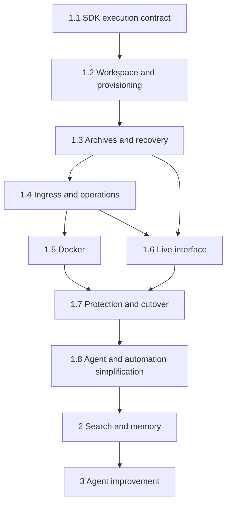

# Core implementation roadmap

This is the single roadmap and status tracker for CogniSphere. It owns delivery order, dependencies, and completion gates across all six layers. The [high-level design](high-level-design.md) explains the system; the [layer designs](#layer-ownership) describe current code; the individual plans below own proposed interfaces and implementation details.

**Current status:** all ten items are planned and unchecked. Existing Pi RPC execution, local files, and polling are implemented; SDK providers, archives, scoped brokers, SSE, agent/automation simplification, session search, and the improvement workflow are not completed by these design documents. The [reference contracts](plans/runtime-contracts.ts) are type-checkable examples with unimplemented drivers. [FAQ](#faq).

## Delivery rules

Sandbox implementation and agent/automation simplification come first, followed by searchable sessions/memory, then agent improvement. Use one shared orchestration path and small Process/Docker adapters. Integrate Pi SDK directly inside execution; no remote stock-Pi-RPC intermediate stage or automatic trusted-host fallback.

Treat simplification as one task, **1.8**, with its resource/configuration interfaces agreed during 1.1–1.4 and activation after the protection gates. It covers immutable base assets plus workspace overrides, capability plugins, specialist sub-agents, vault-backed operations, script routing, and scheduled/daemon scripts. Editable automation is harness-managed but runs in isolated workers; it cannot be imported into the credential-bearing harness process.

Each agent has one sandbox and one shared workspace. Multiple sessions may be admitted, but the baseline requires `maxConcurrentSlots = 1`; all managed workspace turns/publications/maintenance serialize through the same writer gate. Session history and workspace recovery have independent validated heads. Process remains visibly `[no sandbox]`; strict workspace-only tool access requires its own enforced boundary.

Implement milestones incrementally, but activate a production provider only after its cross-cutting persistence, broker, and protection/cutover gates pass. Keep current layer docs factual until the corresponding code ships. An unchecked item can contain implemented substeps; attach evidence and record remaining work here before marking the whole item complete.

## 1. Sandbox implementation

| Item and individual low-level plan | Dependencies | Primary layers | Reviewable output |
|---|---|---|---|
| [1.1 Shared execution contract and SDK host](plans/01-sdk-runtime.md) | None for contract/parity work | Core, agents, CLI | Shared runner boundary, singleton admission, SDK host/transport, Process adapter. |
| [1.2 Persistent workspace and native provisioning](plans/02-workspace-and-provisioning.md) | 1.1 | Core, agents, plugins, API, CLI | Separated control/assets/data layout, writer gate, versioned native recipes. |
| [1.3 Session archives and recovery](plans/03-session-archives.md) | 1.1–1.2 | Core, agents, API | Local/cloud/database adapters, restore/checkpoint receipts, storage-only recovery. |
| [1.4 Trusted ingress and plugin operations](plans/04-ingress-and-operations.md) | 1.1–1.3 | Plugins, core, API, agents | Durable ingress/staging, typed broker, grants, deduplicated operation receipts. |
| [1.5 Docker runtime](plans/05-docker-runtime.md) | 1.1–1.4 | Core, agents, CLI | Pinned images, fixed mounts, supervisor lifecycle, orphan reconciliation. |
| [1.6 Live interface and delivery](plans/06-live-interface.md) | 1.1, 1.3–1.4; 1.5 for full provider controls | API, web, core, plugins | Authenticated SSE/reconnect, history reconciliation, explicit delivery/status UI. |
| [1.7 Protection profiles and cutover](plans/07-protection-and-cutover.md) | 1.1–1.6 | All layers | Verified protection profiles, one-agent pilot, backup/rollback and final cutover evidence. |
| [1.8 Agent and automation simplification](plans/10-agent-simplification.md) | 1.1–1.7 for activation; agree interfaces during foundational work | All layers | Read-only base/image, persistent overrides, selected capability context, same-sandbox sub-agents, encrypted vault/broker, script routing and safe cron/daemon publication. |

- [ ] **1.1 complete:** Process SDK parity covers initial/steered entry mapping, cwd override, settlement, cancellation, uncertain disconnects, and atomic singleton/session admission. Existing queue/silent/no-steer/retry behavior remains shared. Old RPC/reporting path is removed after verified cutover.
- [ ] **1.2 complete:** All managed workspace access uses the gate from turn preparation through descendant cleanup/checkpointing. Native dependencies are approved/versioned; sessions share cwd but retain independent histories/profiles; expected-content edits reject stale changes.
- [ ] **1.3 complete:** Every archive backend restores raw Pi bytes and lineage; partial/no-transcript outcomes are explicit. Failed persistence retains files/gate/reservation, retries storage only, and blocks the next writer. Restart reconciles compute before requeue; closing one session preserves siblings.
- [ ] **1.4 complete:** Ingress persists while compute is idle; scoped grants cannot spoof identity/lifecycle; messaging, Telegram, GWS, scheduler, and artifacts use typed operations. Staged publication is recoverable; changed-payload duplicates conflict; uncertain delivery requires reconciliation.
- [ ] **1.5 complete:** Process/Docker pass the same behavior/recovery suite. Docker enforces declared mounts/resources/network boundaries, preserves durable data, and never overlaps old/new singleton generations. Session close/idle policy respects siblings, descendants, and persistence obligations.
- [ ] **1.6 complete:** Authorized live progress and reconnect do not leak audiences or duplicate final messages. UI shows runtime/storage/capacity/workspace queue and pending persistence. Explicit replies have independent receipts; durable completion waits for required storage.
- [ ] **1.7 complete:** Crash, cancellation, restart, publication races, storage failure, forged credentials, and migration/rollback pass. Capacity-2 A/B/C tests prove one sandbox and serialized turns; strict tool claims have enforcement evidence. No lost notifications/history/files; current and shipped docs match the cutover.
- [ ] **1.8 complete:** Ordered role resources and same-name workspace overrides work across image upgrades; base → plugin → workspace installers build safely. Main/sub-agent turns share one sandbox/workspace without delegation deadlock. Vault/broker keeps upstream secrets outside guest and editable workers. Script routing replaces static routing; scheduler scripts and supervised daemons emit durable events while agent compute is off. Authorized edits publish immutable revisions with safe reload/rollback; GWS uses scripts instead of a built-in notification monitor. Migration preserves customization, cursors, schedules and pending deliveries.

The plans contain algorithms, examples, detailed test scenarios, and rollout steps for each gate. Keep implementation evidence beside the corresponding checkbox (change/PR, validation result, and remaining limitations) when work lands.

## 2. Session search and memory

Individual plan: [session search and memory](plans/08-session-search-memory.md). Follows workstream 1, including simplification; uses its cut-over archive, role scope, and workspace contracts. Primary layers: core, API, web, agents.

Deliver database backfill of raw archive revisions, a rebuildable full-text index, scoped paginated search with source-entry links, bounded recall, shared workspace notes, and retention/deletion across raw and derived data.

- [ ] **2 complete:** Search results trace to original restorable bytes, indexing failure does not affect execution/restore, access cannot cross unauthorized scopes, pagination is stable, deletion cannot be undone by stale jobs, and recall respects context budgets and the workspace gate.

## 3. Agent improvement

Individual plan: [agent improvement](plans/09-agent-improvement.md). Depends on workstream 2 evidence and workstream 1 asset/publication boundaries. Primary layers: agents/plugins with core, API, CLI, and web support.

Deliver scheduled reports of repeated workflows/failures/skill usage, evidence-linked exact draft diffs, a trusted review/validation/publication workflow, and outcome/rollback records. The first release is review-only; controlled application follows its own acceptance checks in the plan.

- [ ] **3 complete:** Review-only reports produce useful scoped evidence without changing active assets; later application publishes only an approved, validated exact revision/diff. Shared workspace changes serialize, and asset changes can be applied and rolled back with provenance and no overlapping runtime generations.

## Layer ownership

| Current low-level design | Roadmap responsibilities |
|---|---|
| [Core](low-level/core.md) | Shared orchestration, singleton/lease stores, providers, archives/search, role delegation, script routing and worker supervision. |
| [Plugins](low-level/plugins.md) | Capability bundles, durable ingress, staging, vault-backed action adapters, cron/daemon producers and operation receipts. |
| [Agents](low-level/agents.md) | Ordered role resources, immutable base and workspace overrides, sub-agent catalogue, history/recall and review drafts. |
| [API](low-level/api.md) | Runtime grants, status/settings, file concurrency, streams, scoped search and review surfaces. |
| [CLI](low-level/cli.md) | Recipe/image tooling, layout migration, runtime selection and trusted release/cutover operations. |
| [Web](low-level/web.md) | Runtime/capacity/persistence state, stream reconciliation, search/source navigation and review decisions. |

The API and CLI descriptions in plans are proposals until implemented. Every roadmap item has exactly one owning plan above; detailed tasks belong in that plan, while delivery status remains here.

## FAQ

These questions help contributors, reviewers, and operators interpret delivery scope. A written design or passing reference-contract type-check is not proof of implementation.

### What can I use today, and which settings/endpoints are only proposed?

Use the six current layer docs as the shipped contract: local Pi RPC execution, filesystem-backed state, existing HTTP routes, and polling. Sandbox/provider selection, session admission settings, archive adapters, runtime grants, SSE, full-history search, and improvement workflows remain planned. Do not enable them by copying a plan's JSON example into today's deployment.

### Why implement sandboxing before search or agent improvement?

The first workstream establishes execution ownership, durable history/workspace recovery, and scoped operation authority. Search then has reliable, authorized evidence to index; improvement can make reviewable proposals from that evidence and publish through a controlled boundary. This order avoids making later features depend on an undefined recovery or trust model.

### Which plan should I work on first, and can separate contributors work ahead?

Start with 1.1's shared contract and SDK parity, then follow the dependency table. Some dependent work can be designed or developed against agreed interfaces before activation—for example, stream projection can use event fixtures—but integration is not complete until its real dependencies pass. Do not bypass persistence or broker gates merely to demonstrate one provider.

### Why are all items still unchecked even though the contract file contains code?

`runtime-contracts.ts` is a type-checkable design reference with driver interfaces and skeleton orchestration. It does not implement transactional admission, provider enforcement, durable storage, or recovery. A checkbox records acceptance-tested delivery in the running system, not how detailed its document or sample types are.

### When may I mark a milestone complete, and where should partial progress go?

Attach implementation/change links, validation evidence, and remaining limitations beside its roadmap item. Keep algorithms and detailed test scenarios in the owning plan. Mark the item complete only after its entire stated acceptance gate passes, including cross-layer integration; report implemented substeps separately while a gate remains open.

### Does `maxSessionsPerSandbox: 4` promise four simultaneous tool runs?

No. The proposed default is admission capacity, while the shared-workspace baseline requires one executing tool-enabled turn. Four sessions may be admitted/waiting without four concurrent writers or four sandboxes. The [runtime FAQ](plans/01-sdk-runtime.md#faq) explains capacity, reuse, and configuration changes.

### Can Process be released before Docker, and can search use a database archive early?

Process is the first parity target, but production activation still needs the applicable workspace, persistence, broker, and cutover protections. An optional database archive belongs to 1.3 and can exist before derived search; selecting it does not complete workstream 2. Docker-specific enforcement and conformance remain their own gate.

### What does the simplification task change about agent customization?

[Plan 1.8](plans/10-agent-simplification.md) adds persistent prompt/skill overrides, new workspace resources, selected main/sub-agent context, and agent-authored routing/monitoring scripts. Base assets stay read-only; a permission can authorize publication of a new release. Script edits take effect through validated immutable publication within trusted policy. Same-sandbox sub-agents yield and resume through messaging so they do not deadlock the single workspace writer.

### Are embeddings, remote cloud providers, and automatic improvement committed deliverables?

No. Initial providers are Process and Docker, search starts with full-text indexing, and evidence-driven improvement starts with review-only reports. The explicitly planned workspace customization and permission-scoped script publication in 1.8 do not authorize automatic changes to trusted security policy or the later improvement workflow. Optional future backends or automatic improvement require explicit design/scope decisions.

### Which docs change when my feature spans several layers?

Update every affected layer contract/FAQ, the high-level design if boundaries changed, the owning plan, and this roadmap's evidence/status. Update shipped app-home docs when user-visible behavior changes. For example, a new stream affects core events, API authorization, and web reconciliation; updating only its route list leaves an incomplete contract.
