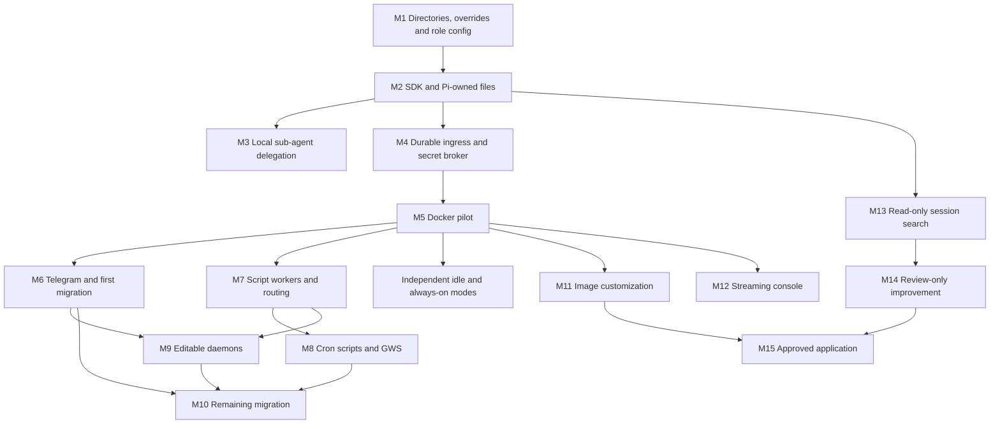

# Core implementation roadmap

This is the sole delivery/status tracker. The [high-level design](high-level-design.md) owns boundaries, current layer docs describe shipped behavior, and the [owning plans](#plan-ownership) hold detailed target contracts. Plan IDs are topic references; **M1–M15 below define implementation order**.

**Current status:** all increments are planned and unchecked. The shipped runtime still uses local Pi RPC and filesystem session files. This change updates the design; it does not migrate running agents.

## Delivery rules

Start with **agent directory reconfiguration**, agent-managed prompt/skill overrides and main/sub-agent configuration, including model selection. Then integrate those resources with the Pi SDK and prove local delegation before adding sandbox deployment and external integrations. Keep one shared runner with small Process/Docker adapters; do not add an intermediate remote Pi RPC implementation.

Use three durable content roots per agent: read-only `base/`, writable `agent-managed/`, and Pi-owned `sessions/`. Docker exposes them as `/assets`, `/workspace`, and `/sessions`. Pi creates, appends, compacts and resumes JSONL directly on the persistent mount. The harness stores only routing/run/task metadata and operation receipts; there is no session archive/copy/restore service, per-turn workspace snapshot or memory implementation.

Keep one sandbox per agent and reuse `maxConcurrentSlots: 1`. Other sessions stay in the durable queue. Hold the writer gate from preparation through Pi/tool shutdown, descendant cleanup and trusted outcome recording. The same gate coordinates file publication and maintenance. Missing mounts, known-session file errors or uncertain old writers cause visible recovery; never silently start empty history or another sandbox.

Apply [protection/migration checks](plans/07-protection-and-cutover.md) when each feature is enabled. Process development is explicitly `[no sandbox]`. A Docker release needs enforced mounts/network/resource boundaries and brokered credentials, but does not wait for every plugin, automation feature or SSE. Existing-agent migration additionally needs backup, continued-input accounting and verified rollback.

Apply the [core simplification review](low-level/core.md#simplification-review-proposed) within these increments: M1/M2 share resource and model resolution across preview, startup and thread selection; M4 separates durable input acceptance and credential use from live runners; M10 removes the superseded paths after parity. Check API-key and OAuth-only model selection through the same resolver. Keep one queue/runner, a small lifecycle manager and small provider adapters; admission/storage interfaces do not require separate deployed services. Editable routing, cron and daemons add capabilities and remain later increments.

## Delivery order

Each increment has a demonstrable result and a completion gate. Dependencies are explicit; an extension does not depend on every earlier row. Attach implementation links, validation evidence and remaining limits beside its checkbox. Keep current/shipped docs factual until the code lands.

```mermaid
flowchart TB
    M1[M1 Directories, overrides and role config] --> M2[M2 SDK and Pi-owned files]
    M2 --> M3[M3 Local sub-agent delegation]
    M2 --> M4[M4 Durable ingress and secret broker]
    M4 --> M5[M5 Docker pilot]
    M5 --> M6[M6 Telegram and first migration]
    M5 --> M7[M7 Script workers and routing]
    M7 --> M8[M8 Cron scripts and GWS]
    M7 --> M9[M9 Editable daemons]
    M6 --> M9
    M6 --> M10[M10 Remaining migration]
    M8 --> M10
    M9 --> M10
    M5 --> Warm[Independent idle and always-on modes]
    M5 --> M11[M11 Image customization]
    M5 --> M12[M12 Streaming console]
    M2 --> M13[M13 Read-only session search]
    M13 --> M14[M14 Review-only improvement]
    M14 --> M15[M15 Approved application]
    M11 --> M15
```

## 1. Agent foundation and sandbox implementation

| Increment | Depends on | Working result and acceptance gate | Owning plans |
|---|---|---|---|
| **M1. Agent directories, overrides and role configuration** | None | Scaffold `base/`, `agent-managed/`, `sessions/`; classify existing defaults/customizations without overwriting them. Resolve agent-managed-over-base prompts/whole skill bundles, ordered prompts and selected plugins/scripts. Configure main/sub-agent descriptions, catalogues and per-role models. Preview exact effective manifests and a migration dry run. Keep existing agents operational until M2 can use the layout. | [Directories](plans/02-workspace-and-provisioning.md), [resources/roles](plans/10-agent-simplification.md) |
| **M2. Pi SDK with persistent session files** | M1 | One opt-in Process agent uses the resolved resources, shared cwd and Pi-owned session directory. Verify prompt/steer/abort, input-entry correlation, cwd override, settlement and restart/resume of the same files. Add singleton/slot/writer ownership and control-state reconciliation. Missing mounts/files fail visibly. No archive step or transcript rewriting. Process remains `[no sandbox]`. | [SDK](plans/01-sdk-runtime.md), [filesystem](plans/02-workspace-and-provisioning.md#pi-owned-sessions) |
| **M3. Local sub-agent delegation** | M2 | Execute one narrow specialist with the M1 resources/model. Use durable parent/task/result records and the validated control channel; parent closes/releases its slot before child starts. Test restart, duplicate result, parent-only messaging, explicit/inherited model and no fallback on unsupported selections. Runs remain on the same agent workspace/runtime; no external integration or Docker dependency. | [Roles/models](plans/10-agent-simplification.md#3-main-agent-and-sub-agent-configuration), [SDK](plans/01-sdk-runtime.md) |
| **M4. Durable ingress, vault and model broker** | M2 | Persist operator/API inputs while compute is stopped; expose basic queued/running/recovery status through REST/polling. Implement one encrypted secret provider, scoped grants and one brokered model-provider path. Keep upstream secrets outside protected guest execution; test revocation, forged grants, vault outage and errors. Reuse task/control metadata from M3 when enabled. | [Ingress/broker](plans/04-ingress-and-operations.md), [secrets](plans/10-agent-simplification.md#4-secret-vault-and-operation-broker) |
| **M5. First usable Docker agent** | M4 | Run the same SDK host in a pinned read-only image with persistent agent-managed and sessions mounts. Start with operator input and explicit `per_turn` lifecycle. Verify actual isolation, container removal/restart with the same Pi files, cancellation, uncertain create/stop and filesystem failure. No second writer or empty-history fallback. | [Docker](plans/05-docker-runtime.md), [release checks](plans/07-protection-and-cutover.md) |
| **M6. Telegram and first existing-agent migration** | M5 | Deliver receive while compute sleeps → durable input → agent turn → brokered reply/file operation with its own receipt. Keep a trusted upstream receiver; a shipped consumer can precede editable daemon support. Migrate one eligible existing agent with intact files, backup and rollback evidence. Unsupported integrations stay explicitly unavailable. | [Operations](plans/04-ingress-and-operations.md), [capabilities](plans/10-agent-simplification.md#2-small-core-prompt-and-capability-plugins), [migration](plans/07-protection-and-cutover.md) |
| **M7. Isolated workers and script routing** | M5; M6 for Telegram route migration | Publish immutable script/config revisions and execute bounded one-shot workers with automation grants and authenticated IPC. Replace one source's static routing with validated, replay-safe delivery batches. Authorized edits activate automatically within policy; invalid updates preserve the working revision. No cron/daemon lifecycle required yet. | [Routing/workers](plans/10-agent-simplification.md#5-script-routing), [operations](plans/04-ingress-and-operations.md) |
| **M8. Scheduled scripts and Gmail monitoring** | M7 | Add at/cron occurrence records, retry/misfire policy and scoped producer state. Add typed GWS operations; an agent-authored script filters mail and emits notifications. Preserve pending one-shots/cursors and stop the old GWS monitor before replacement. | [Scheduler](plans/10-agent-simplification.md#6-scheduler-daemons-and-editable-automation), [operations](plans/04-ingress-and-operations.md) |
| **M9. Editable daemon lifecycle** | M6, M7 | Add worker leases, heartbeat, bounded stop, restart limits and safe reload. Move Telegram consumer/filter logic into a published daemon; keep its token-bearing transport adapter and durable inbox trusted. No overlapping consumer generations. | [Daemons](plans/10-agent-simplification.md#6-scheduler-daemons-and-editable-automation) |
| **M10. Remaining integrations and migration completion** | M6, M8, M9; each retained feature's gate | Migrate messaging/artifacts and other enabled operations, then existing agents, one at a time. Verify selected provider/platform/lifecycle behavior. Retire obsolete RPC, static routing, seed overwrites, direct-secret CLIs and old monitors only after parity and file-preserving migration. Rollback is explicit; no automatic host/RPC fallback. | [SDK](plans/01-sdk-runtime.md), [operations](plans/04-ingress-and-operations.md), [migration](plans/07-protection-and-cutover.md) |

- [ ] **M1:** Three-root layout, prompt/skill overrides and main/sub-agent resource/model manifests demonstrated.
- [ ] **M2:** SDK execution and Pi-owned files survive restart; slot/gate/cleanup and missing-file recovery checks pass.
- [ ] **M3:** Narrow sub-agent delegation, model selection and durable parent continuation demonstrated locally.
- [ ] **M4:** Durable ingress, basic status and one vault/model-broker path verified.
- [ ] **M5:** Fresh Docker pilot preserves mounted work/session files and passes its protection/recovery checks.
- [ ] **M6:** Telegram round trip and one existing-agent migration/rollback verified.
- [ ] **M7:** Isolated editable routing and revision publication/replay verified.
- [ ] **M8:** Script scheduling/GWS monitoring preserve occurrences, cursors and delivery receipts.
- [ ] **M9:** Editable daemons restart/reload without overlapping consumers.
- [ ] **M10:** Supported existing agents/integrations migrated and obsolete paths removed.

M3 and M4 can proceed independently after M2. M8 and M9 share the worker substrate but neither requires the other's whole implementation. Local directory/SDK/delegation work remains trusted development until the selected Docker protection profile is verified. M2/M3 can use explicit mock/test model runtimes before the M4 credential broker exists; they do not claim production secret isolation.

## Capability extensions

| Increment | Depends on | Working result and acceptance gate | Owning plans |
|---|---|---|---|
| **M5 extension. Idle and always-on** | M5 | Warm reuse and idle timers respect queued work, writer ownership, cleanup and recovery. No dependency on Gmail or editable daemons. | [Docker](plans/05-docker-runtime.md) |
| **M11. Agent-managed installers and base publication** | M1, M4, M5 | Build exact agent-managed installer inputs in an isolated stage; protect base/runtime hashes and export only allowed dependency outputs. Publish authorized immutable base/image revisions through drain/stop/replace. Failed builds preserve the prior image and mounted data. | [Images](plans/10-agent-simplification.md#1-base-assets-workspace-and-images), [provisioning](plans/02-workspace-and-provisioning.md) |
| **M12. Streaming console** | M4, M5 | Add authorized SSE/reconnect and source-entry reconciliation to working REST/polling. Execution state, external delivery and Pi session visibility remain distinct. Test audience boundaries, duplicate frames and cursor expiry. | [Live interface](plans/06-live-interface.md) |

- [ ] **M5 warm lifecycle:** Idle/always-on pass lifecycle and recovery tests independently.
- [ ] **M11:** Agent-managed image customization and authorized base publication verified.
- [ ] **M12:** Streaming/reconnect and UI reconciliation verified.

## 2. Session search

**M13. Read-only session search.** Depends on M2 and authorized file access. Search existing Pi JSONL and link to original entries; an optional disposable text index may follow if needed. This feature does not copy transcripts into an archive, affect Pi resume, inject recall or implement memory. It does not block the directory/runtime/sandbox rollout. [Owning plan](plans/08-session-search.md).

- [ ] **M13:** Scoped search, source links, bounded reads and changed/deleted/partially appended file handling pass without any JSONL writes.

## 3. Agent improvement

**M14. Review-only reports.** Depends on M13; manual review runs can ship first and scheduling uses M8 when available. Produce evidence-linked reports and exact proposed diffs without changing active assets. Source references point to existing Pi files/entries, with missing or changed evidence shown explicitly. [Owning plan](plans/09-agent-improvement.md).

- [ ] **M14:** Useful scoped reports and draft diffs are produced without active-resource changes.

**M15. Approved application.** Depends on M14 plus M11's validated publication workflow and applicable migration checks. Publish only an approved exact diff/base, record outcomes and retain a release rollback target. Workspace edits use expected-content checks; no per-turn workspace snapshot service is introduced.

- [ ] **M15:** Approved application rejects stale proposals and failed builds; exclusive release rollback preserves mounted files and trusted input/operation outcomes.

## Plan ownership

| Owning plan | Delivery |
|---|---|
| [1.2 Agent directories/filesystem](plans/02-workspace-and-provisioning.md) | M1 first; M2/M5 direct Pi filesystem integration; M11 provisioning |
| [1.8 Resources, roles and automation](plans/10-agent-simplification.md) | M1 resources/config, M3 delegation, M4 secrets, M6–M9 plugins/automation, M11 images |
| [1.1 SDK runtime](plans/01-sdk-runtime.md) | M2, M3, M5, M10 |
| [1.4 Ingress/operations](plans/04-ingress-and-operations.md) | M4 and each enabled integration/worker |
| [1.5 Docker](plans/05-docker-runtime.md) | M5 pilot/warm extension, M10 migration, M11 image updates |
| [1.6 Live interface](plans/06-live-interface.md) | M4 polling status, M12 SSE |
| [1.7 Protection/migration](plans/07-protection-and-cutover.md) | Applicable checks at every activation; existing-data migration starts M6 |
| [2 Read-only search](plans/08-session-search.md) | M13 |
| [3 Improvement](plans/09-agent-improvement.md) | M14 review, M15 approved application |

The session-archive plan is removed. Archive adapters, JSONL capture/restore pipelines, raw-history database backfill, memory providers, memory extraction and automatic recall are not implementation tasks. Pi's direct mounted filesystem is the session persistence contract. Script publication snapshots and integration cursor checkpoints are separate, still-required operations; they do not snapshot sessions or the workspace each turn.

## Layer ownership

| Current layer design | Responsibility |
|---|---|
| [Agents](low-level/agents.md) | Layout, ordered resource/model configuration, overrides and role context. |
| [Core](low-level/core.md) | Queue/run/task metadata, singleton/gate, SDK lifecycle, provider/worker supervision. |
| [Plugins](low-level/plugins.md) | Capability bundles, ingress, staging, broker adapters and producer state. |
| [API](low-level/api.md) | Authorized input/operations, read-only session inspection, status/config/publication. |
| [CLI](low-level/cli.md) | Scaffolding/preview first, then provisioning, migration and release tools. |
| [Web](low-level/web.md) | Configuration/preview and accurate polling first; streaming/search as their APIs ship. |

Update current layer docs and the shipped app-home reference when behavior actually lands. Record evidence only here; keep algorithms in their owning plans.

## FAQ

### What do we implement first?

M1: directories, ownership, prompt/skill overrides and main/sub-agent configuration/models. Its concrete output is a scaffolded agent plus effective resource manifests and a migration preview. M2 then runs that structure through Pi SDK; M3 proves delegation locally. Docker comes after the model/credential boundary.

### Who manages sessions and memory?

Pi manages its own JSONL in persistent `sessions/`. The harness passes the path/reference and tracks routing/execution metadata. No separate memory implementation is planned; agent-created notes are ordinary files in `agent-managed/`.

### Do we still need both concurrency settings?

No. Keep existing `maxConcurrentSlots`, validated as 1 for the shared-workspace profile. There is no `maxSessionsPerSandbox` pool. Other sessions queue and later reuse the same sandbox; history count is not limited by the execution setting.

### What is the first useful sandbox release?

M5: a fresh operator-driven Docker agent with persistent files, Pi-owned sessions and brokered model access. M6 adds Telegram and migration of one eligible existing agent. Neither requires streaming, search, every plugin or editable image builds.

### What happens to existing data?

Keep current files intact until the new path can read them. Drain the old runtime, use an operator backup, classify base/custom files, preserve Pi session bytes/references, then validate the new mounts and Pi resume. Never fabricate empty replacement history or run both generations against the same files.
