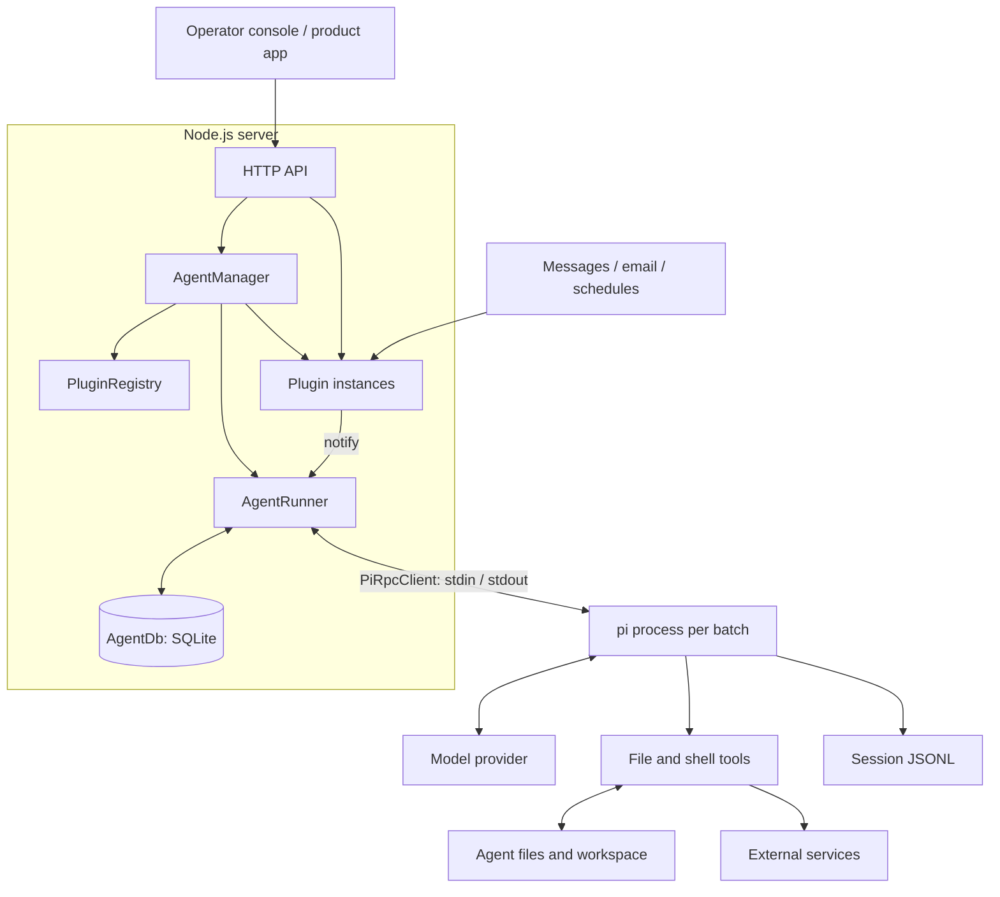
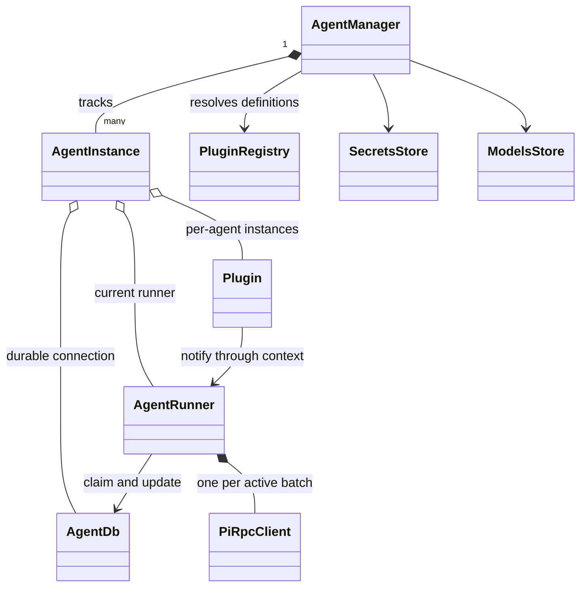
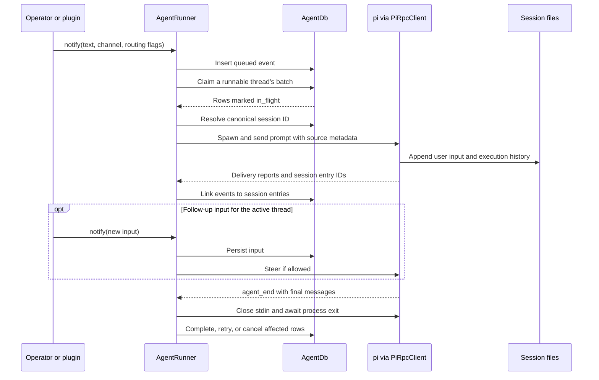
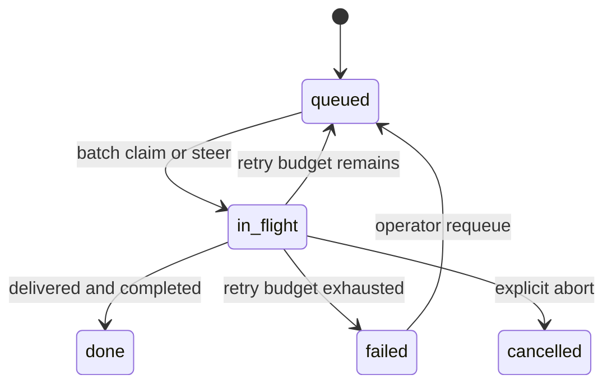

# Harness system design

CogniSphere manages persistent agents from one Node.js server. Plugins bring in work, a durable queue tracks it, and a short-lived `pi` process runs each batch. Agent files and conversation history survive between batches.

This document describes the current implementation. The next architecture is defined in the [sandbox design](design/sandbox.md); implementation priorities live in the [roadmap](roadmap.md).

## System overview



The server and plugin listeners remain active while an agent is running. Model execution starts only when there is work. Agents have separate directories and databases but share the server and host; this is not a sandbox boundary.

## Core concepts

| Concept | Meaning |
|---|---|
| Agent | A persistent identity, configuration, files, and plugin instances. |
| Notification | One input from a plugin, stored as an event row. |
| Channel | A source conversation, such as a Telegram chat ID. |
| Thread | A conversation whose batches execute one at a time. |
| Batch | Queued inputs processed together, plus any follow-up inputs steered into that run. |
| Session | The `pi` conversation JSONL associated with a thread. |
| Slot | Capacity for one active batch; different threads can use separate slots. |

## Components and responsibilities

Source paths below are relative to `packages/harness/src/`.

| Component | Responsibility | Collaborators |
|---|---|---|
| `core/main.ts` | Constructs services, mounts HTTP routes, serves the console, and handles shutdown. | All server services. |
| `AgentManager` — `core/agent-manager.ts` | Loads agents, validates configuration, provisions dependencies, starts/stops plugins and runners, and applies reloads. | Registry, stores, agent instances. |
| `AgentInstance` / `PluginEntry` | Records configuration, lifecycle state, errors, and live object references. These are records, not execution classes. | Manager, API. |
| `PluginRegistry` — `core/plugin-registry.ts` | Discovers plugin definitions and holds their constructors/manifests. User definitions override packaged definitions with the same ID. | Manager, plugin source folders. |
| `AgentRunner` — `core/runner.ts` | Selects work, manages slots and active threads, prepares prompts, spawns children, steers input, and finalizes attempts. | Database, RPC client. |
| `AgentDb` — `core/queue.ts` | Persists inputs, claims batches transactionally, records status/attempts, and binds threads/events to sessions. | Runner, event/session APIs. |
| `PiRpcClient` — `core/rpc.ts` | Wraps one child: JSON-line commands, acknowledgments, delivery/completion callbacks, stderr, and process signals. | Runner, `pi`. |
| `SecretsStore` — `core/secrets.ts` | Resolves agent/plugin secret buckets, caches reads, and detects duplicate environment keys. | Manager, secrets API. |
| `ModelsStore` — `core/models-store.ts` | Reads/writes provider credentials, enabled models, and model overrides. | Manager, models API. |
| `OAuthLoginManager` — `core/oauth-logins.ts` | Adapts model-provider login interactions to the console; delegates token storage/refresh to `pi`. | Models API, `ModelRuntime`. |
| `AuthStore` — `api/auth.ts` | Verifies console credentials, signs session cookies, and checks product-app bearer credentials. | HTTP authentication middleware. |

Supporting modules are small: `config.ts` resolves server settings and paths; `types.ts` defines shared contracts; `models-catalog.ts` describes providers; `pi-models-sync.ts` synchronizes model overrides; `logger.ts` creates scoped logs; `api/credentials.ts` masks and merges credential updates. `LifecycleError` maps missing/conflicting lifecycle operations to API errors.



The manager owns lifecycle, the runner owns dispatch, the database owns processing records, and `pi` owns model/tool execution.

## Agent lifecycle

At server boot, the registry scans plugins and the manager loads existing agent directories. For each agent it reads configuration, resolves credentials/model settings, opens the database, runs `bootstrap/bootstrap.sh` when present, starts plugins, and starts the runner. The runner recovers interrupted event rows before dispatching work. Agents load sequentially; bootstrap failures are logged and tolerated.

Agents and plugins each expose `running`, `stopped`, or `failed`. Failed agents stay listed so their settings can be repaired. A plugin startup failure does not automatically fail the agent's other plugins or runner.

- **Stop/restart:** stop producers, interrupt active batches, and recreate runtime objects as needed. The database survives agent restarts and closes on server shutdown.
- **Settings reload:** pause new dequeues, let active batches finish, then replace the runner/plugins with freshly resolved settings. Eligible messages can still steer an active batch while it drains.
- **Plugin reload:** restart only the affected plugin instance.
- **Thread model change:** apply on the next batch without restarting the agent.

A manually stopped agent has no persistent disabled flag; server boot attempts to start it again. The CLI creates agent directories; the server does not create a privileged admin agent automatically.

## Message processing



Operator chat enters through `POST /admin/:agentId/send` and `AdminPlugin.deliver()`. Other plugins call the same notification interface. Each input carries source metadata; a batch combines its original messages into one prompt. The `harness-bridge` extension reports session entry IDs so queue rows link to the actual conversation.

The current runner treats a final assistant message with `stopReason: stop` as completed work. Undelivered steers are retried even if the main turn finished. Before releasing the thread, cleanup waits for the child to exit and terminates remaining processes in its group.

The HTTP send response acknowledges request handling, not model completion. The plugin context logs notification errors rather than propagating them. Event rows and session history provide processing evidence. Replies to email or Telegram require an explicit integration action; assistant text is not automatically sent to the source app.

## Routing and concurrency

An explicit `threadIdOverride` wins. Otherwise the agent's routing strategy determines the thread:

| Strategy | Result for Telegram channel `123` |
|---|---|
| `single` | `default` |
| `plugin` | `telegram` |
| `plugin_channel` | `telegram:123` |

A runner allows one active batch per thread and defaults to one slot per agent. Extra slots allow different threads to run concurrently, but they still share the agent's workspace. There is no global fleet concurrency limit.

Runnable threads need at least one non-silent queued input. Selection prefers the highest non-silent priority, then the oldest qualifying row. Claiming that thread also includes its queued silent inputs.

| Input condition | Behavior |
|---|---|
| Target thread is streaming and steering is allowed | Persist, then steer into the existing process. |
| Input arrives during process startup | Drain eligible queued input after the initial prompt acknowledgment. |
| `doNotSteer: true` | Wait for a later batch. |
| Only `isSilent: true` input on an idle thread | Remain queued until non-silent work wakes the thread. |
| Another thread, or current thread completing | Use a free slot or wait. |

Silence and steering are independent flags. Sources routed to the same thread can steer each other, regardless of plugin/channel.

## State and recovery

```text
<harnessRoot>/
  harness.json                         timezone and deployment data version
  .secrets/                            agent/plugin credentials, models, login keys
  plugins/<plugin>/                    deployment-owned plugin definitions
  agents/<agent>/
    agent.json                         identity, model, routing, limits, config
    system_prompts/                    assembled instructions
    skills/  scripts/  extensions/      agent capabilities
    knowledge/  workspace/             durable notes and work products
    bootstrap/  .venv/                 runtime setup and Python environment
    plugins/<plugin>/                  config.json, state/, inbox/
    sessions/
      .events.db                       events and thread bindings
      <thread>/<session>.jsonl         conversation history
      <thread>/.system-prompt.md       prompt for the latest spawn
```

SQLite uses WAL mode. `events` stores one mutable lifecycle row per notification, including attempts, error, and session/entry links. `threads` stores the canonical session ID and optional model override. `pi` writes the conversation JSONL; the database does not duplicate tool transcripts.



The default attempt limit is three. On startup, stuck `in_flight` rows count as failed attempts. A delivered input with a stored entry ID resumes through a continuation nudge; an input without one resends its original text with a retry marker. Explicitly requeueing a failed row also resends with a warning.

Operator abort cancels tracked batch inputs. Shutdown/agent stop retries interrupted work if attempts remain. Neither action automatically removes unrelated queued work. Thread reset deletes its rows, binding, and session files and is refused while active.

Retries cannot undo external side effects or guarantee exactly-once email/API actions. A prompt acknowledgment timeout exists, but there is no general streaming-run deadline. Consistent backups must include SQLite WAL state, sessions, agent/plugin files, and credentials. Model OAuth uses `pi`'s separate runtime directory, normally `~/.pi/agent/`.

## Plugins and runtime capabilities

A plugin implements `manifest`, `start(ctx)`, `stop()`, and optionally `handleHttpRequest()`. Its context supplies agent identity, directories, validated configuration, secrets, timezone, logging, `notify()`, and `resetThread()`.

| Plugin | Responsibility |
|---|---|
| `admin` — core | Operator chat. |
| `scheduler` — core | Persistent cron/one-time schedules; scheduled work opts out of steering. |
| `agent-messaging` — core | Agent-to-agent and cross-thread messages through the target agent's HTTP inbox. |
| `telegram` | Long-poll inbound messages/edits and attachments; outbound actions through its CLI. |
| `gws` | Gmail polling/routing, silent backlog input, and Google Workspace CLI actions; supports passive mode. |
| `artifacts` | Publish and serve standalone HTML with public/private visibility. |

Core plugins start for every agent; additional plugins are selected by their agent-local directories. Plugin seeds copy namespaced prompts/scripts/skills into the agent on each start. Edit the source seed when a change must survive that copy.

Each `pi` child receives sorted system-prompt fragments, its explicit session path, selected model, and seven tools: `read`, `bash`, `edit`, `write`, `grep`, `find`, `ls`. Skills load recursively from `skills/`; extensions load from explicit first-level entry points. Its working directory is the agent directory. Automatic discovery is disabled for resources the harness supplies explicitly.

The base extensions link session entries (`harness-bridge`), report context usage (`context-meta`), catch shell quoting errors (`bash-guard`), and announce changed skill versions (`skill-update-notice`). Knowledge and procedural memory live in files. Automatic reflection and skill curation remain planned features.

## Configuration, access, and interfaces

Server environment settings select the data root, instance ID, listener, base URL, and headless mode. `harness.json` supplies timezone. Agent/plugin schemas validate their settings; provider settings select credentials, enabled model IDs, and context/output overrides. Thread model overrides take effect at spawn.

The current runtime inherits server environment variables and adds flattened agent/plugin secrets and config. Duplicate configured keys are rejected. Catalog provider/model choices are checked at start; unknown providers may fall through to ambient `pi` configuration. Secret API fields are masked, but the files and child environment contain usable plaintext credentials.

| Interface | Role |
|---|---|
| `/api/agents/*` | Status/lifecycle/config, sessions, usage, events, and agent files. |
| `/api/models`, `/api/secrets`, `/api/harness` | Shared settings and credentials. |
| `/api/auth/*`, OAuth routes | Console login and model/Google Workspace sign-in. |
| `/admin/:agentId/send`, `/abort` | Operator messages and cancellation. |
| `/webhook/:agentId/:pluginId/*` | Plugin-owned HTTP handling and authentication. |
| `/healthz` | Server availability and listed-agent count. |

The React console polls the APIs for sessions/events, presents chat and tool activity, and provides settings and file editing. Cookie-authenticated operators and bearer-authenticated product backends access the API. Webhooks bypass that gate and require plugin-specific controls. Agent messaging currently uses a shared insider secret and self-reported sender IDs.

This is a trusted deployment model: plugins run in the server, agents have host-level shell access, and authenticated API access is operator-level. The sandbox design changes these boundaries. Packaging, CLI, and deployment instructions belong in the [deployment guide](distribution-and-deployment.md); exact routes belong in the [API reference](api.md).
